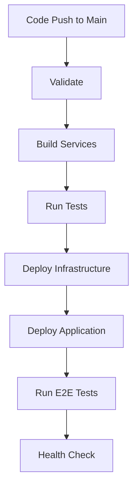

# GitLab CI/CD Setup Guide for Agentic AI

This document provides instructions for configuring GitLab CI/CD variables and secrets required for the automated deployment pipeline.

## Prerequisites

1. **Azure Service Principal**: Create a service principal for automated Azure deployments
2. **Azure Key Vault**: Set up Key Vault with SSL certificate for Application Gateway
3. **Azure AD Groups**: Create Azure AD groups for AKS administration
4. **GitLab Project**: Ensure you have admin access to the GitLab project

## Required GitLab Variables

Configure the following variables in your GitLab project:
**Settings → CI/CD → Variables**

### Azure Authentication (Protected & Masked)

| Variable Name | Type | Value | Description |
|---------------|------|-------|-------------|
| `AZURE_CLIENT_ID` | Variable (Protected, Masked) | `<service-principal-client-id>` | Azure Service Principal Client ID |
| `AZURE_CLIENT_SECRET` | Variable (Protected, Masked) | `<service-principal-secret>` | Azure Service Principal Secret |
| `AZURE_SUBSCRIPTION_ID` | Variable (Protected) | `<azure-subscription-id>` | Target Azure Subscription ID |
| `AZURE_TENANT_ID` | Variable (Protected) | `<azure-tenant-id>` | Azure Tenant ID |

### Infrastructure Configuration

| Variable Name | Type | Value | Description |
|---------------|------|-------|-------------|
| `AZURE_REGION` | Variable | `eastus2` | Azure region for resource deployment |
| `ENVIRONMENT_NAME` | Variable | `dev/qa/prod` | Environment name for deployment |
| `ADMIN_GROUP_OBJECT_ID` | Variable (Protected) | `<ad-group-object-id>` | Azure AD group for AKS administrators |
| `APP_GW_SSL_CERT_SECRET_ID` | Variable (Protected, Masked) | `https://kv.vault.azure.net/secrets/ssl-cert/version` | Key Vault secret URI for SSL certificate |
| `PUBLISHER_EMAIL` | Variable | `admin@company.com` | API Management publisher email |
| `POSTGRES_ADMIN_USER` | Variable | `psqladmin` | PostgreSQL administrator username |

### Application Configuration

| Variable Name | Type | Value | Description |
|---------------|------|-------|-------------|
| `AAD_CLIENT_ID` | Variable (Protected, Masked) | `<aad-app-client-id>` | Azure AD Application Client ID (from tenant deployment) |

### Optional Control Variables

| Variable Name | Type | Value | Description |
|---------------|------|-------|-------------|
| `DEPLOY_TENANT` | Variable | `true/false` | Trigger tenant-level deployment |
| `MANUAL_DEPLOY` | Variable | `true/false` | Enable manual deployment triggers |

## Azure Service Principal Setup

### 1. Create Service Principal

```bash
# Create service principal
az ad sp create-for-rbac --name "agentic-ai-cicd" --role Contributor --scopes /subscriptions/<subscription-id>

# Note the output values:
# - appId (AZURE_CLIENT_ID)
# - password (AZURE_CLIENT_SECRET)
# - tenant (AZURE_TENANT_ID)
```

### 2. Grant Required Permissions

```bash
# Assign additional roles for comprehensive deployment
az role assignment create --assignee <service-principal-id> --role "Application Administrator" --scope /subscriptions/<subscription-id>
az role assignment create --assignee <service-principal-id> --role "User Access Administrator" --scope /subscriptions/<subscription-id>
```

## SSL Certificate Setup

### 1. Upload Certificate to Key Vault

```bash
# Create Key Vault (if not exists)
az keyvault create --name <your-keyvault-name> --resource-group <your-rg> --location eastus2

# Upload SSL certificate
az keyvault certificate import --vault-name <your-keyvault-name> --name ssl-cert --file path/to/certificate.pfx

# Get secret URI
az keyvault secret show --vault-name <your-keyvault-name> --name ssl-cert --query "id" --output tsv
```

### 2. Grant Service Principal Access

```bash
# Grant Key Vault access to service principal
az keyvault set-policy --name <your-keyvault-name> --spn <service-principal-id> --secret-permissions get list
```

## Azure AD Groups Setup

### 1. Create AKS Admin Group

```bash
# Create Azure AD group for AKS administrators
az ad group create --display-name "AKS-Administrators" --mail-nickname "aks-admins"

# Get group object ID
az ad group show --group "AKS-Administrators" --query "id" --output tsv
```

### 2. Add Users to Group

```bash
# Add users to the AKS admin group
az ad group member add --group "AKS-Administrators" --member-id <user-object-id>
```

## Pipeline Execution Flow

### 1. Standard Flow (Main Branch)



### 2. Manual Tenant Deployment

For first-time setup or tenant-level changes:

1. Set `DEPLOY_TENANT=true` in GitLab variables
2. Trigger pipeline manually
3. Note the output values (clientId, tenantId)
4. Update `AAD_CLIENT_ID` variable with the clientId

### 3. Environment-Specific Deployment

The pipeline automatically deploys to the environment specified in `ENVIRONMENT_NAME`:

- **dev**: Basic configuration, single node AKS
- **qa**: Intermediate configuration for testing
- **prod**: High availability, multi-node setup

## Security Best Practices

### 1. Variable Protection

- Mark all sensitive variables as **Protected** and **Masked**
- Use **Protected** branches for sensitive deployments
- Limit variable access to specific environments

### 2. Service Principal Rotation

```bash
# Rotate service principal secret
az ad sp credential reset --id <service-principal-id>

# Update GitLab variable AZURE_CLIENT_SECRET with new value
```

### 3. Certificate Management

- Use certificates with appropriate validity periods
- Set up automated certificate renewal
- Monitor certificate expiration dates

## Troubleshooting

### Common Issues

1. **Permission Denied**: Verify service principal has required roles
2. **Certificate Error**: Check Key Vault access and certificate format
3. **Resource Name Conflicts**: Ensure unique naming across environments
4. **Quota Limits**: Verify Azure subscription quotas for resources

### Debug Commands

```bash
# Check service principal permissions
az role assignment list --assignee <service-principal-id>

# Validate Bicep template
az deployment sub validate --template-file infra/main.bicep --parameters @parameters.json

# Check AKS cluster status
az aks show --resource-group <rg-name> --name <cluster-name>
```

## Environment-Specific Configurations

### Development Environment

```yaml
ENVIRONMENT_NAME: dev
AZURE_REGION: eastus2
# Minimal resource configuration
```

### Production Environment

```yaml
ENVIRONMENT_NAME: prod
AZURE_REGION: eastus2
# High availability configuration
```

## Support and Maintenance

### Monitoring Pipeline Execution

1. Review GitLab CI/CD pipeline logs
2. Check Azure deployment logs in Azure Portal
3. Monitor application health endpoints
4. Set up alerts for deployment failures

### Regular Maintenance Tasks

1. Update service principal credentials quarterly
2. Review and update SSL certificates
3. Monitor Azure resource costs
4. Update Bicep templates for new features

---

For additional support, refer to the project documentation or contact the DevOps team. 