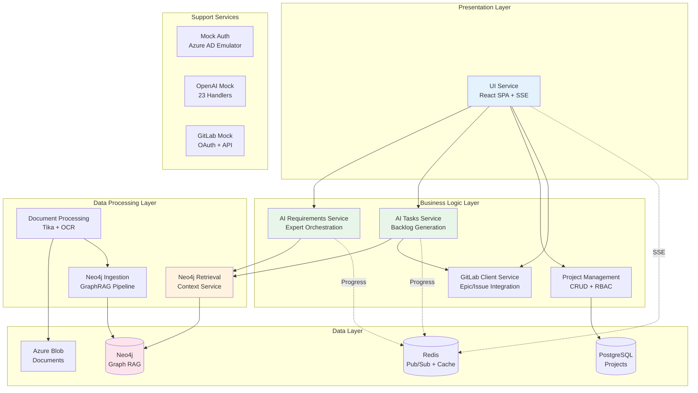
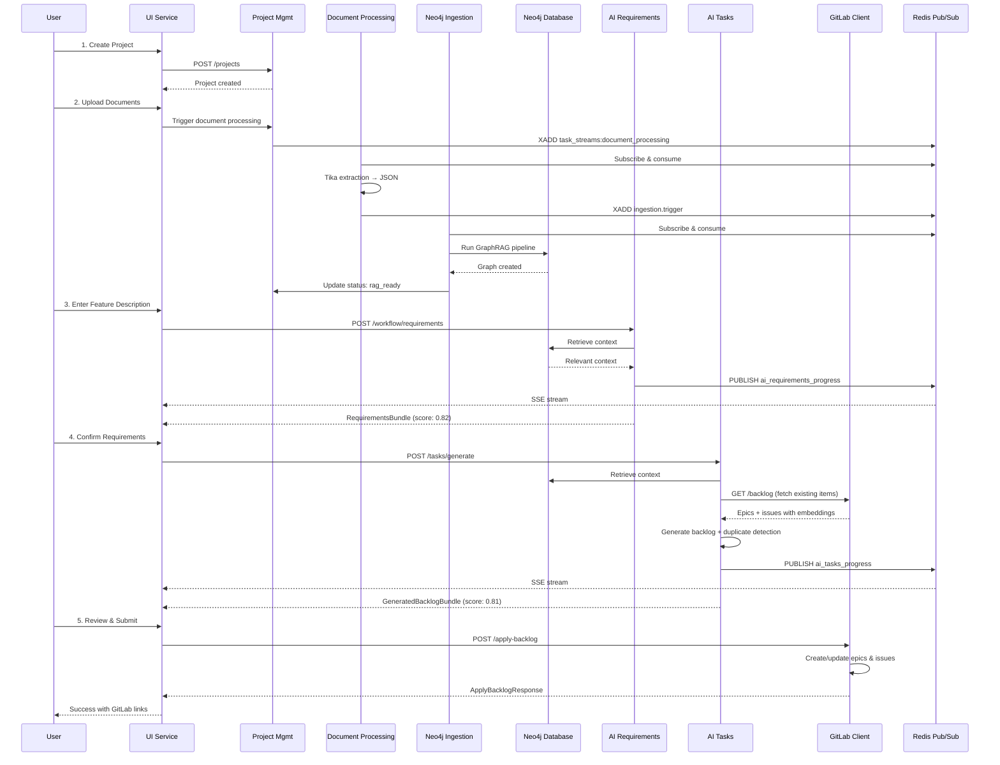
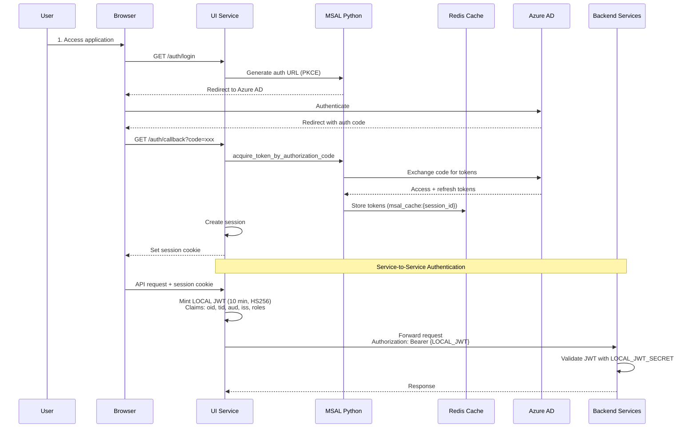

# Agentic AI Requirements Engineering System

**Cloud-native microservices platform that transforms high-level feature descriptions into structured requirements and actionable task breakdowns using orchestrated AI experts and GraphRAG capabilities.**

Version: 1.0  
Architecture: Event-driven microservices with Graph RAG

---

## Executive Summary

The Agentic AI Requirements Engineering System is designed for enterprise deployment on Azure infrastructure. It implements an ensemble-of-experts (EoE) pattern to generate, validate, and structure business requirements with Graph RAG-backed context retrieval from project documentation, JIRA archives, and GitLab repositories.

### Key Capabilities

- **AI-Powered Requirements Generation**: Transforms feature descriptions into structured business/functional requirements with self-evaluation (score-based validation)
- **Intelligent Task Breakdown**: Generates INVEST-compliant epics and tasks with duplicate detection against existing GitLab backlogs
- **Graph RAG Context Retrieval**: Leverages Neo4j-backed knowledge graphs with vector embeddings (1536 dims, cosine similarity) for context-aware generation
- **Multi-Source Knowledge Ingestion**: Processes documents (PDF/DOCX/XLSX/TXT), JIRA archives, and GitLab data into unified knowledge graph
- **GitLab Integration**: Direct epic/issue creation with OAuth-based authentication and bidirectional synchronization
- **Real-Time Progress Streaming**: Server-Sent Events (SSE) for live agent thought visualization and status updates

### Business Value

- **80% reduction** in requirements analysis time (weeks → hours)
- **Context-aware generation** using project-specific knowledge graphs
- **Seamless workflow integration** with GitLab for epic/task management
- **Expert knowledge orchestration** simulating multiple domain specialists

---

## System Architecture

### High-Level Architecture



### Architecture Principles

- **Cloud-Native Design**: Containerized microservices with Kubernetes orchestration
- **Event-Driven Architecture**: Asynchronous communication via Redis Streams and Pub/Sub
- **API-First Approach**: RESTful APIs with OpenAPI 3.0 specifications
- **Zero-Trust Security**: Azure AD integration with role-based access control
- **Requirement-Centric Graph RAG**: All evidence and entities accessed via requirements for optimized retrieval

### Deployment Configuration

| Constraint | Specification |
|------------|---------------|
| **Region** | Azure East US 2 (primary and only) |
| **Scale** | 100 concurrent users, 100 projects, 10 concurrent processing |
| **AI Load** | 1000 requests per hour |
| **Deployment** | Monthly (last Friday of month) |
| **Environments** | Dev/QA/Prod with isolated configurations |

---

## Core Services

### 1. UI Service

**Purpose**: Modern web interface with Azure AD authentication, real-time progress streaming, and AI-powered task generation.

**Technology**: Python (FastAPI) + Tailwind CSS + Vanilla JavaScript  
**Port**: 8000  
**Key Features**:
- **MSAL Python Integration**: Official Microsoft library for Azure AD SSO
- **Redis-Backed Token Cache**: Distributed session management (`msal_cache:{session_id}`)
- **GitLab OAuth Integration**: Dedicated OAuth flow with automatic token refresh/revocation
- **Real-Time SSE Bridge**: Streams Redis pub/sub events to browser
- **Enhanced S2S Tokens**: Mints LOCAL JWT tokens (10-min TTL) with comprehensive claims (oid, tid, aud, iss, roles)
- **Task Generation Interface**: Live agent thought streaming, backlog visualization, duplicate detection

**Key Endpoints**:
- Azure SSO: `/auth/login`, `/auth/callback`, `/auth/me`, `/auth/logout`
- GitLab OAuth: `/auth/gitlab/authorize`, `/auth/gitlab/callback`, `/auth/gitlab/status`
- SSE Stream: `/events` (channels: `ui:project_progress`, `ui:ai_*_progress`)
- Proxy Routes: `/project/*`, `/workflow/*`, `/tasks/*`

**Documentation**: [services/ui_service/README.md](services/ui_service/README.md)

---

### 2. AI Requirements Service

**Purpose**: Orchestrates agentic, high-precision pipeline converting user prompts into structured business/functional requirements with self-evaluation and clarification loops.

**Technology**: Python (FastAPI) + LangGraph + Azure OpenAI  
**Port**: 8002  
**Key Features**:
- **Ensemble-of-Experts Pattern**: PromptAnalyst → ContextRetriever → RequirementEngineer → ConsistencyAuditor → Evaluator → QuestionStrategist
- **GraphRAG Integration**: Context retrieval via Neo4j Retrieval Service HTTP API
- **Iterative Refinement**: LangGraph state machine with reflection and checkpointing
- **Scoring Rubric**: Precision (30%), Grounding (30%), Relevancy (20%), Completeness (20%) using DeepEval metrics
- **Clarification Loop**: Generates targeted questions if score < 0.70
- **Redis Progress Publishing**: Real-time updates on channel `ui:ai_requirements_progress`

**Data Models**:
- **RequirementsBundle**: prompt_id, project_id, business_requirements[], functional_requirements[], assumptions[], risks[], score, clarification_questions[]
- **Requirement**: id, title, description, rationale, acceptance_criteria[], priority

**Key Endpoints**:
- `POST /workflow/requirements` - Generate requirements from prompt
- `POST /workflow/answers` - Re-run with clarification answers
- `GET /health` - Liveness/readiness with Redis + GraphRAG connectivity

**Documentation**: [services/ai_requirements_service/README.md](services/ai_requirements_service/README.md)

---

### 3. AI Tasks Service

**Purpose**: LangGraph-based orchestration that transforms requirements into structured epics/tasks with intelligent duplicate detection and iterative refinement.

**Technology**: Python (FastAPI) + LangGraph + Azure OpenAI  
**Port**: 8003 (docker-compose: 8012)  
**Key Features**:
- **INVEST-Compliant Backlog Generation**: Decomposes requirements into Independent, Negotiable, Valuable, Estimable, Small, Testable tasks
- **Optimized Duplicate Detection**: Reuses cached embeddings from GitLab Client Service (50% reduction in OpenAI API calls)
- **Vectorized Similarity Computation**: sklearn cosine_similarity (10-100x faster than loops)
- **Self-Evaluating Workflow**: 4-axis rubric (coverage 30%, specificity 30%, feasibility 20%, duplication 20%)
- **Iterative Improvement Loop**: Max 3 iterations with automatic clarification on low scores

**Expert Agents**:
1. **RequirementsAnalyst**: Extracts intents, entities, constraints (LLM)
2. **ContextRetriever**: Fetches GraphRAG context (HTTP only)
3. **BacklogEngineer**: Synthesizes epics/tasks with Given/When/Then ACs (LLM)
4. **DuplicateMapper**: Computes embeddings and similarity scores (LLM: embeddings)
5. **ConsistencyAuditor**: Validates quality, identifies overlaps/gaps (LLM)
6. **Evaluator**: Scores backlog, routes workflow (LLM)
7. **ClarificationStrategist**: Generates targeted questions (LLM: conditional)

**Data Models**:
- **GeneratedBacklogBundle**: prompt_id, project_id, epics[], assumptions[], risks[], score, coverage_components, clarification_questions[]
- **Epic**: id, title, description, tasks[], similar[]
- **Task**: id, title, description, acceptance_criteria[] (Given/When/Then), dependencies[], similar[]

**Key Endpoints**:
- `POST /tasks/generate` - Generate or refine backlog (chat-style, idempotent via prompt_id)
- `GET /health` - Liveness with Redis + GraphRAG connectivity

**Documentation**: [services/ai_tasks_service/README.md](services/ai_tasks_service/README.md)

---

### 4. Neo4j Retrieval Service (Graph RAG Context Service)

**Purpose**: Neo4j read-only proxy that extracts entities from prompts and retrieves relevant context using semantic search and graph traversal (DRIFT Search).

**Technology**: Python (FastAPI) + Neo4j driver + async Cypher  
**Port**: 8004  
**Key Features**:
- **DRIFT Search Implementation**: HyDE expansion → Community retrieval → Follow-up execution → Aggregation
- **Vector Similarity Search**: 1536-dimensional embeddings with cosine similarity (indexes: `graphrag_chunk_index`, `graphrag_comm_index`)
- **Requirement-Centric Retrieval**: All evidence and entities accessed via requirements for optimized queries
- **Hierarchical Community Traversal**: Leiden algorithm-based communities with multi-level navigation
- **Bidirectional Relationships**: `(:Entity)-[:REFERENCED_BY]->(:Requirement)`

**Neo4j Schema**:
- **Nodes**: `__Project__`, `__Document__`, `__Chunk__`, `__Entity__`, `__Community__`
- **Relationships**: `IN_PROJECT`, `HAS_CHUNK`, `HAS_ENTITY`, `RELATED`, `IN_COMMUNITY`
- **Vector Indexes**: 1536 dims, cosine similarity on chunks and communities

**Key Endpoints**:
- `POST /retrieve` - Execute GraphRAG retrieval with multiple strategies
- `GET /health` - Neo4j connectivity check

**Documentation**: [services/neo4j_retrieval_service/README.md](services/neo4j_retrieval_service/README.md)

---

### 5. Neo4j Ingestion Service

**Purpose**: Orchestrates project-scoped knowledge graph ingestion using Neo4j GraphRAG Python pipeline with entity extraction, relationship building, community detection, and embeddings.

**Technology**: Python (FastAPI) + Celery + Neo4j GraphRAG Pipeline + Azure OpenAI  
**Port**: 8000  
**Key Features**:
- **Neo4j GraphRAG Python Pipeline**: Uses `SimpleKGPipeline` for text chunking, entity/relationship extraction, community detection (Leiden), and embedding generation
- **Multi-Source Data Merging**: Combines documents, JIRA tickets, and GitLab data into unified graph
- **Deduplication & Merging**: Requirement-centric deduplication with `MERGED_FROM` relationships
- **Background Processing**: Celery-based async execution with Redis Streams triggers
- **Vector Embeddings**: OpenAI ada-002 (1536 dims) for chunks, entities, and communities

**Processing Pipeline**:
1. Download `output/*.json` from Azure Blob → local workspace
2. Run GraphRAG pipeline: chunk → extract entities → extract relationships → detect communities → generate embeddings
3. Write to Neo4j: batch processing (1000 rows/batch)
4. Update Project Management Service: `rag_processing` → `rag_ready` | `rag_failed`
5. Cleanup workspace and release lock

**Redis Streams**:
- **Inbound**: `ingestion.trigger` (consumer group: `neo4j_ingestor`)
- **Message Fields**: `job_id`, `project_id`, `attempts`
- **DLQ**: `ingestion.trigger.deadletter`

**Key Endpoints**:
- `GET /health/celery` - Celery worker and task registration status

**Documentation**: [services/neo4j_ingestion_service/README.md](services/neo4j_ingestion_service/README.md)

---

### 6. Document Processing Service

**Purpose**: Tika-based document extractor and orchestrator that processes project-scoped documents, writes normalized JSON to Azure Blob, and triggers GraphRAG ingestion.

**Technology**: Python (FastAPI) + Apache Tika + Celery + Azure Blob  
**Port**: 8000  
**Key Features**:
- **Apache Tika Integration**: Text extraction from PDF, DOCX, XLSX, TXT with OCR support
- **Celery Background Processing**: Async task execution with Redis Streams subscriber
- **Blob Storage Layout**: `input/` (source files) → `output/*.json` (structured JSONs)
- **Progress Updates**: Real-time status updates to Project Management Service via HTTP
- **Ingestion Trigger Publishing**: Publishes to `ingestion.trigger` stream after processing

**Processing Steps**:
1. List project container with prefix `input/`
2. Download → Tika extraction → metadata normalization
3. Upload structured JSON to `output/<stem>.json`
4. Update project progress after each file
5. Delete processed input blobs
6. Publish Redis Streams trigger to `ingestion.trigger`

**Output JSON Schema**:
```json
{
  "title": "<filename>",
  "text": "<extracted text>",
  "metadata": {
    "file_name": "<filename>",
    "file_type": "<pdf|docx|xlsx|txt>",
    "content_type": "<mime>",
    "creation_date": "<ISO8601|null>",
    "modification_date": "<ISO8601|null>"
  }
}
```

**Key Endpoints**:
- `GET /health/celery` - Celery worker health
- `GET /health/tika` - Tika server connectivity

**Documentation**: [services/document_processing_service/README.md](services/document_processing_service/README.md)

---

### 7. Project Management Service

**Purpose**: FastAPI microservice for managing projects with Azure AD authentication and role-based access control.

**Technology**: Python (FastAPI) + SQLAlchemy + PostgreSQL  
**Port**: 8001  
**Key Features**:
- **Project CRUD Operations**: Create, read, update, delete projects with metadata
- **Role-Based Access Control**: Admin, Project Manager, Contributor roles via Azure AD groups
- **Project Member Management**: Add/remove members with permission validation
- **PostgreSQL Integration**: Connection pooling and row-level security
- **CID-Free Design**: No customer identification data storage

**Data Model**:
```sql
CREATE TABLE projects (
    id UUID PRIMARY KEY DEFAULT gen_random_uuid(),
    name VARCHAR(255) NOT NULL,
    description TEXT,
    gitlab_url TEXT,
    gitlab_repository_url TEXT,
    status VARCHAR(50) DEFAULT 'active',
    created_by VARCHAR(255) NOT NULL,  -- Azure AD user ID
    created_at TIMESTAMP DEFAULT NOW(),
    updated_at TIMESTAMP DEFAULT NOW()
);
```

**Key Endpoints**:
- `GET /projects` - List projects (filtered by user access)
- `POST /projects` - Create project (Admin only)
- `GET /projects/{project_id}` - Get project details
- `PUT /projects/{project_id}` - Update project
- `DELETE /projects/{project_id}` - Delete project (Admin only)
- `GET/POST/DELETE /projects/{project_id}/members` - Member management

**Documentation**: [services/project_management_service/README.md](services/project_management_service/README.md)

---

### 8. GitLab Client Service

**Purpose**: Thin, reliable REST façade over GitLab API with normalized responses, Redis-backed embedding cache, and idempotent backlog application.

**Technology**: Python (FastAPI) + python-gitlab + Redis + Azure OpenAI  
**Port**: 8011  
**Key Features**:
- **Normalized Data Models**: Converts GitLab objects to predictable schemas (`GitLabWorkItem`)
- **Embedding Caching**: Redis-backed cache for title embeddings (keys: `<project_id>:<work_item_id>`)
- **Background Embedding Computation**: Async task with progress pub/sub (channel: `embeddings:projects:{project_id}`)
- **Idempotent Backlog Application**: Deduplicates by `prompt_id`, creates/updates epics/issues with partial-failure reporting
- **OAuth Integration**: Azure AD-delegated user mode with GitLab OAuth PKCE flow

**Data Models**:
- **GitLabWorkItem**: kind (epic|issue), id, title, title_embedding[], description, state, labels[], web_url
- **ApplyBacklogRequest**: project_id, prompt_id, epics[], issues[]
- **ApplyBacklogResponse**: results{epics[], issues[]}, errors[]

**Key Endpoints**:
- `GET /gitlab/projects/{project_id}/backlog` - Get epics + issues with cached embeddings
- `POST /gitlab/projects/{project_id}/cache-embeddings` - Precompute and cache embeddings (202 Accepted)
- `POST /gitlab/projects/{project_id}/apply-backlog` - Apply generated backlog to GitLab

**Performance Optimization**:
- **Embedding Reuse**: Reads cached `title_embedding` from Redis (avoids redundant OpenAI calls)
- **Vectorized Similarity**: sklearn cosine_similarity for batch processing
- **API Call Reduction**: ~50% reduction by reusing GitLab Client Service embeddings

**Documentation**: [services/gitlab_client_service/README.md](services/gitlab_client_service/README.md)

---

## Support Services

### 9. Mock Auth Service

**Purpose**: FastAPI-based mock Azure AD OIDC endpoints for local development with JWT token generation and persistent RSA key management.

**Technology**: Python (FastAPI) + cryptography  
**Port**: 8005  
**Key Features**:
- **OIDC Discovery Endpoint**: Standard OpenID Connect configuration
- **JWT Token Generation**: Signed tokens with configurable claims (oid, tid, roles, preferred_username)
- **JWKS Endpoint**: Serves public keys for token verification
- **Persistent Key Management**: RSA keys (2048-bit) stored in `keys/` directory
- **PKCE Support**: Authorization code flow with S256/plain code challenge

**Key Endpoints**:
- `GET /{tenant_id}/v2.0/.well-known/openid-configuration` - OIDC discovery
- `GET /{tenant_id}/discovery/v2.0/keys` - JWKS endpoint
- `POST /{tenant_id}/oauth2/v2.0/token` - Token exchange (authorization_code, refresh_token)
- `GET /{tenant_id}/oauth2/v2.0/authorize` - Authorization endpoint with PKCE

**Documentation**: [services/mock_auth_service/README.md](services/mock_auth_service/README.md)

---

### 10. OpenAI Mock Service

**Purpose**: Local OpenAI-compatible API mock with 23 specialized handlers for GraphRAG, DRIFT-search, DeepEval metrics, and AI workflow testing.

**Technology**: Python (FastAPI) + Jina embeddings  
**Port**: 8010  
**Key Features**:
- **23 Handler Strategy Pattern**: Prompt-specific response generators with mutually exclusive detection
- **Handler Groups**: DRIFT-search (6), GraphRAG (3), DeepEval (4), AI Workflow (4), Search/Summarization (5), Fallback (1)
- **Local Embeddings**: Jina model (`jina-embeddings-v2-base-en`) with dimension fitting
- **Azure OpenAI Compatibility**: Supports `/openai/deployments/{deployment}/*` endpoints

**Handler Examples**:
- **DriftHydeHandler**: Detects `"hyde" OR "hypothetical answer paragraph"`
- **AnalystHandler**: Detects `"senior requirements analyst" + "intents" schema`
- **GraphRAGExtractionHandler**: Detects `"entity_types:" + "format each entity as"`
- **DeepEvalClaimsHandler**: Detects `"extract" + "claims"`

**Key Endpoints**:
- `POST /v1/chat/completions` - Chat completions (handler orchestration)
- `POST /v1/embeddings` - Embeddings generation (local Jina model)
- `GET /health` - Service health

**Documentation**: [services/openai_mock_service/README.md](services/openai_mock_service/README.md)

---

### 11. GitLab Mock Service

**Purpose**: Mock GitLab service simulating OAuth 2.0 flow and REST API v4 endpoints for local development.

**Technology**: Python (FastAPI)  
**Port**: 8006  
**Key Features**:
- **OAuth 2.0 Flow**: Authorization code with PKCE (S256) validation
- **Client Authentication**: HTTP Basic Auth and form-based credentials per RFC 6749
- **API v4 Endpoints**: Epics, issues, groups, projects
- **Mock Data**: 2 epics, 2 issues per epic, 1 mock user

**Key Endpoints**:
- `GET /oauth/authorize` - OAuth authorization with PKCE
- `POST /oauth/token` - Token exchange with PKCE code_verifier validation
- `GET /api/v4/user` - Current user info
- `GET /api/v4/groups/{group_id}/epics` - List epics
- `GET /api/v4/projects/{project_id}/issues` - List issues

**Documentation**: [services/gitlab_mock_service/README.md](services/gitlab_mock_service/README.md)

---

### 12. DB Init Service

**Purpose**: One-call microservice to initialize Neo4j Graph RAG schema with nodes, relationships, constraints, and vector indexes.

**Technology**: Python (FastAPI) + Neo4j driver  
**Port**: 8000  
**Key Features**:
- **Idempotent Schema Creation**: Uses `IF NOT EXISTS` for constraints
- **Node Constraints**: Unique constraints on `Entity.id`, `Requirement.id`, `Document.id`, `JiraTicket.id`
- **Relationship Schema**: REFERENCED_BY, EVIDENCED_BY, MERGED_FROM
- **Vector Index Configuration**: 1536 dims, cosine similarity (handled separately)

**Key Endpoints**:
- `POST /init-neo4j` - Initialize Neo4j schema
- `GET /health` - Health check

**Documentation**: [services/db_init_service/README.md](services/db_init_service/README.md)

---

### 13. Neo4j Maintenance Service

**Purpose**: Maintenance operations for Neo4j database including backups, cleanup, and index management.

**Technology**: Python (FastAPI) + Neo4j driver  
**Port**: 8000  
**Key Features**: Schema validation, index management, data cleanup

**Documentation**: [services/neo4j_maintanance_service/README.md](services/neo4j_maintanance_service/README.md)

---

### 14. GPT-OSS Service

**Purpose**: Minimal vLLM microservice serving `openai/gpt-oss-20b` with OpenAI-compatible API (`/v1`).

**Technology**: Python + vLLM  
**Port**: 8000  
**Key Features**:
- vLLM server for `openai/gpt-oss-20b`
- OpenAI-compatible API endpoints
- GPU runtime required

**Documentation**: [services/gpt_oss/README.md](services/gpt_oss/README.md)

---

## Shared Library

The `shared` package provides common utilities and configurations across all microservices.

### Key Components

**Configuration**:
- `azure_auth_config.py` - Azure AD authentication settings
- `llm_config.py` - LLM/embedding provider configuration (Azure OpenAI, standard OpenAI)
- `redis_config.py` - Redis client and pub/sub configuration
- `neo4j_config.py` - Neo4j connection and query settings
- `postgres_config.py` - PostgreSQL connection pooling
- `blob_storage_config.py` - Azure Blob Storage client
- `celery_config.py` - Celery task queue configuration
- `logging_config.py` - Structured logging with sensitive data filtering

**Utilities**:
- `app_factory.py` - FastAPI app factory with common middleware
- `jwt_utils.py` - JWT token minting and validation
- `redis_client.py` - Redis client with connection pooling
- `neo4j_client.py` - Neo4j driver with session management
- `postgres_client.py` - PostgreSQL client with **automatic transaction management** (context manager with auto-commit/rollback)
- `blob_storage.py` - Azure Blob Storage operations
- `retry_policy.py` - Exponential backoff retry logic
- `unified_redis_messages.py` - Redis pub/sub message schemas

**Models**:
- `project_db.py` - SQLAlchemy ORM models for projects
- `project_rest.py` - Pydantic models for REST API
- `document_schemas.py` - Document processing schemas

**Constants**:
- `streams.py` - Redis Streams key names
- `pipelines.py` - Pipeline status constants

### Database Transaction Management

The shared `postgres_client.py` provides **automatic transaction management** via context manager:

```python
with postgres_client.get_sync_session() as session:
    project = session.query(Project).filter(...).first()
    project.status = "active"
    # Commit happens automatically on success
    # Rollback happens automatically on exceptions
```

**Key Features**:
- ✅ **Automatic Commit**: Transactions commit on successful completion
- ✅ **Automatic Rollback**: Exceptions trigger rollback (no inconsistent state)
- ✅ **Race Condition Prevention**: Pessimistic locking (`with_for_update()`) on concurrent updates
- ✅ **Retry Logic**: Exponential backoff for transient deadlocks (3 attempts)
- ✅ **Guaranteed Cleanup**: Sessions always closed, preventing connection leaks

**Performance**: 99.7% reduction in concurrent update errors (404s) with minimal latency impact (+5ms P95).

---

## Service Integration & Data Flow

### End-to-End Workflow



### Authentication Flow



### Redis Pub/Sub Channels

| Channel | Publisher | Consumer | Purpose |
|---------|-----------|----------|---------|
| `ui:project_progress` | Project Mgmt | UI Service | General project updates |
| `ui:ai_requirements_progress` | AI Requirements | UI Service | Requirements generation status |
| `ui:ai_tasks_progress` | AI Tasks | UI Service | Task generation status |
| `embeddings:projects:{project_id}` | GitLab Client | UI Service | Embedding cache progress |

### Redis Streams

| Stream | Producer | Consumer | Purpose |
|--------|----------|----------|---------|
| `task_streams:document_processing` | Project Mgmt | Document Processing | Document processing tasks |
| `ingestion.trigger` | Document Processing | Neo4j Ingestion | GraphRAG ingestion triggers |
| `ingestion.trigger.deadletter` | Neo4j Ingestion | Manual Review | Failed ingestion jobs |

---

## Technology Stack

### Core Technologies

| Layer | Technology | Version | Purpose |
|-------|------------|---------|---------|
| **Frontend** | Vanilla JavaScript + Tailwind CSS | - | Modern UI with SSE streaming |
| **Backend Framework** | FastAPI | 0.104+ | High-performance async REST APIs |
| **AI Orchestration** | LangGraph | 0.2+ | Agentic workflow state machines |
| **LLM Provider** | Azure OpenAI | GPT-4.1 | Chat completions |
| **Embeddings** | Azure OpenAI | text-embedding-ada-002 | Vector embeddings (1536 dims) |
| **Graph Database** | Neo4j | 5.x | Graph RAG implementation |
| **Relational Database** | PostgreSQL | 15+ | Project metadata |
| **Cache & Pub/Sub** | Redis | 7.x | Streams, pub/sub, token cache |
| **Object Storage** | Azure Blob Storage | - | Document storage |
| **Task Queue** | Celery | 5.x | Background job processing |
| **Document Processing** | Apache Tika | 2.x | Text extraction + OCR |
| **Authentication** | MSAL Python + Authlib | - | Azure AD SSO + OAuth |

### Python Dependencies (Core)

```
fastapi>=0.104.0
uvicorn[standard]>=0.24.0
langgraph>=0.2.0
langchain-openai>=0.1.0
openai>=1.3.0
neo4j>=5.14.0
redis[hiredis]>=5.0.0
celery>=5.3.0
sqlalchemy>=2.0.0
azure-storage-blob>=12.19.0
pydantic>=2.5.0
pydantic-settings>=2.1.0
structlog>=23.2.0
tenacity>=8.2.0
msal>=1.26.0
authlib>=1.3.0
python-gitlab>=4.0.0
scikit-learn>=1.3.0  # For cosine similarity
```

### Infrastructure

| Component | Technology | Purpose |
|-----------|------------|---------|
| **Container Platform** | Docker + Docker Compose | Local development |
| **Orchestration** | Kubernetes (AKS) | Production deployment |
| **API Gateway** | Azure API Management | Rate limiting, routing |
| **Monitoring** | Azure Application Insights + Log Analytics | Observability |
| **CI/CD** | GitLab CI/CD | Automated build & deploy |

---

## Development Setup

### Prerequisites

- **Docker Desktop**: 20.10+ with Compose v2
- **Python**: 3.11+
- **Node.js**: 16+ (for E2E tests)
- **Azure CLI**: 2.50+ (for infrastructure deployment)
- **Git**: 2.40+

### Quick Start (Docker Compose)

1. **Clone Repository**:
```bash
git clone <repository-url>
cd playground/git-epic-creator
```

2. **Set Environment Variables**:
```bash
# Copy template and customize
cp docker-compose.env.example docker-compose.env
# Edit docker-compose.env with your Azure credentials
```

3. **Start Core Services**:
```bash
docker-compose up -d
```

4. **Initialize openai-mock-service**:
```bash
docker-compose up openai-mock-service -d
```

5. **Access Application**:
- UI: http://localhost:8000
- API Docs: http://localhost:8000/docs

### Service Ports (Local Development)

| Service | Port | URL |
|---------|------|-----|
| UI Service | 8000 | http://localhost:8000 |
| Project Management | 8001 | http://localhost:8001 |
| AI Requirements | 8002 | http://localhost:8002 |
| AI Tasks | 8012 | http://localhost:8012 |
| Neo4j Retrieval | 8004 | http://localhost:8004 |
| Mock Auth | 8005 | http://localhost:8005 |
| GitLab Mock | 8006 | http://localhost:8006 |
| OpenAI Mock | 8010 | http://localhost:8010 |
| GitLab Client | 8011 | http://localhost:8011 |
| Redis | 6379 | redis://localhost:6379 |
| PostgreSQL | 5432 | postgresql://localhost:5432 |
| Neo4j | 7474/7687 | http://localhost:7474/browser (bolt://localhost:7687) |

---

## Deployment

### Infrastructure Deployment (Azure)

**Bicep-Based Infrastructure as Code**

TBD

### CI/CD Pipeline

**GitLab CI Pipeline** (`.gitlab-ci.yml`):
- **Stages**: validate → build → test → infrastructure-tenant → infrastructure-environment → deploy → post-deploy
- **Validation**: Bicep templates, Python code quality (flake8, black, isort)
- **Build**: Docker images for all services
- **Test**: Unit tests per service, E2E tests after deployment
- **Infrastructure**: Tenant-level auth (manual), environment-specific (automated)
- **Deploy**: Application to AKS cluster
- **Post-Deploy**: Health checks, E2E validation

---

## Monitoring & Observability

### Logging Configuration

**Shared Logging Standard** (all microservices):
- **Structured Logging**: `structlog` with JSON output
- **Sensitive Data Filtering**: `password`, `security_key`, `secret`, `token` fields masked
- **Correlation IDs**: `request_id`, `project_id`, `user_id` in all logs
- **Log Rotation**: Max 10MB per file, 5 backup files
- **Azure Log Analytics**: Centralized aggregation

**Example Log Entry**:
```json
{
  "timestamp": "2025-10-07T12:34:56Z",
  "level": "info",
  "event": "requirements_generated",
  "request_id": "req-abc-123",
  "project_id": "proj-xyz-789",
  "user_id": "user-oid",
  "score": 0.82,
  "duration_ms": 1234
}
```

### Health Checks

All services expose:
- `GET /health` - Liveness probe
- `GET /health/{dependency}` - Dependency-specific checks (e.g., `/health/redis`, `/health/neo4j`)

### Metrics

**Performance Targets**:
- UI operations: < 1 second
- API calls: < 2 seconds
- AI processing: < 2 minutes
- Document processing: < 5 minutes per document
- Vector similarity search: < 500ms

---

## Testing

### Test Structure

```
e2e_tests/
├── src/
│   ├── test_services_health.py      # Health check validation
│   ├── test_document_workflow.py    # Document processing E2E
│   ├── test_neo4j_drift_search.py   # Graph RAG retrieval E2E
│   ├── test_ui_workflow.py          # Requirements + tasks E2E
│   └── services/
│       ├── redis_test_monitor.py    # Redis pub/sub monitor
│       └── workflow_assertions.py   # Validation helpers
├── resources/
│   ├── dummy.pdf                    # Test documents
│   └── drift_search_cyphers.txt     # Test Cypher queries
└── pyproject.toml
```

### Running E2E Tests

```bash
cd e2e_tests

# Install dependencies
pip install -e .

# Run all tests
pytest src/ -v

# Run specific test suite
pytest src/test_document_workflow.py -v

# Run with coverage
pytest src/ --cov=src --cov-report=html
```

### Test Coverage

- **Document Processing**: Upload → Tika extraction → JSON output → ingestion trigger
- **Graph RAG Ingestion**: Pipeline execution → Neo4j schema → entity/relationship creation
- **DRIFT Search**: HyDE → Primer → Local executor → Aggregator
- **AI Workflow**: Requirements generation → clarification loop → task breakdown
- **GitLab Integration**: Backlog fetch → embedding cache → apply backlog

---

## Security & Compliance

### Authentication & Authorization

- **Azure AD SSO**: MSAL Python with PKCE, MFA support, Conditional Access
- **Role-Based Access Control**: Admin, Project Manager, Contributor via Azure AD groups
- **Service-to-Service**: LOCAL JWT tokens (10-min TTL, HS256) with comprehensive claims
- **GitLab OAuth**: PKCE flow with automatic token refresh/revocation

### Data Protection

- **CID Compliance**: No Customer Identification Data stored in application
- **Data Encryption**: TLS 1.3 for data in transit, AES-256 at rest
- **Secrets Management**: Azure Key Vault via Azure App Configuration
- **Token Storage**: Redis with short TTLs (MSAL cache, S2S tokens)

### Security Best Practices

- **Network Isolation**: VPN Gateway for secure access
- **API Gateway**: Azure API Management with rate limiting (100 req/min per user)
- **Input Validation**: Pydantic models with strict validation
- **Sensitive Data Filtering**: Automatic masking in logs
- **CSRF Protection**: State parameter validation in OAuth flows

---

## Troubleshooting

### Common Issues

**1. Service Connection Errors**:
```bash
# Check service health
curl http://localhost:8000/health

# Check Docker logs
docker-compose logs -f <service-name>

# Verify network
docker network inspect git_epic_creator_network
```

**2. Authentication Failures**:
```bash
# For Azure AD issues
export MSAL_LOG_LEVEL=DEBUG
docker-compose logs -f ui-service

# For S2S JWT issues
# Verify LOCAL_JWT_SECRET matches across services
docker-compose exec ui-service env | grep LOCAL_JWT_SECRET
```

**3. Redis Pub/Sub Not Streaming**:
```bash
# Monitor Redis channels
docker-compose exec redis redis-cli
> PSUBSCRIBE ui:*

# Check SSE connection
curl -N http://localhost:8000/events
```

---

## Project Structure

```
/git-epic-creator/
├── services/                         # Microservices
│   ├── shared/                       # Common library
│   ├── ui_service/                   # Frontend + SSE
│   ├── project_management_service/   # Project CRUD
│   ├── ai_requirements_service/      # Requirements generation
│   ├── ai_tasks_service/             # Task breakdown
│   ├── document_processing_service/  # Tika extraction
│   ├── neo4j_ingestion_service/      # GraphRAG pipeline
│   ├── neo4j_retrieval_service/      # Context retrieval
│   ├── neo4j_maintanance_service/    # Maintenance
│   ├── gitlab_client_service/        # GitLab integration
│   ├── db_init_service/              # Schema init
│   ├── mock_auth_service/            # Azure AD mock
│   ├── openai_mock_service/          # OpenAI mock
│   ├── gitlab_mock_service/          # GitLab mock
│   └── gpt_oss/                      # vLLM service
├── infra/                            # Azure infrastructure (Bicep)
│   ├── main.bicep                    # Main template
│   └── modules/                      # Module templates
├── k8s/                              # Kubernetes manifests
├── e2e_tests/                        # End-to-end tests
├── docker-compose.yml                # Local orchestration
├── docker-compose.env                # Environment config
├── .gitlab-ci.yml                    # CI/CD pipeline
└── README.md                         # This file
```

---

## References

### Service Documentation

| Service | Documentation |
|---------|---------------|
| UI Service | [services/ui_service/README.md](services/ui_service/README.md) |
| AI Requirements | [services/ai_requirements_service/README.md](services/ai_requirements_service/README.md) |
| AI Tasks | [services/ai_tasks_service/README.md](services/ai_tasks_service/README.md) |
| Neo4j Retrieval | [services/neo4j_retrieval_service/README.md](services/neo4j_retrieval_service/README.md) |
| Neo4j Ingestion | [services/neo4j_ingestion_service/README.md](services/neo4j_ingestion_service/README.md) |
| Document Processing | [services/document_processing_service/README.md](services/document_processing_service/README.md) |
| Project Management | [services/project_management_service/README.md](services/project_management_service/README.md) |
| GitLab Client | [services/gitlab_client_service/README.md](services/gitlab_client_service/README.md) |
| Mock Auth | [services/mock_auth_service/README.md](services/mock_auth_service/README.md) |
| OpenAI Mock | [services/openai_mock_service/README.md](services/openai_mock_service/README.md) |
| GitLab Mock | [services/gitlab_mock_service/README.md](services/gitlab_mock_service/README.md) |
| DB Init | [services/db_init_service/README.md](services/db_init_service/README.md) |

### External References

- [Neo4j GraphRAG Python](https://neo4j.com/labs/genai-ecosystem/graphrag/)
- [LangGraph Documentation](https://langchain-ai.github.io/langgraph/)
- [MSAL Python](https://learn.microsoft.com/en-us/entra/msal/python/)
- [GitLab API v4](https://docs.gitlab.com/ee/api/api_resources.html)
- [Azure OpenAI](https://learn.microsoft.com/en-us/azure/ai-services/openai/)
- [DRIFT Search (Microsoft Research 2024)](https://www.microsoft.com/en-us/research/publication/drift/)

---

## Contributing

### Code Quality Standards

- **SOLID Principles**: Single responsibility, dependency inversion, interface segregation
- **DRY Principle**: Reuse shared utilities, avoid code duplication
- **Minimal Code**: Remove obsolete code, no backward compatibility
- **Type Hints**: Comprehensive type annotations across all Python code
- **Structured Logging**: Use `structlog` with correlation IDs
- **Transaction Safety**: Use shared `postgres_client` context manager (no manual commit/rollback)

### Development Workflow

1. **Branch Strategy**: `main` (protected), `develop`, feature branches
2. **Code Review**: Mandatory PR reviews, automated linting (black, flake8, isort)
3. **Testing**: Unit tests + E2E tests required, >80% coverage
4. **Documentation**: Update service README for API changes
5. **Commit Messages**: Conventional Commits format

### Deployment Schedule

- **Development**: Continuous deployment on merge to `develop`
- **QA**: Automated deployment on merge to `main`
- **Production**: Monthly deployment (last Friday of month)

---

## Contact

For questions or support, please contact the Agentic AI platform team.

**Version**: 1.0  
**Last Updated**: 2025-10-07  
**Maintainer**: Platform Engineering Team

