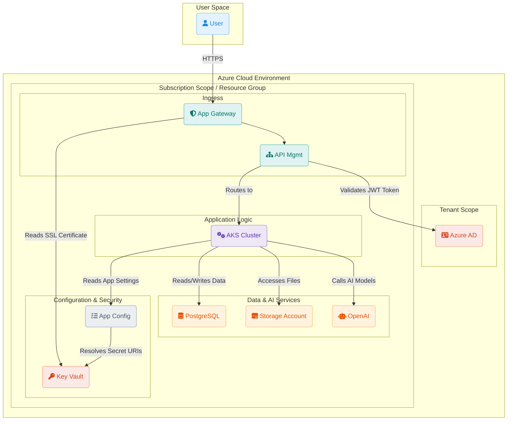
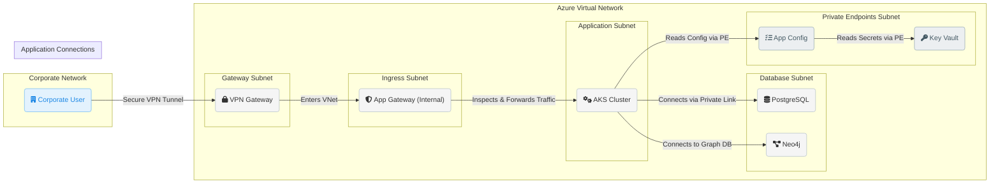
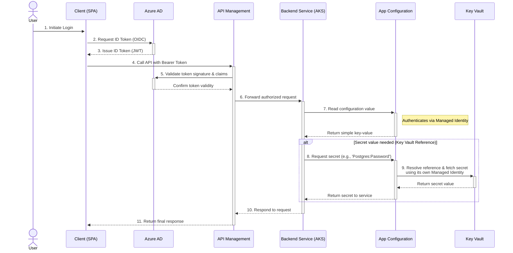

# Agentic AI - Azure Infrastructure as Code

## Architecture Diagrams

To understand the system, let's look at it from a few different perspectives.

### 1. High-Level System Architecture

This diagram provides a top-down overview of the major components, illustrating the flow from the user down to the backend services and security components.



### 2. Network Layout and Traffic Flow

This diagram focuses on the network segmentation and how traffic flows into and within the environment. With all users being internal, the architecture is simplified to a single, private entry path via the corporate VPN, enhancing security by removing public internet exposure.



### 3. Security and Authentication Flow

This diagram details the authentication flow and the centralized configuration access pattern using a sequence diagram for clarity.



## How to Deploy

The infrastructure is deployed in a two-step process to correctly handle resources at different Azure scopes (Tenant and Subscription).

### Step 1: Deploy Tenant-Level Resources (One-Time)

This step deploys the Azure Active Directory application registration. It only needs to be run once for the entire tenant by an administrator with permissions to create AAD applications.

```powershell
./deploy-tenant.ps1
```

After the script completes, note the `clientId` and `tenantId` from the output. These are required for the environment deployments.

### Step 2: Deploy Environment-Specific Infrastructure

This step deploys all the resources for a specific environment (e.g., dev, qa, prod) into a dedicated resource group.

#### Prerequisites

1.  **Azure CLI**: Ensure you have the Azure CLI installed and authenticated.
    ```powershell
    az login
    az account set --subscription <Your-Subscription-ID>
    ```
2.  **PowerShell**: The deployment scripts are designed to be run in a PowerShell environment.
    **Example:**

    ```powershell
    ./deploy.ps1 `
        -SubscriptionId "your-subscription-id" `
        -Environment "dev" `
        -AadClientId "client-id-from-tenant-deployment" `
        -TenantId "tenant-id-from-tenant-deployment" `
        -AdminGroupObjectId "azure-ad-group-object-id-for-aks-admins" `
        -AppGwSslCertSecretId "your-key-vault-secret-id-for-ssl-cert" `
        -PostgresCredential (Get-Credential) `
        -PublisherEmail "your.email@example.com"
    ```

    ### Parameters for `deploy.ps1`

    -   `SubscriptionId` (Mandatory): The ID of the Azure subscription to deploy to.
    -   `Environment` (Mandatory): The target environment name (e.g., `dev`, `qa`, `prod`).
    -   `AadClientId` (Mandatory): The Client ID of the AAD Application from the tenant deployment.
    -   `TenantId` (Mandatory): The Tenant ID where the AAD Application is registered.
    -   `AdminGroupObjectId` (Mandatory): The Object ID of the Azure AD group that will be granted administrator access to the AKS cluster.
    -   `AppGwSslCertSecretId` (Mandatory): The secret identifier (URI) for the SSL certificate stored in Key Vault.
    -   `PostgresCredential` (Mandatory): A PowerShell credential object for the PostgreSQL administrator.
    -   `PublisherEmail` (Mandatory): The email address to be associated with the API Management service publisher.
    -   `AppGatewayBackendIpsJson` (Optional): A JSON string representing an array of IP addresses for the Application Gateway's backend pool. Defaults to an empty array.

3.  **SSL Certificate**: You must have an SSL certificate uploaded to an Azure Key Vault as a secret. The secret's URI is required for the deployment.
    ```powershell
    az keyvault secret set --vault-name <your-key-vault-name> --name <your-secret-name> --value <your-certificate-content>
    ```