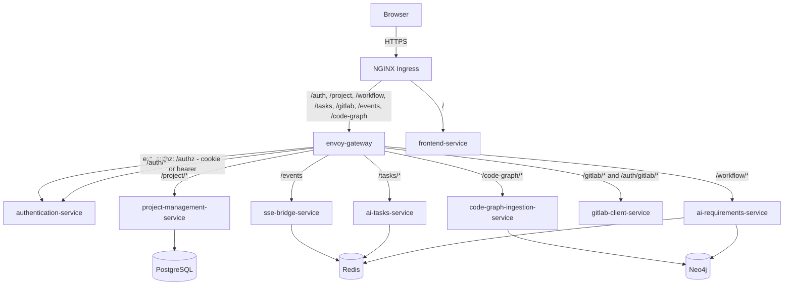
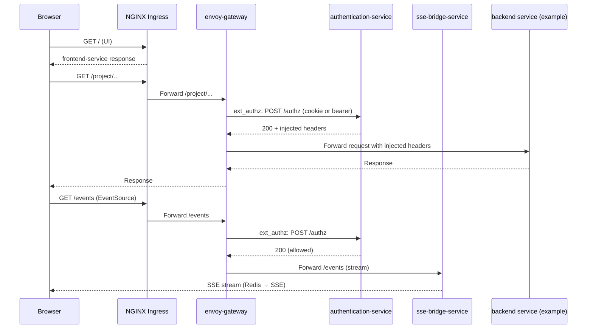

# Agentic AI - Kubernetes Manifests

Kubernetes deployment manifests using Kustomize for the Git Epic Creator platform.

## Architecture



## Structure

```
k8s/
├── base/
│   ├── kustomization.yaml
│   ├── namespace.yaml
│   ├── service-account.yaml
│   ├── configmap.yaml
│   ├── envoy-configmap.yaml
│   ├── secret-provider.yaml
│   ├── network-policy.yaml
│   ├── ingress.yaml
│   ├── services/
│   │   ├── authentication-service.yaml
│   │   ├── sse-bridge-service.yaml
│   │   ├── envoy-gateway.yaml
│   │   ├── frontend-service.yaml
│   │   └── ... other services
│   ├── statefulsets/
│   │   ├── neo4j.yaml
│   │   └── postgresql.yaml
│   └── jobs/
│       ├── postgresdb-schema-init.yaml
│       └── neo4j-schema-init.yaml
└── overlays/
    ├── dev/
    ├── prod/
    └── local/
```

## Services

| Service | Replicas (Dev/Prod) | Purpose |
|---------|---------------------|---------|
| `envoy-gateway` | 1/1 | **API Gateway** (routing, retries, timeouts, `ext_authz`) |
| `authentication-service` | 1/3 | **Auth + ext_authz** (MSAL sessions + `/authz`, S2S token minting) |
| `sse-bridge-service` | 1/3 | **SSE bridge** (`/events`, Redis → SSE) |
| `frontend-service` | 1/3 | UI (React Router SSR) |
| `project-management-service` | 1/3 | Project CRUD |
| `ai-requirements-service` | 1/3 | AI requirement generation |
| `ai-tasks-service` | 1/3 | AI task breakdown |
| `neo4j-retrieval-service` | 1/3 | Knowledge graph queries |
| `neo4j-ingestion-service` | 1/1 | GraphRAG ingestion |
| `neo4j-repository-service` | 1/1 | Neo4j repository API (schema init + typed Cypher registry) |
| `document-processing-service` | 1/3 | Document parsing |
| `gitlab-client-service` | 1/2 | GitLab integration |
| `code-graph-ingestion-service` | 1/1 | Code graph ingestion (`/code-graph/*`) |
| `db-init-service` | 1/1 | PostgreSQL schema |
| `mock-auth-service` | 1/1 | Dev auth mock |
| `postgresql` (StatefulSet) | 1/1 | Relational data |
| `neo4j` (StatefulSet) | 1/1 | Graph database |

## Request Flow



**Why Envoy + authentication-service + SSE bridge?**
- Envoy owns routing/retries/timeouts and calls `authentication-service /authz` (`ext_authz`) for centralized policy enforcement.
- authentication-service keeps Azure AD login (MSAL) and session management.
- sse-bridge-service provides `/events` (Redis → SSE); auth is enforced by Envoy.

## Prerequisites

1. **Azure infrastructure deployed** (see `infra/README.md`)
2. **kubectl** configured for AKS cluster
3. **Kustomize** v5.0+ installed
4. **Helm** (for NGINX Ingress)

## Deployment

### 1. Install NGINX Ingress Controller

```bash
helm repo add ingress-nginx https://kubernetes.github.io/ingress-nginx
helm repo update
helm install nginx-ingress ingress-nginx/ingress-nginx \
  --namespace ingress-nginx --create-namespace \
  --set controller.service.type=LoadBalancer \
  --set controller.service.annotations."service\.beta\.kubernetes\.io/azure-load-balancer-internal"="true"
```

### 2. Create Image Pull Secret (Corporate Registry)

```bash
kubectl create secret docker-registry regcred \
  --docker-server=<your-registry.azurecr.io> \
  --docker-username=<username> \
  --docker-password=<password> \
  -n agentic-ai
```

### 3. Set Environment Variables

```bash
export ENVIRONMENT="dev"
export CONTAINER_REGISTRY="your-registry.azurecr.io"
export DOCKER_IMAGE_TAG="latest"
export WORKLOAD_IDENTITY_CLIENT_ID="..." # From infra deployment
export KEY_VAULT_NAME="agentic-ai-dev-kv"
export REDIS_HOST="agentic-ai-dev-redis.redis.cache.windows.net"
export OAI_ENDPOINT="https://agentic-ai-dev-oai.openai.azure.com"
export AZURE_TENANT_ID="..."
export AZURE_CLIENT_ID="..."
```

### 4. Deploy with Kustomize

```bash
cd k8s/overlays/dev

# Set images
kustomize edit set image \
  sse-bridge-service=${CONTAINER_REGISTRY}/sse-bridge-service:${DOCKER_IMAGE_TAG}

# Apply with variable substitution
kustomize build . | envsubst | kubectl apply -f -
```

Or use the GitLab CI/CD pipeline for automated deployment.

## Local Kubernetes (Docker Desktop / kind)

Use the local overlay at `k8s/overlays/local` to run the same K8s topology locally, without Azure KeyVault CSI:

- Local overlay docs: `k8s/overlays/local/README.md`
- Apply:

```bash
kubectl apply -k k8s/overlays/local
```

Access locally via port-forward (Ingress is deleted in the local overlay):

```bash
kubectl -n agentic-ai port-forward svc/frontend-service 8080:80
kubectl -n agentic-ai port-forward svc/envoy-gateway 8000:80
```

## Configuration

### Environment Variables (ConfigMap)

| Variable | Value | Description |
|----------|-------|-------------|
| `POSTGRES_HOST` | `postgresql-service` | K8s service name |
| `NEO4J_URI` | `bolt://neo4j-service:7687` | K8s service name |
| `REDIS_HOST` | `${REDIS_HOST}` | Azure Redis (from infra) |
| `OAI_BASE_URL` | `${OAI_ENDPOINT}` | Azure OpenAI (from infra) |

### Secrets (from Key Vault via CSI Driver)

| Secret | Key Vault Name | Description |
|--------|----------------|-------------|
| `POSTGRES_PASSWORD` | `Postgres-Password` | PostgreSQL auth |
| `NEO4J_PASSWORD` | `Neo4j-Password` | Neo4j auth |
| `REDIS_PASSWORD` | `Redis-Password` | Azure Redis auth |
| `SESSION_SECRET_KEY` | `Session-SecretKey` | Browser session signing (authentication-service) |
| `LOCAL_JWT_SECRET` | `Local-JwtSecret` | S2S token signing (authentication-service) |
| `API_GATEWAY_MINT_SECRET` | `Api-Gateway-MintSecret` | Legacy `/auth/s2s/mint` caller secret (still used by init jobs) |
| `OAI_KEY` | `OpenAI-ApiKey` | Azure OpenAI |

## Storage

| StatefulSet | PVC Size | Storage Class |
|-------------|----------|---------------|
| PostgreSQL | 10Gi | managed-premium |
| Neo4j data | 50Gi | managed-premium |
| Neo4j logs | 10Gi | managed-premium |

## Network Policies

| Policy | Description |
|--------|-------------|
| `default-deny-ingress` | Deny all ingress by default |
| `allow-ingress-from-gateway` | NGINX -> envoy-gateway |
| `allow-frontend-service-ingress-from-gateway` | NGINX -> frontend-service |
| `allow-sse-bridge-service-ingress-from-envoy` | envoy-gateway -> sse-bridge-service |
| `allow-backend-communication` | envoy-gateway <-> backend tier + backend <-> backend |
| `allow-data-tier-access` | Backend -> PostgreSQL/Neo4j |

## Troubleshooting

### Check pod status
```bash
kubectl get pods -n agentic-ai
kubectl describe pod <pod-name> -n agentic-ai
```

### View logs
```bash
kubectl logs -f deployment/sse-bridge-service -n agentic-ai
```

### Check secrets mounting
```bash
kubectl exec -it deployment/sse-bridge-service -n agentic-ai -- ls /mnt/secrets-store
```

### Check NGINX Ingress
```bash
kubectl get ingress -n agentic-ai
kubectl logs -n ingress-nginx -l app.kubernetes.io/name=ingress-nginx
```

### PostgreSQL connection
```bash
kubectl exec -it statefulset/postgresql -n agentic-ai -- psql -U postgres -d requirementsdb
```
