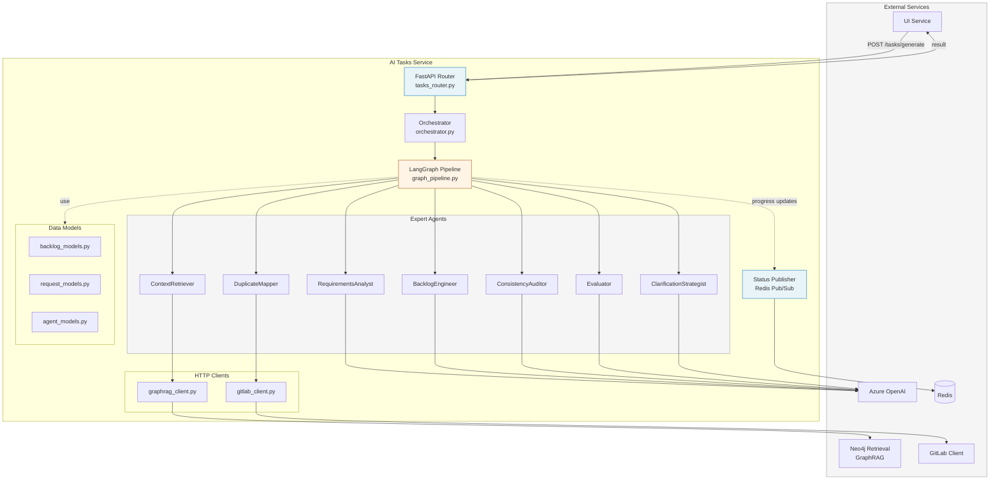
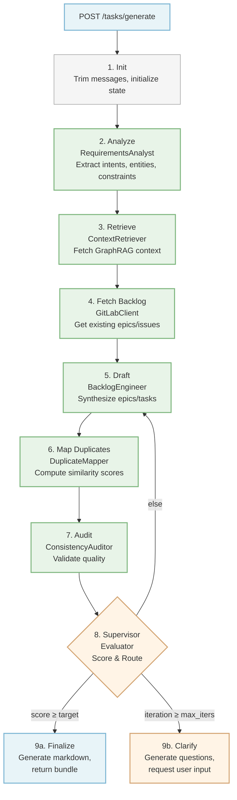
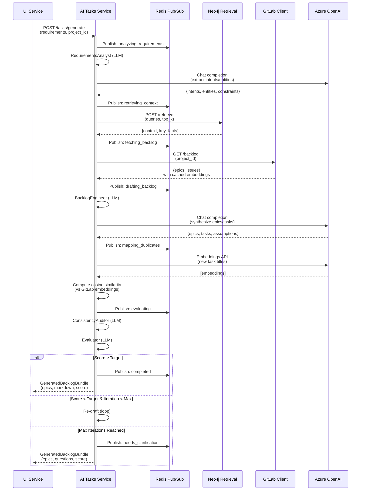
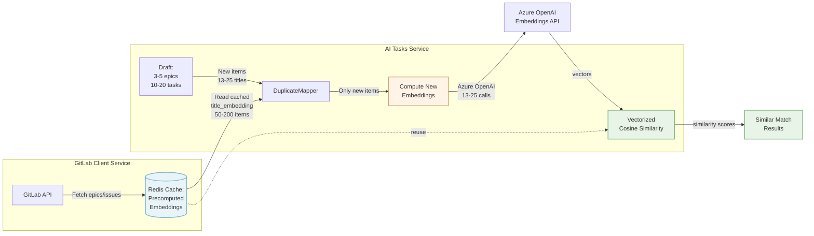
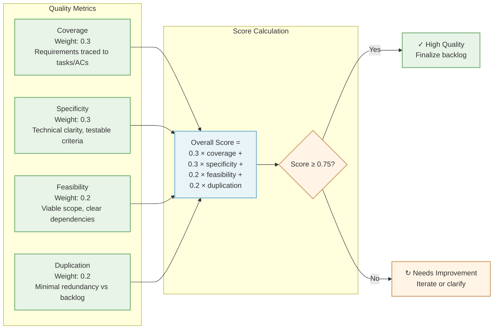

# AI Tasks Service

Agentic backlog generation service that transforms requirements into structured, actionable epics and tasks with intelligent duplicate detection.

## Overview

The AI Tasks Service is a LangGraph-based orchestration system that:

- **Synthesizes backlogs** from natural language requirements
- **Detects duplicates** against existing GitLab epics/issues using semantic similarity
- **Iteratively refines** output through self-evaluation and clarification loops
- **Publishes progress** in real-time via Redis Pub/Sub
- **Optimizes performance** by reusing cached embeddings from GitLab

## Key Features

### Intelligent Backlog Generation
- Decomposes requirements into epics and tasks following **INVEST principles** (Independent, Negotiable, Valuable, Estimable, Small, Testable)
- Generates detailed acceptance criteria in **Given/When/Then** format
- Identifies dependencies, assumptions, and risks
- Includes technical specificity (APIs, data models, endpoints)

### Optimized Duplicate Detection
- **Reuses embeddings** from gitlab_client_service Redis cache (50% reduction in OpenAI API calls)
- **Title-only embeddings** for accurate similarity matching
- **Vectorized similarity computation** using sklearn (10-100x faster than loops)
- **Configurable threshold** (default: 0.83 cosine similarity)

### Self-Evaluating Workflow
- **4-axis quality rubric**: coverage, specificity, feasibility, duplication
- **Iterative improvement loop** with configurable max iterations (default: 3)
- **Automatic clarification** when quality score falls below target (default: 0.75)
- **Contextual questions** generated to address weak areas

### Real-Time Progress Updates
- Redis Pub/Sub channel: `ui:ai_tasks_progress`
- Status updates: `analyzing_requirements`, `retrieving_context`, `fetching_backlog`, `drafting_backlog`, `mapping_duplicates`, `evaluating`, `completed`, `error`

## Architecture

### Component Overview



### Ensemble-of-Experts Pattern

The service orchestrates 7 specialized expert agents using **LangGraph StateGraph**:



### Expert Agents

| Expert | Purpose | LLM Call |
|--------|---------|----------|
| **RequirementsAnalyst** | Extracts intents, entities, constraints from requirements | ✅ Chat |
| **ContextRetriever** | Fetches technical context from GraphRAG (Neo4j) | ❌ HTTP only |
| **BacklogEngineer** | Synthesizes epics/tasks with INVEST principles | ✅ Chat |
| **DuplicateMapper** | Computes embeddings and similarity scores | ✅ Embeddings |
| **ConsistencyAuditor** | Validates quality, identifies overlaps and gaps | ✅ Chat |
| **Evaluator** | Scores backlog on 4-axis rubric, routes workflow | ✅ Chat |
| **ClarificationStrategist** | Generates targeted questions for weak areas | ✅ Chat (conditional) |

### Directory Structure

```
ai_tasks_service/
├── src/
│   ├── config.py                           # AITasksSettings with shared configs
│   ├── main.py                             # FastAPI app with health checks
│   ├── models/
│   │   ├── backlog_models.py               # Epic, Task, SimilarMatch
│   │   ├── request_models.py               # TasksChatRequest, GeneratedBacklogBundle
│   │   ├── progress_messages.py            # BacklogProgressMessage (Redis)
│   │   └── agent_models.py                 # Internal expert state models
│   ├── routers/
│   │   └── tasks_router.py                 # POST /tasks/generate
│   ├── services/
│   │   └── ai_tasks_status_publisher.py    # Redis pub/sub publisher
│   └── orchestrator/
│       ├── llm.py                          # LLM factory (Azure OpenAI)
│       ├── graph_pipeline.py               # LangGraph StateGraph
│       ├── orchestrator.py                 # Entry point: run_backlog_workflow()
│       └── experts/
│           ├── requirements_analyst.py
│           ├── context_retriever.py
│           ├── backlog_engineer.py
│           ├── duplicate_mapper.py
│           ├── consistency_auditor.py
│           ├── evaluator.py
│           ├── clarification_strategist.py
│           └── clients/
│               ├── graphrag_client.py      # HTTP client for neo4j_retrieval_service
│               └── gitlab_client.py        # HTTP client for gitlab_client_service
├── tests/
│   ├── test_config.py                      # Configuration validation tests
│   └── test_models.py                      # Pydantic model tests
├── pyproject.toml
├── Dockerfile
└── README.md
```

## API Endpoints

### POST /tasks/generate

Single chat-style endpoint for both initial generation and iterative refinement.

**Headers:**
```http
Authorization: Bearer <jwt_token>
X-GitLab-Access-Token: <gitlab_token>  # Optional, forwarded from UI
```

**Request:**
```json
    {
  "project_id": "550e8400-e29b-41d4-a716-446655440000",
  "prompt_id": "660e8400-e29b-41d4-a716-446655440001",  // Optional: omit for new conversation
  "message": "Generate backlog for user authentication system with OAuth2 support",
  "options": {
    "top_k": 2,
    "similarity_threshold": 0.83,
    "max_iters": 3
  }
}
```

**Response (High Quality Score ≥ Target):**
```json
{
  "prompt_id": "660e8400-e29b-41d4-a716-446655440001",
  "project_id": "550e8400-e29b-41d4-a716-446655440000",
  "epics": [
    {
      "id": "EPIC-001",
      "title": "User Authentication System",
      "description": "Complete OAuth2-based authentication with token management",
      "tasks": [
        {
          "id": "TASK-001",
          "title": "Implement OAuth2 login endpoint",
          "description": "Create RESTful endpoint for OAuth2 provider integration with token issuance",
          "acceptance_criteria": [
            "Given valid credentials, When login attempted, Then JWT token issued with 1-hour expiry",
            "Given invalid credentials, When login attempted, Then return 401 with error message",
            "Given OAuth provider timeout, When login attempted, Then retry with exponential backoff"
          ],
          "dependencies": [],
          "similar": [
            {
              "kind": "issue",
              "id": "123",
              "title": "Add OAuth login support",
              "status": "open",
              "similarity": 0.87,
              "url": "https://gitlab.com/issues/123"
            }
          ]
        }
      ],
      "similar": []
    }
  ],
  "assumptions": [
    "Users have valid email addresses",
    "OAuth provider (Google/GitHub) is available",
    "Redis is configured for session storage"
  ],
  "risks": [
    "OAuth provider downtime affects login availability",
    "Token refresh logic may need additional iteration",
    "GDPR compliance requirements for user data storage"
  ],
  "score": 0.81,
  "coverage_components": {
    "coverage": 0.82,
    "specificity": 0.78,
    "feasibility": 0.80,
    "duplication": 0.85
  },
  "clarification_questions": null,
  "markdown_text": "# Generated Backlog\n\n## Epic EPIC-001: User Authentication System\n..."
}
```

**Response (Low Score < Target):**
```json
{
  "prompt_id": "660e8400-e29b-41d4-a716-446655440001",
  "project_id": "550e8400-e29b-41d4-a716-446655440000",
  "epics": [...],
  "score": 0.65,
  "coverage_components": {
    "coverage": 0.60,
    "specificity": 0.68,
    "feasibility": 0.65,
    "duplication": 0.90
  },
  "clarification_questions": [
    {
      "id": "CLR-001",
      "text": "What OAuth providers should be supported (Google, GitHub, Microsoft, custom OIDC)?"
    },
    {
      "id": "CLR-002",
      "text": "Are there specific compliance requirements (GDPR, SOC2, HIPAA)?"
    },
    {
      "id": "CLR-003",
      "text": "What is the expected session duration and refresh token strategy?"
    }
  ],
  "markdown_text": null
}
```

### GET /health

Liveness/readiness endpoint with Redis and GraphRAG connectivity checks.

**Response:**
```json
{
  "status": "healthy",
  "timestamp": "2025-10-05T12:34:56Z",
  "checks": {
    "redis": "ok",
    "graphrag": "ok"
  }
}
```

## Integration Points

### Service Interaction Flow



### 1. Neo4j Retrieval Service (GraphRAG)

**Endpoint:** `POST {GRAPH_RAG_BASE_URL}/retrieve`

**Purpose:** Fetches technical context (architecture patterns, existing implementations, constraints) to inform epic/task synthesis

**Client:** `orchestrator/experts/clients/graphrag_client.py`

**Request:**
```json
{
  "project_id": "550e8400-e29b-41d4-a716-446655440000",
  "queries": [
    "Authentication patterns",
    "OAuth2 implementation",
    "Token management"
  ],
  "top_k": 2
}
```

### 2. GitLab Client Service

**Endpoint:** `GET {GITLAB_INGESTION_BASE_URL}/gitlab/projects/{project_id}/backlog`

**Purpose:** Fetches existing epics/issues with cached embeddings for duplicate detection

**Client:** `orchestrator/experts/clients/gitlab_client.py`

**Response:**
```json
{
  "epics": [
    {
      "id": "42",
      "title": "User Management",
      "title_embedding": [0.0023, -0.009, ...],  // Cached in Redis
      "status": "opened",
      "url": "https://gitlab.com/epics/42"
    }
  ],
  "issues": [
    {
      "id": "123",
      "title": "Add OAuth login support",
      "title_embedding": [0.0012, -0.007, ...],  // Cached in Redis
      "status": "opened",
      "url": "https://gitlab.com/issues/123"
    }
  ]
}
```

**Performance Optimization:**
- DuplicateMapper **reuses** `title_embedding` field from gitlab_client_service
- **Avoids redundant embedding computations** (only computes for newly generated items)
- **Reduces OpenAI API calls** by ~50% in typical scenarios

### 3. Redis Pub/Sub

**Channel:** `ui:ai_tasks_progress`

**Message Type:** `BacklogProgressMessage`

**Status Values:**
- `analyzing_requirements` - Requirements analysis started
- `retrieving_context` - Fetching GraphRAG context
- `fetching_backlog` - Fetching GitLab epics/issues
- `drafting_backlog` - Generating epics/tasks
- `mapping_duplicates` - Computing similarity scores
- `evaluating` - Quality evaluation in progress
- `needs_clarification` - Score below target, questions generated
- `completed` - Workflow finished
- `error` - Workflow failure

**Message Structure:**
```json
{
  "project_id": "550e8400-e29b-41d4-a716-446655440000",
  "prompt_id": "660e8400-e29b-41d4-a716-446655440001",
  "status": "drafting_backlog",
  "thought_summary": "Synthesizing epics and tasks from requirements...",
  "details_md": "### Backlog Synthesis\nGenerating 3 epics with INVEST principles...",
  "timestamp": "2025-10-05T12:34:56Z"
}
```

## Configuration

### Environment Variables

```bash
# Service URLs
GRAPH_RAG_BASE_URL=http://neo4j-retrieval-service:8000
GITLAB_INGESTION_BASE_URL=http://gitlab-client-service:8000
HTTP_TIMEOUT_SEC=30.0

# Azure OpenAI (required)
OAI_BASE_URL=https://your-resource.openai.azure.com
OAI_KEY=your-azure-openai-key
OAI_API_VERSION=2024-02-01
OAI_MODEL=gpt-4
OAI_EMBED_MODEL_NAME=text-embedding-3-small
OAI_EMBED_DEPLOYMENT_NAME=text-embedding-3-small
LLM_TIMEOUT_SEC=20.0
LLM_TEMPERATURE=0.2

# Redis
REDIS_URL=redis://redis:6379

# Workflow Parameters
CLARIFICATION_SCORE_TARGET=0.75           # Target score for finalization (0.0-1.0)
MAX_AGENT_ITERS=3                         # Maximum refinement iterations
SIMILARITY_THRESHOLD=0.83                 # Cosine similarity for duplicates (0.0-1.0)
RETRIEVAL_TOP_K=2                         # Number of GraphRAG results per query

# Evaluation Weights (must sum to 1.0)
EVAL_WEIGHTS={
  "coverage": 0.3,                        # Requirements coverage
  "specificity": 0.3,                     # Technical clarity and testability
  "feasibility": 0.2,                     # Viability within constraints
  "duplication": 0.2                      # Minimal redundancy
}

# Retry Configuration
RETRY_MAX_ATTEMPTS=3
RETRIEVAL_BACKOFF_BASE_SEC=0.2
```

### Configuration Class

Settings are managed via `AITasksSettings` (Pydantic-based) in `src/config.py`:

```python
from config import get_ai_tasks_settings

settings = get_ai_tasks_settings()
print(settings.CLARIFICATION_SCORE_TARGET)  # 0.75
print(settings.llm.OAI_MODEL)               # gpt-4
print(settings.redis.REDIS_URL)             # redis://redis:6379
```

## Development

### Setup

```bash
cd services/ai_tasks_service

# Install in editable mode with dev dependencies
pip install -e .[dev]
```

### Dependencies

Core dependencies (from `pyproject.toml`):
- `fastapi` - REST API framework
- `langgraph` - Agentic workflow orchestration
- `langchain-openai` - Azure OpenAI integration
- `openai` - OpenAI SDK for embeddings
- `redis[hiredis]` - Redis pub/sub client
- `httpx` - HTTP client for service calls
- `tenacity` - Retry logic with exponential backoff
- `scikit-learn` - Cosine similarity computation
- `numpy` - Vectorized operations
- `deepeval` - LLM evaluation utilities
- `shared` - Shared utilities (JWT auth, Redis, config)

### Running Locally

```bash
# Set environment variables
export OAI_BASE_URL=https://your-resource.openai.azure.com
export OAI_KEY=your-key
export REDIS_URL=redis://localhost:6379

# Start service
uvicorn src.main:app --host 0.0.0.0 --port 8000 --reload
```

### Testing

```bash
# Run all tests
pytest tests/ -v

# Run specific test suites
pytest tests/test_config.py -v      # Configuration tests (4 tests)
pytest tests/test_models.py -v      # Model validation tests (8 tests)

# Run with coverage
pytest tests/ --cov=src --cov-report=html
```

**Test Results:** ✅ 12/12 passing

## Docker Deployment

### Dockerfile

Multi-stage build pattern:

```dockerfile
# Stage 1: Install shared dependencies
FROM python:3.11-slim AS shared-builder
WORKDIR /build
COPY shared/ ./shared/
RUN pip wheel --no-cache-dir --wheel-dir /build/wheels ./shared

# Stage 2: Install service dependencies
FROM python:3.11-slim AS service-builder
WORKDIR /build
COPY --from=shared-builder /build/wheels /build/wheels
COPY ai_tasks_service/pyproject.toml ./
RUN pip wheel --no-cache-dir --wheel-dir /build/wheels --find-links /build/wheels .

# Stage 3: Runtime
FROM python:3.11-slim
WORKDIR /app
COPY --from=service-builder /build/wheels /tmp/wheels
RUN pip install --no-cache-dir --no-index --find-links /tmp/wheels ai-tasks-service \
    && rm -rf /tmp/wheels
COPY ai_tasks_service/src/ ./src/
EXPOSE 8000
CMD ["uvicorn", "main:app", "--host", "0.0.0.0", "--port", "8000"]
```

### Docker Compose

Add to `docker-compose.yml`:

```yaml
ai-tasks-service:
  build:
    context: ./services
    dockerfile: ./ai_tasks_service/Dockerfile
  ports:
    - "8012:8000"
  env_file:
    - ./docker-compose.env
  environment:
    - API_PORT=8000
    - SERVICE_NAME=ai-tasks-service
  depends_on:
    - neo4j-retrieval-service
    - gitlab-client-service
    - redis
  networks:
    - app-network
  healthcheck:
    test: ["CMD", "curl", "-f", "http://localhost:8000/health"]
    interval: 30s
    timeout: 10s
    retries: 3
    start_period: 5s
```

### Start Service

```bash
# Build and start
docker-compose up ai-tasks-service --build

# View logs
docker-compose logs -f ai-tasks-service

# Check health
curl http://localhost:8012/health
```

## Performance Optimization

### Embedding Reuse Strategy

The `DuplicateMapper` expert achieves significant performance gains through intelligent caching:



**Key Optimizations:**

1. **Reuses embeddings** from gitlab_client_service Redis cache
   - GitLab service pre-computes and caches `title_embedding` for all epics/issues
   - AI Tasks Service reads these cached embeddings directly

2. **Only computes new embeddings** for generated epics/tasks
   - Average backlog: 3-5 epics, 10-20 tasks → 13-25 new embeddings
   - Existing backlog: 50-200 items → 0 new embeddings

3. **API call reduction**
   - Without optimization: 13-25 (new) + 50-200 (existing) = 63-225 embedding calls
   - With optimization: 13-25 (new only) = **~50% reduction**

4. **Vectorized similarity computation**
   - Uses `sklearn.metrics.pairwise.cosine_similarity()`
   - Batch processes all comparisons in single NumPy operation
   - **10-100x faster** than nested loops

5. **Graceful degradation**
   - If cached embedding missing: logs warning, skips comparison
   - No workflow failure, just reduced duplicate detection coverage

### LLM Request Optimization

- **Message trimming**: Keeps last 512 tokens of chat history
- **Temperature 0.2**: Reduces randomness for consistent outputs
- **Timeout 20s**: Prevents hanging on slow LLM responses
- **Retry with backoff**: 3 attempts with exponential backoff (0.2s base)

## Workflow Quality Metrics

### Evaluation Rubric



**Metric Details:**

| Metric | Weight | Description | Low Score (< 0.6) | High Score (> 0.8) |
|--------|--------|-------------|-------------------|-------------------|
| **Coverage** | 0.3 | Every requirement has traceable tasks/ACs | Missing key requirements | All requirements decomposed |
| **Specificity** | 0.3 | Technical clarity, testable G/W/T criteria | Vague, ambiguous tasks | Clear APIs, data models, configs |
| **Feasibility** | 0.2 | Viable within constraints, dependencies clear | Unrealistic scope, missing risks | Well-scoped with risk mitigation |
| **Duplication** | 0.2 | Minimal redundancy vs. existing backlog | Many near-duplicates | Unique tasks, clear boundaries |

### Routing Logic


## Best Practices Followed

### SOLID Principles
- **Single Responsibility**: Each expert has one concern (analysis, synthesis, evaluation)
- **Dependency Inversion**: HTTP clients injected via FastAPI dependencies
- **Interface Segregation**: Clear separation of read/write operations

### DRY Principle
- Reused shared Redis client utilities (`shared` package)
- Reused shared LLM configuration (`LlmConfig`)
- Reused shared JWT authentication (`get_local_user_verified`)
- Reused embeddings from gitlab_client_service (no redundant computations)

### Code Quality
- **Type hints** throughout (Pydantic models, function signatures)
- **Structured logging** with structlog
- **Error handling** at every layer (try/except with proper logging)
- **Async/await** for I/O-bound operations (Redis, HTTP, LLM calls)

### Minimal & Clean Code
- No backward compatibility code
- No unused APIs or scaffolding
- Modern Python patterns (3.10+, walrus operator, unpacking)
- Always uses Azure OpenAI (no conditional logic for provider switching)

## Contributing

This service follows the architecture patterns established by `ai_requirements_service`. When adding new experts:

1. Create expert class in `src/orchestrator/experts/`
2. Implement structured I/O (Pydantic models for input/output)
3. Add LLM prompt with clear system/user message separation
4. Register node in `graph_pipeline.py`
5. Add unit tests in `tests/`
6. Update this README with expert description
