# AI Tasks Service

Agentic backlog generation service that transforms requirements into structured, actionable epics and tasks with intelligent duplicate detection.

## Overview

The AI Tasks Service is a LangGraph-based orchestration system that:

- **Synthesizes backlogs** from natural language requirements
- **Detects duplicates** against existing GitLab epics/issues using semantic similarity
- **Iteratively refines** output through self-evaluation and clarification loops
- **Publishes progress** in real-time via Redis Pub/Sub
- **Optimizes performance** by reusing cached embeddings from GitLab

## Key Features

### Intelligent Backlog Generation
- Decomposes requirements into epics and tasks following **INVEST principles** (Independent, Negotiable, Valuable, Estimable, Small, Testable)
- Generates detailed acceptance criteria in **Given/When/Then** format
- Identifies dependencies, assumptions, and risks
- Includes technical specificity (APIs, data models, endpoints)

### Multi-Project GitLab Integration
- **Comprehensive backlog analysis** across multiple GitLab projects/repositories
- **Parallel fetching** from all configured projects using asyncio for maximum performance
- **Source tracking** - each match includes `project_id` indicating origin project
- **User-controlled routing** - each backlog item has dropdown to select target GitLab project
- **Fault tolerance** - continues processing if individual project fetch fails
- **Use cases:**
  - Teams with multiple related repositories (frontend, backend, mobile)
  - Monorepo with separate GitLab projects per component
  - Cross-team coordination with shared backlog visibility

### Optimized Duplicate Detection
- **Reuses embeddings** from gitlab_client_service Redis cache (50% reduction in OpenAI API calls)
- **Title-only embeddings** for accurate similarity matching
- **Vectorized similarity computation** using sklearn (10-100x faster than loops)
- **Configurable threshold** (default: 0.83 cosine similarity)
- **Multi-project scope** - finds duplicates across ALL configured GitLab projects

### Self-Evaluating Workflow
- **4-axis quality rubric**: coverage, specificity, feasibility, duplication
- **Iterative improvement loop** with configurable max iterations (default: 3)
- **Automatic clarification** when quality score falls below target (default: 0.75)
- **Contextual questions** generated to address weak areas

### Real-Time Progress Updates
- Redis Pub/Sub channel: `ui:ai_tasks_progress`
- Status updates: `analyzing_requirements`, `retrieving_context`, `fetching_backlog`, `drafting_backlog`, `mapping_duplicates`, `evaluating`, `completed`, `error`
- Progress messages include per-project breakdown when fetching from multiple sources

## Architecture

### Component Overview


### Ensemble-of-Experts Pattern

The service orchestrates 7 specialized expert agents using **LangGraph StateGraph** with **parallel execution optimization**:


### Expert Agents

| Expert | Purpose | LLM Call | Model Used |
|--------|---------|----------|------------|
| **RequirementsAnalyst** | Extracts intents, entities, constraints from requirements | ✅ Chat | Fast Model |
| **ContextRetriever** | Fetches technical context from GraphRAG (Neo4j) | ❌ HTTP only | N/A |
| **BacklogEngineer** | Synthesizes epics/tasks with INVEST principles | ✅ Chat | **Standard Model** |
| **DuplicateMapper** | Computes embeddings and similarity scores | ✅ Embeddings | Embedding Model |
| **ConsistencyAuditor** | Validates quality, identifies overlaps and gaps | ✅ Chat | Fast Model |
| **Evaluator** | Scores backlog on 4-axis rubric, routes workflow | ✅ Chat | Fast Model |
| **ClarificationStrategist** | Generates targeted questions for weak areas | ✅ Chat (conditional) | Fast Model |

### LLM Chain Architecture

The service uses **LangChain Expression Language (LCEL)** to construct type-safe, composable LLM chains. Each expert follows a consistent pattern for prompt template construction and LLM invocation.

#### Model Selection Strategy

**Two-Tier Model Architecture:**
- **Standard Model** (`OAI_MODEL`): Used exclusively for **BacklogEngineer** due to high complexity of epic/task synthesis requiring advanced reasoning
- **Fast Model** (`OAI_MODEL_FAST`): Used for all other experts (RequirementsAnalyst, ConsistencyAuditor, Evaluator, ClarificationStrategist) to optimize cost and latency for simpler tasks

#### Chain Construction Pattern

```python
# 1. Prompt Repository (prompts/prompt_repository.py)
EXPERT_PROMPT = PromptSpec(
    name="expert_name",
    system="System role and instructions...",
    human="{variable_name}"  # Template variables
)

# 2. LLM Factory (clients/llm.py)
@lru_cache(maxsize=2)
def get_llm(use_fast_model: bool = False) -> AzureChatOpenAI:
    """Returns cached AzureChatOpenAI instance.
    
    Args:
        use_fast_model: If True, uses OAI_MODEL_FAST for simpler tasks.
                        If False, uses OAI_MODEL for complex reasoning (BacklogEngineer).
    """
    settings = get_ai_tasks_settings()
    model = settings.llm.OAI_MODEL_FAST if use_fast_model else settings.llm.OAI_MODEL
    
    return AzureChatOpenAI(
        azure_endpoint=settings.llm.OAI_BASE_URL,
        deployment_name=model,
        api_key=settings.llm.OAI_KEY,
        api_version=settings.llm.OAI_API_VERSION,
        timeout=settings.llm.LLM_TIMEOUT_SEC,
        temperature=settings.llm.LLM_TEMPERATURE,
    )

# 3. Expert Implementation (e.g., requirements_analyst.py)
class RequirementsAnalyst:
    async def analyze(self, requirements: str) -> RequirementsAnalysis:
        # Define output schema
        class AnalysisOut(BaseModel):
            intents: List[str] = Field(default_factory=list)
            entities: List[str] = Field(default_factory=list)
            constraints: List[str] = Field(default_factory=list)
        
        # Build chain using LCEL pipe operator
        prompt_tmpl = build_chat_prompt(REQUIREMENTS_ANALYST)
        llm = get_llm(use_fast_model=True)  # Fast model for simple extraction
        chain = prompt_tmpl | llm.with_structured_output(AnalysisOut)
        
        # Invoke async with type safety
        out: AnalysisOut = await chain.ainvoke({"requirements": requirements})
        
        return RequirementsAnalysis(
            intents=out.intents,
            entities=out.entities,
            constraints=out.constraints
        )
```

#### Execution Flow


**Key Components:**
1. **Prompt Template**: Fills system/human message templates with runtime variables
2. **Pipe Operator (`|`)**: Chains prompt to LLM in functional composition style
3. **Structured Output**: `with_structured_output(PydanticModel)` enforces type-safe JSON responses
4. **Async Invocation**: `ainvoke(variables)` executes non-blocking API call
5. **LRU Cache**: Prevents duplicate LLM client instantiation (2 variants cached)

**Performance Optimizations:**
- Fast model reduces latency by 40-60% for simple extraction/validation tasks
- Standard model reserved for BacklogEngineer's complex synthesis requiring deep reasoning
- LRU cache eliminates repeated client construction overhead
- Structured output eliminates post-processing and parsing errors

### Directory Structure

```
ai_tasks_service/
├── src/
│   ├── config.py                           # AITasksSettings with shared configs
│   ├── main.py                             # FastAPI app with health checks
│   ├── models/
│   │   ├── backlog_models.py               # Epic, Task, SimilarMatch
│   │   ├── request_models.py               # TasksChatRequest, GeneratedBacklogBundle
│   │   ├── progress_messages.py            # BacklogProgressMessage (Redis)
│   │   └── agent_models.py                 # Internal expert state models
│   ├── routers/
│   │   └── tasks_router.py                 # POST /tasks/generate
│   ├── services/
│   │   └── ai_tasks_status_publisher.py    # Redis pub/sub publisher
│   └── orchestrator/
│       ├── llm.py                          # LLM factory (Azure OpenAI)
│       ├── graph_pipeline.py               # LangGraph StateGraph
│       ├── orchestrator.py                 # Entry point: run_backlog_workflow()
│       └── experts/
│           ├── requirements_analyst.py
│           ├── context_retriever.py
│           ├── backlog_engineer.py
│           ├── duplicate_mapper.py
│           ├── consistency_auditor.py
│           ├── evaluator.py
│           ├── clarification_strategist.py
│           └── clients/
│               ├── graphrag_client.py      # HTTP client for neo4j_retrieval_service
│               ├── gitlab_client.py        # HTTP client for gitlab_client_service
│               └── project_client.py       # HTTP client for project_management_service
├── tests/
│   ├── test_config.py                      # Configuration validation tests
│   └── test_models.py                      # Pydantic model tests
├── pyproject.toml
├── Dockerfile
└── README.md
```

## API Endpoints

### POST /tasks/generate

Single chat-style endpoint for both initial generation and iterative refinement.

**Headers:**
```http
Authorization: Bearer <jwt_token>
X-GitLab-Access-Token: <gitlab_token>  # Optional, forwarded from UI
```

**Request:**
```json
    {
  "project_id": "550e8400-e29b-41d4-a716-446655440000",
  "prompt_id": "660e8400-e29b-41d4-a716-446655440001",  // Optional: omit for new conversation
  "message": "Generate backlog for user authentication system with OAuth2 support",
  "options": {
    "top_k": 2,
    "similarity_threshold": 0.83,
    "max_iters": 3
  }
}
```

**Response (High Quality Score ≥ Target):**
```json
{
  "prompt_id": "660e8400-e29b-41d4-a716-446655440001",
  "project_id": "550e8400-e29b-41d4-a716-446655440000",
  "epics": [
    {
      "id": "EPIC-001",
      "title": "User Authentication System",
      "description": "Complete OAuth2-based authentication with token management",
      "tasks": [
        {
          "id": "TASK-001",
          "title": "Implement OAuth2 login endpoint",
          "description": "Create RESTful endpoint for OAuth2 provider integration with token issuance",
          "acceptance_criteria": [
            "Given valid credentials, When login attempted, Then JWT token issued with 1-hour expiry",
            "Given invalid credentials, When login attempted, Then return 401 with error message",
            "Given OAuth provider timeout, When login attempted, Then retry with exponential backoff"
          ],
          "dependencies": [],
          "similar": [
            {
              "kind": "issue",
              "id": "123",
              "title": "Add OAuth login support",
              "status": "open",
              "similarity": 0.87,
              "url": "https://gitlab.com/issues/123"
            }
          ]
        }
      ],
      "similar": []
    }
  ],
  "assumptions": [
    "Users have valid email addresses",
    "OAuth provider (Google/GitHub) is available",
    "Redis is configured for session storage"
  ],
  "risks": [
    "OAuth provider downtime affects login availability",
    "Token refresh logic may need additional iteration",
    "GDPR compliance requirements for user data storage"
  ],
  "score": 0.81,
  "coverage_components": {
    "coverage": 0.82,
    "specificity": 0.78,
    "feasibility": 0.80,
    "duplication": 0.85
  },
  "clarification_questions": null,
  "markdown_text": "# Generated Backlog\n\n## Epic EPIC-001: User Authentication System\n..."
}
```

**Response (Low Score < Target):**
```json
{
  "prompt_id": "660e8400-e29b-41d4-a716-446655440001",
  "project_id": "550e8400-e29b-41d4-a716-446655440000",
  "epics": [...],
  "score": 0.65,
  "coverage_components": {
    "coverage": 0.60,
    "specificity": 0.68,
    "feasibility": 0.65,
    "duplication": 0.90
  },
  "clarification_questions": [
    {
      "id": "CLR-001",
      "text": "What OAuth providers should be supported (Google, GitHub, Microsoft, custom OIDC)?"
    },
    {
      "id": "CLR-002",
      "text": "Are there specific compliance requirements (GDPR, SOC2, HIPAA)?"
    },
    {
      "id": "CLR-003",
      "text": "What is the expected session duration and refresh token strategy?"
    }
  ],
  "markdown_text": null
}
```

### GET /health

Liveness/readiness endpoint with Redis and GraphRAG connectivity checks.

**Response:**
```json
{
  "status": "healthy",
  "timestamp": "2025-10-05T12:34:56Z",
  "checks": {
    "redis": "ok",
    "graphrag": "ok"
  }
}
```

## Multi-Project GitLab Architecture

### Overview

Projects can be linked to **multiple GitLab projects** for comprehensive backlog analysis. This enables:
- Finding duplicates across multiple repositories/teams
- User-controlled routing via dropdown on each backlog item
- Comprehensive coverage for complex systems with multiple codebases

### Data Flow


### Example Workflow

**Scenario:** Team managing a web application with 3 GitLab projects:
- Project 123: Frontend (React)
- Project 456: Backend API (Python)
- Project 789: Mobile App (Flutter)

**Step 1: Configuration**
```json
{
  "gitlab_backlog_project_ids": ["123", "456", "789"],
  "gitlab_backlog_project_urls": [
    "https://gitlab.com/team/frontend",
    "https://gitlab.com/team/backend-api", 
    "https://gitlab.com/team/mobile-app"
  ]
}
```

**Step 2: Task Generation**
User: *"Add OAuth2 authentication with social login support"*

**Step 3: Parallel Backlog Fetch**
```
Fetching from project 123: 15 epics, 87 issues
Fetching from project 456: 22 epics, 134 issues
Fetching from project 789: 8 epics, 45 issues
Total: 45 epics, 266 issues for duplicate detection
```

**Step 4: Match Detection**
```
Epic: "OAuth2 Authentication Flow"
  → Similar: Epic #42 "User Authentication" (85% match) [proj:456]
  
Task: "Implement Google OAuth Provider"  
  → Similar: Issue #156 "OAuth Integration" (88% match) [proj:456]
  
Task: "Add Login UI Component"
  → Similar: Issue #23 "Login Screen" (79% match) [proj:123]
```

**Step 5: User Review & Selection**
- Each backlog item has dropdown showing available projects
- Default: First configured project (123)
- User can select different target project for any item
- User accepts/rejects similar matches for linking

**Step 6: Submission with User Routing**
```
Submitting to GitLab Project 456 (user selected):
  - Epic: "OAuth2 Authentication Flow" (linked to #42 if accepted)
  - Task: "Implement Google OAuth Provider" (linked to #156 if accepted)

Submitting to GitLab Project 123 (user selected):
  - Task: "Add Login UI Component" (linked to #23 if accepted)
  - Task: "Update Navigation Component" (new item)

Submitting to GitLab Project 789 (user selected):
  - Task: "Mobile OAuth Screen" (new item)
```

### Performance Characteristics

| Projects | Avg Fetch Time | Items Analyzed | Memory Usage |
|----------|---------------|----------------|--------------|
| 1        | 1.2s          | 50-100         | ~15MB        |
| 3        | 1.5s          | 150-300        | ~25MB        |
| 5        | 1.8s          | 250-500        | ~35MB        |

**Performance Notes:**
- **Parallel fetching** keeps overhead minimal even with multiple projects
- GitLab fetch runs **concurrently with requirements analysis** (Parallel Block 1)
- Multiple projects fetched **simultaneously** using `asyncio.gather()`
- Each additional project adds only ~0.1-0.3s due to parallelization

## Integration Points

### Service Interaction Flow

```mermaid
sequenceDiagram
    participant UI as UI Service
    participant AI as AI Tasks Service
    participant ProjMgmt as Project Management
    participant Redis as Redis Pub/Sub
    participant Neo4j as Neo4j Retrieval
    participant GitLab as GitLab Client
    participant OpenAI as Azure OpenAI
    
    UI->>AI: POST /tasks/generate<br/>(requirements, project_id UUID)
    activate AI
    AI->>ProjMgmt: GET /projects/{project_id}
    ProjMgmt-->>AI: {id, gitlab_backlog_project_ids: [123, 456, 789]}
    Note over AI: Resolve internal UUID<br/>to array of GitLab project IDs
    
    Note over AI: 🚀 PARALLEL BLOCK 1: Analysis + Fetch
    par Requirements Analysis (parallel)
        AI->>Redis: Publish: analyzing_requirements
        AI->>AI: RequirementsAnalyst (LLM)
        AI->>OpenAI: Chat completion<br/>(extract intents/entities)
        OpenAI-->>AI: {intents, entities, constraints}
    and Fetch from multiple projects (parallel)
        AI->>Redis: Publish: fetching_backlog
        AI->>GitLab: GET /gitlab/projects/123/backlog
        GitLab-->>AI: {items} + add project_id:123
        AI->>GitLab: GET /gitlab/projects/456/backlog
        GitLab-->>AI: {items} + add project_id:456
        AI->>GitLab: GET /gitlab/projects/789/backlog
        GitLab-->>AI: {items} + add project_id:789
    end
    Note over AI: Aggregate all backlogs<br/>Each item tagged with source project_id
    Note over AI: Total: {epics, issues}<br/>with cached embeddings + project_id
    
    AI->>Redis: Publish: retrieving_context
    AI->>Neo4j: POST /retrieve<br/>(queries, top_k)
    Neo4j-->>AI: {context, key_facts}
    
    AI->>Redis: Publish: drafting_backlog
    AI->>AI: BacklogEngineer (LLM)
    AI->>OpenAI: Chat completion<br/>(synthesize epics/tasks)
    OpenAI-->>AI: {epics, tasks, assumptions}
    
    Note over AI: 🚀 PARALLEL BLOCK 2: Mapping + Audit
    par Duplicate Mapping (parallel)
        AI->>Redis: Publish: mapping_duplicates
        AI->>OpenAI: Embeddings API<br/>(new task titles only)
        OpenAI-->>AI: [embeddings]
        Note over AI: Compute cosine similarity<br/>vs all GitLab items (tagged with project_id)
        Note over AI: Each match includes:<br/>- similarity score<br/>- project_id (source)<br/>- item details
    and Consistency Audit (parallel)
        AI->>AI: ConsistencyAuditor (LLM)
        AI->>OpenAI: Chat completion<br/>(validate quality)
        OpenAI-->>AI: {issues, suggestions, overlaps}
    end
    
    AI->>Redis: Publish: evaluating
    AI->>AI: Evaluator (DeepEval 4 metrics in parallel)
    par DeepEval Metrics (parallel)
        AI->>OpenAI: Coverage metric
        OpenAI-->>AI: score
    and
        AI->>OpenAI: Specificity metric
        OpenAI-->>AI: score
    and
        AI->>OpenAI: Feasibility metric
        OpenAI-->>AI: score
    and
        AI->>OpenAI: Duplication metric
        OpenAI-->>AI: score
    end
    
    alt Score ≥ Target
        AI->>Redis: Publish: completed
        Note over AI,UI: Bundle includes:<br/>- Epics & tasks<br/>- Similar matches with project_id<br/>- Quality score & metadata
        AI-->>UI: GeneratedBacklogBundle<br/>(epics, similar[], score)
    else Score < Target & Iteration < Max
        AI->>AI: Re-draft (loop)
    else Max Iterations Reached
        AI->>Redis: Publish: needs_clarification
        AI-->>UI: GeneratedBacklogBundle<br/>(epics, questions, score)
    end
    deactivate AI
    
    Note over UI: User reviews matches<br/>Sees project_id badges (e.g., proj:456)
    Note over UI: User accepts matches<br/>UI groups by target project_id
    
    UI->>GitLab: POST /projects/456/apply-backlog<br/>(items with matches from 456)
    UI->>GitLab: POST /projects/123/apply-backlog<br/>(items with no matches - default)
```



### 1. Neo4j Retrieval Service (GraphRAG)

**Endpoint:** `POST {GRAPH_RAG_SERVICE_URL}/retrieve`

**Purpose:** Fetches technical context (architecture patterns, existing implementations, constraints) to inform epic/task synthesis

**Client:** `orchestrator/experts/clients/graphrag_client.py`

**Request:**
```json
{
  "project_id": "550e8400-e29b-41d4-a716-446655440000",
  "queries": [
    "Authentication patterns",
    "OAuth2 implementation",
    "Token management"
  ],
  "top_k": 2
}
```

### 2. Project Management Service

**Endpoint:** `GET {PROJECT_MANAGEMENT_SERVICE_URL}/projects/{project_id}`

**Purpose:** Resolves internal PostgreSQL project UUID to GitLab numeric project IDs (supports multiple backlog projects)

**Client:** `orchestrator/experts/clients/project_client.py`

**Request:** HTTP GET with Authorization header

**Response:**
```json
{
  "id": "550e8400-e29b-41d4-a716-446655440000",
  "name": "My Project",
  "gitlab_backlog_project_ids": ["123", "456"],
  "gitlab_backlog_project_urls": ["https://gitlab.com/group/project1", "https://gitlab.com/group/project2"],
  "gitlab_repository_url": "https://gitlab.com/group/repo.git",
  "status": "active"
}
```

**Note:** If `gitlab_backlog_project_ids` is empty or null, the project is not linked to GitLab and duplicate detection is skipped. The workflow uses ALL project IDs for comprehensive backlog analysis across multiple repositories.

### 3. GitLab Client Service

**Endpoint:** `GET {GITLAB_CLIENT_SERVICE_URL}/gitlab/projects/{gitlab_project_id}/backlog`

**Purpose:** Fetches existing epics/issues with cached embeddings for duplicate detection

**Client:** `orchestrator/experts/clients/gitlab_client.py`

**Note:** Requires numeric GitLab project ID (e.g., "123"), not internal UUID

**Response:**
```json
{
  "epics": [
    {
      "id": "42",
      "title": "User Management",
      "title_embedding": [0.0023, -0.009, ...],  // Cached in Redis
      "status": "opened",
      "url": "https://gitlab.com/epics/42"
    }
  ],
  "issues": [
    {
      "id": "123",
      "title": "Add OAuth login support",
      "title_embedding": [0.0012, -0.007, ...],  // Cached in Redis
      "status": "opened",
      "url": "https://gitlab.com/issues/123"
    }
  ]
}
```

**Performance Optimization:**
- DuplicateMapper **reuses** `title_embedding` field from gitlab_client_service
- **Avoids redundant embedding computations** (only computes for newly generated items)
- **Reduces OpenAI API calls** by ~50% in typical scenarios

**GitLab Integration Prerequisites:**
- Project must have at least one entry in `gitlab_backlog_project_ids` array in Project Management database
- `gitlab_backlog_project_ids` are resolved during project creation via GitLab URL lookup
- If project not linked to GitLab (empty array), duplicate detection is gracefully skipped
- **Multiple backlog projects fully supported:**
  - Fetches from ALL projects in parallel for maximum performance
  - Each match includes `project_id` indicating source project
  - Smart submission routes items to correct GitLab project based on accepted matches
  - Enables comprehensive duplicate detection across multiple repositories/teams

### 4. Redis Pub/Sub

**Channel:** `ui:ai_tasks_progress`

**Message Type:** `BacklogProgressMessage`

**Status Values:**
- `analyzing_requirements` - Requirements analysis started
- `retrieving_context` - Fetching GraphRAG context
- `fetching_backlog` - Fetching GitLab epics/issues
- `drafting_backlog` - Generating epics/tasks
- `mapping_duplicates` - Computing similarity scores
- `evaluating` - Quality evaluation in progress
- `needs_clarification` - Score below target, questions generated
- `completed` - Workflow finished
- `error` - Workflow failure

**Message Structure:**
```json
{
  "project_id": "550e8400-e29b-41d4-a716-446655440000",
  "prompt_id": "660e8400-e29b-41d4-a716-446655440001",
  "status": "drafting_backlog",
  "thought_summary": "Synthesizing epics and tasks from requirements...",
  "details_md": "### Backlog Synthesis\nGenerating 3 epics with INVEST principles...",
  "timestamp": "2025-10-05T12:34:56Z"
}
```

## Configuration

### Environment Variables

```bash
# Service URLs
GRAPH_RAG_SERVICE_URL=http://neo4j-retrieval-service:8000
GITLAB_CLIENT_SERVICE_URL=http://gitlab-client-service:8000
PROJECT_MANAGEMENT_SERVICE_URL=http://project-management-service:8000
HTTP_CONNECTION_TIMEOUT=30.0
HTTP_READ_TIMEOUT=180.0
WORKFLOW_TIMEOUT_SEC=150

# Azure OpenAI (required)
# Note: Service uses AzureChatOpenAI connector which requires deployment_name parameter
# OAI_MODEL is used as the deployment_name for Azure OpenAI deployments (complex tasks)
# OAI_MODEL_FAST is used as the deployment_name for Azure OpenAI deployments (simple/review tasks)
OAI_BASE_URL=https://your-resource.openai.azure.com     # Azure endpoint (no trailing /openai)
OAI_KEY=your-azure-openai-key                           # Azure OpenAI API key
OAI_API_VERSION=2024-02-01                              # Azure OpenAI API version
OAI_MODEL=gpt-4                                         # Azure deployment name for complex tasks (backlog generation)
OAI_MODEL_FAST=gpt-4o-mini                              # Azure deployment name for fast tasks (analysis, audits, evaluation)
OAI_EMBED_MODEL_NAME=text-embedding-3-small             # Embedding model name (for tiktoken)
OAI_EMBED_DEPLOYMENT_NAME=text-embedding-3-small        # Embedding deployment name
LLM_TIMEOUT_SEC=20.0                                    # Shared via LlmConfig
LLM_TEMPERATURE=0.2                                     # Shared via LlmConfig

# Model Selection Strategy:
# - Standard Model (OAI_MODEL): Used for complex technical decomposition
#   * BacklogEngineer: Epic and task generation with mermaid diagrams
# - Fast Model (OAI_MODEL_FAST): Used for analysis and review tasks (60-70% of calls)
#   * RequirementsAnalyst: Parse requirements into structured intents
#   * ConsistencyAuditor: Backlog quality review
#   * Evaluator: Quality scoring and gap identification
#   * ClarificationStrategist: Clarification question generation
# - LLM Parameters: LLM_TIMEOUT_SEC and LLM_TEMPERATURE are centralized in shared LlmConfig for consistency

# Redis
REDIS_URL=redis://redis:6379

# Workflow Parameters
CLARIFICATION_SCORE_TARGET=0.75           # Target score for finalization (0.0-1.0)
MAX_AGENT_ITERS=3                         # Maximum refinement iterations
SIMILARITY_THRESHOLD=0.83                 # Cosine similarity for duplicates (0.0-1.0)
RETRIEVAL_TOP_K=2                         # Number of GraphRAG results per query

# Evaluation Weights (must sum to 1.0)
EVAL_WEIGHTS={
  "coverage": 0.3,                        # Requirements coverage
  "specificity": 0.3,                     # Technical clarity and testability
  "feasibility": 0.2,                     # Viability within constraints
  "duplication": 0.2                      # Minimal redundancy
}

# Retry Configuration
RETRY_MAX_ATTEMPTS=3
RETRIEVAL_BACKOFF_BASE_SEC=0.2
```

### Configuration Class

Settings are managed via `AITasksSettings` (Pydantic-based) in `src/config.py`:

```python
from config import get_ai_tasks_settings

settings = get_ai_tasks_settings()
print(settings.CLARIFICATION_SCORE_TARGET)  # 0.75
print(settings.llm.OAI_MODEL)               # gpt-4
print(settings.redis.REDIS_URL)             # redis://redis:6379
```

## Development

### Setup

```bash
cd services/ai_tasks_service

# Install in editable mode with dev dependencies
pip install -e .[dev]
```

### Dependencies

Core dependencies (from `pyproject.toml`):
- `fastapi` - REST API framework
- `langgraph` - Agentic workflow orchestration
- `langchain-openai` - Azure OpenAI integration
- `openai` - OpenAI SDK for embeddings
- `redis[hiredis]` - Redis pub/sub client
- `httpx` - HTTP client for service calls
- `tenacity` - Retry logic with exponential backoff
- `scikit-learn` - Cosine similarity computation
- `numpy` - Vectorized operations
- `deepeval` - LLM evaluation utilities
- `shared` - Shared utilities (JWT auth, Redis, config)

### Running Locally

```bash
# Set environment variables
export OAI_BASE_URL=https://your-resource.openai.azure.com
export OAI_KEY=your-key
export REDIS_URL=redis://localhost:6379

# Start service
uvicorn src.main:app --host 0.0.0.0 --port 8000 --reload
```

### Testing

```bash
# Run all tests
pytest tests/ -v

# Run specific test suites
pytest tests/test_config.py -v      # Configuration tests (4 tests)
pytest tests/test_models.py -v      # Model validation tests (8 tests)

# Run with coverage
pytest tests/ --cov=src --cov-report=html
```

**Test Results:** ✅ 12/12 passing

## Workflow Quality Metrics

### Evaluation Rubric

```mermaid
graph LR
    subgraph Metrics["Quality Metrics"]
        Coverage[Coverage<br/>Weight: 0.3<br/>Requirements traced to tasks/ACs]
        Specificity[Specificity<br/>Weight: 0.3<br/>Technical clarity, testable criteria]
        Feasibility[Feasibility<br/>Weight: 0.2<br/>Viable scope, clear dependencies]
        Duplication[Duplication<br/>Weight: 0.2<br/>Minimal redundancy vs backlog]
    end
    
    subgraph Scoring["Score Calculation"]
        Formula[Overall Score =<br/>0.3 × coverage +<br/>0.3 × specificity +<br/>0.2 × feasibility +<br/>0.2 × duplication]
        Target{Score ≥ 0.75?}
    end
    
    Coverage --> Formula
    Specificity --> Formula
    Feasibility --> Formula
    Duplication --> Formula
    Formula --> Target
    Target -->|Yes| Pass[✓ High Quality<br/>Finalize backlog]
    Target -->|No| Improve[↻ Needs Improvement<br/>Iterate or clarify]
    
    style Coverage fill:#e8f4e8,stroke:#7eb67e,stroke-width:2px
    style Specificity fill:#e8f4e8,stroke:#7eb67e,stroke-width:2px
    style Feasibility fill:#e8f4e8,stroke:#7eb67e,stroke-width:2px
    style Duplication fill:#e8f4e8,stroke:#7eb67e,stroke-width:2px
    style Formula fill:#e8f4f8,stroke:#7eb6d4,stroke-width:2px
    style Target fill:#fff4e6,stroke:#d4a574,stroke-width:2px
    style Pass fill:#e8f4e8,stroke:#7eb67e,stroke-width:2px
    style Improve fill:#fff4e6,stroke:#d4a574,stroke-width:2px
```



**Metric Details:**

| Metric | Weight | Description | Low Score (< 0.6) | High Score (> 0.8) |
|--------|--------|-------------|-------------------|-------------------|
| **Coverage** | 0.3 | Every requirement has traceable tasks/ACs | Missing key requirements | All requirements decomposed |
| **Specificity** | 0.3 | Technical clarity, testable G/W/T criteria | Vague, ambiguous tasks | Clear APIs, data models, configs |
| **Feasibility** | 0.2 | Viable within constraints, dependencies clear | Unrealistic scope, missing risks | Well-scoped with risk mitigation |
| **Duplication** | 0.2 | Minimal redundancy vs. existing backlog | Many near-duplicates | Unique tasks, clear boundaries |

### Routing Logic

```mermaid
flowchart TD
    Start([Supervisor Node:<br/>Receive Evaluation])
    CheckScore{Score ≥ Target<br/>0.75?}
    CheckIter{Iteration ≥<br/>Max Iters<br/>3?}
    Finalize[Finalize:<br/>Generate markdown<br/>Return bundle with score]
    Clarify[Clarify:<br/>Generate questions<br/>Return bundle with Q&A]
    Iterate[Iterate:<br/>Increment iteration<br/>Add audit feedback<br/>Return to Draft node]
    
    Start --> CheckScore
    CheckScore -->|Yes| Finalize
    CheckScore -->|No| CheckIter
    CheckIter -->|Yes| Clarify
    CheckIter -->|No| Iterate
    
    style Start fill:#f5f5f5,stroke:#999,stroke-width:2px
    style CheckScore fill:#fff4e6,stroke:#d4a574,stroke-width:2px
    style CheckIter fill:#fff4e6,stroke:#d4a574,stroke-width:2px
    style Finalize fill:#e8f4e8,stroke:#7eb67e,stroke-width:2px
    style Clarify fill:#ffe8e8,stroke:#d47e7e,stroke-width:2px
    style Iterate fill:#e8f4f8,stroke:#7eb6d4,stroke-width:2px
```


