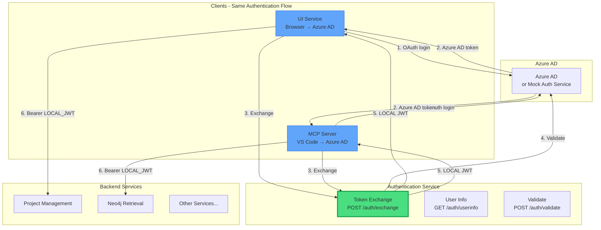
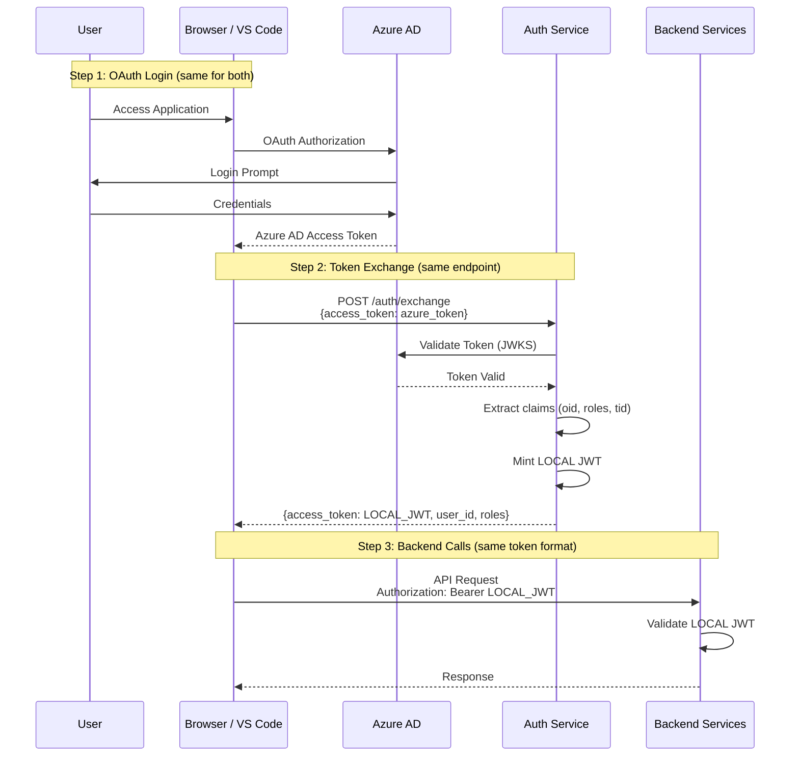

# Authentication Service

Centralized authentication service for exchanging Azure AD tokens for LOCAL JWTs. Both UI Service (browser) and MCP Server (VS Code Copilot) use the **same unified endpoint**.

## Architecture



**Key Design Principle:** There is ONE authentication mechanism. Both browser users (UI Service) and VS Code Copilot users (MCP Server) authenticate to the **same Azure AD**, receive the **same type of token**, and exchange it via the **same endpoint**. Azure AD authentication is REQUIRED - there is no service account fallback.

## Endpoints

### POST /auth/exchange

Exchange an Azure AD access token for a LOCAL JWT. This is the **only** token exchange endpoint.

**Request:**
```json
{
  "access_token": "<azure_ad_access_token>"
}
```

**Response:**
```json
{
  "access_token": "<local_jwt>",
  "token_type": "Bearer",
  "expires_in": 3600,
  "user_id": "oid-from-azure-ad",
  "username": "user@example.com",
  "roles": ["User", "Admin"]
}
```

### GET /auth/userinfo

Get user information from a LOCAL JWT. This centralizes JWT validation - clients don't need to interpret JWT claims directly.

**Request Headers:**
```
Authorization: Bearer <local_jwt>
```

**Response (200 OK):**
```json
{
  "authenticated": true,
  "user_id": "oid-from-azure-ad",
  "username": "user@example.com",
  "roles": ["User", "Admin"],
  "tenant_id": "azure-tenant-id"
}
```

**Response (401 Unauthorized):** Token invalid or expired

### POST /auth/validate

Low-level validation of a LOCAL JWT token. For user info, prefer `GET /auth/userinfo`.

**Request Body:** Token string (plain text)

**Response:**
```json
{
  "valid": true,
  "claims": {
    "oid": "user-id",
    "preferred_username": "user@example.com",
    "roles": ["User"],
    "iss": "authentication-service",
    "aud": "backend-services",
    "exp": 1234567890
  }
}
```

## Unified Authentication Flow

Both UI Service and MCP Server follow the **same authentication flow**:



## Configuration

### Environment Variables

| Variable | Default | Description |
|----------|---------|-------------|
| `API_PORT` | `8020` | Service port |
| `AZURE_AD_AUTHORITY` | `https://login.microsoftonline.com` | Azure AD authority (or mock auth URL) |
| `AZURE_TENANT_ID` | - | Azure AD tenant ID |
| `AZURE_CLIENT_ID` | - | Azure AD client ID |
| `AZURE_AD_VERIFY_SSL` | `true` | SSL verification (false for mock auth in dev) |
| `LOCAL_JWT_SECRET` | - | **Required**: Shared secret for LOCAL JWT signing |

### Token TTL

LOCAL JWTs have a default TTL of 3600 seconds (1 hour), consistent with the shared `jwt_utils.sign_jwt()` default used across all microservices.

### Design (Single Responsibility)

```
/auth/exchange  - Unified token exchange for all clients
/auth/userinfo  - Get user info from LOCAL JWT (central validation)
/auth/validate  - Low-level token validation
```

**Benefits:**
1. **Consistent**: UI Service and MCP Server use the same flow
2. **Secure**: All tokens are validated against Azure AD JWKS
3. **Simple**: One mechanism, one endpoint, one token format
4. **Single Responsibility**: JWT validation centralized in authentication-service

## Development

### Local Setup

```bash
# Install dependencies
cd services
pip install -e ./shared
pip install -e ./authentication_service

# Run service
cd authentication_service
python -m src.main
```

### Docker

```bash
# Build
docker build -t authentication-service -f authentication_service/Dockerfile ./services

# Run
docker run -p 8020:8020 \
  -e LOCAL_JWT_SECRET=dev-local-jwt-secret \
  -e AZURE_TENANT_ID=your-tenant-id \
  -e AZURE_CLIENT_ID=your-client-id \
  authentication-service
```

## Security Considerations

- **LOCAL_JWT_SECRET**: Must be consistent across all services
- **Azure AD Required**: There is no service account fallback - Azure AD authentication is mandatory
- **Token TTL**: 1 hour default (consistent with all services)
- **SSL Verification**: Enable in production (`AZURE_AD_VERIFY_SSL=true`)
- **Token Validation**: ALL tokens are validated against Azure AD JWKS before exchanging
