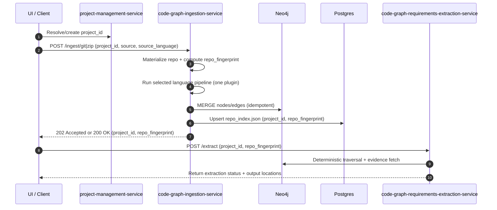
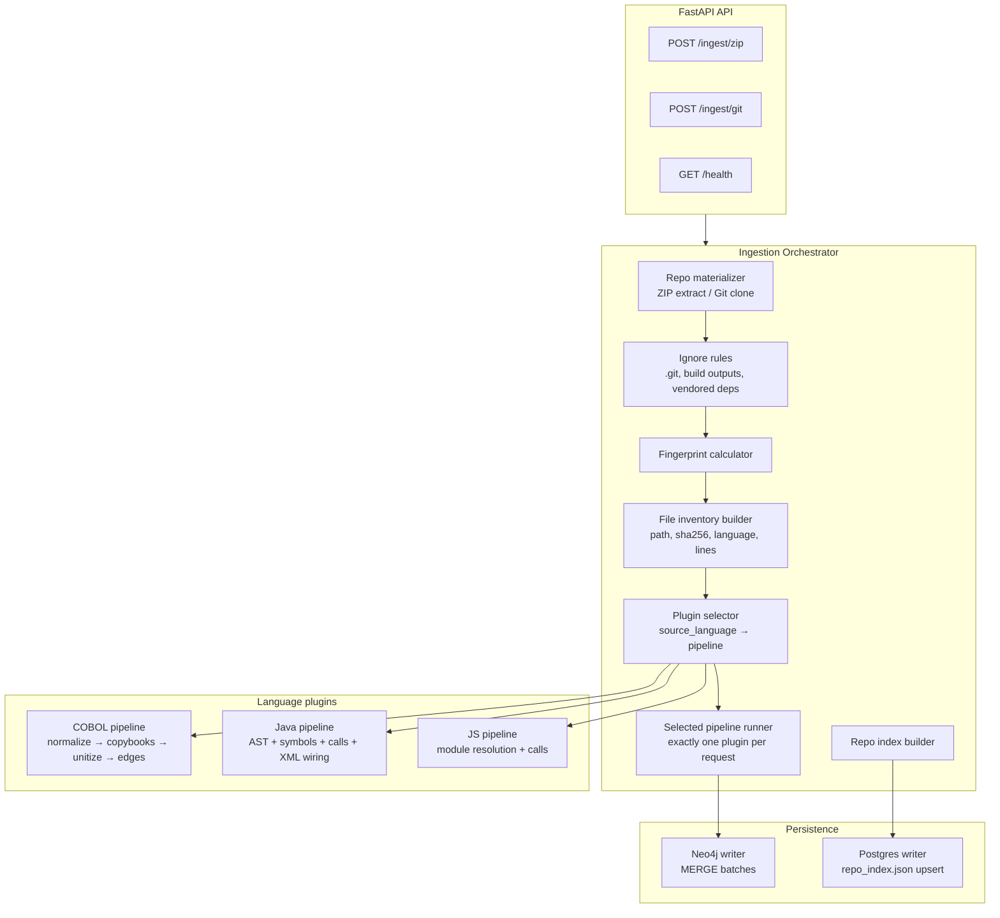

# Code Graph Ingestion Service (plugin-based; UI-selected source language)

A FastAPI service that ingests a **project-scoped source repository** (ZIP upload or Git URL), performs **deterministic static analysis** using **Tree-sitter-based parsers with language plugins**, and persists a **code RepoGraph** into **Neo4j 5.26** as the system of record.

This service is the **only producer** of the code RepoGraph (`__Repo__`, `__File__`, `__CodeNode__` + relationships). Downstream services read from Neo4j and never require portable graph exports.

---

## Functional requirements

### Ingestion interfaces
- **CGI-FR-001 (ZIP ingest)**: The service SHALL expose `POST /ingest/zip` to ingest an uploaded ZIP into a project-scoped workspace and persist the resulting graph to Neo4j.
- **CGI-FR-002 (Git ingest)**: The service SHALL expose `POST /ingest/git` to clone a Git repository (optionally checkout ref) into a workspace and persist the resulting graph to Neo4j.
- **CGI-FR-003 (No job graph root)**: The ingestion MUST be identified by `(project_id, repo_fingerprint)` and SHALL NOT rely on `job_id` for data modeling.
- **CGI-FR-004 (Health)**: The service SHALL expose `GET /health` (shared) returning `{ "status": "ok" }`.
  - Detailed checks are exposed via `GET /health/postgres` and `GET /health/neo4j`.
- **CGI-FR-004A (User-selected source language)**: The ingestion request SHALL include `source_language` and the service SHALL ingest using exactly one language pipeline chosen by that value.

#### `source_language` values (API contract)
`source_language` SHALL be one of:
- `cobol`
- `java`
- `javascript`

### Determinism, idempotency, and reproducibility
- **CGI-FR-005 (Deterministic fingerprint)**: The service SHALL compute `repo_fingerprint` deterministically:
  - Git: commit SHA (+ dependency manifest hashes when present)
  - ZIP: content hash (+ dependency manifest hashes when present)
- **CGI-FR-006 (Idempotent writes)**: Graph writes SHALL be idempotent for identical `(project_id, repo_fingerprint)` using `MERGE` patterns.
- **CGI-FR-007 (Deterministic node IDs)**: All created `__CodeNode__.node_id` values SHALL be stable for identical inputs.

### Language plugin architecture
- **CGI-FR-008 (Plugin-based languages)**: Each supported source language SHALL be implemented as a separate plugin/pipeline with a shared repo materializer, shared fingerprinting/inventory logic, and a shared Neo4j writer.
- **CGI-FR-009 (Single-plugin execution)**: For one ingestion request, the service SHALL execute exactly one plugin selected by `source_language`.
  - If XML files are needed for Java wiring, the Java plugin includes them as part of the Java run (no separate XML plugin selection from the UI).
- **CGI-FR-009B (Java config wiring)**: When `source_language=java`, the service SHALL also ingest relevant XML configuration files and emit `CONFIG_WIRES` edges as part of the same Java ingestion run.

### COBOL static analysis (must be precise)
- **CGI-FR-010 (Fixed/Free handling)**: COBOL files SHALL be processed deterministically with FIXED format default, and switch via `>>SOURCE FORMAT FREE|FIXED` directives.
- **CGI-FR-011 (Physical lines preserved)**: All COBOL `__CodeNode__.text` MUST preserve original physical line boundaries verbatim, including comment/debug lines.
- **CGI-FR-012 (COBOL unitization)**: The service SHALL create stable COBOL units as `__CodeNode__` nodes with kinds:
  `program, division, section, paragraph, sentence, statement, exec_block, copybook, data_item`.
- **CGI-FR-013 (Copybook expansion)**: The service SHALL resolve and expand `COPY ... REPLACING` deterministically, emitting `INCLUDES` edges to copybook files and maintaining evidence provenance.
- **CGI-FR-014 (COBOL edges)**: The service SHALL emit conservative edges with confidence:
  - `CALLS` (literal: 1.0; dynamic: to `UnresolvedCall` with 0.2)
  - `PERFORMS` (1.0)
  - `READS`/`WRITES` for data items and DB tables (best-effort, conservative)
  - `EXEC` blocks as `exec_block` nodes
  - **Preprocessing responsibility (mandatory)**: COBOL dialect differences SHALL be handled primarily via deterministic preprocessing (fixed/free normalization, columns, directives, COPY/REPLACING expansion, and `EXEC ... END-EXEC` handling) before passing text to Tree-sitter.

### COBOL parser dependency (precompiled wheel)
- The COBOL pipeline SHALL reuse the precompiled wheel implemented in-repo at `services/tree_sitter_cobol_binding/`.
  - Runtime import name: `tree_sitter_cobol`
  - Wheel name: `tree-sitter-cobol`
  - The wheel provides dialect keys (`cobol`, `ibm`, `micro_focus`, `gnucobol`), with current aliases handled primarily through preprocessing.

### Java and JavaScript static analysis
- **CGI-FR-015 (Java nodes/edges)**: The service SHALL create `__CodeNode__` nodes for packages, classes, methods, annotations and conservative `IMPORTS`/`CALLS` edges.
- **CGI-FR-016 (XML wiring)**: The service SHALL parse XML statically and emit `CONFIG_WIRES` edges (e.g., Spring-style bean wiring) to Java code nodes.
- **CGI-FR-017 (JS module resolution)**: The service SHALL resolve ES imports and CommonJS `require()` deterministically and emit `IMPORTS` edges.

### Oversized node handling
- **CGI-FR-018 (Oversized chunking)**: Any `__CodeNode__` spanning >1000 physical lines SHALL be chunked deterministically and connected via synthetic `CALLS` pipe edges with `confidence=1.0` and metadata `{synthetic:true, pipe:true, order:i}`.

### Repo index persistence (Postgres)
- **CGI-FR-019 (Repo index stored in Postgres)**: The service SHALL persist a deterministic `repo_index.json` payload into Postgres in a project-scoped table keyed by `(project_id, repo_fingerprint)`.
  - This record is treated as a **cheap deterministic manifest** (not a portable graph export and not a graph golden source).
- **CGI-FR-020 (Repo index retrieval contract)**: Downstream code-graph requirements extraction SHALL retrieve `repo_index.json` from Postgres.

#### Postgres table contract (required)
The service SHALL persist into table `project_repo_indexes`:
- `project_id` (UUID, not null)
- `repo_fingerprint` (TEXT, not null)
- `repo_index_json` (JSONB, not null)
- `content_sha256` (TEXT, not null) — sha256 over canonical JSON bytes (determinism check)
- `created_at` / `updated_at` timestamps

Uniqueness:
- one record per `(project_id, repo_fingerprint)` (upsert semantics).

---

## Place in system architecture and workflow

### End-to-end workflow position



---

## Architecture of service internals



### Plugin contract (internal)
Each language plugin MUST implement:
- **File selection** (which files are in scope)
- **Normalization / preprocessing** (COBOL fixed/free, copybooks)
- **Unitization** into `__CodeNode__` records with stable spans
- **Edge extraction** with explicit confidence rules
- **Static checks** (e.g., unresolved call ratio thresholds)
- **Repo-index facts** (symbols/entrypoints summary)

---

## Graph model (Neo4j) — schema extensions (non-breaking)

This service **extends** the existing Neo4j model used by other services. It does not replace it.

### Project scoping rule
- The canonical project scope node remains `(__Project__ {id})`.
- Every created node and relationship MUST include `project_id` for project isolation.
- Every created code-graph node MUST also link to the project scope using `(node)-[:IN_PROJECT]->(__Project__)` (same scoping convention as DRIFT/GraphRAG).

### New / extended node labels
- `__Repo__` — repository snapshot
- `__File__` — repository file inventory
- `__CodeNode__` — universal unit-of-code node (language-agnostic)

### Required relationships (directed)
- `(__Repo__)-[:HAS_FILE]->(__File__)`
- `(__File__)-[:CONTAINS]->(__CodeNode__)`
- `(__CodeNode__)-[:IMPORTS|CALLS|PERFORMS|INCLUDES|READS|WRITES|CONFIG_WIRES]->(__CodeNode__|__File__)`
- `(__Repo__|__File__|__CodeNode__)-[:IN_PROJECT]->(__Project__)`

### Relationship required properties
All relationships emitted by this service MUST include:
- `project_id: string`
- `repo_fingerprint: string`
- `confidence: float (0..1)`
- optional `metadata: map`

---

## High-level implementation details

- **Runtime**: Python 3.12, FastAPI, Pydantic v2
- **Parsing**:
  - Java/JavaScript/XML via `tree-sitter-language-pack` (**pinned to `0.7.4` to remain compatible with `tree-sitter==0.25.1` required by `tree-sitter-cobol`**)
  - COBOL via compiled wheel `tree-sitter-cobol` (import: `tree_sitter_cobol`) maintained in-repo at `services/tree_sitter_cobol_binding/`
- **Graph persistence**: Neo4j 5.26 via official Python driver
- **Repo index persistence**: PostgreSQL 16 (JSONB), via shared SQLAlchemy models
- **Observability**: structured logs + OpenTelemetry spans (initialized at service startup; spans wrap orchestration phases)

### Key settings (env)
- **`WORKSPACE_ROOT`**: deterministic base directory for materialized repos (default: `workspace/`)
- **`COBOL_TS_MAX_ERROR_RATIO`**: per-file Tree-sitter permissive gate (default: `0.02`)

---

## Start / shutdown instructions

### Local (Docker Compose)
From `playground/git-epic-creator/` start dependencies:

```bash
docker compose up -d postgres neo4j redis db-init-service postgresdb-schema-init neo4j-repository-service neo4j-schema-init
```

Run the service locally in a Python venv (example):

```powershell
python -m venv venv
.\venv\Scripts\Activate.ps1
pip install -U pip
# Install service deps (includes `shared` and the COBOL wheel dependency pin)
pip install -e .
uvicorn src.main:app --reload --port 8015
```

Shutdown:

```bash
docker compose down
```

---

## General implementation tips and rules

- **Determinism first**: sort all file lists, symbol lists, and traversal lists; never rely on dict iteration order for persisted results.
- **Evidence fidelity**: store verbatim physical lines in `__CodeNode__.text`; use `(file_path,start_line,end_line,snippet_hash)` for pointers.
- **Idempotency**: use `MERGE` for all node/relationship writes keyed by stable IDs; avoid random UUIDs in graph modeling.
- **Conservative edges**: when resolution is uncertain, emit low-confidence edges to explicit unresolved nodes rather than guessing.
- **No portable graph exports**: Neo4j is the graph golden source; `repo_index.json` is stored in Postgres only as a deterministic manifest (not as a graph substitute).
