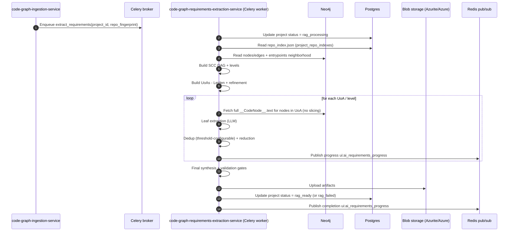

# Code Graph Requirements Extraction Service (graph-driven; message-triggered)

This service consumes the **project-scoped code RepoGraph** produced by the ingestion service and produces:
- `requirements.md` (system-level requirements derived from code evidence)
- `validation.json` (coverage + entailment + dedup provenance + reduction trace)
- `run-metadata.json` (config, metrics, and audit fields)

Unlike the ingestion service, this service is **not started via a REST call**. It runs as a **Celery job** enqueued when ingestion finishes. Progress and completion are published via **Redis pub/sub**, and the project status is updated in **Postgres**.

Downstream truth is the ingestion output:
- Neo4j is the **graph system of record** (nodes/edges + `__CodeNode__.text` evidence)
- Postgres `project_repo_indexes` stores `repo_index.json` as a deterministic manifest used for normalization and entrypoint/public-endpoint identification

---

## Inputs (hard-coupled to ingestion outputs)

This README is intentionally coupled to the contracts defined in:
- `services/code_graph_ingestion_service/README.md`
- `services/code_graph_ingestion_service/IMPLEMENTATION.md`

### Neo4j graph model (consumed as-is)

The extractor SHALL assume the following labels/relationships and required properties exist exactly as emitted by ingestion:

- **Nodes**
  - `__Repo__`
  - `__File__`
  - `__CodeNode__` with required properties:
    - `project_id: string`
    - `repo_fingerprint: string`
    - `node_id: string` (stable ID; deterministic)
    - `language: "cobol"|"java"|"javascript"|"xml"|"other"`
    - `kind: string` (ingestion-defined universal kind)
    - `symbol: string|null`
    - `file_path: string`
    - `start_line: int`
    - `end_line: int`
    - `snippet_hash: string` (stable)
    - `text: string` (verbatim physical lines; evidence)
    - optional extra labels such as `__UnresolvedCall__`, `__DbTable__`

- **Relationships** (directed; required properties on every relationship):
  - Types: `IMPORTS|CALLS|PERFORMS|INCLUDES|READS|WRITES|CONFIG_WIRES`
  - Required properties:
    - `project_id: string`
    - `repo_fingerprint: string`
    - `confidence: float (0..1)`
    - optional `metadata: map`

### Ingestion oversized-node behavior (must be honored)

Ingestion may chunk oversized `__CodeNode__` spans (>1000 physical lines) into multiple chunk nodes connected by synthetic pipe edges (a directed edge, typically `CALLS`, with metadata `{synthetic:true, pipe:true, order:i}` and `confidence=1.0`).

The extractor MUST treat these ingestion-produced chunks as the atomic evidence units and MUST NOT re-slice code text inside a unit of analysis (see **CGE-FR-012**).

### Postgres repo index contract (consumed as-is)

The extractor SHALL read `repo_index_json` from `project_repo_indexes` keyed by `(project_id, repo_fingerprint)` (see ingestion **CGI-FR-019/020**). This manifest is used for:
- deterministic canonicalization during dedup/merge (symbol normalization map)
- identification of **entrypoints** and **main public endpoints** (only these get IO/error extraction)

---

## Functional requirements

### Orchestration and interfaces (message-first)
- **CGE-FR-001 (No REST trigger)**: The service SHALL NOT require a REST call to start extraction for `(project_id, repo_fingerprint)`.
- **CGE-FR-002 (Celery job trigger)**: When ingestion finishes successfully, it SHALL enqueue a Celery task to start requirements extraction for `(project_id, repo_fingerprint)` (e.g., `tasks.code_requirements.extract_requirements_task`) rather than calling an HTTP endpoint.
- **CGE-FR-003 (Health endpoint)**: The service MAY expose `GET /health` for diagnostics, including connectivity checks for Neo4j, Postgres, Blob storage, Redis, and Celery broker.
- **CGE-FR-004 (Completion event + status)**: On completion (success or failure), the service SHALL:
  - publish a Redis pub/sub message (see **CGE-FR-005**)
  - update project status in Postgres (see **CGE-FR-006**)

### Progress + completion messaging (Redis pub/sub)
- **CGE-FR-005 (Redis progress channel)**: The service SHALL publish progress to the shared UI channel `ui:ai_requirements_progress` (see `services/shared/src/constants/streams.py`).
- **CGE-FR-005A (Completion message)**: The service SHALL publish a completion message containing at minimum:
  - `project_id`, `repo_fingerprint`
  - `status: "completed"|"failed"`
  - artifact blob keys/paths (requirements.md, validation.json, run-metadata.json)
  - summary metrics (coverage, counts)

### Project status updates (Postgres)
- **CGE-FR-006 (Update project status)**: The service SHALL update the project record in Postgres as part of the run:
  - set status to `rag_processing` while running
  - set status to `rag_ready` on success
  - set status to `rag_failed` on failure

> Note: These status values match `ProjectStatus` in `services/shared/src/models/project_rest.py`.

### Evidence and golden source
- **CGE-FR-007 (Graph-only evidence)**: The service SHALL fetch evidence exclusively from Neo4j `__CodeNode__.text` and ingestion-defined neighborhoods. No snippet sidecars are permitted.
- **CGE-FR-008 (No portable graph exports)**: The service SHALL NOT consume any portable graph export as the authoritative source.
- **CGE-FR-009 (Repo index from Postgres)**: The service SHALL retrieve `repo_index.json` from Postgres `project_repo_indexes` to support deterministic canonicalization and endpoint classification.

---

## Deterministic traversal (graph schedule)

- **CGE-FR-010 (Traversal graph definition)**: The traversal graph SHALL be derived from ingestion outputs using edge types:
  - Primary behavioral/control edges: `CALLS`, `PERFORMS`, `IMPORTS`
  - Wiring/dependency edges (used when relevant for behavior): `INCLUDES`, `CONFIG_WIRES`
  - Synthetic chunk pipes (ingestion metadata `{pipe:true}`) MUST be included
- **CGE-FR-011 (SCC collapse)**: The service SHALL collapse SCCs (Tarjan) into a DAG and schedule work by topological levels from entrypoints.
- **CGE-FR-011A (Deterministic scheduling)**: Within each level, SCCs SHALL be processed deterministically:
  - primary: SCC size descending
  - tie-breakers: lexical order `(file_path, symbol, node_id)` for the min key within the SCC

---

## Unit-of-analysis (UoA) selection (language-agnostic; graph-parameter-driven; Leiden-assisted)

This replaces any “COBOL-first / Java-next / JS-next” ordering. All languages have equal priority; UoAs are selected **only** from graph configuration and measurable graph parameters.

### Scientific grounding (why Leiden is a reasonable starting point)

- **Leiden algorithm** (Traag, Waltman, van Eck, 2019) improves on Louvain by guaranteeing **well-connected communities**, which is important when we treat communities as “units” to be summarized and reduced.
- In software component identification research, community detection on structural graphs (e.g., call graphs / dependency graphs) is commonly used as an architecture recovery primitive. A large-scale comparison for Java systems found Leiden and Infomap to be viable; Leiden tends to produce **better-separated** components while Infomap can yield **more cohesive** clusters (Sas & Capiluppi, 2021).

Implication for this service:
- Use **Leiden** as an initial partitioning heuristic (connectedness + speed), but add **deterministic constraints** (size, topological coherence, boundary expansion rules) and optional cohesion checks to avoid “structurally valid but semantically noisy” units.

### UoA objective

- **CGE-FR-012 (No slicing within a unit)**: A UoA SHALL be constructed so that all evidence text included in that unit can be sent to the LLM **as one chunk** (no slicing of any `__CodeNode__.text` inside the unit).
- **CGE-FR-012A (Graph-first splitting)**: If a unit would exceed the configured model context budget, the unit MUST be split in graph space (e.g., refine communities / cut boundaries), not by truncating or slicing code snippets.

### Deterministic, configurable UoA selection algorithm

- **Inputs**
  - `G`: project-scoped Neo4j subgraph for `(project_id, repo_fingerprint)`
  - `repo_index.json`: provides entrypoints/public endpoints and canonical naming
  - `max_uoa_tokens` (or equivalent max bytes/chars): config
  - `edge_type_weights`: config (defaults stable across runs)
  - `leiden_resolution`: config (supports multi-resolution refinement)

- **Graph parameters used (language-agnostic)**
  - **Weighted degree / relationship count**: number of incident edges, weighted by `confidence * type_weight`
  - **Topological depth**: node’s SCC-level distance from entrypoints in the SCC DAG
  - **Edge confidence distribution**: prefer keeping high-confidence subgraphs intact
  - **Community membership**: Leiden communities computed on a symmetrized weighted graph

- **Leiden graph construction (deterministic)**
  - Project the directed traversal graph to an **undirected weighted** graph \(H\):
    - for each pair \((u,v)\), \(w(u,v)=\max(w(u\to v), w(v\to u))\)
    - with \(w(u\to v)=confidence(u\to v) \times edge\_type\_weight(type)\)
  - Fix a **stable random seed** derived from `(project_id, repo_fingerprint)` to ensure repeatability.

- **Partition + refinement**
  1. Compute SCC DAG and topological levels from entrypoints (deterministic).
  2. For each sliding window of levels (configurable), run Leiden on the induced subgraph to produce initial communities.
  3. For each community, build a candidate UoA by including:
     - all nodes in the community
     - mandatory evidence neighbors (e.g., copybooks via `INCLUDES`, wiring via `CONFIG_WIRES`, chunk pipes) when their inclusion does not exceed `max_uoa_tokens`
  4. Enforce the “single chunk” budget:
     - if the UoA exceeds budget, **refine** by increasing Leiden resolution or re-running Leiden inside that community (deterministic seed + parameters)
     - if still too large, split by topological depth boundaries (prefer separating deeper nodes first) while preserving high-confidence edges when possible
  5. Deterministic ordering of final UoAs:
     - primary: increasing topological level (closer to entrypoints first)
     - secondary: decreasing total incident weight (relationship count/strength)
     - tie-breakers: lexical min key `(file_path, symbol, node_id)`

---

## Context building (single-chunk units; no intra-unit slicing)

- **CGE-FR-013 (Relation-aware unit context)**: The “context bundle” for analysis SHALL include:
  - the full `__CodeNode__.text` for every code node in the UoA, and
  - the **relationship types** (and direction) between those included nodes, so the LLM can interpret how the texts relate (e.g., `CALLS`, `IMPORTS`, `PERFORMS`, `INCLUDES`, `CONFIG_WIRES`), including relationship confidence when available.
- **CGE-FR-013A (Deterministic assembly; minimal headers)**: Within a UoA, evidence MUST be serialized deterministically by:
  - sorting nodes on `(file_path, start_line, end_line, node_id)` and emitting a per-node header containing only:
    - `file_path`, `kind`, `start_line..end_line`, and optional `language`
  - emitting an **edge list** section describing all relationships between nodes included in the unit (sorted deterministically), expressed as `(src_index, rel_type, dst_index, confidence, metadata?)`.
- **CGE-FR-013B (No text truncation)**: The service SHALL NOT truncate `__CodeNode__.text` for inclusion; budget compliance is achieved by UoA construction/refinement (see **CGE-FR-012A**).

---

## Requirement extraction, dedup, reduction, and validation

### Leaf extraction (what to extract)
- **CGE-FR-014 (Leaf requirements)**: For each UoA, the leaf extractor SHALL output:
  - requirement statements (atomic, testable “shall” form)
  - rationale (short, evidence-grounded)
  - evidence pointers (file_path, line span, snippet_hash, node_id)
  - confidence (0..1)
- **CGE-FR-014A (IO/errors scope)**: The leaf extractor SHALL NOT extract inputs/outputs/errors **except** for:
  - entrypoints
  - main public endpoints (public-facing APIs, top-level program entry nodes, exported/public methods used as system boundaries)
- **CGE-FR-014B (Assumptions scope)**: The leaf extractor SHALL NOT emit assumptions. Assumptions are permitted only at the final reduction stage (see **CGE-FR-018**).

### Dedup (configurable similarity threshold)
- **CGE-FR-015 (Dedup pass A — deterministic normalization + exact merge)**: The service SHALL implement a deterministic first-pass dedup that:
  - normalizes every requirement statement into a canonical form (case/whitespace/punctuation normalization; modal verb normalization to “shall”; stable reference normalization using `repo_index.json` symbol map when available),
  - computes a deterministic `statement_hash` over the canonical form,
  - merges exact duplicates by `statement_hash` by:
    - selecting a deterministic canonical representative (lexicographically smallest original statement as tie-break),
    - unioning evidence pointers and provenance,
    - recomputing confidence deterministically (e.g., max or evidence-weighted mean across merged items; must be stable and recorded).
- **CGE-FR-016 (Dedup pass B)**: Semantic clustering using embeddings cache (in-memory or Redis), with **configurable** similarity threshold (default remains 0.88 but MUST be configurable).

### Reduction (hierarchical synthesis) + confidence aggregation
- **CGE-FR-017 (Iterative reduction)**: The service SHALL reduce requirements hierarchically (UoA→file/module→subsystem→system).
- **CGE-FR-017A (Confidence aggregation)**: Any reduced requirement confidence SHALL be computed as a deterministic combination of its supporting lower-level confidences.
  - Recommended conservative aggregation:
    - evidence-weighted mean: \(conf = \frac{\sum_i w_i \cdot conf_i}{\sum_i w_i}\)
    - where \(w_i\) may reflect evidence coverage (e.g., number of distinct evidence nodes, or cumulative edge-confidence weight).
  - The reducer MUST record provenance so the aggregated confidence is auditable in `validation.json`.
- **CGE-FR-018 (Assumptions only at final synthesis)**: Assumptions MAY be emitted only at the last-level system synthesis/reduction step, and MUST be explicitly flagged as assumptions with bounded confidence.

### Validation gates
- **CGE-FR-019 (Self-validation gates)**: The service SHALL implement:
  - Gate 1: coverage (covered_uoas/total_uoas) ≥ 0.90 unless uncovered are unreachable
  - Gate 2: evidence entailment check per requirement
  - Gate 3: contradiction scan within dedup clusters

---

## Outputs (Blob storage)

- **CGE-FR-020 (Artifacts)**: The service SHALL upload:
  - `requirements-artifacts/{project_id}/{repo_fingerprint}/requirements.md`
  - `requirements-artifacts/{project_id}/{repo_fingerprint}/validation.json`
  - `requirements-artifacts/{project_id}/{repo_fingerprint}/run-metadata.json`
- **CGE-FR-021 (No Postgres requirements storage)**: The service SHALL NOT store requirements or embeddings in Postgres.

---

## Place in system architecture and workflow (message-driven)

---

## High-level implementation notes (non-normative)

- **Determinism is mandatory**: stable sorting in every list → stable prompts → stable outputs.
- **Graph/manifest coupling**: treat Neo4j + `repo_index.json` contracts as fixed inputs; avoid re-deriving facts already determined by ingestion.
- **Budget is enforced structurally**: enforce context limits by UoA partition/refinement, not by truncation or slicing.
- **Claims must be evidenced**: non-evidenced statements are allowed only as final-stage assumptions and must be labeled as such.
