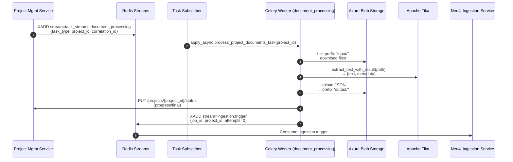

## Document Processing Service — Tika-based Document Extractor and Orchestrator

This service processes project-scoped documents using Apache Tika, writes normalized JSON outputs back to Azure Blob Storage, updates Project Management Service with progress, and publishes ingestion triggers to the Neo4j Ingestion Service.

### Scope and responsibilities
- Consume task requests from Redis Streams to process documents for a specific `project_id`.
- Download source documents from Azure Blob container under `input/` prefix.
- Extract text and metadata with Apache Tika and normalize the metadata for GraphRAG.
- Upload structured output JSONs to the same project container under `output/` prefix.
- Update Project Management Service with progress and completion/failure state.
- Publish a trigger message to `ingestion.trigger` for the Neo4j GraphRAG pipeline to start.

### Architecture flow


### Message contracts
- Inbound task request (Redis Streams)
  - Stream key: `task_streams:document_processing` (`TASK_REQUEST_STREAM`)
  - Consumer group: `document_processors` (`DOCUMENT_PROCESSORS_CONSUMER_GROUP`)
  - Expected fields:
    - `task_type`: must be `process_project_documents`
    - `project_id`: UUID string
    - `correlation_id`: optional string

- Outbound ingestion trigger (Redis Streams)
  - Stream key: `ingestion.trigger` (`INGESTION_TRIGGER_STREAM`)
  - Fields (all strings):
    - `job_id`: Celery task id
    - `project_id`: UUID string
    - `attempts`: initial `0`
  - DLQ: `ingestion.trigger.deadletter` handled by the Neo4j service retry/DLQ logic.

### Blob storage filesystem layout (per project container)
- `input/` — uploaded source files to process
- `output/*.json` — structured outputs for GraphRAG

### Output JSON schema (per document)
```json
{
  "title": "<original filename>",
  "text": "<extracted text>",
  "metadata": {
    "file_name": "<original filename>",
    "file_type": "<pdf|docx|xlsx|pptx|txt|...>",
    "content_type": "<mime>",
    "creation_date": "<ISO8601|null>",
    "modification_date": "<ISO8601|null>"
  }
}
```

### Runtime components and modules
- FastAPI app and health: `src/main.py` (`/health/celery` - comprehensive health endpoint)
- Celery worker app: `src/celery_worker_app.py` (task discovery/validation)
- Task subscriber: `src/task_subscriber.py` (wraps shared `TaskStreamSubscriber`)
- Celery task: `src/tasks/document_tasks.py` (`tasks.document_tasks.process_project_documents_task`)
- Core logic (framework-agnostic): `src/tasks/document_core.py`
- Tika processor: `src/services/tika_processor.py`
- Ingestion trigger publisher: `src/services/ingestion_job_publisher.py`

### Processing steps (Celery task)
1) **Initial status update**: Publish `status='processing'` with `processed_count=0` to ensure UI observability before document processing begins.
2) List project container with prefix `input/` and collect files.
3) For each file: download to temp path, run Tika/Docling to extract text and metadata.
4) Validate extracted text content:
   - If text is empty or contains only whitespace, skip JSON creation and mark as empty document
   - Empty documents are tracked separately but not uploaded to output
5) Filter metadata to required fields and upload structured JSON to `output/<stem>.json` for valid documents.
6) Send progress update to Project Management via HTTP after each file.
7) Delete processed input blobs (including empty documents).
8) Conditionally trigger Neo4j ingestion:
   - If at least one valid document exists → publish trigger to `ingestion.trigger`
   - If all documents are empty → skip ingestion and update project status to `rag_failed`

**Note on async-to-sync bridge**: Progress updates use a persistent event loop pattern (consistent with neo4j_ingestion_service) via `utils.asyncio_runner.run_async()`. The persistent loop runs in a dedicated thread for the worker's lifetime, preventing event loop conflicts and ensuring reliable async HTTP calls. This approach is initialized via Celery worker signals (`worker_process_init`/`worker_process_shutdown`).

### Environment configuration

#### Docling VLM Configuration (`service_configuration.docling_config.DoclingSettings`)
- **VLM Mode Selection**:
  - `DOCLING_VLM_MODE` (default `local`) - VLM mode: `local` (SmolVLM) or `remote` (API-based)
  - `DOCLING_VLM_PROVIDER` (default `azure_openai`) - Remote VLM provider when mode is `remote`
    - Supported providers: `azure_openai`, `lm_studio`, `ollama`, `watsonx`, `openai_compatible`

- **Azure OpenAI Configuration** (PRIMARY remote provider):
  - `DOCLING_AZURE_OPENAI_ENDPOINT` - Azure OpenAI endpoint URL (e.g., `https://myresource.openai.azure.com`)
  - `DOCLING_AZURE_OPENAI_DEPLOYMENT_NAME` - Deployment name (e.g., `llama-32-vision`)
  - `DOCLING_AZURE_OPENAI_API_KEY` - Azure OpenAI API key
  - `DOCLING_AZURE_OPENAI_API_VERSION` (default `2024-02-15-preview`) - API version

- **Generic Remote VLM Configuration** (for non-Azure providers):
  - `DOCLING_VLM_ENDPOINT` (default `http://localhost:1234`) - API endpoint for LM Studio/Ollama/custom
  - `DOCLING_VLM_MODEL` (default `granite-docling-258m-mlx`) - Model name/ID
  - `DOCLING_VLM_API_KEY` - API key if required

- **watsonx.ai Configuration**:
  - `WX_API_KEY` - IBM Cloud API key
  - `WX_PROJECT_ID` - watsonx.ai project ID

- **Common VLM Parameters**:
  - `DOCLING_VLM_PROMPT` (default `Convert this page to docling format with detailed descriptions.`)
  - `DOCLING_VLM_TIMEOUT` (default `90`) - Timeout in seconds
  - `DOCLING_VLM_TEMPERATURE` (default `0.7`) - Generation temperature
  - `DOCLING_VLM_MAX_TOKENS` (default `4096`) - Maximum tokens
  - `DOCLING_VLM_RESPONSE_FORMAT` (default `DOCTAGS`) - Response format: `DOCTAGS` or `MARKDOWN`

- **Local VLM Configuration**:
  - `DOCLING_USE_OCR` (default `True`) - Enable OCR
  - `DOCLING_OCR_LANGS` (default `en`) - OCR languages (comma-separated)
  - `DOCLING_IMAGES_SCALE` (default `2.0`) - Image scaling factor

- **Fallback Configuration**:
  - `DOCLING_ENABLE_EMPTY_FALLBACK` (default `True`) - Enable automatic fallback to Tika if Docling returns empty/minimal text
  - `DOCLING_MIN_TEXT_LENGTH` (default `50`) - Minimum text length (chars) to consider extraction successful. Below this triggers fallback if enabled.

#### Pipeline Architecture

**Hybrid Text + Vision Pipeline (Remote Mode)**:
When `DOCLING_VLM_MODE=remote`, the service uses a hybrid approach that preserves PDF text extraction while adding remote vision capabilities:

- **PdfPipelineOptions** handles standard PDF processing: text layer extraction, OCR, table detection
- **PictureDescriptionApiOptions** handles remote API calls for picture/image description
- Result: **Both** PDF text content AND remote vision-based picture descriptions

This fixes the empty text issue where VlmPipeline alone would skip PDF text extraction and only perform vision processing.

**Local Mode**:
When `DOCLING_VLM_MODE=local`, the service uses SmolVLM for local picture description while preserving all standard PDF extraction features.

**Fallback Mechanism**:
If Docling extraction returns text below `DOCLING_MIN_TEXT_LENGTH` threshold:
1. Logs `EMPTY_EXTRACTION_DETECTED` warning with file stats
2. Attempts Tika fallback extraction
3. If Tika succeeds, uses Tika text and logs `FALLBACK_TIKA_SUCCESS`
4. If Tika also fails, continues with original empty result
5. Metadata includes `fallback_used: "tika"` when fallback succeeds

Fallback conditions: text below threshold AND file is PDF AND size > 4KB AND `DOCLING_ENABLE_EMPTY_FALLBACK=true`

#### Example Configurations

**Local VLM (SmolVLM - Default)**:
```bash
DOCLING_VLM_MODE=local
DOCLING_USE_OCR=true
DOCLING_IMAGES_SCALE=2.0
```

**Remote VLM with Azure OpenAI (Llama 3.2 Vision)** - Hybrid text + vision:
```bash
DOCLING_VLM_MODE=remote
DOCLING_VLM_PROVIDER=azure_openai
DOCLING_AZURE_OPENAI_ENDPOINT=https://myresource.openai.azure.com
DOCLING_AZURE_OPENAI_DEPLOYMENT_NAME=llama-32-vision
DOCLING_AZURE_OPENAI_API_KEY=your-api-key
DOCLING_AZURE_OPENAI_API_VERSION=2024-02-15-preview
# Fallback configuration
DOCLING_ENABLE_EMPTY_FALLBACK=true
DOCLING_MIN_TEXT_LENGTH=50
```

**Remote VLM with LM Studio**:
```bash
DOCLING_VLM_MODE=remote
DOCLING_VLM_PROVIDER=lm_studio
DOCLING_VLM_ENDPOINT=http://localhost:1234
DOCLING_VLM_MODEL=granite-docling-258m-mlx
```

**Remote VLM with Ollama**:
```bash
DOCLING_VLM_MODE=remote
DOCLING_VLM_PROVIDER=ollama
DOCLING_VLM_ENDPOINT=http://localhost:11434
DOCLING_VLM_MODEL=llama3.2-vision:11b
```

#### Tika Configuration (`service_configuration.tika_config.TikaSettings`)
- `TIKA_SERVER_JAR` (default `/opt/tika-server/tika-server.jar`)
- `TIKA_SERVER_ENDPOINT` (default `http://localhost:9998`)
- `TIKA_LOG_PATH` (default `/tmp/tika-logs`)
- `TIKA_SERVER_TIMEOUT`, `TIKA_CLIENT_TIMEOUT`, `TIKA_VERSION`, `TIKA_CLIENT_ONLY`, `TIKA_SERVER_AUTO_START`, `TIKA_SERVER_STARTUP_TIMEOUT`

#### Azure Blob (shared config)
- `AZURE_STORAGE_CONNECTION_STRING`
- `AZURE_STORAGE_CONTAINER_NAME`
- Optional: `AZURE_STORAGE_BLOB_ENDPOINT`

#### Messaging / Celery
- `REDIS_URL` (via shared Redis client)
- `CELERY_BROKER_URL`, `CELERY_RESULT_BACKEND`
- Queue: `document_processing`

#### Project Management client (shared config)
- `PROJECT_MANAGEMENT_SERVICE_URL`
- Local S2S auth uses `LOCAL_JWT_SECRET` for signing/verification

### Health
- `GET /health/celery` - Comprehensive health endpoint that returns:
  - Basic service health
  - Celery worker status (app name, registered tasks, routes, serializers, task validation status)
  - Processor initialization status (DoclingProcessor and TikaProcessor)
  - Tika server availability and configuration
  - All components organized under `components` object with individual `healthy` status
  - Overall `healthy` flag that is `false` if any critical component fails

#### Processor Initialization Health Check
The service implements fail-fast initialization with health status reporting:
- **Healthy**: Processors (`DoclingProcessor`, `TikaProcessor`) initialized successfully
- **Unhealthy**: Processor initialization failed (e.g., invalid Azure OpenAI credentials, missing configuration)

When processor initialization fails:
- Service stays running (doesn't crash)
- Health endpoints return `"healthy": false`
- Response includes `processor_initialization` with error details:
  - `initialized`: Whether initialization was attempted
  - `healthy`: Whether initialization succeeded
  - `error`: Error message if initialization failed
  - `error_type`: Category of error (`configuration_error`, `unexpected_error`, `task_import_error`)
  - `timestamp`: When initialization was attempted
- Celery tasks are **not imported** (prevents task execution with broken processors)
- Logs show `SERVICE_UNHEALTHY` and `TASKS_NOT_IMPORTED` messages

Example unhealthy response:
```json
{
  "healthy": false,
  "processor_initialization_failed": true,
  "processor_initialization": {
    "initialized": true,
    "healthy": false,
    "error": "Configuration validation failed: DOCLING_AZURE_OPENAI_API_KEY is required for azure_openai provider",
    "error_type": "configuration_error",
    "timestamp": "2025-10-15T20:30:00.000Z"
  }
}
```

This design ensures that configuration errors are immediately visible via health checks rather than causing silent worker crashes.

### Exception handling and timeout configuration
The service implements comprehensive exception handling to prevent silent task failures:

#### Multi-layer Exception Handling
1. **Document Core Layer** (`document_core.py`):
   - Defensive logging brackets around `extract_text_with_result()` calls
   - Explicit try-except wrapper catches all processor exceptions
   - Failed documents are tracked separately and processing continues for remaining documents
   - Full exception context logged with `exc_info=True` for stack traces

2. **Docling Processor Layer** (`docling_processor.py`):
   - Specific handlers for `requests.exceptions.Timeout`, `ConnectionError`, `HTTPError`, `RequestException`
   - Generic catch-all for unexpected errors (threading issues, C library crashes, memory errors)
   - Enhanced logging with VLM configuration details (endpoint, deployment, timeout, provider)
   - Returns structured `DocumentProcessingResult` with error details instead of raising exceptions

3. **Task Layer** (`document_tasks.py`):
   - Celery soft time limit: 3300s (55 minutes) for graceful cleanup
   - Celery hard time limit: 3600s (1 hour) prevents indefinite hangs
   - `SoftTimeLimitExceeded` exception handled explicitly
   - Generic exception handler logs full context

#### Timeout Configuration
- **VLM API Timeout**: `DOCLING_VLM_TIMEOUT` (default 90s) - Controls remote VLM API call timeout
- **Celery Soft Timeout**: 3300s (55 minutes) - Allows graceful cleanup before hard kill
- **Celery Hard Timeout**: 3600s (1 hour) - Forcefully terminates hung tasks

#### Debugging Capabilities
When investigating failures, look for these log events:
- `DOCLING_PIPELINE_CONFIGURED` - Pipeline strategy selected (local_pdf_with_smolvlm, pdf_with_remote_vision)
- `DOCLING_PROCESSING_START` - Document processing begins (includes file size, VLM mode, provider)
- `DOCLING_PROCESSING_COMPLETED` - Processing finished with text length and page count
- `DOCUMENT_PROCESSING_START` / `DOCUMENT_PROCESSING_COMPLETED` - Core layer processing events
- `DOCUMENT_PROCESSING_EXCEPTION` - Processor threw an exception
- `EMPTY_EXTRACTION_DETECTED` - Extracted text below threshold, triggering fallback
- `FALLBACK_TIKA_TRIGGERED` - Tika fallback started
- `FALLBACK_TIKA_SUCCESS` - Tika fallback succeeded with improved text
- `FALLBACK_TIKA_ALSO_EMPTY` - Tika fallback also returned minimal text
- `FALLBACK_TIKA_FAILED` / `FALLBACK_TIKA_EXCEPTION` - Tika fallback error
- `DOCLING_VLM_API_TIMEOUT` - Remote VLM API call timed out
- `DOCLING_VLM_API_CONNECTION_ERROR` - Network/DNS issues
- `DOCLING_VLM_API_HTTP_ERROR` - HTTP errors (401, 403, 429, 500)
- `DOCLING_PROCESSING_FAILED` - Unexpected processor failure
- `TASK_SOFT_TIMEOUT` - Task exceeded 55-minute soft limit
- `TASK_EXECUTION_FAILED` - Task-level exception

All error logs include full exception details (`exc_info=True`) with stack traces and VLM configuration context.

### Operational notes
- Subscriber uses consumer group `document_processors` on `task_streams:document_processing` and enqueues Celery with `process_project_documents_task(project_id)`.
- Celery worker runs with queue `document_processing` and prefetch multiplier 1; tune concurrency via worker flags.
- Task timeout: soft limit 55 minutes, hard limit 1 hour (configurable via task decorator).
- Observability: structured logs across blob I/O, Tika processing, progress updates, and trigger publishing with comprehensive exception tracking.

### Docker and Compose
- Image should include `tika` client and place Tika server JAR at `TIKA_SERVER_JAR` path if `TIKA_SERVER_AUTO_START` is true.
- Run a dedicated Celery worker for queue `document_processing`; on Windows, prefer `--pool=solo`.
- Healthcheck: probe `/health/celery` (comprehensive health check for all components).

#### Build Configuration
The service supports two VLM modes affecting build time and resources:
- **Local VLM (default)**: Downloads and caches ML models during build (~30-40 min, 6-8GB RAM)
- **Remote VLM**: Skips model downloads, uses external APIs (~5-10 min, 2-4GB RAM)

### Local development quickstart
1) Start dependent services (from `playground/git-epic-creator`):
   - Suggested: `redis azurite project-management-service openai-mock-service mock-auth-service`
   - Example:
     ```bash
     docker compose up -d redis azurite project-management-service openai-mock-service mock-auth-service
     ```
2) In a Python venv, install shared + this service (from `playground/git-epic-creator/services`):
   ```bash
   python -m venv venv
   source venv/bin/activate  # Windows: .\venv\Scripts\Activate.ps1
   pip install -U pip
   pip install -e ./shared
   pip install -e ./document_processing_service[dev]
   ```
3) Run the service locally (threads: FastAPI + Celery + Subscriber):
   ```bash
   python -m document_processing_service.main
   ```
4) Validate health:
   ```bash
   curl http://localhost:8000/health/celery
   ```
5) Publish a test task request (fields shown below) to `task_streams:document_processing` or use the e2e helper.

### Empty document handling
The service implements validation to prevent downstream errors in Neo4j ingestion:
- **Detection**: After text extraction, documents with empty or whitespace-only content are identified
- **Tracking**: Empty documents are counted separately (`empty_documents` field in result)
- **No upload**: Empty documents do not generate output JSON files
- **Cleanup**: Empty document input files are still deleted from blob storage
- **Ingestion gating**: If all documents are empty, Neo4j ingestion is skipped and project status is set to `rag_failed`
- **Mixed scenarios**: Projects with both valid and empty documents will process successfully with only valid documents sent to ingestion

**Why this matters**: Empty documents cause pandas DataFrame errors in GraphRAG's `create_base_text_units` workflow. This validation prevents those errors by filtering empty content before it reaches the ingestion pipeline.

### Acceptance criteria
- Given documents in `input/`, the task produces one JSON per valid input in `output/` with required schema, updates project status during processing, deletes inputs, and publishes an ingestion trigger to `ingestion.trigger` only if valid documents exist.
- Documents with empty or whitespace-only text are tracked but not uploaded, and do not trigger ingestion if they are the only documents.

### Inter-service integration
- Upstream: Project Management Service publishes a task request to `task_streams:document_processing` when a project moves to processing.
- Downstream: Neo4j Ingestion Service consumes `ingestion.trigger` and processes the `output/*.json` documents written by this service.
- Shared contracts and constants originate from the `shared` package (`constants.streams`, `models.ingestion_messages`).


