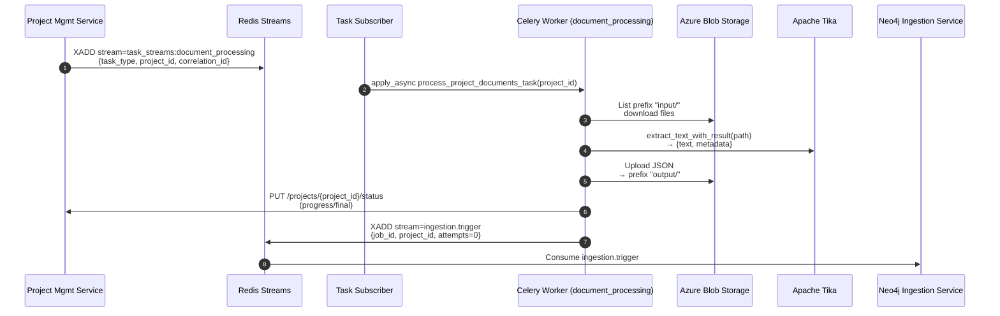

## Document Processing Service — Tika-based Document Extractor and Orchestrator

This service processes project-scoped documents using Apache Tika, writes normalized JSON outputs back to Azure Blob Storage, updates Project Management Service with progress, and publishes ingestion triggers to the Neo4j Ingestion Service.

### Scope and responsibilities
- Consume task requests from Redis Streams to process documents for a specific `project_id`.
- Download source documents from Azure Blob container under `input/` prefix.
- Extract text and metadata with Apache Tika and normalize the metadata for GraphRAG.
- Upload structured output JSONs to the same project container under `output/` prefix.
- Update Project Management Service with progress and completion/failure state.
- Publish a trigger message to `ingestion.trigger` for the Neo4j GraphRAG pipeline to start.

### Architecture flow


### Message contracts
- Inbound task request (Redis Streams)
  - Stream key: `task_streams:document_processing` (`TASK_REQUEST_STREAM`)
  - Consumer group: `document_processors` (`DOCUMENT_PROCESSORS_CONSUMER_GROUP`)
  - Expected fields:
    - `task_type`: must be `process_project_documents`
    - `project_id`: UUID string
    - `correlation_id`: optional string

- Outbound ingestion trigger (Redis Streams)
  - Stream key: `ingestion.trigger` (`INGESTION_TRIGGER_STREAM`)
  - Fields (all strings):
    - `job_id`: Celery task id
    - `project_id`: UUID string
    - `attempts`: initial `0`
  - DLQ: `ingestion.trigger.deadletter` handled by the Neo4j service retry/DLQ logic.

### Blob storage filesystem layout (per project container)
- `input/` — uploaded source files to process
- `output/*.json` — structured outputs for GraphRAG

### Output JSON schema (per document)
```json
{
  "title": "<original filename>",
  "text": "<extracted text>",
  "metadata": {
    "file_name": "<original filename>",
    "file_type": "<pdf|docx|xlsx|pptx|txt|...>",
    "content_type": "<mime>",
    "creation_date": "<ISO8601|null>",
    "modification_date": "<ISO8601|null>"
  }
}
```

### Runtime components and modules
- FastAPI app and health: `src/main.py` (`/health/celery`, `/health/tika`)
- Celery worker app: `src/celery_worker_app.py` (task discovery/validation)
- Task subscriber: `src/task_subscriber.py` (wraps shared `TaskStreamSubscriber`)
- Celery task: `src/tasks/document_tasks.py` (`tasks.document_tasks.process_project_documents_task`)
- Core logic (framework-agnostic): `src/tasks/document_core.py`
- Tika processor: `src/services/tika_processor.py`
- Ingestion trigger publisher: `src/services/ingestion_job_publisher.py`

### Processing steps (Celery task)
1) List project container with prefix `input/` and collect files.
2) For each file: download to temp path, run Tika to extract text and metadata.
3) Filter metadata to required fields and upload structured JSON to `output/<stem>.json`.
4) Send progress update to Project Management via HTTP after each file.
5) Delete processed input blobs.
6) Publish Redis Streams trigger to `ingestion.trigger` for Neo4j ingestion.

### Environment configuration

#### Docling VLM Configuration (`service_configuration.docling_config.DoclingSettings`)
- **VLM Mode Selection**:
  - `DOCLING_VLM_MODE` (default `local`) - VLM mode: `local` (SmolVLM) or `remote` (API-based)
  - `DOCLING_VLM_PROVIDER` (default `azure_openai`) - Remote VLM provider when mode is `remote`
    - Supported providers: `azure_openai`, `lm_studio`, `ollama`, `watsonx`, `openai_compatible`

- **Azure OpenAI Configuration** (PRIMARY remote provider):
  - `AZURE_OPENAI_ENDPOINT` - Azure OpenAI endpoint URL (e.g., `https://myresource.openai.azure.com`)
  - `AZURE_OPENAI_DEPLOYMENT_NAME` - Deployment name (e.g., `llama-32-vision`)
  - `AZURE_OPENAI_API_KEY` - Azure OpenAI API key
  - `AZURE_OPENAI_API_VERSION` (default `2024-02-15-preview`) - API version

- **Generic Remote VLM Configuration** (for non-Azure providers):
  - `DOCLING_VLM_ENDPOINT` (default `http://localhost:1234`) - API endpoint for LM Studio/Ollama/custom
  - `DOCLING_VLM_MODEL` (default `granite-docling-258m-mlx`) - Model name/ID
  - `DOCLING_VLM_API_KEY` - API key if required

- **watsonx.ai Configuration**:
  - `WX_API_KEY` - IBM Cloud API key
  - `WX_PROJECT_ID` - watsonx.ai project ID

- **Common VLM Parameters**:
  - `DOCLING_VLM_PROMPT` (default `Convert this page to docling format with detailed descriptions.`)
  - `DOCLING_VLM_TIMEOUT` (default `90`) - Timeout in seconds
  - `DOCLING_VLM_TEMPERATURE` (default `0.7`) - Generation temperature
  - `DOCLING_VLM_MAX_TOKENS` (default `4096`) - Maximum tokens
  - `DOCLING_VLM_RESPONSE_FORMAT` (default `DOCTAGS`) - Response format: `DOCTAGS` or `MARKDOWN`

- **Local VLM Configuration**:
  - `DOCLING_USE_OCR` (default `True`) - Enable OCR
  - `DOCLING_OCR_LANGS` (default `en`) - OCR languages (comma-separated)
  - `DOCLING_IMAGES_SCALE` (default `2.0`) - Image scaling factor

#### Example Configurations

**Local VLM (SmolVLM - Default)**:
```bash
DOCLING_VLM_MODE=local
DOCLING_USE_OCR=true
DOCLING_IMAGES_SCALE=2.0
```

**Remote VLM with Azure OpenAI (Llama 3.2 Vision)**:
```bash
DOCLING_VLM_MODE=remote
DOCLING_VLM_PROVIDER=azure_openai
AZURE_OPENAI_ENDPOINT=https://myresource.openai.azure.com
AZURE_OPENAI_DEPLOYMENT_NAME=llama-32-vision
AZURE_OPENAI_API_KEY=your-api-key
AZURE_OPENAI_API_VERSION=2024-02-15-preview
```

**Remote VLM with LM Studio**:
```bash
DOCLING_VLM_MODE=remote
DOCLING_VLM_PROVIDER=lm_studio
DOCLING_VLM_ENDPOINT=http://localhost:1234
DOCLING_VLM_MODEL=granite-docling-258m-mlx
```

**Remote VLM with Ollama**:
```bash
DOCLING_VLM_MODE=remote
DOCLING_VLM_PROVIDER=ollama
DOCLING_VLM_ENDPOINT=http://localhost:11434
DOCLING_VLM_MODEL=llama3.2-vision:11b
```

#### Tika Configuration (`service_configuration.tika_config.TikaSettings`)
- `TIKA_SERVER_JAR` (default `/opt/tika-server/tika-server.jar`)
- `TIKA_SERVER_ENDPOINT` (default `http://localhost:9998`)
- `TIKA_LOG_PATH` (default `/tmp/tika-logs`)
- `TIKA_SERVER_TIMEOUT`, `TIKA_CLIENT_TIMEOUT`, `TIKA_VERSION`, `TIKA_CLIENT_ONLY`, `TIKA_SERVER_AUTO_START`, `TIKA_SERVER_STARTUP_TIMEOUT`

#### Azure Blob (shared config)
- `AZURE_STORAGE_CONNECTION_STRING`
- `AZURE_STORAGE_CONTAINER_NAME`
- Optional: `AZURE_STORAGE_BLOB_ENDPOINT`

#### Messaging / Celery
- `REDIS_URL` (via shared Redis client)
- `CELERY_BROKER_URL`, `CELERY_RESULT_BACKEND`
- Queue: `document_processing`

#### Project Management client (shared config)
- `PROJECT_MANAGEMENT_SERVICE_URL`
- Local S2S auth uses `LOCAL_JWT_SECRET` for signing/verification

### Health
- `GET /health/celery` returns Celery health, app name, registered tasks, routes, serializers, and task validation status.
- `GET /health/tika` returns Tika status and configuration endpoint checks.

### Operational notes
- Subscriber uses consumer group `document_processors` on `task_streams:document_processing` and enqueues Celery with `process_project_documents_task(project_id)`.
- Celery worker runs with queue `document_processing` and prefetch multiplier 1; tune concurrency via worker flags.
- Observability: structured logs across blob I/O, Tika processing, progress updates, and trigger publishing.

### Docker and Compose
- Image should include `tika` client and place Tika server JAR at `TIKA_SERVER_JAR` path if `TIKA_SERVER_AUTO_START` is true.
- Run a dedicated Celery worker for queue `document_processing`; on Windows, prefer `--pool=solo`.
- Healthcheck: probe `/health/celery` and `/health/tika`.

### Local development quickstart
1) Start dependent services (from `playground/git-epic-creator`):
   - Suggested: `redis azurite project-management-service openai-mock-service mock-auth-service`
   - Example:
     ```bash
     docker compose up -d redis azurite project-management-service openai-mock-service mock-auth-service
     ```
2) In a Python venv, install shared + this service (from `playground/git-epic-creator/services`):
   ```bash
   python -m venv venv
   source venv/bin/activate  # Windows: .\venv\Scripts\Activate.ps1
   pip install -U pip
   pip install -e ./shared
   pip install -e ./document_processing_service[dev]
   ```
3) Run the service locally (threads: FastAPI + Celery + Subscriber):
   ```bash
   python -m document_processing_service.main
   ```
4) Validate health:
   ```bash
   curl http://localhost:8000/health/celery
   curl http://localhost:8000/health/tika
   ```
5) Publish a test task request (fields shown below) to `task_streams:document_processing` or use the e2e helper.

### Acceptance criteria
- Given documents in `input/`, the task produces one JSON per input in `output/` with required schema, updates project status during processing, deletes inputs, and publishes an ingestion trigger to `ingestion.trigger`.

### Inter-service integration
- Upstream: Project Management Service publishes a task request to `task_streams:document_processing` when a project moves to processing.
- Downstream: Neo4j Ingestion Service consumes `ingestion.trigger` and processes the `output/*.json` documents written by this service.
- Shared contracts and constants originate from the `shared` package (`constants.streams`, `models.ingestion_messages`).


