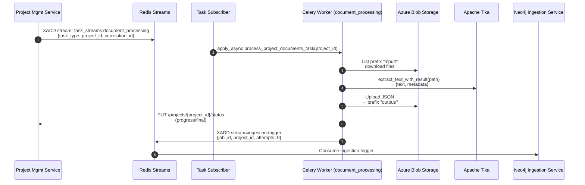

## Document Processing Service — Tika-based Document Extractor and Orchestrator

This service processes project-scoped documents using Apache Tika, writes normalized JSON outputs back to Azure Blob Storage, updates Project Management Service with progress, and publishes ingestion triggers to the Neo4j Ingestion Service.

### Scope and responsibilities
- Consume task requests from Redis Streams to process documents for a specific `project_id`.
- Download source documents from Azure Blob container under `input/` prefix.
- Extract text and metadata with Apache Tika and normalize the metadata for GraphRAG.
- Upload structured output JSONs to the same project container under `output/` prefix.
- Update Project Management Service with progress and completion/failure state.
- Publish a trigger message to `ingestion.trigger` for the Neo4j GraphRAG pipeline to start.

### Architecture flow


### Message contracts
- Inbound task request (Redis Streams)
  - Stream key: `task_streams:document_processing` (`TASK_REQUEST_STREAM`)
  - Consumer group: `document_processors` (`DOCUMENT_PROCESSORS_CONSUMER_GROUP`)
  - Expected fields:
    - `task_type`: must be `process_project_documents`
    - `project_id`: UUID string
    - `correlation_id`: optional string

- Outbound ingestion trigger (Redis Streams)
  - Stream key: `ingestion.trigger` (`INGESTION_TRIGGER_STREAM`)
  - Fields (all strings):
    - `job_id`: Celery task id
    - `project_id`: UUID string
    - `attempts`: initial `0`
  - DLQ: `ingestion.trigger.deadletter` handled by the Neo4j service retry/DLQ logic.

### Blob storage filesystem layout (per project container)
- `input/` — uploaded source files to process
- `output/*.json` — structured outputs for GraphRAG

### Output JSON schema (per document)
```json
{
  "title": "<original filename>",
  "text": "<extracted text>",
  "metadata": {
    "file_name": "<original filename>",
    "file_type": "<pdf|docx|xlsx|pptx|txt|...>",
    "content_type": "<mime>",
    "creation_date": "<ISO8601|null>",
    "modification_date": "<ISO8601|null>"
  }
}
```

### Runtime components and modules
- FastAPI app and health: `src/main.py` (`/health/celery` - comprehensive health endpoint)
- Celery worker app: `src/celery_worker_app.py` (task discovery/validation)
- Task subscriber: `src/task_subscriber.py` (wraps shared `TaskStreamSubscriber`)
- Celery task: `src/tasks/document_tasks.py` (`tasks.document_tasks.process_project_documents_task`)
- Core logic (framework-agnostic): `src/tasks/document_core.py`
- Tika processor: `src/services/tika_processor.py`
- Ingestion trigger publisher: `src/services/ingestion_job_publisher.py`

### Processing steps (Celery task)
1) **Initial status update**: Publish `status='processing'` with `processed_count=0` to ensure UI observability before document processing begins.
2) List project container with prefix `input/` and collect files.
3) For each file: download to temp path, run Tika/Docling to extract text and metadata.
4) Validate extracted text content:
   - If text is empty or contains only whitespace, skip JSON creation and mark as empty document
   - Empty documents are tracked separately but not uploaded to output
5) Filter metadata to required fields and upload structured JSON to `output/<stem>.json` for valid documents.
6) Send progress update to Project Management via HTTP after each file.
7) Delete processed input blobs (including empty documents).
8) Conditionally trigger Neo4j ingestion:
   - If at least one valid document exists → publish trigger to `ingestion.trigger`
   - If all documents are empty → skip ingestion and update project status to `rag_failed`

**Note on async-to-sync bridge**: Progress updates use a persistent event loop pattern (consistent with neo4j_ingestion_service) via `utils.asyncio_runner.run_async()`. The persistent loop runs in a dedicated thread for the worker's lifetime, preventing event loop conflicts and ensuring reliable async HTTP calls. This approach is initialized via Celery worker signals (`worker_process_init`/`worker_process_shutdown`).

### Environment configuration

#### Docling VLM Configuration (`service_configuration.docling_config.DoclingSettings`)
- **VLM Mode Selection**:
  - `DOCLING_VLM_MODE` (default `local`) - VLM mode: `local` (SmolVLM) or `remote` (API-based)
  - `DOCLING_VLM_PROVIDER` (default `azure_openai`) - Remote VLM provider when mode is `remote`
    - Supported providers: `azure_openai`, `lm_studio`, `ollama`, `watsonx`, `openai_compatible`

- **Azure OpenAI Configuration** (PRIMARY remote provider):
  - `DOCLING_AZURE_OPENAI_ENDPOINT` - Azure OpenAI endpoint URL (e.g., `https://myresource.openai.azure.com`)
  - `DOCLING_AZURE_OPENAI_DEPLOYMENT_NAME` - Deployment name (e.g., `llama-32-vision`)
  - `DOCLING_AZURE_OPENAI_API_KEY` - Azure OpenAI API key
  - `DOCLING_AZURE_OPENAI_API_VERSION` (default `2024-02-15-preview`) - API version

- **Generic Remote VLM Configuration** (for non-Azure providers):
  - `DOCLING_VLM_ENDPOINT` (default `http://localhost:1234`) - API endpoint for LM Studio/Ollama/custom
  - `DOCLING_VLM_MODEL` (default `granite-docling-258m-mlx`) - Model name/ID
  - `DOCLING_VLM_API_KEY` - API key if required

- **watsonx.ai Configuration**:
  - `WX_API_KEY` - IBM Cloud API key
  - `WX_PROJECT_ID` - watsonx.ai project ID

- **Common VLM Parameters**:
  - `DOCLING_VLM_PROMPT` (default `Convert this page to docling format with detailed descriptions.`)
  - `DOCLING_VLM_TIMEOUT` (default `90`) - Timeout in seconds
  - `DOCLING_VLM_TEMPERATURE` (default `0.7`) - Generation temperature
  - `DOCLING_VLM_MAX_TOKENS` (default `4096`) - Maximum tokens
  - `DOCLING_VLM_RESPONSE_FORMAT` (default `DOCTAGS`) - Response format: `DOCTAGS` or `MARKDOWN`

- **Local VLM Configuration**:
  - `DOCLING_USE_OCR` (default `True`) - Enable OCR
  - `DOCLING_OCR_LANGS` (default `en`) - OCR languages (comma-separated)
  - `DOCLING_IMAGES_SCALE` (default `2.0`) - Image scaling factor

- **RapidOCR Offline Configuration**:
  - `RAPIDOCR_MODELS_PATH` (default `/opt/rapidocr-models`) - Path to RapidOCR ONNX models
  - The service uses three pre-existing OCR models (must be in `plugins/rapidocr-models/`):
    - Detection Model: `ch_PP-OCRv3_det_infer.onnx` (identifies text regions in images)
    - Recognition Model: `ch_PP-OCRv3_rec_infer.onnx` (recognizes text within detected regions)
    - Classification Model: `ch_ppocr_mobile_v2.0_cls_infer.onnx` (determines text orientation)
  - Models are copied from `plugins/rapidocr-models/` to Docker image during build
  - This configuration enables OCR processing without runtime internet access
  - Docker build will FAIL if required models are not present in `plugins/rapidocr-models/`

- **Font Configuration** (prevents runtime font download):
  - Fonts are pre-installed at **system level** in Docker base image (no application config needed)
  - Environment variables set in `Dockerfile.base`:
    - `FONTS_DIR=/usr/share/fonts` - System fonts directory
    - `FONTCONFIG_PATH=/etc/fonts` - Fontconfig configuration directory
  - Pre-installed font packages:
    - **Western fonts**: `fonts-liberation`, `fonts-dejavu-core`
    - **Chinese fonts**: `fonts-wqy-microhei`, `fonts-wqy-zenhei`
  - Font cache is updated during build (`fc-cache -fv`) to prevent runtime downloads
  - RapidOCR and Pillow automatically use system fonts via fontconfig (no explicit configuration required)

- **Fallback Configuration**:
  - `DOCLING_ENABLE_EMPTY_FALLBACK` (default `True`) - Enable automatic fallback to Tika if Docling returns empty/minimal text
  - `DOCLING_MIN_TEXT_LENGTH` (default `50`) - Minimum text length (chars) to consider extraction successful. Below this triggers fallback if enabled.

#### Pipeline Architecture

**Hybrid Text + Vision Pipeline (Remote Mode)**:
When `DOCLING_VLM_MODE=remote`, the service uses a hybrid approach that preserves PDF text extraction while adding remote vision capabilities:

- **PdfPipelineOptions** handles standard PDF processing: text layer extraction, OCR, table detection
- **PictureDescriptionApiOptions** handles remote API calls for picture/image description
- Result: **Both** PDF text content AND remote vision-based picture descriptions

This fixes the empty text issue where VlmPipeline alone would skip PDF text extraction and only perform vision processing.

**Local Mode**:
When `DOCLING_VLM_MODE=local`, the service uses SmolVLM for local picture description while preserving all standard PDF extraction features.

**Fallback Mechanism**:
If Docling extraction returns text below `DOCLING_MIN_TEXT_LENGTH` threshold:
1. Logs `EMPTY_EXTRACTION_DETECTED` warning with file stats
2. Attempts Tika fallback extraction
3. If Tika succeeds, uses Tika text and logs `FALLBACK_TIKA_SUCCESS`
4. If Tika also fails, continues with original empty result
5. Metadata includes `fallback_used: "tika"` when fallback succeeds

Fallback conditions: text below threshold AND file is PDF AND size > 4KB AND `DOCLING_ENABLE_EMPTY_FALLBACK=true`

#### Example Configurations

**Local VLM (SmolVLM - Default)**:
```bash
DOCLING_VLM_MODE=local
DOCLING_USE_OCR=true
DOCLING_IMAGES_SCALE=2.0
```

**Remote VLM with Azure OpenAI (Llama 3.2 Vision)** - Hybrid text + vision:
```bash
DOCLING_VLM_MODE=remote
DOCLING_VLM_PROVIDER=azure_openai
DOCLING_AZURE_OPENAI_ENDPOINT=https://myresource.openai.azure.com
DOCLING_AZURE_OPENAI_DEPLOYMENT_NAME=llama-32-vision
DOCLING_AZURE_OPENAI_API_KEY=your-api-key
DOCLING_AZURE_OPENAI_API_VERSION=2024-02-15-preview
# Fallback configuration
DOCLING_ENABLE_EMPTY_FALLBACK=true
DOCLING_MIN_TEXT_LENGTH=50
```

**Remote VLM with LM Studio**:
```bash
DOCLING_VLM_MODE=remote
DOCLING_VLM_PROVIDER=lm_studio
DOCLING_VLM_ENDPOINT=http://localhost:1234
DOCLING_VLM_MODEL=granite-docling-258m-mlx
```

**Remote VLM with Ollama**:
```bash
DOCLING_VLM_MODE=remote
DOCLING_VLM_PROVIDER=ollama
DOCLING_VLM_ENDPOINT=http://localhost:11434
DOCLING_VLM_MODEL=llama3.2-vision:11b
```

#### Tika Configuration (`service_configuration.tika_config.TikaSettings`)
- `TIKA_SERVER_JAR` (default `/opt/tika-server/tika-server.jar`)
- `TIKA_SERVER_ENDPOINT` (default `http://localhost:9998`)
- `TIKA_LOG_PATH` (default `/tmp/tika-logs`)
- `TIKA_SERVER_TIMEOUT`, `TIKA_CLIENT_TIMEOUT`, `TIKA_VERSION`, `TIKA_CLIENT_ONLY`, `TIKA_SERVER_AUTO_START`, `TIKA_SERVER_STARTUP_TIMEOUT`

#### Azure Blob (shared config)
- `AZURE_STORAGE_CONNECTION_STRING`
- `AZURE_STORAGE_CONTAINER_NAME`
- Optional: `AZURE_STORAGE_BLOB_ENDPOINT`

#### Messaging / Celery
- `REDIS_URL` (via shared Redis client)
- `CELERY_BROKER_URL`, `CELERY_RESULT_BACKEND`
- Queue: `document_processing`

#### Project Management client (shared config)
- `PROJECT_MANAGEMENT_SERVICE_URL`
- Local S2S auth uses `LOCAL_JWT_SECRET` for signing/verification

### Health Check
`GET /health/celery` - Comprehensive health endpoint that monitors all critical components and provides detailed worker state information.

#### What It Checks
The health endpoint verifies:
- **Basic service health**: Service is running and responsive
- **Celery workers**: At least one worker is alive and responding to pings
- **Worker state**: Current activity level (idle, active, busy, busy_unresponsive, unresponsive)
- **Long-running tasks**: Tasks processing > 60 seconds are tracked separately
- **Task registration**: Expected tasks are registered with workers
- **Docling processor**: 
  - Initialization status (VLM mode, OCR enabled)
  - Runtime health (RapidOCR models availability, system fonts availability, configuration)
- **Tika processor**:
  - Initialization status
  - Runtime health (Tika server availability, version)

#### Response Structure
All components are organized under a `components` object with individual health status. The overall `healthy` flag is `false` if any critical component fails.

Example healthy response with busy worker:
```json
{
  "healthy": true,
  "service": "Document Processing Service",
  "components": {
    "basic": {"healthy": true, "status": "ok"},
    "docling_initialization": {
      "initialized": true,
      "healthy": true,
      "vlm_mode": "local",
      "ocr_enabled": true
    },
    "docling": {
      "healthy": true,
      "vlm_mode": "local",
      "ocr_enabled": true,
      "ocr_health": "healthy",
      "rapidocr_models_path": "/opt/rapidocr-models",
      "fonts_dir": "/usr/share/fonts",
      "fonts_count": 127,
      "fonts_health": "healthy",
      "supported_formats": ["pdf", "jpg", "png", "webp"],
      "processor_version": "docling-1.0"
    },
    "tika_initialization": {
      "initialized": true,
      "healthy": true
    },
    "tika": {
      "healthy": true,
      "server_healthy": true,
      "server_endpoint": "http://localhost:9998",
      "server_version": "3.1.0",
      "tika_version": "3.1.0",
      "supported_formats": [".pdf", ".docx", ".doc", ".xlsx", ".xls", ".txt"]
    },
    "celery": {
      "healthy": true,
      "active_workers_count": 1,
      "worker_state": "busy",
      "long_running_tasks": [
        {
          "worker": "document-processor@hostname",
          "task_id": "abc-123",
          "task_name": "tasks.document_tasks.process_project_documents_task",
          "elapsed_seconds": 87
        }
      ]
    }
  }
}
```

#### Worker State Detection
The health check distinguishes between different worker states to avoid false alarms during heavy processing:

- **`idle`**: No active tasks
- **`active`**: Processing tasks < 60 seconds
- **`busy`**: Processing long-running tasks (> 60 seconds) - still healthy
- **`busy_unresponsive`**: Workers alive but too busy to respond to inspector - still healthy
- **`unresponsive`**: Workers not responding to ping - unhealthy

This prevents false alarms when workers are legitimately busy with large documents (95s+ processing time).

#### Processor Initialization
The service implements fail-fast initialization with health status reporting. Each processor (Docling and Tika) is initialized and checked independently. When processor initialization fails:
- Service stays running (doesn't crash)
- Health endpoint returns `"healthy": false`
- Response includes detailed error information per processor (configuration_error, unexpected_error, task_import_error)
- Celery tasks are not imported to prevent execution with broken processors

Example unhealthy response (Docling configuration error):
```json
{
  "healthy": false,
  "processor_initialization_failed": true,
  "components": {
    "docling_initialization": {
      "initialized": true,
      "healthy": false,
      "error": "Docling configuration validation failed: DOCLING_AZURE_OPENAI_API_KEY is required for azure_openai provider",
      "error_type": "configuration_error",
      "vlm_mode": null,
      "ocr_enabled": null
    },
    "docling": {
      "healthy": false,
      "error": "Docling unavailable due to initialization failure",
      "initialization_error": "Docling configuration validation failed: DOCLING_AZURE_OPENAI_API_KEY is required for azure_openai provider"
    },
    "tika_initialization": {
      "initialized": true,
      "healthy": true
    },
    "tika": {
      "healthy": false,
      "server_healthy": false,
      "error": "Tika server is not responding"
    }
  }
}
```

#### Configuration
Health check behavior can be tuned via shared Celery configuration:
- `CELERY_HEALTH_CHECK_PING_TIMEOUT`: 5s (worker ping timeout)
- `CELERY_HEALTH_CHECK_INSPECTOR_TIMEOUT`: 5s (inspector call timeout)
- `CELERY_HEALTH_CHECK_LONG_RUNNING_THRESHOLD`: 60s (long-running task threshold)

#### Log Events
Health check operations emit structured log events:
- `CELERY_WORKER_STARTING`: Worker starting with pool type and platform
- `CELERY_WORKERS_IDLE`: No active tasks
- `CELERY_WORKERS_ACTIVE`: Processing tasks < 60s
- `CELERY_WORKERS_BUSY`: Processing long-running tasks with details
- `CELERY_INSPECT_TIMEOUT_DURING_PROCESSING`: Inspector timed out but worker alive (expected during heavy processing)
- `CELERY_HEALTH_CHECK_COMPLETED`: Health check finished with summary

#### Why Concurrent Pool Matters
The service uses platform-aware concurrent pools (`prefork` on Linux, `threads` on Windows) instead of single-threaded `solo` pool. This allows workers to respond to health checks while processing long-running tasks, preventing false timeouts and "missing tasks" warnings during legitimate heavy processing.

### Exception handling and timeout configuration
The service implements comprehensive exception handling to prevent silent task failures:

#### Multi-layer Exception Handling
1. **Document Core Layer** (`document_core.py`):
   - Defensive logging brackets around `extract_text_with_result()` calls
   - Explicit try-except wrapper catches all processor exceptions
   - Failed documents are tracked separately and processing continues for remaining documents
   - Full exception context logged with `exc_info=True` for stack traces

2. **Docling Processor Layer** (`docling_processor.py`):
   - Specific handlers for `requests.exceptions.Timeout`, `ConnectionError`, `HTTPError`, `RequestException`
   - Generic catch-all for unexpected errors (threading issues, C library crashes, memory errors)
   - Enhanced logging with VLM configuration details (endpoint, deployment, timeout, provider)
   - Returns structured `DocumentProcessingResult` with error details instead of raising exceptions

3. **Task Layer** (`document_tasks.py`):
   - Celery soft time limit: 3300s (55 minutes) for graceful cleanup
   - Celery hard time limit: 3600s (1 hour) prevents indefinite hangs
   - `SoftTimeLimitExceeded` exception handled explicitly
   - Generic exception handler logs full context

#### Timeout Configuration
- **VLM API Timeout**: `DOCLING_VLM_TIMEOUT` (default 90s) - Controls remote VLM API call timeout
- **Celery Soft Timeout**: 3300s (55 minutes) - Allows graceful cleanup before hard kill
- **Celery Hard Timeout**: 3600s (1 hour) - Forcefully terminates hung tasks

#### Debugging Capabilities
When investigating failures, look for these log events:
- `DOCLING_PIPELINE_CONFIGURED` - Pipeline strategy selected (local_pdf_with_smolvlm, pdf_with_remote_vision)
- `DOCLING_PROCESSING_START` - Document processing begins (includes file size, VLM mode, provider)
- `DOCLING_PROCESSING_COMPLETED` - Processing finished with text length and page count
- `DOCUMENT_PROCESSING_START` / `DOCUMENT_PROCESSING_COMPLETED` - Core layer processing events
- `DOCUMENT_PROCESSING_EXCEPTION` - Processor threw an exception
- `EMPTY_EXTRACTION_DETECTED` - Extracted text below threshold, triggering fallback
- `FALLBACK_TIKA_TRIGGERED` - Tika fallback started
- `FALLBACK_TIKA_SUCCESS` - Tika fallback succeeded with improved text
- `FALLBACK_TIKA_ALSO_EMPTY` - Tika fallback also returned minimal text
- `FALLBACK_TIKA_FAILED` / `FALLBACK_TIKA_EXCEPTION` - Tika fallback error
- `DOCLING_VLM_API_TIMEOUT` - Remote VLM API call timed out
- `DOCLING_VLM_API_CONNECTION_ERROR` - Network/DNS issues
- `DOCLING_VLM_API_HTTP_ERROR` - HTTP errors (401, 403, 429, 500)
- `DOCLING_PROCESSING_FAILED` - Unexpected processor failure
- `TASK_SOFT_TIMEOUT` - Task exceeded 55-minute soft limit
- `TASK_EXECUTION_FAILED` - Task-level exception

All error logs include full exception details (`exc_info=True`) with stack traces and VLM configuration context.

### Operational notes
- Subscriber uses consumer group `document_processors` on `task_streams:document_processing` and enqueues Celery with `process_project_documents_task(project_id)`.
- **Celery worker pool**: Platform-aware selection - `prefork` (Linux/Docker) or `threads` (Windows dev)
  - **Concurrency**: 2 workers by default
  - **Prefetch multiplier**: 1 (processes one task at a time per worker)
  - **Max tasks per child**: 10 (worker restarts after 10 tasks to prevent memory leaks)
  - **Pool rationale**: Switched from `solo` to `prefork/threads` to fix health check issues during long-running tasks
- Task timeout: soft limit 55 minutes, hard limit 1 hour (configurable via task decorator).
- **Offline OCR Operation**: RapidOCR models and system fonts are pre-installed during Docker build, enabling OCR processing and text rendering without runtime internet access. Models are configured via `RAPIDOCR_MODELS_PATH` environment variable. System fonts are managed by fontconfig and automatically used by RapidOCR/Pillow.
- Observability: structured logs across blob I/O, Tika processing, progress updates, and trigger publishing with comprehensive exception tracking. OCR model configuration is logged during pipeline initialization (`RAPIDOCR_MODELS_CONFIGURED` event).

### Docker Architecture - Two-Stage Build

The service uses a **two-stage Docker build** to optimize rebuild times by separating heavy, rarely-changing dependencies from frequently-changing application code. This reduces code change rebuild time from **30-40 minutes to 2-5 minutes** (87% faster).

#### Image Hierarchy

```
python-service-base:latest (Python 3.12 slim)
  └─> document-processing-base:latest (heavy dependencies)
       └─> document-processing-service:latest (application code)
```

#### Stage 1: Base Image (`Dockerfile.base`)
Contains heavy dependencies that rarely change:
- **System packages**: Java 17 JRE (~200MB), libgl1, libssl-dev, wget, git, curl
- **Font packages**: fontconfig, Liberation fonts, DejaVu fonts, WenQuanYi fonts (~30MB)
- **Binary artifacts**: Apache Tika JAR (~80MB), RapidOCR ONNX models (~13MB)
- **Heavy Python libraries**: docling[vlm], onnxruntime, shared (~200MB+)
- **Optional**: Hugging Face SmolVLM model (~500MB-1GB, local VLM mode only)

**Build time**: 30-40 min (local VLM) / 5-10 min (remote VLM)  
**Rebuild frequency**: Rarely (only on dependency/model updates)

#### Stage 2: Service Image (`Dockerfile`)
Contains application code that changes frequently:
- Application source (src/), scripts, configuration
- Lightweight dependency reinstall (fast, uses cached layers)
- Optional: Model download & pre-warm (local VLM mode)

**Build time**: 2-5 minutes  
**Rebuild frequency**: Every code change

#### Build Process

**Using build-all.ps1** (recommended):
```powershell
cd playground/git-epic-creator

# First-time build (automatically builds base image if needed)
.\build-all.ps1

# Code changes only (87% faster - skips base image)
.\build-all.ps1 -SkipDocumentProcessingBase

# Remote VLM mode (faster, smaller image)
.\build-all.ps1 -VlmMode remote -SkipDocumentProcessingBase

# Build only document-processing-service
.\build-all.ps1 -Services "document-processing-service"
```

**Manual build**:
```powershell
cd playground/git-epic-creator/services

# Base image (rarely)
docker build -f ./document_processing_service/Dockerfile.base -t document-processing-base:latest .

# Service image (frequently)
docker build -f ./document_processing_service/Dockerfile -t document-processing-service:latest .
```

#### When to Rebuild Each Image

**Rebuild base image when**:
- ✅ Updating Python packages in `pyproject.toml`
- ✅ Updating system packages (Java, libraries)
- ✅ Updating Apache Tika or RapidOCR models
- ✅ Changing VLM mode (local ↔ remote)

**Rebuild service image only when**:
- ✅ Changing application code, scripts, or configuration
- ✅ Updating tests or documentation

#### Build Configuration

**VLM Modes**:
- **Local VLM (default)**: Downloads SmolVLM model during build (~30-40 min, 6-8GB RAM)
- **Remote VLM**: Uses external APIs, skips model downloads (~5-10 min, 2-4GB RAM)

**RapidOCR Models** (required for both modes):
- Must exist in `plugins/rapidocr-models/` before build:
  - `ch_PP-OCRv3_det_infer.onnx` (detection)
  - `ch_PP-OCRv3_rec_infer.onnx` (recognition)
  - `ch_ppocr_mobile_v2.0_cls_infer.onnx` (classification)
- Copied to `/opt/rapidocr-models/` during build (~13MB)
- Enables offline OCR processing
- **Build will FAIL if models are missing**

### Docker Compose and Runtime
- Celery worker pool: Auto-selected (`prefork` on Linux/Docker, `threads` on Windows)
- Healthcheck: `/health/celery` (monitors all components with busy-worker awareness)
- Tika server: JAR at `TIKA_SERVER_JAR`, auto-starts if `TIKA_SERVER_AUTO_START=true`
- RapidOCR models: Pre-loaded in `/opt/rapidocr-models/` for offline operation
- System fonts: Pre-installed in `/usr/share/fonts/` with fontconfig in `/etc/fonts/`

### Local development quickstart
1) Start dependent services (from `playground/git-epic-creator`):
   - Suggested: `redis azurite project-management-service openai-mock-service mock-auth-service`
   - Example:
     ```bash
     docker compose up -d redis azurite project-management-service openai-mock-service mock-auth-service
     ```
2) In a Python venv, install shared + this service (from `playground/git-epic-creator/services`):
   ```bash
   python -m venv venv
   source venv/bin/activate  # Windows: .\venv\Scripts\Activate.ps1
   pip install -U pip
   pip install -e ./shared
   pip install -e ./document_processing_service[dev]
   ```
3) Run the service locally (threads: FastAPI + Celery + Subscriber):
   ```bash
   python -m document_processing_service.main
   ```
4) Validate health:
   ```bash
   curl http://localhost:8000/health/celery
   ```
5) Publish a test task request (fields shown below) to `task_streams:document_processing` or use the e2e helper.

### Empty document handling
The service implements validation to prevent downstream errors in Neo4j ingestion:
- **Detection**: After text extraction, documents with empty or whitespace-only content are identified
- **Tracking**: Empty documents are counted separately (`empty_documents` field in result)
- **No upload**: Empty documents do not generate output JSON files
- **Cleanup**: Empty document input files are still deleted from blob storage
- **Ingestion gating**: If all documents are empty, Neo4j ingestion is skipped and project status is set to `rag_failed`
- **Mixed scenarios**: Projects with both valid and empty documents will process successfully with only valid documents sent to ingestion

**Why this matters**: Empty documents cause pandas DataFrame errors in GraphRAG's `create_base_text_units` workflow. This validation prevents those errors by filtering empty content before it reaches the ingestion pipeline.

### Acceptance criteria
- Given documents in `input/`, the task produces one JSON per valid input in `output/` with required schema, updates project status during processing, deletes inputs, and publishes an ingestion trigger to `ingestion.trigger` only if valid documents exist.
- Documents with empty or whitespace-only text are tracked but not uploaded, and do not trigger ingestion if they are the only documents.

### Inter-service integration
- Upstream: Project Management Service publishes a task request to `task_streams:document_processing` when a project moves to processing.
- Downstream: Neo4j Ingestion Service consumes `ingestion.trigger` and processes the `output/*.json` documents written by this service.
- Shared contracts and constants originate from the `shared` package (`constants.streams`, `models.ingestion_messages`).


