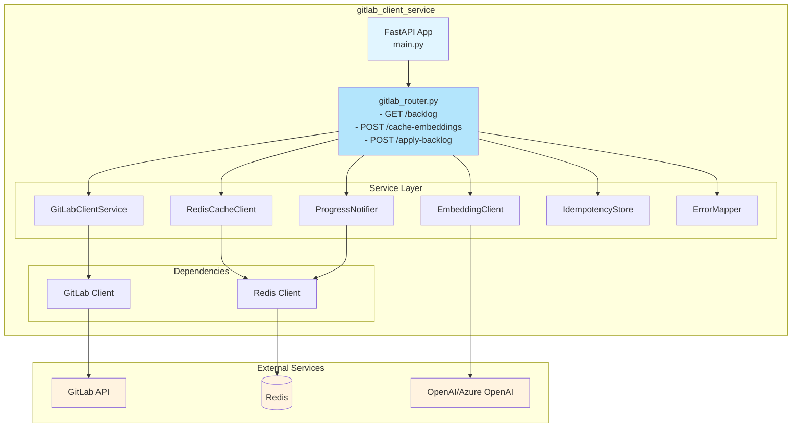
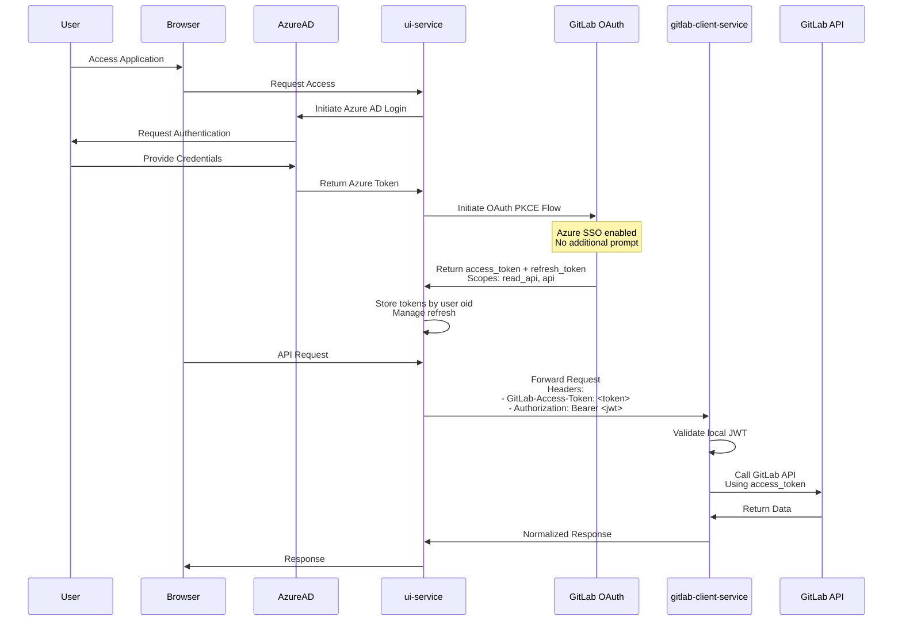
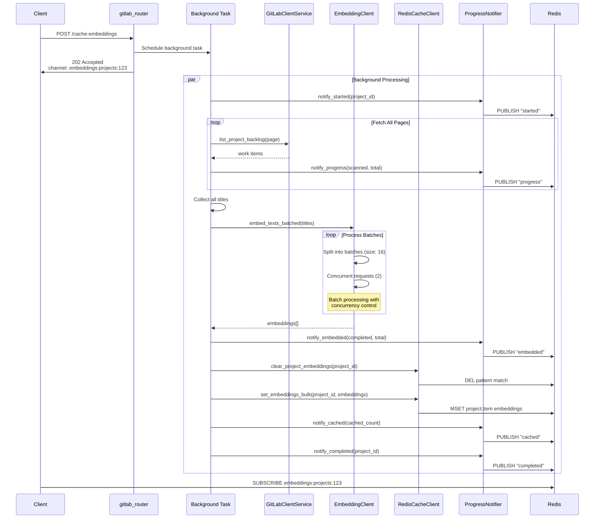
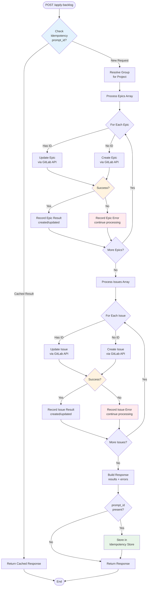

# GitLab Client Service

## Overview

The `gitlab_client_service` provides a thin, reliable REST façade over GitLab. It normalizes responses and exposes purpose-built endpoints to:
- Fetch epics and issues for a project (with filters and pagination)
- Cache embeddings for work item titles with Redis-backed storage
- Supply normalized data to `ai_tasks_service` for duplicate mapping/backlog generation
- Apply a reviewed backlog to GitLab with idempotent create/update and linking

This service uses `python-gitlab` for all GitLab communication and follows shared conventions for configuration, logging, errors, and retries.

Reference: [python-gitlab v6.x](https://python-gitlab.readthedocs.io/en/stable/)

## Goals

- Provide stable, simple REST endpoints for UI and `ai_tasks_service`
- Normalize GitLab records to predictable models: `{ id, title, description, state, web_url, labels[] }`
- Support label/state filtering and pagination
- Safely apply a generated backlog with idempotency and partial-failure reporting

## Non-goals

- AI backlog generation (handled by `ai_tasks_service`)
- Full pass-through to all GitLab APIs (only the required subset with safe defaults)

## Architecture

### System Architecture



### Framework & Technology Stack

- **Framework:** FastAPI via `shared.utils.app_factory.FastAPIFactory`
- **GitLab Client:** `python-gitlab` v4+ configured via environment and shared config
- **Caching:** Redis with `redis[hiredis]` for embeddings and pub/sub
- **Embeddings:** OpenAI/Azure OpenAI compatible API
- **Resilience:** Timeouts, retries with exponential backoff, and rate-limit handling
- **Observability:** Health endpoints, structured logging (`structlog`), request IDs, metrics hooks

### Local Components

Local to this microservice:
- `GitLabClientSettings` (Pydantic): encapsulates all config/env vars
- `GitLabClientService`: wrapper over `python-gitlab` with normalization
- `IdempotencyStore`: simple in-memory dedupe keyed by `prompt_id` (TTL 24 hours)
- `ErrorMapper`: maps python-gitlab exceptions to unified error schema
- `RedisCacheClient`: Redis connection and namespacing for embeddings
- `EmbeddingClient`: wrapper over embedding provider (OpenAI/Azure OpenAI/local)
- `ProgressNotifier`: publishes Redis pub/sub messages for long-running tasks

### Shared Components

From shared library:
- `RedisSettings`: Redis configuration and client utilities
- `LlmConfig`: LLM/embedding provider configuration
- `FastAPIFactory`: FastAPI app factory with common middleware
- JWT authentication for service-to-service calls

## Configuration

### Environment Variables

Configuration is centralized in `src/config.py` and reuses shared library configs:

**GitLab-specific settings:**
```env
GITLAB_BASE_URL=""                     # Required: e.g., https://gitlab.example.com
GITLAB_VERIFY_SSL=true                 # Verify SSL certificates
HTTP_TIMEOUT_SEC=30.0                  # HTTP request timeout
RETRY_MAX_ATTEMPTS=3                   # Maximum HTTP retries
RETRY_BACKOFF_FACTOR=2.0              # Exponential backoff factor
DEFAULT_PAGE_SIZE=100                  # Default pagination size
OAI_EMBED_BATCH=16                    # Batch size for embeddings
OAI_EMBED_CONCURRENCY=2               # Concurrent embedding requests
EMBEDDINGS_PUBSUB_PREFIX="embeddings:projects:"  # Redis pub/sub prefix
IDEMPOTENCY_TTL_SECONDS=86400         # 24 hours default
```

**Shared Redis configuration (from `RedisSettings`):**
```env
REDIS_URL="redis://redis:6379"
REDIS_PASSWORD=""
REDIS_DB=0
REDIS_MAX_CONNECTIONS=10
REDIS_SOCKET_CONNECT_TIMEOUT=5
REDIS_SOCKET_TIMEOUT=5
REDIS_PUBSUB_CHANNEL_PREFIX="embeddings:"
```

**Shared LLM configuration (from `LlmConfig`):**
```env
# For Azure OpenAI:
OAI_BASE_URL="https://<your-resource>.openai.azure.com"
OAI_API_VERSION="2024-02-01"
OAI_KEY="your-azure-openai-key"

# For standard OpenAI or mock:
# OAI_BASE_URL="http://openai-mock-service:8000"
# OAI_KEY="sk-..."

OAI_EMBED_MODEL_NAME="text-embedding-3-small"
OAI_EMBED_DEPLOYMENT_NAME="text-embedding-3-small"
```

**Local JWT (for service-to-service auth):**
```env
LOCAL_JWT_SECRET="dev-local-jwt-secret"
```

### Embedding Provider Compatibility

The service auto-detects Azure OpenAI vs standard OpenAI:
- **Azure OpenAI:** Detected when `OAI_API_VERSION` is set
  - Uses `AzureOpenAI` client with `api_version` parameter
- **Standard OpenAI:** When `OAI_API_VERSION` is not set
  - Uses `OpenAI` client with `base_url` parameter

## Authentication & Authorization

### Mechanism for GitLab Integration

Delegated user mode:

1. User signs in via Azure AD (Azure token is in session)
2. `ui-service` initiates GitLab OAuth Authorization Code flow (PKCE). With GitLab Azure SSO, the user typically isn't prompted again
3. `ui-service` receives GitLab `access_token` (+ `refresh_token`) with required scopes:
   - `read_api` for read-only operations
   - `api` for write operations
4. `ui-service` stores tokens server-side keyed by the app's user id (`oid`) and refreshes them proactively
5. `ui-service` calls `gitlab-client-service` with two headers:
   - `GitLab-Access-Token: <gitlab_access_token>` - for GitLab API access
   - `Authorization: Bearer <local_jwt>` - for intra-platform authentication
6. `gitlab-client-service` uses the GitLab access token to call GitLab APIs

All endpoints use the same authentication headers: `GitLab-Access-Token` for GitLab access, and `Authorization: Bearer <local_jwt>` for intra-platform auth.

### Authentication Flow Diagram



## Data Models

Normalized models are shared; JSON field names must match exactly.

### GitLabWorkItem

```json
{
  "kind": "epic" | "issue",
  "id": "string",
  "title": "string",
  "title_embedding": [0.123, ...] | [],
  "description": "string",
  "state": "opened" | "closed",
  "labels": ["string"],
  "web_url": "string"
}
```

### ListResponse<T>

```json
{
  "items": [GitLabWorkItem],
  "pagination": {
    "page": 1,
    "per_page": 100,
    "next_page": 2 | null,
    "prev_page": null,
    "total": 150 | null
  }
}
```

### ApplyBacklogRequest

```json
{
  "project_id": "string",
  "prompt_id": "string",
  "epics": [
    {
      "id": "string" | null,
      "title": "string",
      "description": "string",
      "labels": ["string"]
    }
  ],
  "issues": [
    {
      "id": "string" | null,
      "title": "string",
      "description": "string",
      "labels": ["string"],
      "epic_id": "string" | null
    }
  ]
}
```

### ApplyBacklogResponse

```json
{
  "results": {
    "epics": [
      {
        "input_index": 0,
        "action": "created" | "updated" | "unchanged",
        "id": "string",
        "web_url": "string"
      }
    ],
    "issues": [
      {
        "input_index": 0,
        "action": "created" | "updated" | "unchanged",
        "id": "string",
        "web_url": "string"
      }
    ]
  },
  "errors": [
    {
      "scope": "epic" | "issue",
      "input_index": 0,
      "message": "string",
      "gitlab_status": 404
    }
  ]
}
```

## REST APIs

Base path: `/gitlab`

### GET /gitlab/projects/{project_id}/backlog

Get project backlog (epics + issues) with cached embeddings.

**Query Parameters:**
- `labels` (optional): Comma-separated labels to filter by
- `state` (optional): Filter by state - `opened` (default), `closed`, `all`
- `page` (optional): Page number (default: 1)
- `per_page` (optional): Items per page (default: service default, max: 1000)

**Response:** `ListResponse<GitLabWorkItem>`

**Notes:**
- Epics are group-level; resolves owning group automatically
- If epics disabled, returns `items: []` with header `X-GitLab-Epics-Disabled: true`
- `title_embedding` is populated from Redis cache if present (no on-the-fly computation)

**Get Backlog Data Flow:**


### POST /gitlab/projects/{project_id}/cache-embeddings

Precompute and cache title embeddings for all epics and issues in the project.

**Response:** 202 Accepted with channel information

**Behavior:**
- Runs as background task, returns immediately with HTTP 202
- Retrieves all epics and issues for the project (fetches all pages)
- Computes embeddings for each `title` using the configured `EmbeddingClient`
- Stores vectors in Redis with keys `<project_id>:<work_item_id>`
- Replaces any existing cache for the project (clears before storing new values)
- Publishes progress via Redis pub/sub on channel `${EMBEDDINGS_PUBSUB_PREFIX}<project_id>`

**Pub/Sub Messages:**

Channel: `embeddings:projects:{project_id}`

Message examples:
```json
{ "event": "started", "project_id": "123" }
{ "event": "progress", "project_id": "123", "scanned": 150, "total": 320 }
{ "event": "embedded", "project_id": "123", "completed": 80, "total": 320 }
{ "event": "cached", "project_id": "123", "cached": 320 }
{ "event": "completed", "project_id": "123" }
{ "event": "error", "project_id": "123", "message": "..." }
```

**Cache Embeddings Workflow:**



### POST /gitlab/projects/{project_id}/apply-backlog

Apply a generated backlog to GitLab with idempotent create/update.

**Request Body:** `ApplyBacklogRequest`

**Response:** `ApplyBacklogResponse`

**Behavior:**
- Idempotent: identical payloads yield `unchanged` when no diffs
- State: created/updated items are `opened`
- Labels: unknown labels are ignored (may be reported as non-fatal warnings)
- Linking: resolves created epic ids to link subsequent issues
- Partial failures: continues processing and reports errors per item

**Apply Backlog Workflow:**



### GET /health

Health check endpoint for liveness/readiness.

Checks:
- Process health
- GitLab reachability (`/version` endpoint)
- Redis connectivity
- Embedding provider availability

## Error Handling

Unified error response format:

```json
{
  "error": {
    "code": "string",
    "message": "string",
    "gitlab_status": 404 | null,
    "details": {} | null
  }
}
```

**Common Error Codes:**
- `invalid_request` - Malformed request data
- `unauthorized` - Missing or invalid authentication (401)
- `forbidden` - Insufficient permissions (403)
- `not_found` - Resource not found (404)
- `conflict` - Resource conflict (409)
- `rate_limited` - GitLab rate limit exceeded (429)
- `gitlab_unavailable` - GitLab service unavailable (503)
- `idempotency_key_required` - Missing required idempotency key
- `cache_unavailable` - Redis cache unavailable
- `embedding_unavailable` - Embedding provider unavailable

## Integration Contracts

### ai_tasks_service → gitlab_client_service

- Uses `GET /gitlab/projects/{project_id}/backlog`
- Requires normalized fields: `{ kind, id, title, description, state, web_url, title_embedding }`
- Labels are optional

### UI Service → gitlab_client_service

- On Submit, calls `POST /gitlab/projects/{project_id}/apply-backlog`
- Can use `dry_run=true` query parameter for pre-validation (if implemented)
- Handles progress updates via Redis pub/sub subscription

### Service Integration Flow

```mermaid
sequenceDiagram
    participant UI as ui-service
    participant GitLabClient as gitlab-client-service
    participant AITasks as ai-tasks-service
    participant GitLabAPI as GitLab API
    participant Redis
    participant OpenAI as OpenAI/Azure

    Note over UI,OpenAI: Scenario: Generate and Apply Backlog

    UI->>GitLabClient: POST /cache-embeddings
    activate GitLabClient
    GitLabClient->>UI: 202 Accepted<br/>channel: embeddings:projects:123
    deactivate GitLabClient
    
    par Background: Cache Embeddings
        GitLabClient->>GitLabAPI: Fetch all epics & issues
        GitLabAPI-->>GitLabClient: Work items
        GitLabClient->>OpenAI: Batch embed titles
        OpenAI-->>GitLabClient: Embeddings
        GitLabClient->>Redis: Store embeddings
        GitLabClient->>Redis: PUBLISH progress events
    and UI subscribes to progress
        UI->>Redis: SUBSCRIBE embeddings:projects:123
        Redis-->>UI: Progress updates
    end
    
    UI->>GitLabClient: GET /backlog?state=opened
    activate GitLabClient
    GitLabClient->>GitLabAPI: List epics & issues
    GitLabAPI-->>GitLabClient: Raw GitLab data
    GitLabClient->>Redis: GET embeddings
    Redis-->>GitLabClient: Cached embeddings
    GitLabClient->>GitLabClient: Normalize + enrich
    GitLabClient-->>UI: Normalized work items<br/>with embeddings
    deactivate GitLabClient
    
    UI->>AITasks: POST /generate-backlog<br/>with existing items
    activate AITasks
    AITasks->>AITasks: Duplicate detection<br/>using embeddings
    AITasks->>OpenAI: Generate new items
    OpenAI-->>AITasks: AI-generated backlog
    AITasks-->>UI: Generated backlog
    deactivate AITasks
    
    UI->>UI: User reviews<br/>& approves
    
    UI->>GitLabClient: POST /apply-backlog<br/>with reviewed items
    activate GitLabClient
    GitLabClient->>GitLabClient: Check idempotency
    
    loop For each epic/issue
        GitLabClient->>GitLabAPI: Create or Update
        GitLabAPI-->>GitLabClient: Created/Updated item
    end
    
    GitLabClient->>GitLabClient: Build response<br/>with results & errors
    GitLabClient-->>UI: ApplyBacklogResponse
    deactivate GitLabClient
    
    UI->>UI: Display results<br/>to user
    
    style UI fill:#e3f2fd
    style GitLabClient fill:#fff3e0
    style AITasks fill:#e8f5e9
    style Redis fill:#ffebee
    style OpenAI fill:#f3e5f5
```

## Docker Compose Integration

### Service Definition

Add to `docker-compose.yml`:

```yaml
gitlab-client-service:
  build:
    context: ./services
    dockerfile: ./gitlab_client_service/Dockerfile
  ports:
    - "8011:8000"
  env_file:
    - ./docker-compose.env
  environment:
    - API_PORT=8000
  depends_on:
    - gitlab-mock-service
    - openai-mock-service
    - redis
  networks:
    - app-network
  healthcheck:
    test: ["CMD", "curl", "-f", "http://localhost:8000/health"]
    interval: 30s
    timeout: 10s
    retries: 3
    start_period: 5s
```

### Required Environment Variables

From `docker-compose.env`:

```env
# GitLab Configuration
GITLAB_BASE_URL=http://gitlab-mock-service:8000
GITLAB_VERIFY_SSL=false

# Redis Configuration
REDIS_URL=redis://redis:6379
REDIS_PASSWORD=
REDIS_DB=0

# Azure OpenAI Configuration
OAI_BASE_URL=https://<your-resource>.openai.azure.com
OAI_KEY=your-azure-openai-key
OAI_API_VERSION=2024-02-01
OAI_EMBED_MODEL_NAME=text-embedding-3-small
OAI_EMBED_DEPLOYMENT_NAME=text-embedding-3-small
OAI_EMBED_BATCH=16
OAI_EMBED_CONCURRENCY=2

# Local JWT (for S2S auth)
LOCAL_JWT_SECRET=dev-local-jwt-secret
```

## Testing

### Unit Tests

Run unit tests (24 passing):

```bash
cd services/gitlab_client_service
python -m pytest tests/ -v
```

### Integration Testing

To test with `gitlab_mock_service`:

1. **Start dependencies:**
   ```bash
   docker-compose up -d redis gitlab-mock-service openai-mock-service
   ```

2. **Run service locally:**
   ```bash
   cd services/gitlab_client_service
   export $(cat ../../docker-compose.env | xargs)
   export GITLAB_BASE_URL=http://localhost:8006
   export OAI_BASE_URL=http://localhost:8000
   export REDIS_URL=redis://localhost:6379
   uvicorn src.main:app --host 0.0.0.0 --port 8011 --reload
   ```

3. **Test endpoints:**
   ```bash
   # Health checks
   curl http://localhost:8011/health
   curl http://localhost:8011/health/redis
   curl http://localhost:8011/health/gitlab
   curl http://localhost:8011/health/embeddings

   # Get backlog (requires GitLab token)
   curl -H "GitLab-Access-Token: <token>" \
        -H "Authorization: Bearer <jwt>" \
        http://localhost:8011/gitlab/projects/1/backlog
   
   # Cache embeddings
   curl -X POST \
        -H "GitLab-Access-Token: <token>" \
        -H "Authorization: Bearer <jwt>" \
        http://localhost:8011/gitlab/projects/1/cache-embeddings
   
   # Apply backlog
   curl -X POST \
        -H "GitLab-Access-Token: <token>" \
        -H "Authorization: Bearer <jwt>" \
        -H "Content-Type: application/json" \
        -d '{"project_id": "1", "prompt_id": "test", "epics": [], "issues": []}' \
        http://localhost:8011/gitlab/projects/1/apply-backlog
   ```

## Examples

### Example 1: Fetch Project Backlog

**Request:**
```http
GET /gitlab/projects/123/backlog?labels=backend,security&state=opened&page=1&per_page=50
Headers:
  GitLab-Access-Token: <gitlab_access_token>
  Authorization: Bearer <local_jwt>
```

**Response:**
```json
{
  "items": [
    {
      "kind": "issue",
      "id": "1345",
      "title": "Fix JWT validation",
      "description": "...",
      "state": "opened",
      "labels": ["backend", "security"],
      "web_url": "https://gitlab.example.com/...",
      "title_embedding": [0.123, 0.456, ...]
    }
  ],
  "pagination": {
    "page": 1,
    "per_page": 50,
    "next_page": 2,
    "prev_page": null,
    "total": null
  }
}
```

### Example 2: Cache Embeddings

**Request:**
```http
POST /gitlab/projects/123/cache-embeddings
Headers:
  GitLab-Access-Token: <gitlab_access_token>
  Authorization: Bearer <local_jwt>
```

**Response:**
```json
{
  "message": "Embedding caching started",
  "project_id": "123",
  "channel": "embeddings:projects:123"
}
```

**Pub/Sub Channel:** `embeddings:projects:123`

**Example Progress Message:**
```json
{ "event": "completed", "project_id": "123" }
```

### Example 3: Apply Backlog

**Request:**
```http
POST /gitlab/projects/123/apply-backlog
Headers:
  GitLab-Access-Token: <gitlab_access_token>
  Authorization: Bearer <local_jwt>
Content-Type: application/json

{
  "project_id": "123",
  "prompt_id": "gen-abc-123",
  "epics": [
    {
      "id": null,
      "title": "Security Hardening",
      "description": "Implement security improvements",
      "labels": ["security"]
    }
  ],
  "issues": [
    {
      "id": null,
      "title": "Rotate service keys",
      "description": "Update all service authentication keys",
      "labels": ["security"],
      "epic_id": null
    }
  ]
}
```

**Response:**
```json
{
  "results": {
    "epics": [
      {
        "input_index": 0,
        "action": "created",
        "id": "567",
        "web_url": "https://gitlab.example.com/groups/mygroup/-/epics/567"
      }
    ],
    "issues": [
      {
        "input_index": 0,
        "action": "created",
        "id": "1346",
        "web_url": "https://gitlab.example.com/mygroup/myproject/-/issues/1346"
      }
    ]
  },
  "errors": []
}
```

## Best Practices Followed

1. **SOLID Principles**
   - Single Responsibility: Each service class has one concern
   - Dependency Inversion: Dependencies injected via FastAPI
   - Interface Segregation: Clear separation of read/write operations

2. **DRY Principle**
   - Reused shared Redis client utilities
   - Reused shared LLM configuration
   - Reused shared JWT authentication

3. **Code Quality**
   - Type hints throughout
   - Comprehensive docstrings
   - Structured logging with `structlog`
   - Error handling at every layer

4. **Minimal & Clean Code**
   - No backward compatibility code
   - No unused APIs or scaffolding
   - Modern Python patterns (3.10+)

## Known Limitations & Future Improvements

1. **Idempotency Store**
   - Currently in-memory (will reset on service restart)
   - Production should use Redis-backed store

2. **Epic Linking**
   - Issue-to-epic linking not yet implemented
   - Requires epic IID tracking and API calls

3. **Rate Limiting**
   - Basic retry with exponential backoff
   - Could add circuit breaker pattern

4. **Caching Strategy**
   - No TTL on cached embeddings
   - Consider automatic invalidation on GitLab updates

5. **Metrics**
   - Structured logging present
   - Prometheus metrics not yet exposed

## Implementation Notes for Engineers

- Normalize GitLab objects to the schemas above; avoid leaking raw fields
- Resolve group for epics via the project's namespace; prefer nearest ancestor with epics enabled
- Idempotent writes: no-op when no changes detected; otherwise update diffs only
- Use `python-gitlab` with persistent sessions, retries, and rate-limit handling
- Use built-in pagination and surface pagination metadata
- Epics: `gl.groups.get(group_id).epics.list(...)` with filters
- Issues: `gl.projects.get(project_id).issues.list(...)` with filters (labels, state, search)
- Support server-side filtering; if client-side filtering is applied, set header `X-Client-Filtered: true`
- Embeddings cache keys: `<project_id>:<work_item_id>`; values are numeric arrays
- List endpoints read `title_embedding` from cache only; they do not compute embeddings on demand

## Security & Compliance

- Store credentials only in env/secrets manager; never in repo
- Enforce input validation; avoid logging PII or sensitive descriptions
- Respect TLS/verification settings; never log tokens; mask headers in logs

## API Documentation

Once deployed, interactive API documentation is available at:
- **Swagger UI:** `http://localhost:8011/docs`
- **ReDoc:** `http://localhost:8011/redoc`
- **OpenAPI JSON:** `http://localhost:8011/openapi.json`

## Deployment Checklist

- [x] Dockerfile configured with multi-stage build
- [x] Health checks implemented
- [x] Environment variables documented
- [x] Dependencies locked in pyproject.toml
- [ ] Add to docker-compose.yml
- [ ] Configure service networking
- [ ] Set up logging aggregation
- [ ] Add monitoring/alerting
- [ ] Run E2E tests in docker-compose environment
- [ ] Performance/load testing

## Observability

### Health Checks

- `/health` - Overall service health
- `/health/redis` - Redis connectivity
- `/health/gitlab` - GitLab API reachability
- `/health/embeddings` - Embedding provider availability

### Logging

- Structured logging with `structlog`
- Request IDs propagated via `X-Request-ID` header
- Log levels: DEBUG, INFO, WARNING, ERROR
- Key logged events:
  - API request/response
  - GitLab API calls
  - Embedding generation
  - Cache operations
  - Error conditions

### Metrics (Future)

Planned metrics:
- Request count/duration by endpoint
- GitLab API error rates
- Retry counts
- Cache hit/miss rates
- Embedding generation latency