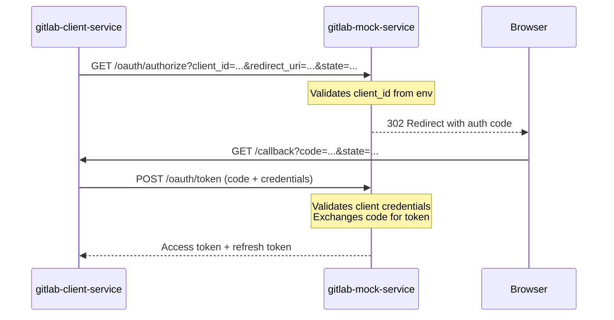

# GitLab Mock Service

Mock GitLab service for local development and testing. Simulates GitLab OAuth authentication and REST API endpoints.

## Features

- **OAuth 2.0 Flow**: Complete OAuth authorization code flow with PKCE (S256) validation support
- **Client Authentication**: Supports both HTTP Basic Auth and form-based client credential authentication per RFC 6749
- **API v4 Endpoints**: Mock GitLab REST API endpoints for epics and issues
- **Realistic Responses**: Returns properly formatted JSON responses matching GitLab API structure
- **Environment Configuration**: Reads OAuth credentials from environment variables for seamless integration
- **SSL/TLS Support**: HTTPS enabled with self-signed certificate for production-like behavior

## SSL/TLS Configuration

The mock service runs with **HTTPS enabled** using a self-signed SSL certificate to replicate production GitLab behavior.

### Certificate Files

- **`gitlab.crt`**: Self-signed SSL certificate (valid for 365 days)
- **`gitlab.key`**: Private key for SSL/TLS encryption

### Certificate Details

- **Common Name (CN)**: `host.docker.internal`
- **Subject Alternative Names (SANs)**:
  - `host.docker.internal`
  - `localhost`
  - `gitlab-mock-service`
  - `127.0.0.1`
- **Key Size**: RSA 4096-bit
- **Validity**: 365 days from generation

### Certificate Trust

The certificate is automatically copied to `gitlab-client-service` during Docker build and configured via:
```env
GITLAB_CA_CERT_PATH=/app/gitlab_client_service/gitlab.crt
```

This allows `gitlab-client-service` to trust the mock service's self-signed certificate.

### Environment Variables

```env
SSL_KEYFILE=/app/gitlab_mock_service/gitlab.key   # Private key path
SSL_CERTFILE=/app/gitlab_mock_service/gitlab.crt  # Certificate path
```

### Regenerating Certificates

If you need to regenerate the SSL certificate (e.g., after expiry):

```python
# Use Python's cryptography library
from cryptography import x509
from cryptography.hazmat.primitives.asymmetric import rsa
# ... see generate_cert.py for full implementation
```

Or use OpenSSL:
```bash
openssl req -x509 -newkey rsa:4096 -nodes \
  -keyout gitlab.key -out gitlab.crt -days 365 \
  -subj "/CN=host.docker.internal" \
  -addext "subjectAltName=DNS:host.docker.internal,DNS:localhost,DNS:gitlab-mock-service,IP:127.0.0.1"
```

After regeneration, copy `gitlab.crt` to `gitlab_client_service/` directory and rebuild both Docker images.

## OAuth Configuration

### Environment Variables

The mock service automatically reads OAuth credentials from environment variables to match the configuration used by `gitlab-client-service`. This ensures seamless OAuth flow testing without hardcoded credentials.

**Required Environment Variables:**
```env
GITLAB_OAUTH_CLIENT_ID=<your-oauth-client-id>
GITLAB_OAUTH_CLIENT_SECRET=<your-oauth-client-secret>
```

**Configuration Flow:**
1. `docker-compose.env` defines OAuth credentials (shared across services)
2. `gitlab-mock-service` reads these credentials via environment variables
3. `gitlab-client-service` uses the same credentials for OAuth authentication
4. OAuth flow succeeds because both services use matching credentials

**Default Values (for local development without docker-compose):**
- `GITLAB_OAUTH_CLIENT_ID`: `mock-gitlab-client-id`
- `GITLAB_OAUTH_CLIENT_SECRET`: `mock-gitlab-secret`

### OAuth Flow

The mock service implements the complete OAuth 2.0 authorization code flow:



**Supported Features:**
- HTTP Basic Auth and form-based client authentication
- PKCE (S256 and plain) validation
- Authorization code expiry (5 minutes)
- Access token generation with 2-hour expiry
- Refresh token support

## Supported Endpoints

### OAuth Endpoints

- `GET /oauth/authorize` - OAuth authorization endpoint (supports PKCE code_challenge)
- `POST /oauth/token` - Token exchange endpoint (validates PKCE code_verifier, accepts credentials via HTTP Basic Auth or form data)

### API v4 Endpoints

#### User & Project Endpoints
- `GET /api/v4/user` - Get current user information
- `GET /api/v4/projects/{project_id}` - Get project by numeric ID or UUID
- `GET /api/v4/projects/{path:path}` - Get project by path (e.g., `namespace/subnamespace/project`) - generates mock data dynamically
- `GET /api/v4/groups/{group_id}` - Get group by ID

#### Epic Endpoints
- `GET /api/v4/groups/{group_id}/epics` - List group epics
- `POST /api/v4/groups/{group_id}/epics` - Create epic
- `PUT /api/v4/groups/{group_id}/epics/{epic_id}` - Update epic
- `GET /api/v4/groups/{group_id}/epics/{epic_id}` - Get specific epic
- `GET /api/v4/groups/{group_id}/epics/{epic_iid}/issues` - List epic issues

#### Issue Endpoints
- `GET /api/v4/projects/{project_id}/issues` - List project issues
- `POST /api/v4/projects/{project_id}/issues` - Create issue
- `PUT /api/v4/projects/{project_id}/issues/{issue_iid}` - Update issue
- `GET /api/v4/projects/{project_id}/issues/{issue_iid}` - Get specific issue

#### Linking Endpoints
- `POST /api/v4/projects/{project_id}/issues/{issue_iid}/links` - Create issue link (relates_to, blocks, is_blocked_by)
- `POST /api/v4/groups/{group_id}/epics/{epic_iid}/related_epics` - Create epic relationship
- `POST /api/v4/groups/{group_id}/epics/{epic_iid}/issues` - Link issue to epic (parent-child)

### Health Check

- `GET /health` - Service health check

## Configuration

### Core Service Settings

Environment variables:

- `HOST` - Service host (default: `0.0.0.0`)
- `PORT` - Service port (default: `8000`)

### OAuth Settings (see OAuth Configuration section above)

- `GITLAB_OAUTH_CLIENT_ID` - OAuth client ID (reads from environment, default: `mock-gitlab-client-id`)
- `GITLAB_OAUTH_CLIENT_SECRET` - OAuth client secret (reads from environment, default: `mock-gitlab-secret`)

**Important:** When running with docker-compose, these values are automatically read from `docker-compose.env`.

## Running Locally

```bash
cd services/gitlab_mock_service
python -m venv venv
source venv/bin/activate  # On Windows: venv\Scripts\activate
pip install -e .
python src/main.py
```

## Running with Docker

```bash
docker build -t gitlab-mock-service .
docker run -p 8011:8000 gitlab-mock-service
```

## Mock Data

The service provides mock data for:

- 2 epics (Migration Planning Epic, Risk Analytics Modernization)
- 2 issues per epic (Analysis tasks)
- 1 mock user
- In-memory storage for created epics, issues, and links

All mock data includes realistic GitLab API response structures.

### Dynamic Mock Data Generation

The service automatically generates mock data for **any** project ID, group ID, or project path requested:

#### Project by Path
```bash
GET /api/v4/projects/team/subteam/project

# Returns deterministic mock project (same path = same ID via MD5 hash)
{
  "id": 7234,
  "name": "Project",
  "path": "project",
  "path_with_namespace": "team/subteam/project",
  "namespace": { "kind": "group", ... }
}
```

#### Project by Numeric ID
```bash
GET /api/v4/projects/1873

# Returns mock project with derived group ID
{
  "id": 1873,
  "name": "Mock Project 1873",
  "path": "mock-project-1873",
  "namespace": {
    "id": 187,  # Derived: project_id // 10
    "kind": "group",
    "path": "mock-group-187"
  }
}
```

#### Group Epics
```bash
GET /api/v4/groups/187/epics

# Always returns 2 mock epics with deterministic IDs
[
  {
    "id": 18701,  # group_id * 100 + 1
    "title": "Epic: Planning Phase for Group 187",
    "labels": ["planning", "mock"]
  },
  {
    "id": 18702,
    "title": "Epic: Implementation Phase for Group 187",
    "labels": ["implementation", "mock"]
  }
]
```

#### Project Issues
```bash
GET /api/v4/projects/1873/issues

# Always returns 3 mock issues with deterministic IDs
[
  {
    "id": 1873001,  # project_id * 1000 + 1
    "title": "Issue: Setup infrastructure for project 1873",
    "labels": ["infrastructure", "setup"]
  },
  {
    "id": 1873002,
    "title": "Issue: Implement core features for project 1873",
    "labels": ["feature", "development"]
  },
  {
    "id": 1873003,
    "title": "Issue: Testing and documentation for project 1873",
    "labels": ["testing", "documentation"]
  }
]
```

**Key Features:**
- ✅ No pre-configuration needed - works for any ID or path
- ✅ Deterministic IDs (same input = same output)
- ✅ Proper GitLab API response structure
- ✅ Supports cache embeddings flow end-to-end

### Linking Support

The mock service fully supports:
- **Issue-to-Issue Links**: Create related/blocks/blocked-by relationships between issues
- **Epic-to-Epic Links**: Create related relationships between epics
- **Issue-to-Epic Links**: Create parent-child relationships (epic contains issues)

## Integration

### With docker-compose

When running with docker-compose, services automatically use the shared OAuth credentials from `docker-compose.env`:

```yaml
# docker-compose.yml
gitlab-mock-service:
  env_file:
    - docker-compose.env  # Reads GITLAB_OAUTH_CLIENT_ID and GITLAB_OAUTH_CLIENT_SECRET
  
gitlab-client-service:
  env_file:
    - docker-compose.env  # Uses same credentials
  environment:
    - GITLAB_BASE_URL=http://gitlab-mock-service:8000
```

### Manual Configuration

For standalone testing without docker-compose:

```env
GITLAB_BASE_URL=http://gitlab-mock-service:8000
GITLAB_OAUTH_CLIENT_ID=mock-gitlab-client-id
GITLAB_OAUTH_CLIENT_SECRET=mock-gitlab-secret
```

## Development

The service is designed to be minimal and stateless, with in-memory storage for OAuth flows. Perfect for:

- Local development without external GitLab instance
- E2E testing of GitLab integration
- CI/CD pipelines

## Troubleshooting

### OAuth Authentication Fails

**Symptoms:**
- `invalid_client` error during OAuth authorization
- `Invalid client credentials` error during token exchange

**Diagnosis:**
Check the service logs for OAuth credential mismatch:
```bash
docker-compose logs gitlab-mock-service | grep "OAuth"
```

Look for log entries showing:
- `OAuth authorization rejected: client_id mismatch` - Client ID doesn't match
- `Client credential mismatch` - Client secret doesn't match

**Solution:**
1. Verify environment variables are set in `docker-compose.env`:
   ```env
   GITLAB_OAUTH_CLIENT_ID=<value>
   GITLAB_OAUTH_CLIENT_SECRET=<value>
   ```

2. Ensure both `gitlab-mock-service` and `gitlab-client-service` use `env_file: - docker-compose.env` in docker-compose.yml

3. Restart services to pick up environment variable changes:
   ```bash
   docker-compose restart gitlab-mock-service gitlab-client-service
   ```

4. Verify credentials are loaded correctly:
   ```bash
   docker-compose exec gitlab-mock-service env | grep GITLAB_OAUTH
   ```

### Debugging OAuth Flow

The mock service includes detailed structured logging for OAuth operations:

- **Authorization requests**: Shows client_id validation and auth code generation
- **Token exchange**: Shows credential validation method (Basic Auth vs form-based)
- **Token issuance**: Shows successful token generation

**Enable debug logging:**
```bash
docker-compose logs -f gitlab-mock-service
```

**Look for these log entries:**
- `OAuth authorization request received` - Initial authorization with client_id comparison
- `OAuth authorization code generated` - Successful code generation
- `OAuth token request received` - Token exchange with auth method
- `OAuth token issued successfully` - Successful token generation

### Common Issues

1. **Default credentials used instead of environment variables**
   - Check docker-compose.yml has `env_file: - docker-compose.env`
   - Verify environment variables are not overridden in service-specific `environment:` section

2. **Credentials mismatch between services**
   - Both services must read from same `docker-compose.env`
   - Check for typos in environment variable names (case-sensitive)

3. **Authorization code expired**
   - Codes expire after 5 minutes
   - Complete OAuth flow quickly or regenerate authorization

