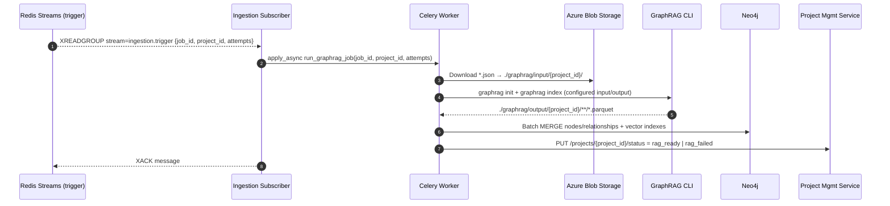

## Neo4j Ingestion Service — GraphRAG CLI Orchestrator

This service orchestrates Microsoft GraphRAG end-to-end for a project and ingests the produced parquet artifacts into Neo4j.

### Scope and responsibilities
- Accept a trigger message with `project_id` (and `job_id`) via Redis Streams.
- Download project-scoped `.json` documents from Azure Blob into `input/{project_id}`.
- Initialize/configure a GraphRAG workspace and run the indexer via the official CLI.
- Read GraphRAG parquet outputs from `output/{project_id}` and upsert into Neo4j with idempotent MERGE.
- Update the Project Management Service status to `rag_ready` (or `rag_failed`).

Reference: Microsoft GraphRAG Getting Started (CLI, settings, Azure OpenAI configuration) — https://microsoft.github.io/graphrag/get_started/

### Architecture flow


### Message contract (Redis Streams)
- Stream key: `ingestion.trigger` (consumer group: `neo4j_ingestor`, consumer name configurable)
- Message shape:
```json
{
  "job_id": "<uuid>",
  "project_id": "<uuid>",
  "attempts": 0
}
```
- Dead-letter stream: `ingestion.trigger.deadletter` after max attempts.

### Filesystem layout (inside container)
- `RAG_WORKSPACE_ROOT` (default `/app/graphrag`)
  - `settings.yaml` and `.env` for GraphRAG
  - `input/{project_id}/*.json` — downloaded inputs for the project
  - `output/{project_id}/**/*.parquet` — GraphRAG artifacts

### GraphRAG input JSON schema (per document)
Downloaded from Azure Blob into `input/{project_id}` (produced upstream by the Document Processing Service):
```json
{
  "id": "<doc_id>",
  "title": "<title>",
  "text": "<full text>",
  "creation_date": "2024-01-01T00:00:00Z",
  "sources_url": "https://...",
  "metadata": { "...": "..." }
}
```

### Dependencies
- Runtime Python packages:
  - `graphrag` (CLI and pipeline)
  - `azure-storage-blob` (download JSONs)
  - `pyarrow` (read parquet) or `pandas[parquet]`
  - `neo4j` (official Python driver)
  - `structlog`, `fastapi`, `celery`, `redis`
- System: `curl` (healthchecks)

### Environment configuration
- GraphRAG / LLM
  - `GRAPHRAG_API_KEY` (OpenAI key). For Azure OpenAI: also set in `settings.yaml`:
    - `type: azure_openai_chat` / `azure_openai_embedding`
    - `api_base: https://<instance>.openai.azure.com`
    - `api_version: 2024-02-15-preview`
    - `deployment_name: <azure_model_deployment_name>`
- Azure Blob
  - `AZURE_STORAGE_CONNECTION_STRING`
  - `AZURE_BLOB_CONTAINER`
  - `AZURE_BLOB_PREFIX_TEMPLATE` (e.g., `projects/{project_id}/graphrag-input`)
- Paths
  - `RAG_WORKSPACE_ROOT` default `/app/graphrag`
- Messaging
  - `REDIS_URL`, `INGESTION_STREAM_KEY=ingestion.trigger`, `INGESTION_GROUP=neo4j_ingestor`
- Neo4j
  - `NEO4J_URI`, `NEO4J_USERNAME`, `NEO4J_PASSWORD`, `NEO4J_DATABASE=neo4j`
- Project Management
  - `PROJECT_MGMT_BASE_URL`

### GraphRAG workspace and settings
On first run (or when missing), the service will initialize the workspace and write settings:
```bash
graphrag init --root ${RAG_WORKSPACE_ROOT}
```
Then adjust `settings.yaml` under `${RAG_WORKSPACE_ROOT}` to set per-project paths:
```yaml
input:
  file_pattern: input/{project_id}
output:
  path: output/{project_id}
models:
  default:
    chat:
      type: azure_openai_chat
      api_base: https://<instance>.openai.azure.com
      api_version: 2024-02-15-preview
      deployment_name: <azure_model_deployment_name>
      api_key: ${GRAPHRAG_API_KEY}
    embedding:
      type: azure_openai_embedding
      api_base: https://<instance>.openai.azure.com
      api_version: 2024-02-15-preview
      deployment_name: <azure_embedding_deployment>
      api_key: ${GRAPHRAG_API_KEY}
```
For OpenAI (non-Azure), set `type: openai_chat` / `openai_embedding` and only `api_key`.

### CLI commands used
- Initialize (once per workspace root):
```bash
graphrag init --root ${RAG_WORKSPACE_ROOT}
```
- Index for a specific project (after inputs are in place and settings reference it):
```bash
graphrag index --root ${RAG_WORKSPACE_ROOT}
```
Reference: GraphRAG CLI and configuration — https://microsoft.github.io/graphrag/get_started/

### Orchestration steps (Celery task `run_graphrag_job`)
1) Create `${RAG_WORKSPACE_ROOT}/input/{project_id}` and `${RAG_WORKSPACE_ROOT}/output/{project_id}` if absent
2) Download JSON files from Azure Blob using `AZURE_BLOB_PREFIX_TEMPLATE` → `input/{project_id}`
3) Ensure workspace initialized; patch `settings.yaml` to point to `input/{project_id}` and `output/{project_id}`
4) Run `graphrag index --root ${RAG_WORKSPACE_ROOT}` and verify exit code
5) Load parquet outputs from `output/{project_id}` with `pyarrow` and map to Neo4j rows
6) Upsert into Neo4j with idempotent MERGE; create HNSW vector indexes (1536/cosine) as needed
7) Update Project Management Service status: `rag_ready` on success; `rag_failed` on error

### Neo4j ingestion mapping (from GraphRAG parquet)
- Expected tables: `documents`, `text_units`, `entities`, `relationships`, `communities`, `community_reports` (+ optional `covariates`)
- Identity strategy:
  - Nodes: deterministic `id` per table (e.g., `sha256(text|doc_id)` for `text_units`)
  - Relationships: synthetic `id = sha256(start_id|TYPE|end_id|context)` for idempotent MERGE
- Vector search: store embeddings on `__Entity__`, `__TextUnit__`, `__Community__` and create native HNSW vector indexes:
```cypher
CREATE VECTOR INDEX entity_embedding_index IF NOT EXISTS
FOR (e:__Entity__) ON (e.embedding)
OPTIONS { indexConfig: { `vector.dimensions`: 1536, `vector.similarity_function`: 'cosine' } };
```

### Operational notes
- Backpressure: keep 1–2 in-flight tasks per consumer; use `acks_late=true` and `worker_prefetch_multiplier=1`
- Resiliency: use `XAUTOCLAIM`/`XCLAIM` to recover idle messages; DLQ to `ingestion.trigger.deadletter`
- Observability: structured logs for each phase (blob → graphrag → parquet → neo4j); capture counts and durations
- Cleanup: optionally retain `output/{project_id}` for audit; configurable TTL

### Docker and Compose
- Image should install: `graphrag`, `azure-storage-blob`, `pyarrow`, plus service deps
- Mount a named volume for `${RAG_WORKSPACE_ROOT}` to persist artifacts, for example: `graphrag_workspace:/app/graphrag`
- Run a dedicated Celery worker for the `neo4j_ingestion` queue; optionally run a lightweight subscriber process (or start the subscriber in the API process)
- Healthcheck: `GET /health`

### Local development quickstart
1) Export required env vars (OpenAI/Azure keys, Neo4j, Redis, Blob)
2) Ensure sample input JSON documents exist in Blob under the prefix from `AZURE_BLOB_PREFIX_TEMPLATE` (e.g., `projects/{project_id}/graphrag-input`)
3) Start stack via docker-compose
4) Publish a trigger message to `ingestion.trigger` with `{job_id, project_id}`
5) Inspect logs; verify parquet creation and Neo4j graph updates

### Acceptance criteria
- On successful completion of the Celery task for a project, all GraphRAG parquet artifacts are loaded into Neo4j with idempotent MERGE, and Project status is set to `rag_ready`.

### References
- GraphRAG Getting Started: https://microsoft.github.io/graphrag/get_started/

### Implementation using existing scripts in this repo (and small adjustments)
- FastAPI app and health
  - Use `neo4j_ingestion_service/src/main.py` (FastAPI via `FastAPIFactory`).
  - Small change: enable Redis and Blob clients if you want runtime stream subscription from the API process:
    - Set `enable_redis=True`, `enable_blob_storage=True` in `FastAPIFactory.create_app(...)` and wire a startup task to start the subscriber (see Subscriber below).

- Celery worker app
  - Use `neo4j_ingestion_service/src/celery_worker_app.py` to create the app and register tasks.
  - Already routes `tasks.neo4j_ingestion.*` to `queue="neo4j_ingestion"` and sets `task_acks_late=True`.
  - Keep as-is; ensure the worker imports this module as the entrypoint.

- Redis Streams subscriber (shared utility)
  - Use `services/shared/src/utils/task_stream_subscriber.py` `TaskStreamSubscriber` to consume the trigger stream and enqueue Celery tasks.
  - The service-level thin wrapper is at `neo4j_ingestion_service/src/task_subscriber.py`.
  - Required change: update stream key to the new contract and simplify the task args:
    - Change `stream_key` from `"ingestion.jobs"` to `"ingestion.trigger"`.
    - Provide a `build_apply_kwargs` that passes only `[job_id, project_id, attempts]` (no `documents`). Example:
      ```python
      def build_apply_kwargs(fields):
          return {
              "args": [fields.get("job_id"), fields.get("project_id"), int(fields.get("attempts", 0) or 0)],
              "queue": "neo4j_ingestion",
          }
      subscriber = TaskStreamSubscriber(
          redis_client=redis_client,
          stream_key="ingestion.trigger",
          consumer_group="neo4j_ingestor",
          consumer_name="worker",
          task=run_graphrag_job_task,
          queue="neo4j_ingestion",
          build_apply_kwargs=build_apply_kwargs,
      )
      ```

- Celery task to orchestrate GraphRAG
  - Replace the current stub in `neo4j_ingestion_service/src/tasks/ingestion_tasks.py` with orchestration:
    - Signature: `run_graphrag_job(job_id: str, project_id: str, attempts: int = 0)`
    - Steps: create project workspace dirs; list/download JSONs from Blob; init/patch GraphRAG `settings.yaml`; call CLI `graphrag index --root ${RAG_WORKSPACE_ROOT}` via `subprocess`; read parquet via `pyarrow`; batch MERGE to Neo4j using `Neo4jClient`.
    - Remove local chunking/entity placeholder logic; chunking/NER/community are handled by GraphRAG.

- GraphRAG runner module (new, small)
  - Add `neo4j_ingestion_service/src/graphrag_runner.py` to encapsulate: workspace init, settings templating, and CLI invocation with exit-code check.
  - Keep it thin; the task calls it.

- Azure Blob I/O (shared utility)
  - Use `services/shared/src/utils/blob_storage.py` `BlobStorageClient`:
    - List files for the project using `list_files(project_id, prefix=...)` where prefix derives from `AZURE_BLOB_PREFIX_TEMPLATE`.
    - Download each JSON to `${RAG_WORKSPACE_ROOT}/input/{project_id}` using `download_file(blob_name, local_path, project_id)`.
  - Note: this client uses per-project containers by default (`{container}-{project_id}`). If you use a single container with prefixes instead, you can pass `project_id=None` and rely purely on `prefix`.

- Neo4j client (shared utility)
  - Use `services/shared/src/utils/neo4j_client.py` `Neo4jClient` for executing Cypher.
  - Implement ingestion helpers (either here or a local module) to perform chunked `UNWIND` MERGE for nodes/relationships and to create HNSW vector indexes.

- Subscriber startup
  - Option A: Run the `TaskStreamSubscriber` in the API process (in `main.py`) using the shared Redis client, and wire graceful shutdown.
  - Option B: Run the subscriber in a separate process/container if you prefer isolation; it still enqueues the same Celery task.

- Settings and configuration (shared)
  - Use existing Pydantic settings under `services/shared/src/configuration/*` for Neo4j, Redis, and Blob. Add GraphRAG-specific envs in this service as needed and document them in `.env`.

- Service skeletons to keep/use
  - `neo4j_ingestion_service/src/services/ingestion_service.py` exists as a placeholder; you can evolve it to host reusable ingestion routines (e.g., parquet→rows→MERGE), called by the Celery task.
  - `neo4j_ingestion_service/src/main.py` provides health endpoints; keep `/health` and `/health/celery`.

- Tests
  - The existing test `tests/test_text_chunking.py` validates an old local chunking flow; after migration to GraphRAG, replace with tests for:
    - settings templating, CLI invocation args, parquet→Neo4j mapping, and subscriber `build_apply_kwargs` behavior.


