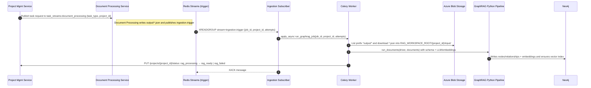
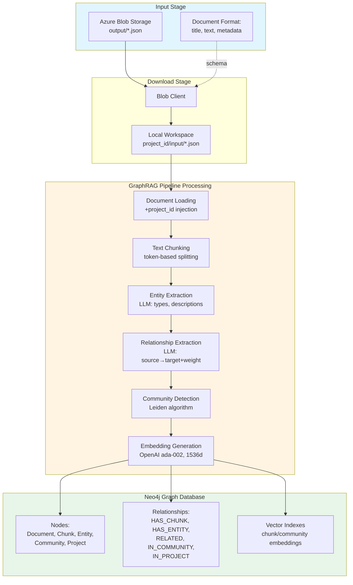
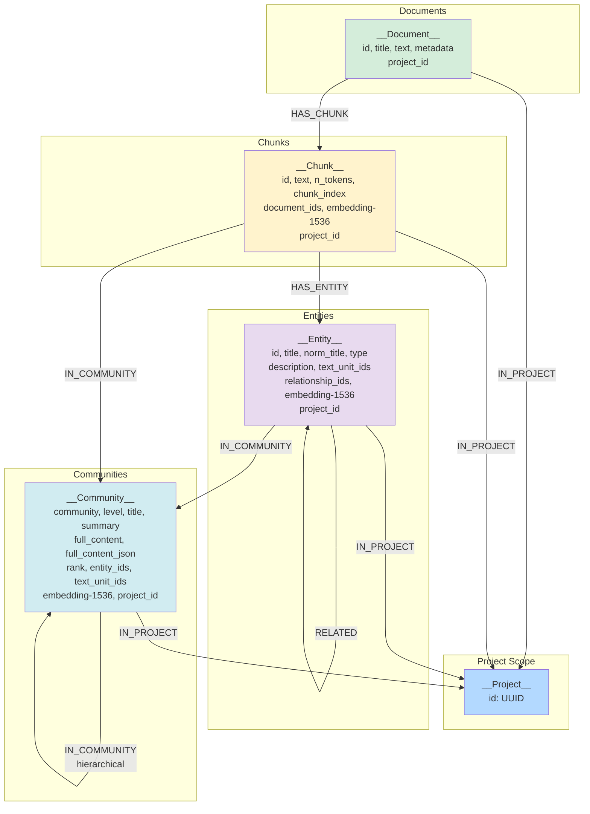
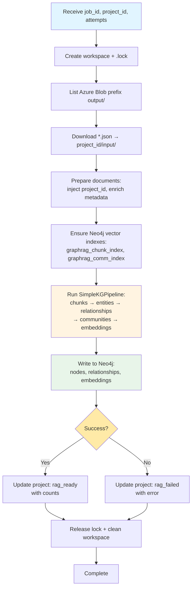

## Neo4j Ingestion Service — Neo4j GraphRAG Python Pipeline Orchestrator

This service orchestrates project-scoped knowledge graph ingestion using the Neo4j GraphRAG Python pipeline. It consumes trigger messages from Redis Streams, downloads JSON documents from Azure Blob, runs the GraphRAG pipeline to extract entities/relationships/communities with embeddings, writes directly to Neo4j, and updates the Project Management Service with progress and status.

### Scope and responsibilities
- Accept trigger messages with `job_id`, `project_id`, `attempts` via Redis Streams
- Download project-scoped `.json` documents from Azure Blob (`output/` prefix) into `RAG_WORKSPACE_ROOT/{project_id}/input/`
- Run Neo4j GraphRAG Python pipeline (`SimpleKGPipeline`) to construct knowledge graph:
  - Text chunking and entity extraction (LLM-powered)
  - Relationship extraction and community detection (Leiden algorithm)
  - Vector embeddings (OpenAI ada-002, 1536 dims)
- Create Neo4j graph schema with nodes (`__Document__`, `__Chunk__`, `__Entity__`, `__Community__`, `__Project__`) and relationships (`HAS_CHUNK`, `HAS_ENTITY`, `RELATED`, `IN_COMMUNITY`, `IN_PROJECT`)
- Ensure vector indexes exist: `graphrag_chunk_index` on `(:__Chunk__).embedding`, `graphrag_comm_index` on `(:__Community__).embedding` (1536 dims, cosine similarity)
- Update Project Management Service: `rag_processing` → `rag_ready` | `rag_failed`

### Architecture
#### Service Integration Flow


#### GraphRAG Pipeline Data Flow


### Message contract (Redis Streams)
- Stream key: `ingestion.trigger` (consumer group: `neo4j_ingestor`, consumer name configurable)
- Message shape:
```json
{
  "job_id": "<uuid>",
  "project_id": "<uuid>",
  "attempts": 0
}
```
- Dead-letter stream: `ingestion.trigger.deadletter` after max attempts.

### Inter-service integration
- Upstream producer: `document_processing_service`
  - Writes per-document JSONs to project container under `output/` prefix with fields `title`, `text`, and filtered `metadata`.
  - Publishes `ingestion.trigger` entries with fields `job_id`, `project_id`, `attempts` via shared `models.ingestion_messages`.
- This service consumes `ingestion.trigger`, downloads the `output/*.json` payloads, and ingests them into Neo4j via the GraphRAG Python pipeline.

### Filesystem layout (inside container)
- `RAG_WORKSPACE_ROOT` (default `./graphrag` via local script)
  - `{project_id}/input/*.json` — downloaded inputs
  - `{project_id}/.lock` — lock file to prevent concurrent runs
  - Workspace is cleaned after successful pipeline execution

### Data structures

#### Input JSON format (per document)
Upstream produces JSON documents; the service injects `project_id` during processing:
```json
{
  "title": "<title>",
  "text": "<full text or structured JSON>",
  "metadata": {
    "file_name": "<original filename>",
    "file_type": "<pdf|docx|...>",
    "content_type": "<mime>",
    "creation_date": "2024-01-01T00:00:00Z",
    "modification_date": "2024-01-02T00:00:00Z"
  }
}
```

#### Neo4j graph schema


**Key node properties:**

| Node | Required Properties | Optional Properties | Notes |
|------|---------------------|---------------------|-------|
| `__Project__` | `id` (UUID) | - | Multi-tenant scoping; unique constraint on `id` |
| `__Document__` | `id`, `project_id` | `title`, `text`, `metadata` (dict) | Source documents |
| `__Chunk__` | `id`, `text`, `document_ids` (list), `project_id` | `n_tokens`, `chunk_index`, `embedding` (1536 float) | Deduplication by `text`; embedding set post-ingestion |
| `__Entity__` | `id`, `description`, `text_unit_ids` (list), `project_id` | `title`, `norm_title`, `type`, `relationship_ids` (list), `merged_ids` (list), `embedding` (1536 float) | Matched by `id`, `norm_title`, or `description`; `merged_ids` tracks all entity IDs merged into this entity |
| `__Community__` | `community`, `full_content`, `entity_ids` (list), `project_id` | `level`, `title`, `summary`, `full_content_json`, `rank`, `rating_explanation`, `text_unit_ids` (list), `embedding` (1536 float) | Composite key: `(community, project_id)`; hierarchical Leiden communities |

**Entity ID Deduplication & Merged ID Tracking:**

Entities are deduplicated by `norm_title` and `description` during ingestion. When multiple entities with the same semantic identity are merged, the **first entity's ID is preserved** and subsequent IDs are tracked in a `merged_ids` array:

**Example:**
```cypher
// entities.parquet has two entities with same norm_title
{id: "entity_A", title: "Risk Model"}
{id: "entity_B", title: "RISK MODEL"}  // Same after normalization

// After merge_entity.cypher:
(:__Entity__ {
  id: "entity_A",                    // Primary ID (first one wins)
  merged_ids: ["entity_A", "entity_B"]  // All IDs that reference this entity
})
```

**Community Relationship Resolution:**

- **GraphRAG output:** `communities.parquet` contains `entity_ids` that may reference merged IDs (e.g., `["entity_B"]`)
- **Match strategy:** `merge_community.cypher` matches entities using: `WHERE entity_id IN e.merged_ids`
- **Result:** Community finds the entity even if it references a merged ID
- **Update:** `Community.entity_ids` is updated to current canonical IDs (e.g., `["entity_A"]`) **ONLY when entities are found**
- **Preservation:** If no entities match during initial ingestion, original `entity_ids` from parquet are preserved for backfill phase

This ensures `Entity-[:IN_COMMUNITY]->Community` relationships are created correctly even when entity IDs from GraphRAG output were merged during deduplication.

**Community Hierarchy Construction:**

Communities are organized hierarchically using Leiden algorithm levels (0, 1, 2). The hierarchy is constructed through backfill operations:

1. **Initial Ingestion (`merge_community.cypher`):**
   - Creates `__Community__` nodes with properties from `communities.parquet`
   - Attempts to match entities and create `(Entity)-[:IN_COMMUNITY]->(Community)` relationships
   - If entities found: Updates `entity_ids` with canonical IDs and creates relationships
   - If no entities found: Preserves original `entity_ids` for backfill phase

2. **Entity/Chunk Membership Backfill (`backfill_community_membership.cypher`):**
   - Runs after vector embeddings are ingested
   - Resolves missing `(Entity)-[:IN_COMMUNITY]->(Community)` relationships
   - Uses three fallback strategies:
     - Path 1: Match by stored `entity_ids` (from parquet)
     - Path 2: Match by existing `IN_COMMUNITY` relationships
     - Path 3: Fallback to `text_unit_ids` → chunks → entities traversal
   - Creates `(Chunk)-[:IN_COMMUNITY]->(Community)` relationships

3. **Hierarchy Backfill (`backfill_community_hierarchy.cypher`):**
   - Creates `(child:Community)-[:IN_COMMUNITY]->(parent:Community)` relationships
   - Matches parent-child by level difference (level N links to level N-1)
   - Uses two matching strategies:
     - Primary: Entity overlap (`entity_ids` intersection)
     - Fallback: Relationship overlap (`relationship_ids` intersection)
   - Result: Hierarchical graph enabling multi-level DRIFT search

**Key relationships:**

| Relationship | Direction | Properties | Purpose |
|--------------|-----------|------------|---------|
| `IN_PROJECT` | `(Node)-[:IN_PROJECT]->(Project)` | - | Multi-tenant project scoping |
| `HAS_CHUNK` | `(Document)-[:HAS_CHUNK]->(Chunk)` | - | Links documents to text chunks; deduplicated |
| `HAS_ENTITY` | `(Chunk)-[:HAS_ENTITY]->(Entity)` | - | Links chunks to entities mentioned within |
| `RELATED` | `(Entity)-[:RELATED]->(Entity)` | `id`, `source`, `target`, `source_id`, `target_id`, `description`, `weight`, `combined_degree`, `text_unit_ids` (list) | Semantic entity relationships with LLM-generated descriptions |
| `IN_COMMUNITY` | `(Entity\|Chunk\|Community)-[:IN_COMMUNITY]->(Community)` | - | Community membership for entities/chunks; hierarchical parent-child relationships between communities (Leiden hierarchy: level 2→1→0) |

### Runtime dependencies
- `neo4j-graphrag` (GraphRAG Python pipeline)
- `neo4j` (official Python driver)
- `azure-storage-blob` (download JSONs)
- `structlog`, `fastapi`, `celery`, `redis`

### Environment configuration
- GraphRAG / LLM (from `config` in this service; shared LLM config at `shared/configuration/llm_config.py`)
  - `OAI_KEY` (API key)
  - `OAI_BASE_URL` (for Azure or custom gateway). When paired with `OAI_API_VERSION`, Azure mode is used.
  - `OAI_API_VERSION` (e.g., `2024-06-01`)
  - `OAI_MODEL` (chat model)
  - `OAI_EMBED_MODEL_NAME` (embedding model name for tiktoken, e.g., `text-embedding-3-small`)
  - `OAI_EMBED_DEPLOYMENT_NAME` (Azure deployment name for embeddings; optional, defaults to `OAI_EMBED_MODEL_NAME`)
- Azure Blob
  - `AZURE_STORAGE_CONNECTION_STRING`
  - `AZURE_STORAGE_CONTAINER_NAME`
  - `AZURE_STORAGE_BLOB_ENDPOINT`
- Paths
  - `RAG_WORKSPACE_ROOT` (e.g., `./graphrag`)
- Messaging
  - `REDIS_URL`
  - `CELERY_BROKER_URL`, `CELERY_RESULT_BACKEND`
- Neo4j
  - `NEO4J_URI`, `NEO4J_USERNAME`, `NEO4J_PASSWORD`, `NEO4J_DATABASE`
- Project Management
  - `PROJECT_MANAGEMENT_SERVICE_URL`

### Operations

#### Subscriber and retry/DLQ
- Subscriber (`subscribers/task_subscriber.py`) consumes stream `ingestion.trigger` and enqueues Celery task on queue `neo4j_ingestion` with args `[job_id, project_id, attempts]`
- Retry policy uses shared backoff logic; retries published back to `ingestion.trigger`, DLQ to `ingestion.trigger.deadletter` after max attempts

#### Orchestration steps
Celery task `tasks.neo4j_ingestion.run_graphrag_job` executes:



**Step details:**
1. **Workspace setup:** Create `RAG_WORKSPACE_ROOT/{project_id}/input` and `.lock` to prevent concurrent runs
2. **Download:** List Blob files with prefix `output/`, download `.json` files to input directory
3. **Document preparation:** Inject `project_id` into each document, carry forward metadata fields
4. **Index creation:** Ensure vector indexes exist via `neo4j_graphrag.indexes.create_vector_index` (1536 dims, cosine similarity)
5. **Pipeline execution:** Run `SimpleKGPipeline` with finance-oriented schema (permissive extensions allowed):
   - Text chunking (token-based splitting)
   - Entity extraction (LLM: types, descriptions, text_unit associations)
   - Relationship extraction (LLM: source→target with descriptions, weights)
   - Community detection (Leiden algorithm, hierarchical levels)
   - Embedding generation (OpenAI ada-002, 1536 dimensions for chunks, entities, communities)
6. **Neo4j writes:** Create nodes/relationships with project scoping; batch processing (1000 rows/batch)
   - Documents: Ensure `title` is populated (fallback: `metadata.file_name` → `id`)
   - Chunks: Deduplication by text with relationship merging
   - Entities: Merge by `id`, `norm_title`, or `description`
   - Relationships: Create with deduplication
   - Communities: Create `__Community__` nodes with `level` property from Leiden hierarchy output, establish `(Entity|Chunk)-[:IN_COMMUNITY]->(Community)` relationships
   - **Embeddings:** Bulk ingestion from LanceDB tables (see "Embedding Ingestion Strategy" below)
7. **Backfills:** Populate derived properties and cross-references after all data ingestion completes
   - `backfill_entity_relationship_ids`: Populate `Entity.relationship_ids[]` arrays from actual `RELATED` edges
   - `backfill_community_membership`: Populate `Community.entity_ids[]` arrays and missing `IN_COMMUNITY` edges
   - `backfill_community_hierarchy`: Create hierarchical `(child:__Community__)-[:IN_COMMUNITY]->(parent:__Community__)` relationships
     - **Note:** GDS Leiden algorithm outputs hierarchical community levels (0=root, 1=intermediate, 2=leaf) as node properties, but does NOT create inter-community relationship edges
     - This backfill step reconstructs the hierarchy by matching communities where `child.level = parent.level - 1` AND parent contains child's entities
     - Consolidated into single backfill query (removed duplicate logic from `merge_community.cypher` for DRY compliance)
   - `backfill_community_ids`: Synthesize composite `Community.id` property (`community_project_id`)
   - `sync_entity_relationship_ids`: Reconcile `Entity.relationship_ids[]` with actual graph state after cleanup
8. **Embedding validation:** Comprehensive check across all node types (chunks, entities, communities)
   - Flags critical issues if communities missing embeddings (blocks DRIFT search)
   - Warns if >10% chunks missing embeddings (degrades DRIFT quality)
   - Returns actionable results with `has_critical_issues`, `has_warnings`, `issues[]`, `suggestions[]`
   - Included in pipeline result for downstream decision-making
9. **Orphaned node cleanup:** Detect and remove nodes disconnected during deduplication
10. **Relationship validation:** Check relationship health and log duplicate counts
11. **Status update:** On success → `rag_ready` with counts; on failure → `rag_failed` with error message
12. **Cleanup:** Release lock, remove workspace on success

#### Embedding Ingestion Strategy

The service uses a **two-phase approach** for embedding ingestion:

**Phase 1: Bulk Ingestion (Primary)**
- **Source:** LanceDB tables generated by GraphRAG pipeline
- **Method:** `ingest_all_vectors()` matches nodes by text property
- **Tables:**
  - `default-community-full_content` → `__Community__.full_content`
  - `default-entity-description` → `__Entity__.description`  
  - `default-text_unit-text` → `__Chunk__.text`
- **Performance:** Efficient for initial pipeline run (1000 rows/batch)
- **Query pattern:** `MATCH (n:Label {text_property: r.text}) SET n.embedding = r.embedding`

**Phase 2: Selective Update (Recovery/Manual)**
- **Source:** External (API calls, cached vectors, manual fixes)
- **Method:** `update_community_embedding_by_id()` updates by composite key
- **Use cases:**
  - Fix missing embeddings after validation failures
  - Re-generate embeddings for specific communities
  - Manual updates during debugging/testing
- **Query pattern:** `MATCH (c:__Community__ {community: $id, project_id: $pid}) SET c.embedding = $embedding`

**Validation Flow:**
1. `validate_all_embeddings()` performs comprehensive health check across all node types
   - Returns structured results with `has_critical_issues`, `has_warnings` flags
   - Provides human-readable `issues[]` and `suggestions[]` for remediation
   - Included in pipeline result under `embedding_validation` key
2. Pipeline checks validation results and logs appropriate warnings/errors
3. If critical issues found, use `update_community_embedding_by_id()` to fix selectively
4. Downstream services can check `embedding_validation.has_critical_issues` before attempting DRIFT search

**Why two approaches?**
- Bulk ingestion optimized for full pipeline runs (match by content)
- Selective update enables targeted fixes without re-running pipeline (match by ID)
- Validation provides feedback loop for data quality monitoring

#### Health and monitoring
- `GET /health/celery` — Exposes discovered vs expected tasks and Celery worker registration status
- Structured logs capture: blob download → pipeline execution → Neo4j writes with counts and durations

#### Operational best practices
- **Backpressure:** Keep 1–2 in-flight tasks per consumer; configure `acks_late=true`, `worker_prefetch_multiplier=1`
- **Resiliency:** Automatic retries via shared backoff logic; DLQ to `ingestion.trigger.deadletter` after max attempts
- **Concurrency control:** `.lock` file prevents concurrent runs for same project
- **Cleanup:** Workspace removed on success; lock always released (success or failure)
- **Batch processing:** Neo4j writes use 1000 rows/batch to optimize memory and network usage

### Docker and Compose
- Image installs: `neo4j-graphrag`, `azure-storage-blob`, `neo4j`, `celery`, `redis`, `fastapi`, `structlog`
- Run dedicated Celery worker for `neo4j_ingestion` queue; Windows workers use `--pool=solo`
- Healthcheck: `GET /health/celery`

### RAG capabilities enabled
The resulting knowledge graph supports powerful RAG (Retrieval-Augmented Generation) queries combining:

- **Vector similarity search:** Find semantically similar chunks/communities via cosine similarity on 1536-dim embeddings
- **Graph traversal:** Navigate entity relationships, trace document→chunk→entity→community paths, explore hierarchical community structures via `(Community)-[:IN_COMMUNITY]->(ParentCommunity)` edges
- **Multi-modal retrieval:** Combine vector search with graph patterns (e.g., "find entities related to X within community Y")
- **Project-scoped access control:** `IN_PROJECT` relationships enable multi-tenant isolation
- **Community-based context aggregation:** Retrieve summarized context from hierarchical communities (Leiden levels 0→1→2) for broad topic understanding, drill down from high-level summaries to granular details

**Example query patterns:**
- Vector search for relevant chunks, traverse to entities, fetch related entities and their communities
- Find all entities in a community, traverse to their chunks, retrieve source documents
- Multi-hop entity traversal with relationship descriptions for explainable reasoning chains
- Navigate community hierarchy: start from leaf communities (level 2), traverse up to parent communities (level 1→0) for broader context aggregation

### Local development quickstart
1) Start Docker Compose services (from `playground/git-epic-creator`):
   - Suggested services: `neo4j redis azurite project-management-service openai-mock-service mock-auth-service`
   - Example:
     ```bash
     docker compose up -d neo4j redis azurite project-management-service openai-mock-service mock-auth-service
     ```
2) In a Python 3.11 venv, install shared + this service (from `playground/git-epic-creator/services`):
   ```bash
   python -m venv venv
   source venv/bin/activate  # Windows: .\venv\Scripts\Activate.ps1
   pip install -U pip
   pip install -e ./shared
   pip install -e ./neo4j_ingestion_service[dev]
   ```
3) Run the service locally (Windows PowerShell):
   ```powershell
   # From service dir: playground/git-epic-creator/services/neo4j_ingestion_service
   powershell -ExecutionPolicy Bypass -File .\scripts\run_local.ps1
   ```
   - The script exports envs pointing to localhost ports and starts FastAPI + a local Celery worker + the subscriber.
4) Validate health:
   ```bash
   curl http://localhost:8000/health/celery
   ```
5) Trigger an ingestion job (from service dir):
   ```powershell
   # Replace with a real project UUID; blob container (per-project when UUID) must contain JSONs under prefix "output/"
   powershell -ExecutionPolicy Bypass -File .\scripts\trigger_ingestion.ps1 -ProjectId 11111111-1111-1111-1111-111111111111
   ```
6) Inspect logs; verify GraphRAG runs, Neo4j constraints/index are created, counts returned, and project status updated.

### Data Quality and Cleanup

The ingestion pipeline includes comprehensive data quality checks and cleanup operations:

#### Orphaned Node Detection and Cleanup
After merge and deduplication operations, some nodes may become "orphaned" (disconnected from the graph):
- **Orphaned Chunks**: Chunks without incoming `HAS_CHUNK` relationships from documents
- **Orphaned Entities**: Entities without incoming `HAS_ENTITY` relationships from chunks
- **Orphaned Communities**: Communities without incoming `IN_COMMUNITY` relationships
- **Unlinked Nodes**: Nodes without `IN_PROJECT` relationships

**Pipeline Behavior:**
1. After backfills complete, the pipeline detects orphaned nodes and logs counts
2. If orphaned nodes are found, automatic cleanup runs to remove them
3. Results are logged and included in the pipeline result under `orphaned_cleanup`

**Cypher Queries:**
- Detection: `detect_orphaned_nodes.cypher` - Returns counts and percentages
- Cleanup: `cleanup_orphaned_nodes.cypher` - Removes orphaned nodes in 4 steps

#### Document Title Handling
Documents must have a valid `title` property for citation retrieval. The pipeline ensures:
- If `title` is empty/null, fallback to `metadata.file_name`
- If both are missing, fallback to document `id`
- This prevents "[unknown]" citations in retrieval results

### Acceptance criteria
On successful completion of the Celery task for a project:
- All input JSON documents are processed through the Neo4j GraphRAG Python pipeline
- Neo4j contains complete graph schema: `__Project__`, `__Document__`, `__Chunk__`, `__Entity__`, `__Community__` nodes with appropriate relationships
- Vector indexes exist: `graphrag_chunk_index` and `graphrag_comm_index` (1536 dims, cosine similarity)
- Embeddings are populated on `__Chunk__`, `__Entity__`, and `__Community__` nodes
- Orphaned nodes are detected and removed (if any)
- Document titles are properly populated for citation retrieval
- Project Management Service status is updated to `rag_ready` with node/relationship counts
- Workspace is cleaned up, lock is released

### Implementation notes
- **FastAPI app:** `src/main.py` (via `FastAPIFactory`) exposes `/health/celery`
- **Celery worker:** `src/worker/celery_app.py` configures queue routing, acks; tasks in `tasks.neo4j_ingestion.*`
- **Subscriber:** `src/subscribers/task_subscriber.py` wraps shared `TaskStreamSubscriber` for `ingestion.trigger` consumption
- **Ingestion service:** `src/services/ingestion_service.py` orchestrates blob operations and calls `ingestion/graphrag_pipeline.py`
- **Pipeline runner:** `src/ingestion/graphrag_pipeline.py` executes `SimpleKGPipeline` with finance-oriented schema
- **Retry/DLQ:** `src/tasks/retry.py` publishes retries/DLQ entries to Redis Streams

### References
- [Neo4j GraphRAG Python Pipeline](https://neo4j.com/labs/genai-ecosystem/graphrag/)
- [Microsoft GraphRAG Configuration](https://microsoft.github.io/graphrag/config/yaml/)
- Shared configuration: `shared/configuration/llm_config.py`
- Shared models: `shared/models/ingestion_messages.py`
