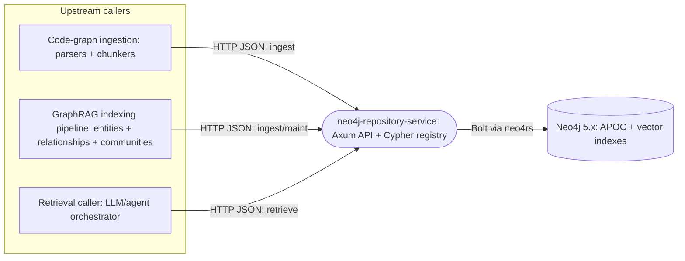
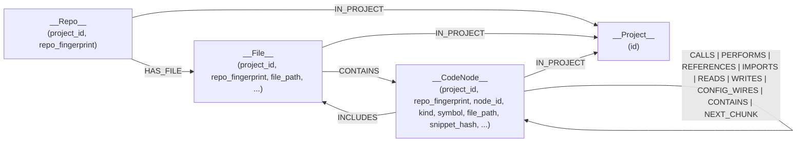
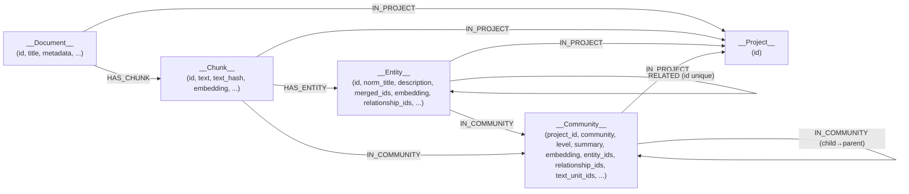
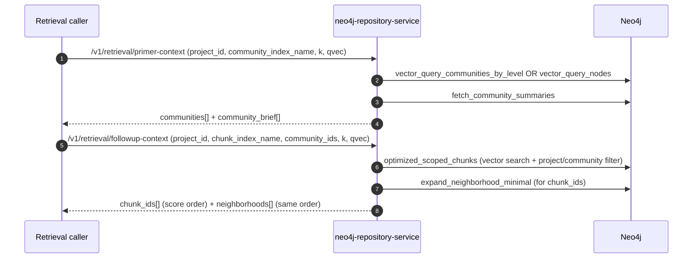

# neo4j-repository-service

A small Rust HTTP service that exposes **stable, typed endpoints** for:

- **Initializing Neo4j schema** (constraints + indexes) from versioned Cypher files
- **Ingesting a project-scoped code graph** (repos/files/code nodes + code relationships)
- **Ingesting a project-scoped requirements/GraphRAG graph** (documents/chunks/entities/communities + embeddings + maintenance)
- **Retrieving context by walking the requirements graph** (vector search → scoped chunks → neighborhood expansion)

This service is intentionally “thin”: most domain behavior lives in the `.cypher` files under `queries/`.

---

## Purpose

The surrounding system (ingestion pipelines + retrieval workflows) needs a single place to:

- execute known-good Cypher scripts with consistent scoping rules
- avoid embedding Neo4j and Cypher details in multiple services
- keep the graph schema and query logic versioned alongside code (in this repo)

It also provides a guarded “escape hatch” endpoint for executing registered queries by key (disabled by default).

**Important:** this service does **not** run community detection itself. Community detection (and the resulting
`communities.parquet` + `community_reports.parquet`) is produced upstream by `neo4j_ingestion_service`’s GraphRAG run.
This service persists those outputs and builds the operational graph shape needed for DRIFT/retrieval via backfills.

---

## High-level architecture (place in the system)

At a high level, this service sits between other system components and Neo4j:



Key properties of this placement:

- **Query-driven**: the executable behavior is defined by `queries/**/*.cypher`.
- **Project isolation**: both graph models are designed to be **project-scoped**, so multiple projects can co-exist in one Neo4j DB safely.

---

## Low-level architecture (internals)

### Runtime building blocks

- **`Config`** (`src/config.rs`): reads env vars for bind/Neo4j connection config. The queries directory is intentionally fixed to `/app/queries` (container layout).
- **`QueryRegistry`** (`src/queries.rs`): loads all `*.cypher` files under the queries directory and exposes them by a stable key:
  - key = relative path without `.cypher`
  - separators normalized to `/`
  - example: `requirements_graph/retrieval/expand_neighborhood_minimal`
- **`Neo4jExecutor` trait** (`src/executor.rs`): abstraction for “execute write” and “execute read rows”.
- **`Neo4rsExecutor`** (`src/executor.rs` + `src/neo4j.rs`): `neo4rs::Graph` backed implementation.
- **HTTP router** (`src/http.rs`): wires endpoints to typed handlers. Also:
  - includes `TraceLayer` + request id + gzip compression
  - enforces a **4 MiB** request body limit (vectors/neighborhoods can be large)
- **Handler helpers** (`src/api/cypher.rs`): shared wrappers for “query rows”, “first row”, “count”, and “exec write”.

### Feature/API surface (by endpoint family)

#### Schema / maintenance

- `POST /v1/maintenance/init-schema`
  - executes **every** query whose key starts with `schema/` in sorted order
  - schema is expected to be Neo4j 5.x compatible (constraints, indexes, vector indexes)

#### Health

- `GET /health`
- `GET /health/neo4j`
  - runs a Neo4j connectivity check
  - additionally runs `SHOW INDEXES ...` and returns an index health summary (vector index population is treated as “not OK” until 100%)

#### Code graph ingestion (project-centric isolated code graph)

- `POST /v1/code-graph/merge-project`
- `POST /v1/code-graph/merge-repo`
- `POST /v1/code-graph/merge-files`
- `POST /v1/code-graph/merge-code-graph`
  - accepts a single payload containing both `nodes` and `edges`
  - edges are grouped by `rel_type` (validated by `CodeRelType`):
    `calls|performs|references|imports|includes|reads|writes|config_wires|contains|next_chunk`

These endpoints are built to accept **bulk rows** and rely on `UNWIND $rows ...` Cypher patterns for throughput.

#### Requirements/GraphRAG ingestion + maintenance

Merge:

- `POST /v1/requirements-graph/merge/documents`
- `POST /v1/requirements-graph/merge/chunks`
- `POST /v1/requirements-graph/merge/entities`
- `POST /v1/requirements-graph/merge/relationships`
- `POST /v1/requirements-graph/merge/community-reports`
- `POST /v1/requirements-graph/merge/communities`

Embeddings:

- `POST /v1/requirements-graph/embeddings/chunk-text`
- `POST /v1/requirements-graph/embeddings/entity-description`
- `POST /v1/requirements-graph/embeddings/community-full-content`

Maintenance/validation:

- `POST /v1/requirements-graph/backfill/entity-relationship-ids`
- `POST /v1/requirements-graph/backfill/community-membership`
- `POST /v1/requirements-graph/backfill/community-ids`
- `POST /v1/requirements-graph/backfill/community-hierarchy`
- `POST /v1/requirements-graph/validate/embeddings`
- `POST /v1/requirements-graph/validate/relationships`
- `POST /v1/requirements-graph/cleanup/duplicate-relationships`
- `POST /v1/requirements-graph/detect/orphaned-nodes`
- `POST /v1/requirements-graph/cleanup/orphaned-nodes`
- `POST /v1/requirements-graph/sync/entity-relationship-ids`

#### Retrieval (“walking through the graph”)

Vector search:

- `POST /v1/retrieval/vector/communities`
- `POST /v1/retrieval/vector/communities-by-level`
- `POST /v1/retrieval/communities/max-level`
- `POST /v1/retrieval/communities/summaries`

Scoped chunk search + neighborhood expansion:

- `POST /v1/retrieval/chunks/scoped`
- `POST /v1/retrieval/chunks/neighborhood-minimal`

High-level convenience composition:

- `POST /v1/retrieval/primer-context`
- `POST /v1/retrieval/followup-context`

---

## Tech stack and libraries

- **Rust**: edition **2024**
- **HTTP server**: `axum` + `tower` + `tower-http` (trace, gzip, request-id, body limit)
- **Async runtime**: `tokio` (multi-thread)
- **Neo4j driver**: `neo4rs` (Bolt)
- **Serialization**: `serde`, `serde_json`
- **Errors**: `thiserror`, `anyhow`
- **Observability**: `tracing`, `tracing-subscriber`
- **IDs**: `uuid` (mostly for tests/temp dirs)
- **Neo4j capabilities required**:
  - **APOC** (`apoc.create.addLabels`, `apoc.util.sha256`)
  - **Vector index queries** (`db.index.vector.queryNodes`)

---

## Graph structure (Mermaid)

### Code graph (project-centric isolated code graph)

This graph is scoped by `(project_id, repo_fingerprint, …)` on most nodes and relationships.

- `__Project__`: `{ id }`
- `__Repo__`: `{ project_id, repo_fingerprint }`
- `__File__`: `{ project_id, repo_fingerprint, file_path, sha256, language, line_count }`
- `__CodeNode__`: `{ project_id, repo_fingerprint, node_id, ...props }`

Relationships (all include `project_id` + `repo_fingerprint` and typically carry `{confidence, metadata}`):

- `(__Repo__) -[:IN_PROJECT]-> (__Project__)`
- `(__Repo__) -[:HAS_FILE]-> (__File__)`
- `(__File__) -[:IN_PROJECT]-> (__Project__)`
- `(__File__) -[:CONTAINS]-> (__CodeNode__)`
- `(__CodeNode__) -[:IN_PROJECT]-> (__Project__)`
- Between code nodes:
  - `CALLS`, `PERFORMS`, `REFERENCES`, `IMPORTS`, `READS`, `WRITES`, `CONFIG_WIRES`, `CONTAINS`, `NEXT_CHUNK`
- Cross type:
  - `(__CodeNode__) -[:INCLUDES]-> (__File__)` (note: INCLUDES targets a file path)



Notes:

- `merge_code_nodes_apoc.cypher` dynamically adds extra labels via `apoc.create.addLabels(n, row.extra_labels)`. This allows modeling language-specific node kinds without changing the base label (`__CodeNode__`).
- Indexes are optimized for scoped lookups (`project_id`, `repo_fingerprint`) + one discriminator field (`symbol`, `kind`, `file_path`, `snippet_hash`).

### Requirements/GraphRAG graph (project-centric isolated requirements graph)

Core nodes:

- `__Project__`: `{ id }`
- `__Document__`: `{ id, title, project_id, metadata, ... }`
- `__Chunk__`: `{ id, text, text_hash, embedding, project_id, document_ids, ... }`
- `__Entity__`: `{ id, title, norm_title, description, merged_ids, embedding, relationship_ids, project_id, ... }`
- `__Community__`: `{ project_id, community, id, level, summary, full_content, embedding, entity_ids, relationship_ids, text_unit_ids, ... }`

Core relationships:

- `(__Document__) -[:IN_PROJECT]-> (__Project__)`
- `(__Chunk__) -[:IN_PROJECT]-> (__Project__)`
- `(__Entity__) -[:IN_PROJECT]-> (__Project__)`
- `(__Community__) -[:IN_PROJECT]-> (__Project__)`
- `(__Document__) -[:HAS_CHUNK]-> (__Chunk__)`
- `(__Chunk__) -[:HAS_ENTITY]-> (__Entity__)`
- `(__Entity__) -[:RELATED {id, ...}]-> (__Entity__)`
- `(__Entity__) -[:IN_COMMUNITY]-> (__Community__)`
- `(__Chunk__) -[:IN_COMMUNITY]-> (__Community__)`
- Community hierarchy:
  - `(__Community__) -[:IN_COMMUNITY]-> (__Community__)` (child → parent), created by `backfill_community_hierarchy.cypher`



---

## How retrieval “walks” the requirements graph

The retrieval path is implemented by combining Cypher queries:

1) **Find relevant communities** using vector search against community embeddings:
   - `requirements_graph/retrieval/vector_query_communities_by_level.cypher`
   - with fallback to `requirements_graph/retrieval/vector_query_nodes.cypher` if there is no level hierarchy

2) **Scope chunk vector search to those communities**:
   - `requirements_graph/retrieval/optimized_scoped_chunks.cypher`
   - calls `db.index.vector.queryNodes(chunkIndex, limit * 20, qvec)` once, then filters to:
     - chunks in the project
     - chunks with `(:__Chunk__)-[:IN_COMMUNITY]->(:__Community__)` where community is in `cids`

3) **Expand neighborhoods around selected chunks** (bounded fanout, minimal payload):
   - `requirements_graph/retrieval/expand_neighborhood_minimal.cypher`
   - for each chunk id:
     - fetch document title
     - fetch up to 2 “neighbor” entities directly in the chunk
     - traverse `RELATED` edges to gather up to 3 related entities and up to 5 relationship descriptors
     - jump to up to 3 “neighbor chunk ids” that contain those related entities



Safety limits in the HTTP layer / handlers:

- request body capped at **4 MiB**
- neighborhood expansion caps chunk_ids to **50**
- neighborhood query caps returned collections with `[0..N]` slices in Cypher

---

## Startup and developer information

### Run locally (Rust)

From `services/neo4j_repository_service/`:

```bash
cargo run
```

The service binds to `BIND_HOST:API_PORT` (defaults `0.0.0.0:8080`).

### Run in Docker

Build:

```bash
docker build -t neo4j-repository-service .
```

Run (example):

```bash
docker run --rm -p 8080:8080 ^
  -e NEO4J_URI=bolt://localhost:7687 ^
  -e NEO4J_USERNAME=neo4j ^
  -e NEO4J_PASSWORD=neo4j123 ^
  -e NEO4J_DATABASE=neo4j ^
  neo4j-repository-service
```

Then initialize schema:

```bash
curl -X POST http://localhost:8080/v1/maintenance/init-schema
```

### Environment variables

HTTP:

- `API_PORT` (default `8080`)
- `BIND_HOST` (default `0.0.0.0`)
- `RUST_LOG` (suggested: `info,tower_http=info`)

Neo4j:

- `NEO4J_URI` (default `bolt://neo4j:7687`)
- `NEO4J_USERNAME` (default `neo4j`)
- `NEO4J_PASSWORD` (default `neo4j123`)
- `NEO4J_DATABASE` (default `neo4j`)
- `NEO4J_MAX_CONNECTION_POOL_SIZE` (default `50`)
- `NEO4J_CONNECT_TIMEOUT_MS` (default `30000`)

Feature flags:

- `NEO4J_REPOSITORY_ENABLE_UNSAFE_ENDPOINTS`
  - if `1` or `true`, enables:
    - `GET /v1/unsafe/queries`
    - `POST /v1/unsafe/execute/{key}`
    - `POST /v1/unsafe/query/{key}`

Embedding validation:

- `VECTOR_INDEX_DIMENSIONS` (default `3072`)
  - used by `POST /v1/requirements-graph/validate/embeddings`
  - note: the vector index definitions in `queries/schema/graphrag/index_vector_*.cypher` are currently created with `3072` dimensions

### Tests

Unit-style router tests use a mock executor and do not require Neo4j.

Integration smoke test requires env vars:

- `NEO4J_TEST_URI`
- `NEO4J_TEST_USERNAME`
- `NEO4J_TEST_PASSWORD`
- `NEO4J_TEST_DATABASE` (optional; default `neo4j`)

Run:

```bash
cargo test
```


