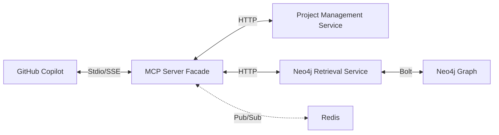
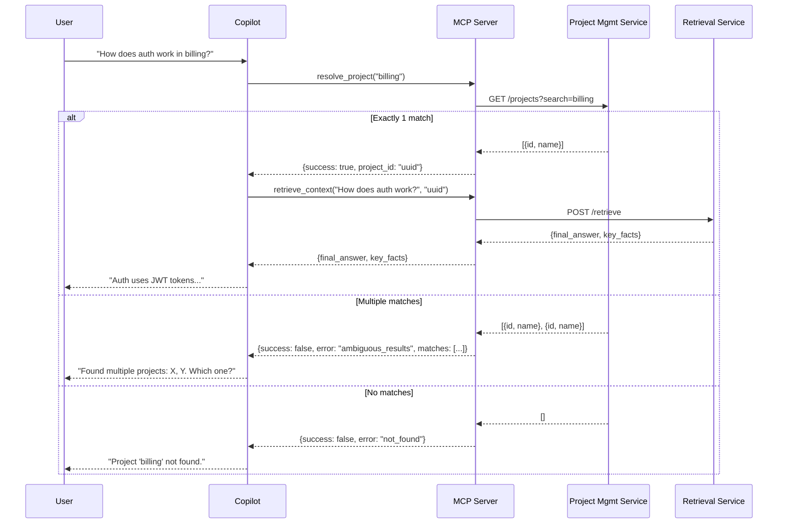

# Neo4j Retrieval MCP Server

A lightweight MCP (Model Context Protocol) facade that enables GitHub Copilot to access the knowledge graph via `neo4j_retrieval_service`.

It translates MCP protocol requests into HTTP calls to upstream microservices, providing no business logic of its own.

## Architecture



- **Role:** Stateless Proxy
- **Upstream Services:**
  - `project_management_service` - Project resolution
  - `neo4j_retrieval_service` - DRIFT search
- **Tools Provided:** 2 (+ health_check utility)

## MCP Tools

### 1. resolve_project

Resolves a natural language project name to a system UUID via Project Management Service.

**Use Case:** Copilot calls this tool with `"billing system"` to get the technical ID required for retrieval.

**Signature:**
```python
@mcp.tool()
async def resolve_project(project_name: str) -> dict:
    """
    Resolve a project name to a specific Project UUID.
    
    Args:
        project_name: Name of the project (e.g., "billing", "risk analytics")
        
    Returns:
        # Success (exactly one match):
        {
            "success": "boolean",        // true
            "project_id": "uuid_string",
            "project_name": "string"     // Official name
        }
        
        # Ambiguous (multiple matches):
        {
            "success": "boolean",        // false
            "error": "ambiguous_results",
            "message": "string",         // User-friendly message
            "matches": [
                {
                    "project_id": "uuid_string",
                    "project_name": "string"
                }
            ]
        }
        
        # Not found (zero matches):
        {
            "success": "boolean",        // false
            "error": "not_found",
            "message": "string"          // User-friendly message
        }
    """
```

**Implementation Mapping:**
Proxies to `GET http://project_management_service:8000/projects?search={project_name}`

**Behavior:**
- **1 match:** Returns `success=true` with `project_id`
- **Multiple matches:** Returns `success=false` with `error=ambiguous_results` and list of matches
- **0 matches:** Returns `success=false` with `error=not_found`

**Important:** Copilot must check `success` field before proceeding to `retrieve_context`. On failure, display `message` to user for clarification.

### 2. retrieve_context

Retrieves technical context, requirements, and citations using DRIFT search.

**Use Case:** Copilot calls this tool with a technical question and `project_id` (obtained from `resolve_project`).

**Signature:**
```python
@mcp.tool()
async def retrieve_context(
    query: str,
    project_id: str,
    top_k: int = 5
) -> dict:
    """
    Retrieve context from the Knowledge Graph using DRIFT search.
    
    Args:
        query: The technical question to answer
        project_id: The UUID returned by resolve_project (REQUIRED)
        top_k: Number of results (default: 5)
        
    Returns:
        {
            "final_answer": "string",
            "key_facts": [
                {
                    "fact": "string",
                    "citations": [
                        {
                            "chunk_id": "uuid_string",
                            "document_name": "string",
                            "span": "string"
                        }
                    ]
                }
            ],
            "residual_uncertainty": "string",
            "no_data_found": "boolean"
        }
    """
```

**Implementation Mapping:**
Proxies to `POST http://neo4j_retrieval_service:8000/retrieve`

## Redis Progress Listening

The MCP server subscribes to Redis pub/sub channel `ui:retrieval_progress` to receive real-time progress updates from the retrieval service during DRIFT search operations.

**Progress Message Schema:**
```json
{
  "message_type": "retrieval_progress",
  "project_id": "uuid_string",
  "retrieval_id": "uuid_string",
  "phase": "string",       // 'initializing' | 'expanding_query' | 'retrieving_communities' | ...
  "progress_pct": "integer", // 0-100
  "thought_summary": "string",
  "details_md": "string",    // Optional markdown
  "timestamp": "iso8601_string"
}
```

This enables the server to republish progress updates to MCP clients (Copilot) for enhanced user experience during slow searches.

## Copilot Workflow



## Configuration

### Shared Library Integration

This service reuses configurations from the `shared` library:
- **HTTP Client Settings** (`HTTPClientSettings`): Service URLs, timeouts, retry configuration
- **Redis Settings** (`RedisSettings`): Connection URL, pool size, pub/sub configuration  
- **Logging** (`configure_logging`): Structured JSON logging with sensitive data filtering
- **Constants** (`streams.py`): Redis channel names like `UI_RETRIEVAL_PROGRESS_CHANNEL`

### Environment Variables

Most configuration comes from `docker-compose.env` via the shared library. MCP-specific settings:

```bash
# MCP-specific (not in shared config)
PORT=8082                  # HTTP server port
MCP_TRANSPORT=stdio        # Transport mode: 'stdio' or 'http'

# From shared HTTPClientSettings (in docker-compose.env)
PROJECT_MANAGEMENT_SERVICE_URL=http://project-management-service:8000
GRAPH_RAG_SERVICE_URL=http://neo4j-retrieval-service:8000
HTTP_CONNECTION_TIMEOUT=30.0
HTTP_READ_TIMEOUT=180.0
HTTP_MAX_RETRIES=3

# From shared RedisSettings (in docker-compose.env)
REDIS_URL=redis://redis:6379
REDIS_DB=0
REDIS_MAX_CONNECTIONS=10
```

## GitHub Copilot Integration

This section provides step-by-step instructions for integrating the MCP server with GitHub Copilot in VS Code.

### Prerequisites

1. **VS Code** with GitHub Copilot extension installed
2. **Docker** installed and running
3. **Backend services running** (via docker-compose or locally):
   - `project-management-service` (port 8003)
   - `neo4j-retrieval-service` (port 8008)
   - `redis` (port 6379)

### Step 1: Build the MCP Server Docker Image

From the `playground/git-epic-creator` directory:

```bash
# Build all services including the MCP server
docker-compose build neo4j-retrieval-mcp-server

# Or build standalone (from services directory)
cd services
docker build -t neo4j_retrieval_mcp_server -f ./neo4j_retrieval_mcp_server/Dockerfile .
```

### Step 2: Verify Backend Services Are Running

Ensure the docker-compose stack is running:

```bash
# Start all services
docker-compose up -d

# Verify services are healthy
docker-compose ps

# Check specific service health
curl http://localhost:8003/health  # project-management-service
curl http://localhost:8008/health  # neo4j-retrieval-service
```

### Step 3: Configure VS Code MCP Settings

Open VS Code settings and add the MCP server configuration.

#### Option A: Using settings.json (Recommended)

1. Open VS Code Command Palette (`Ctrl+Shift+P` / `Cmd+Shift+P`)
2. Type "Preferences: Open User Settings (JSON)"
3. Add the MCP configuration:

**For Windows:**
```json
{
  "github.copilot.chat.mcpServers": {
    "neo4j-retrieval": {
      "command": "docker",
      "args": [
        "run",
        "-i",
        "--rm",
        "--network", "git_epic_creator_network",
        "-e", "PROJECT_MANAGEMENT_SERVICE_URL=http://project-management-service:8000",
        "-e", "GRAPH_RAG_SERVICE_URL=http://neo4j-retrieval-service:8000",
        "-e", "REDIS_URL=redis://redis:6379",
        "neo4j_retrieval_mcp_server"
      ]
    }
  }
}
```

**For macOS/Linux with host network:**
```json
{
  "github.copilot.chat.mcpServers": {
    "neo4j-retrieval": {
      "command": "docker",
      "args": [
        "run",
        "-i",
        "--rm",
        "--network", "host",
        "-e", "PROJECT_MANAGEMENT_SERVICE_URL=http://localhost:8003",
        "-e", "GRAPH_RAG_SERVICE_URL=http://localhost:8008",
        "-e", "REDIS_URL=redis://localhost:6379",
        "neo4j_retrieval_mcp_server"
      ]
    }
  }
}
```

**For Windows/macOS using host.docker.internal:**
```json
{
  "github.copilot.chat.mcpServers": {
    "neo4j-retrieval": {
      "command": "docker",
      "args": [
        "run",
        "-i",
        "--rm",
        "-e", "PROJECT_MANAGEMENT_SERVICE_URL=http://host.docker.internal:8003",
        "-e", "GRAPH_RAG_SERVICE_URL=http://host.docker.internal:8008",
        "-e", "REDIS_URL=redis://host.docker.internal:6379",
        "neo4j_retrieval_mcp_server"
      ]
    }
  }
}
```

#### Option B: Using Workspace Settings

Create `.vscode/settings.json` in your workspace:

```json
{
  "github.copilot.chat.mcpServers": {
    "neo4j-retrieval": {
      "command": "docker",
      "args": [
        "run",
        "-i",
        "--rm",
        "--network", "git_epic_creator_network",
        "-e", "PROJECT_MANAGEMENT_SERVICE_URL=http://project-management-service:8000",
        "-e", "GRAPH_RAG_SERVICE_URL=http://neo4j-retrieval-service:8000",
        "-e", "REDIS_URL=redis://redis:6379",
        "neo4j_retrieval_mcp_server"
      ]
    }
  }
}
```

### Step 4: Restart VS Code

After adding the configuration:
1. Close VS Code completely
2. Reopen VS Code
3. Open Copilot Chat (`Ctrl+Shift+I` / `Cmd+Shift+I`)

### Step 5: Verify MCP Server is Connected

In Copilot Chat, you should see the MCP tools available. Test by asking:

```
@neo4j-retrieval What projects are available?
```

Or directly use the tools:
```
Use the resolve_project tool to find "billing"
```

### Troubleshooting

#### MCP Server Not Appearing in Copilot

1. **Check Docker is running:**
   ```bash
   docker ps
   ```

2. **Test the MCP server manually:**
   ```bash
   # Run interactively to see any errors
   docker run -it --rm \
     --network git_epic_creator_network \
     -e PROJECT_MANAGEMENT_SERVICE_URL=http://project-management-service:8000 \
     -e GRAPH_RAG_SERVICE_URL=http://neo4j-retrieval-service:8000 \
     neo4j_retrieval_mcp_server
   ```

3. **Check VS Code Output:**
   - Open Output panel (`Ctrl+Shift+U`)
   - Select "GitHub Copilot Chat" from dropdown
   - Look for MCP-related errors

#### Connection Refused Errors

1. **Verify network connectivity:**
   ```bash
   # List Docker networks
   docker network ls
   
   # Inspect the network
   docker network inspect git_epic_creator_network
   ```

2. **Check service health:**
   ```bash
   # From within the Docker network
   docker run --rm --network git_epic_creator_network curlimages/curl \
     curl -f http://project-management-service:8000/health
   ```

#### Authentication Errors

The MCP server currently doesn't pass authentication tokens. Ensure your services allow unauthenticated access for development, or configure appropriate service accounts.

### Local Development (Without Docker)

For development without Docker:

```json
{
  "github.copilot.chat.mcpServers": {
    "neo4j-retrieval": {
      "command": "python",
      "args": ["-m", "main"],
      "cwd": "${workspaceFolder}/services/neo4j_retrieval_mcp_server/src",
      "env": {
        "PYTHONPATH": "${workspaceFolder}/services/neo4j_retrieval_mcp_server/src:${workspaceFolder}/services/shared/src",
        "PROJECT_MANAGEMENT_SERVICE_URL": "http://localhost:8003",
        "GRAPH_RAG_SERVICE_URL": "http://localhost:8008",
        "REDIS_URL": "redis://localhost:6379"
      }
    }
  }
}
```

### Example Copilot Conversations

Once connected, you can ask Copilot questions like:

```
# Find a project
@neo4j-retrieval Find the billing project

# Query the knowledge graph
@neo4j-retrieval How does authentication work in the billing system?

# Technical questions
@neo4j-retrieval What are the main API endpoints in the risk analytics project?

# Architecture questions  
@neo4j-retrieval Explain the data flow for payment processing
```

Copilot will automatically:
1. Call `resolve_project` to get the project UUID
2. Call `retrieve_context` with your question
3. Synthesize the response with citations from the knowledge graph

## Health Check

### health_check Tool

Returns service health and upstream dependency status.

**Response Schema:**
```json
{
  "status": "string",                      // 'healthy' | 'degraded'
  "upstream": {
    "project_management_service": "string", // 'connected' | 'disconnected'
    "retrieval_service": "string"           // 'connected' | 'disconnected'
  }
}
```

## Development

### Directory Structure
```
src/
├── main.py               # FastMCP entrypoint with tools
├── adapter.py            # HTTP Clients (reuses shared patterns)
└── config.py             # Settings (extends shared configurations)
tests/
├── __init__.py
└── test_mcp_tools.py     # Tool tests
```

### Dependencies

This service depends on the `shared` library (same as all other services):
- `shared @ file:../shared` in pyproject.toml
- Dockerfile copies and installs shared before service dependencies

### Prerequisites
Both `project_management_service` and `neo4j_retrieval_service` must be running. This server contains **no** database drivers or LLM clients; it is strictly a protocol translator.

### Running Locally

```bash
# Install shared library first
cd ../shared && pip install -e . && cd ../neo4j_retrieval_mcp_server

# Install service dependencies
pip install -e .

# Run with stdio transport (default)
python -m main

# Run with HTTP transport
python -m main --http
# or
MCP_TRANSPORT=http python -m main
```

### Running Tests

```bash
# Install dev dependencies
pip install -e ".[dev]"

# Run tests
pytest tests/
```

## Docker

### Build

```bash
docker build -t neo4j_retrieval_mcp_server -f ./neo4j_retrieval_mcp_server/Dockerfile ./services
```

### Run with HTTP Transport

```bash
docker run -p 8082:8082 \
  -e MCP_TRANSPORT=http \
  -e PROJECT_MANAGEMENT_SERVICE_URL=http://host.docker.internal:8003 \
  -e RETRIEVAL_SERVICE_URL=http://host.docker.internal:8008 \
  neo4j_retrieval_mcp_server
```

### Run with Stdio Transport (for Copilot)

```bash
docker run -i --rm \
  -e PROJECT_MANAGEMENT_SERVICE_URL=http://host.docker.internal:8003 \
  -e RETRIEVAL_SERVICE_URL=http://host.docker.internal:8008 \
  neo4j_retrieval_mcp_server
```
