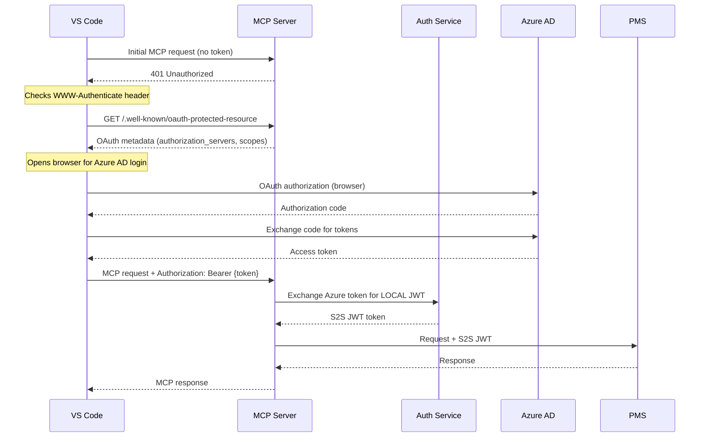

# Neo4j Retrieval MCP Server

A lightweight MCP (Model Context Protocol) server that enables GitHub Copilot to access the knowledge graph via `neo4j_retrieval_service`.

It translates MCP protocol requests into HTTP calls to upstream microservices, providing no business logic of its own.

## Architecture


- **Role:** Stateless Protocol Translator with OAuth Authentication
- **Authentication:** OAuth 2.0 via VS Code built-in client + token exchange via authentication-service
- **Upstream Services:**
  - `authentication-service` - OAuth token exchange, S2S JWT minting
  - `project_management_service` - Project resolution
  - `neo4j_retrieval_service` - DRIFT search
- **Tools Provided:** 2 (+ health_check utility)

## VS Code Copilot Integration

This MCP server is designed to work with GitHub Copilot in VS Code using VS Code's **built-in OAuth MCP client**. No custom extension is required.

### How It Works: OAuth Discovery Flow

VS Code's MCP client handles the entire OAuth flow automatically using OAuth 2.0 Protected Resource Metadata (RFC 9728):



### Step 1: Configure VS Code settings and MCP server configuration

#### 1.1 Enable MCP Gallery in VS Code

- Open VS Code
- Preferences: Open User Settings (JSON)
- Add the following setting:

```json
{
  //other settings...
  "chat.mcp.gallery.enabled": true,
  //other settings...
}
```

#### 1.2 Create MCP server configuration file

- In your project root, create .vscode/mcp.json with:

```json
{
  "servers": {
    "neo4j-retrieval-mcp-server": {
      "type": "http",
      "url": "http://localhost:8082/mcp"
    }
  }
}
```
- Reload VS Code so MCP settings are applied.

### Step 2: Configure MCP Authetication integration with VS Code

#### 2.1 Automatic configuration (preferred) 

The MCP server exposes `/.well-known/oauth-protected-resource` which returns:
- `authorization_servers`: Azure AD authorization URL
- `scopes_supported`: Required OAuth scopes
- `bearer_methods_supported`: How to send the token (header)

#### 2.2 Local Development (Mock Auth Service)

For local development, you can use a mock auth service.

Add the following to the MCP server configuration file:

```json
{
  "servers": {
    "neo4j-retrieval": {
      "type": "http",
      "url": "http://localhost:8082/mcp",
      "authorization": {
        "type": "oauth2",
        "configuration": {
          "clientId": "00000000-0000-0000-0000-000000000001",
          "authorizationUrl": "https://localhost:8005/00000000-0000-0000-0000-000000000000/oauth2/v2.0/authorize",
          "tokenUrl": "https://localhost:8005/00000000-0000-0000-0000-000000000000/oauth2/v2.0/token",
          "scopes": ["api://00000000-0000-0000-0000-000000000001/user_impersonation"]
        }
      }
    }
  }
}
```

### Step 3: Use the MCP Tools

Once authenticated, you can use the MCP tools in Copilot Chat. For example:

```
@neo4j-retrieval-mcp-server Find the billing project

@neo4j-retrieval-mcp-server How does authentication work in the billing system?

@neo4j-retrieval-mcp-server What are the main API endpoints in the risk analytics project?
```

Copilot will automatically:
1. Call `resolve_project` to get the project UUID
2. Call `retrieve_context` with your question
3. Synthesize the response with citations from the knowledge graph

## Authentication Flow

### Unified Token Exchange

MCP Server uses the **same authentication mechanism** as UI Service. Both exchange Azure AD tokens for LOCAL JWTs via the same `/auth/exchange` endpoint:


This is the **SAME endpoint** used by UI Service. The same user authenticating via browser or VS Code gets the same LOCAL JWT format.

### Token Extraction Priority

The MCP server extracts Azure AD tokens in this order:

1. **HTTP Authorization Header** (preferred) - `Authorization: Bearer {token}`
2. **MCP Context client_params** (fallback for stdio transport)

If no token is found, HTTP 401 is returned to trigger the OAuth discovery flow.

## OAuth Discovery Endpoint

### GET /.well-known/oauth-protected-resource

Returns OAuth 2.0 Protected Resource Metadata (RFC 9728) for VS Code's OAuth discovery:

**Response:**
```json
{
  "resource": "http://localhost:8082/mcp",
  "authorization_servers": [
    "https://login.microsoftonline.com/{tenant-id}/v2.0"
  ],
  "bearer_methods_supported": ["header"],
  "scopes_supported": [
    "api://{client-id}/user_impersonation",
    "openid",
    "profile",
    "email"
  ],
  "resource_documentation": "https://github.com/your-org/neo4j-retrieval-mcp-server"
}
```

## MCP Tools

### 1. resolve_project

Resolves a natural language project name to a system UUID via Project Management Service.

**Use Case:** Copilot calls this tool with `"billing system"` to get the technical ID required for retrieval.

**Authentication:** Required (returns HTTP 401 with WWW-Authenticate header to trigger OAuth flow)

**Signature:**
```python
@mcp.tool()
async def resolve_project(project_name: str) -> dict:
    """
    Resolve a project name to a specific Project UUID.
    
    AUTHENTICATION REQUIRED: Returns HTTP 401 to trigger VS Code OAuth flow.
    
    Args:
        project_name: Name of the project (e.g., "billing", "risk analytics")
        
    Returns:
        # Success (exactly one match):
        {
            "success": true,
            "project_id": "uuid_string",
            "project_name": "string"
        }
        
        # Ambiguous (multiple matches):
        {
            "success": false,
            "error": "ambiguous_results",
            "message": "string",
            "matches": [{"project_id": "uuid", "project_name": "string"}]
        }
        
        # Not found:
        {
            "success": false,
            "error": "not_found",
            "message": "string"
        }
        
    Raises:
        HTTPException 401: When authentication is required.
            Includes WWW-Authenticate header pointing to OAuth discovery endpoint.
            This triggers VS Code's built-in OAuth flow.
    """
```

### 2. retrieve_context

Retrieves technical context, requirements, and citations using DRIFT search.

**Use Case:** Copilot calls this tool with a technical question and `project_id` (obtained from `resolve_project`).

**Authentication:** Required (returns HTTP 401 with WWW-Authenticate header to trigger OAuth flow)

**Signature:**
```python
@mcp.tool()
async def retrieve_context(
    query: str,
    project_id: str,
    top_k: int = 5
) -> dict:
    """
    Retrieve context from the Knowledge Graph using DRIFT search.
    
    AUTHENTICATION REQUIRED: Returns HTTP 401 to trigger VS Code OAuth flow.
    
    Args:
        query: The technical question to answer
        project_id: The UUID returned by resolve_project (REQUIRED)
        top_k: Number of results (default: 5)
        
    Returns:
        {
            "final_answer": "string",
            "key_facts": [
                {
                    "fact": "string",
                    "citations": [
                        {
                            "chunk_id": "uuid_string",
                            "document_name": "string",
                            "span": "string"
                        }
                    ]
                }
            ],
            "residual_uncertainty": "string",
            "no_data_found": "boolean"
        }
        
    Raises:
        HTTPException 401: When authentication is required.
            Includes WWW-Authenticate header pointing to OAuth discovery endpoint.
    """
```

## Copilot Workflow


## Configuration

### Environment Variables

```bash
# MCP Server Configuration
PORT=8082                      # HTTP server port
MCP_TRANSPORT=stdio            # Transport mode: 'stdio' or 'http'
MCP_SERVER_URL=http://localhost:8082  # Base URL for OAuth discovery

# Authentication Service
AUTH_SERVICE_URL=http://authentication-service:8020

# Upstream Services (from shared HTTPClientSettings)
PROJECT_MANAGEMENT_SERVICE_URL=http://project-management-service:8000
GRAPH_RAG_SERVICE_URL=http://neo4j-retrieval-service:8000

# HTTP Client Settings
HTTP_CONNECTION_TIMEOUT=30.0
HTTP_READ_TIMEOUT=180.0
HTTP_MAX_RETRIES=3

# Redis (for progress streaming)
REDIS_URL=redis://redis:6379
REDIS_DB=0

# Azure AD Configuration (for OAuth discovery metadata)
AZURE_AD_AUTHORITY=https://login.microsoftonline.com
AZURE_TENANT_ID=your-tenant-id
AZURE_CLIENT_ID=your-client-id
```

## Redis Progress Listening

The MCP server subscribes to Redis pub/sub channel `ui:retrieval_progress` to receive real-time progress updates from the retrieval service during DRIFT search operations.

**Progress Message Schema:**
```json
{
  "message_type": "retrieval_progress",
  "project_id": "uuid_string",
  "retrieval_id": "uuid_string",
  "phase": "string",
  "progress_pct": 0-100,
  "thought_summary": "string",
  "details_md": "string",
  "timestamp": "iso8601_string"
}
```

## Troubleshooting

### MCP Server Not Appearing in Copilot

1. **Check VS Code version**: Ensure you have the latest VS Code with MCP support
2. **Verify configuration**: Check `.vscode/mcp.json` syntax
3. **Reload VS Code**: Run "Developer: Reload Window"
4. **Check Output panel**: Look for MCP-related errors in "GitHub Copilot Chat"

### OAuth Discovery Not Working

```bash
# Test OAuth discovery endpoint
curl -v http://localhost:8082/.well-known/oauth-protected-resource

# Expected response:
{
  "resource": "http://localhost:8082/mcp",
  "authorization_servers": ["https://login.microsoftonline.com/.../v2.0"],
  "bearer_methods_supported": ["header"],
  "scopes_supported": [...]
}
```

### Authentication Errors

```bash
# Check authentication-service is running
curl http://localhost:8020/health

# Test token exchange (with a valid Azure token)
curl -X POST http://localhost:8020/auth/exchange \
  -H "Content-Type: application/json" \
  -d '{"access_token": "your-azure-token"}'
```

### Connection Refused Errors

```bash
# Verify Docker network
docker network ls
docker network inspect git_epic_creator_network

# Test service connectivity from within Docker
docker run --rm --network git_epic_creator_network curlimages/curl \
  curl -f http://authentication-service:8020/health
```

### OAuth Flow Not Working

1. **Check Azure AD configuration**: Verify client ID and tenant ID
2. **Check redirect URI**: Ensure `vscode://...` is registered in Azure AD app
3. **Check scopes**: Ensure API permissions are granted in Azure AD
4. **For mock auth**: Use `https://localhost:8005` and accept self-signed certificate

## Development

### Directory Structure
```
src/
├── main.py               # FastMCP entrypoint with tools + OAuth discovery
├── adapter.py            # HTTP Clients for upstream services
├── config.py             # Settings (extends shared configurations)
└── auth.py               # MCP authentication handler
tests/
├── __init__.py
└── test_mcp_tools.py     # Tool tests
```

### Running Locally

```bash
# Install shared library first
cd ../shared && pip install -e . && cd ../neo4j_retrieval_mcp_server

# Install service dependencies
pip install -e .

# Run with stdio transport (default, no OAuth)
python -m main

# Run with HTTP transport (with OAuth discovery)
MCP_TRANSPORT=http python -m main
```

### Running Tests

```bash
pip install -e ".[dev]"
pytest tests/
```

## Docker

### Build

```bash
docker build -t neo4j_retrieval_mcp_server -f ./neo4j_retrieval_mcp_server/Dockerfile ./services
```

### Run with HTTP Transport (OAuth enabled)

```bash
docker run -p 8082:8082 \
  -e MCP_TRANSPORT=http \
  -e MCP_SERVER_URL=http://localhost:8082 \
  -e AUTH_SERVICE_URL=http://host.docker.internal:8020 \
  -e PROJECT_MANAGEMENT_SERVICE_URL=http://host.docker.internal:8003 \
  -e GRAPH_RAG_SERVICE_URL=http://host.docker.internal:8008 \
  -e AZURE_TENANT_ID=your-tenant-id \
  -e AZURE_CLIENT_ID=your-client-id \
  neo4j_retrieval_mcp_server
```

### Run with Stdio Transport

```bash
docker run -i --rm \
  -e AUTH_SERVICE_URL=http://host.docker.internal:8020 \
  -e PROJECT_MANAGEMENT_SERVICE_URL=http://host.docker.internal:8003 \
  -e GRAPH_RAG_SERVICE_URL=http://host.docker.internal:8008 \
  neo4j_retrieval_mcp_server
```

Note: Azure AD authentication is required. For stdio transport, tokens can be passed via MCP context params.

## Health Check

### health_check Tool

Returns service health and upstream dependency status.

**Response Schema:**
```json
{
  "status": "healthy|degraded",
  "upstream": {
    "authentication_service": "connected|disconnected",
    "project_management_service": "connected|disconnected",
    "retrieval_service": "connected|disconnected"
  }
}
```

### HTTP Endpoint

```bash
curl http://localhost:8082/health
```

## Security Considerations

### Token Handling

- OAuth tokens from VS Code are **never stored** by the MCP server
- Tokens are exchanged immediately for LOCAL JWTs (1 hour TTL, same as other services)
- LOCAL JWTs are cached in-memory for performance (with 60s buffer before expiry)
- Azure AD authentication is REQUIRED - there is no service account fallback

### Production Checklist

- [ ] Use real Azure AD (not mock auth service)
- [ ] Configure proper OAuth redirect URIs in Azure AD
- [ ] Set `MCP_SERVER_URL` to the actual production URL
- [ ] Use HTTPS for MCP server (HTTP transport)
- [ ] Restrict network access to authentication-service
- [ ] Monitor token exchange logs for anomalies
