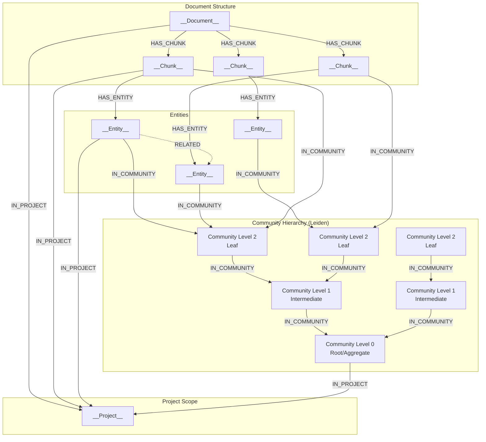

# Neo4j Retrieval Service (DRIFT Search)

A microservice providing **GraphRAG** capabilities using the **DRIFT Search** (Microsoft Research, 2024) algorithm on a Neo4j Knowledge Graph. It serves as the central knowledge retrieval engine for the AI Agent ecosystem.

## Service Overview

This service adapts Microsoft's DRIFT method to a hierarchical Neo4j graph (Leiden algorithm communities). It powers:
- **AI Requirements Service:** For getting requirements context for building new BRs FRs.
- **AI Tasks Service:** For grounding tasks in the actual technical requirements.
- **Neo4j Retrieval MCP Server:** For enriching developer context via GitHub Copilot integration (see `neo4j_retrieval_mcp_server`).

### MCP Server Integration

The `neo4j_retrieval_mcp_server` acts as a stateless facade that:
1. Proxies `retrieve_context` tool calls to `POST /retrieve`
2. Subscribes to Redis `ui:retrieval_progress` channel for progress updates
3. Enables GitHub Copilot to query the Knowledge Graph directly from the IDE

## 📡 API Interface

### GET /health
Health check endpoint for service monitoring.

**Response Schema:**
```json
{
  "status": "string",           // 'healthy' | 'degraded'
  "neo4j": "string",            // 'connected' | 'disconnected'
  "redis": "string"             // 'connected' | 'disconnected'
}
```

### GET /health/llm
Checks reachability of the configured OpenAI-compatible endpoint (`OAI_BASE_URL`).

### GET /health/ready
Aggregated readiness endpoint.

- Ready iff **Redis** is reachable (when enabled) and **LLM** endpoint is reachable.
- Returns **200** when ready, **503** when not ready.

### 1. POST /retrieve
The primary endpoint for all consumers (MCP, internal services).

**Request Schema:**
```json
{
  "query": "string",           // Natural language question
  "top_k": "integer",          // Default: 5
  "project_id": "uuid_string", // Target Project UUID
  "prompt_id": "string"        // Optional trace ID for UI
}
```

**Response Schema:**
```json
{
  "final_answer": "string",
  "key_facts": [
    {
      "fact": "string",
      "citations": [
        {
          "chunk_id": "uuid_string",
          "span": "string",          // Text excerpt
          "document_name": "string"  // File path or title
        }
      ]
    }
  ],
  "residual_uncertainty": "string",
  "no_data_found": "boolean"
}
```

**Note on `no_data_found`:** Returns `true` when:
- Project has no ingested data (graph empty for project_id)
- Project status is not `rag_ready` (ingestion in progress or failed)
- Query yielded no relevant results from DRIFT search

Callers should check this flag before using `final_answer`.

**Note:** Project name → UUID resolution is handled by `project_management_service`, not this service. The MCP Server calls Project Management Service first, then uses the resolved `project_id` to call this endpoint.

---

## ⚡ Real-time Progress Updates

The service publishes granular progress updates via **Redis Pub/Sub** to `ui:retrieval_progress`. This allows the UI to show "thoughts" while the slow DRIFT algorithm runs.

**Message Schema:**
```json
{
  "message_type": "retrieval_progress",
  "project_id": "uuid_string",
  "retrieval_id": "uuid_string",
  "phase": "string",       // 'initializing' | 'expanding_query' | 'retrieving_communities' | ...
  "progress_pct": "integer", // 0-100
  "thought_summary": "string",
  "details_md": "string",    // Optional markdown
  "timestamp": "iso8601_string"
}
```

---

## 🧠 DRIFT Search Architecture

The service implements a **Global-to-Local** search strategy:

### 1. Graph Schema (Leiden Hierarchy)



**Cypher Schema:**
```cypher
(:__Document__)-[:HAS_CHUNK]->(:__Chunk__)
(:__Chunk__)-[:HAS_ENTITY]->(:__Entity__)
(:__Entity__)-[:IN_COMMUNITY]->(:__Community__ {level: 2})  // Leaf level
(:__Community__ {level: 2})-[:IN_COMMUNITY]->(:__Community__ {level: 1})
(:__Community__ {level: 1})-[:IN_COMMUNITY]->(:__Community__ {level: 0})  // Root
(Node)-[:IN_PROJECT]->(:__Project__)  // All nodes scoped to project
```

**Hierarchy Levels:**
- **Level 0:** Root/aggregate communities (broadest summaries, queried first by DRIFT)
- **Level 1:** Intermediate communities
- **Level N:** Leaf communities (most granular)

- **Communities:** Summaries of code clusters at different levels of abstraction.
- **Chunks:** Actual source code segments with embeddings.

### 2. Algorithm Phases
1.  **Primer Phase (Global):**
    - Uses **HyDE** to hallucinate a hypothetical answer.
    - Vector searches top-level **Community Summaries** (not raw code).
    - LLM generates "Follow-up Questions" based on these summaries.

2.  **Follow-up Phase (Local):**
    - For each follow-up question, searches specific **Chunks** within relevant communities.
    - Performs **Neighborhood Expansion** (1-hop graph traversal) to find related entities.
    - Iterates 2 times (configurable).

3.  **Aggregation Phase:**
    - Synthesizes all partial answers into a final response.
    - Deduplicates and formats citations.

---

## ⚙️ Configuration

### Environment Variables

```bash
# Service Identity
PORT=8080
LOG_LEVEL=INFO

# Neo4j Connection
NEO4J_URI=bolt://neo4j:7687
NEO4J_USERNAME=neo4j
NEO4J_PASSWORD=password

NEO4J_REPOSITORY_SERVICE_URL=http://neo4j-repository-service:8080

# Azure OpenAI (Required for Embeddings & Chat)
OAI_BASE_URL=https://your-resource.openai.azure.com/
OAI_KEY=your-key
OAI_MODEL_FAST=gpt-4o-mini              # For routing & simple tasks
OAI_MODEL=gpt-4o                        # For complex aggregation
OAI_EMBED_MODEL_NAME=text-embedding-3-small

# Search Parameters
VECTOR_INDEX_DIMENSIONS=3072            # Must match embedding model
DRIFT_MAX_ITERATIONS=2                  # Max follow-up loops
```

### Dependencies
- `langgraph`: Orchestrates the cyclic state machine.
- `neo4j_repository_service`: Rust Neo4j gateway (all graph reads happen over HTTP).
- `redis`: For real-time status publishing.
- `shared`: Internal library for logging and auth.

## 🛠️ Development

```bash
# Install dependencies
pip install -e .[dev]

# Run locally
python -m src.main
```

## 🧪 Testing

The test suite mocks Neo4j and OpenAI to verify the LangGraph state machine logic.

```bash
# Run tests
pytest tests/
```
