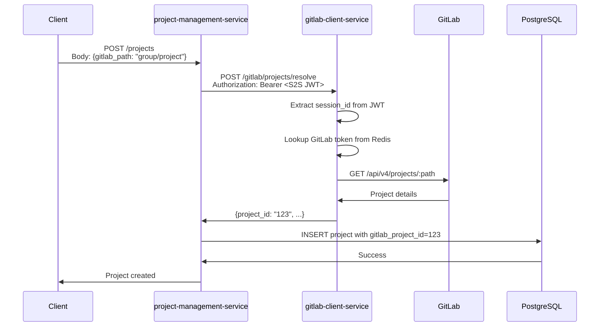

# Project Management Service

A FastAPI microservice for managing projects in the Agentic AI Requirements Engineering System.

## Features

- Project CRUD operations with Azure AD authentication
- Role-based access control (Admin, Project Manager, Contributor)
- Project member management
- PostgreSQL integration with connection pooling
- GitLab project path resolution via gitlab-client-service
- Comprehensive API documentation

## API Endpoints

- `GET /projects` - List projects (filtered by user access)
- `POST /projects` - Create new project (Admin only)
- `GET /projects/{project_id}` - Get project details
- `PUT /projects/{project_id}` - Update project
- `DELETE /projects/{project_id}` - Delete project (Admin only)
- `GET /projects/{project_id}/members` - List project members
- `POST /projects/{project_id}/members` - Add project member
- `DELETE /projects/{project_id}/members/{user_id}` - Remove project member

## Authentication

All endpoints require Azure AD authentication. Role-based access control is enforced based on Azure AD groups.

## GitLab Integration

Project management service integrates with GitLab for project path resolution. All GitLab interactions are delegated to gitlab-client-service via HTTP.

### Project Resolution Flow

When creating or updating a project with `gitlab_path`, the service resolves the path to a numeric GitLab project ID:



### GitLab Fields in Project Model

```python
class Project(Base):
    gitlab_path: Optional[str]                 # User-provided path: "namespace/project"
    gitlab_project_id: Optional[str]           # Resolved numeric ID: "123"
    gitlab_repository_url: Optional[str]       # Full URL (optional)
```

**Resolution Logic:**
- If `gitlab_path` provided during create/update → resolve to `gitlab_project_id`
- If path changes during update → re-resolve project ID
- If resolution fails → log warning, continue without GitLab ID
- GitLab integration is optional and does not block project operations

### HTTP Resilience and Retry Policy

The service uses shared HTTP client configuration from the `shared` library for all external HTTP calls. This ensures consistent retry behavior across services.

**Retry Strategy:**
- **Retries**: Transient failures only (connection errors, timeouts, 5xx server errors)
- **Fails fast**: Client errors (4xx) including 401 (auth) and 404 (not found)
- **Backoff**: Exponential backoff with configurable multiplier
- **Max attempts**: Configurable via `HTTP_MAX_RETRIES` (default: 3)

**Retryable Failures:**
- Network connection errors (`httpx.ConnectError`)
- Request timeouts (`httpx.TimeoutException`)
- Server errors (HTTP 500-599)

**Non-Retryable Failures:**
- Client errors (HTTP 400-499) - fail immediately for faster error handling
- Authentication failures (401) - retry won't help without valid credentials
- Not found errors (404) - resource doesn't exist

### Configuration

The service uses shared HTTP client configuration from environment variables:

```env
# Service URL
GITLAB_CLIENT_SERVICE_URL="http://gitlab-client-service:8011"

# Timeout settings
HTTP_CONNECTION_TIMEOUT=30.0  # Connection timeout in seconds
HTTP_READ_TIMEOUT=180.0       # Read timeout in seconds (for long operations)

# Retry settings
HTTP_MAX_RETRIES=3            # Maximum retry attempts
HTTP_RETRY_BACKOFF_FACTOR=2.0 # Exponential backoff multiplier

# Connection pooling
HTTP_MAX_CONNECTIONS=100
HTTP_MAX_KEEPALIVE_CONNECTIONS=20
```

All HTTP configuration is managed through the `shared` library's `HTTPClientSettings`.

### Dependencies

- **shared** - Shared library providing HTTP client configuration and retry policies
- **gitlab-client-service** - For GitLab path resolution
- **httpx** - HTTP client library
- **tenacity** - Retry/resilience library
- **No direct GitLab dependencies** - No python-gitlab library

## Development

```bash
# Install dependencies
pip install -e ".[dev]"

# Run tests
pytest

# Start service
uvicorn main:app --reload --port 8001
```