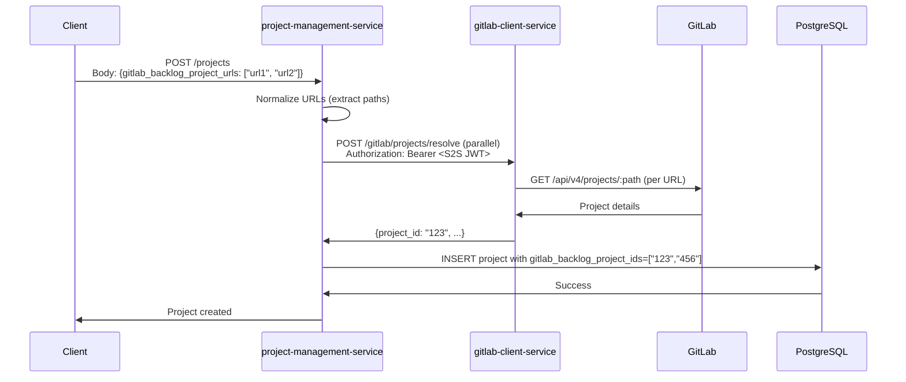

# Project Management Service

A FastAPI microservice for managing projects in the Agentic AI Requirements Engineering System.

## Features

- Project CRUD operations with Azure AD authentication
- Role-based access control (Admin, Project Manager, Contributor)
- Project member management
- PostgreSQL integration with connection pooling
- GitLab project path resolution via gitlab-client-service
- Comprehensive API documentation

## API Endpoints

- `GET /projects` - List projects (filtered by user access)
- `GET /projects?search={name}` - Search projects by name (case-insensitive partial match)
- `POST /projects` - Create new project (Admin only)
- `GET /projects/{project_id}` - Get project details
- `PUT /projects/{project_id}` - Update project
- `DELETE /projects/{project_id}` - Delete project (Admin only)
- `GET /projects/{project_id}/members` - List project members
- `POST /projects/{project_id}/members` - Add project member
- `DELETE /projects/{project_id}/members/{user_id}` - Remove project member

### Project Search

The `GET /projects?search={name}` endpoint supports project name resolution for the MCP server integration:

```bash
# Search for projects matching "billing"
GET /projects?search=billing

# Returns array of matching projects:
[
  {"id": "uuid-1", "name": "Billing Core", ...},
  {"id": "uuid-2", "name": "Billing Analytics", ...}
]
```

**Behavior:**
- Case-insensitive partial matching (ILIKE)
- Returns 0, 1, or multiple matches
- Used by `neo4j_retrieval_mcp_server` for `resolve_project` tool

## Authentication

All endpoints require Azure AD authentication. Role-based access control is enforced based on Azure AD groups.

## GitLab Integration

Project management service integrates with GitLab for TWO distinct purposes:
1. **Repository URL** - for source code access (git clone)
2. **Backlog Projects** - for issues/epics management

All GitLab interactions are delegated to gitlab-client-service via HTTP.

### Architecture: Two Separate Concerns

#### 1. GitLab Repository URL (Source Code)
- **Purpose**: Git clone URL for source code operations
- **Storage**: Single text field `gitlab_repository_url`
- **Resolution**: NOT resolved - stored as-is (SSH or HTTPS URL)
- **Example**: `https://gitlab.com/group/project.git` or `git@gitlab.com:group/project.git`

#### 2. GitLab Backlog Projects (Issues/Epics)
- **Purpose**: Fetch issues and epics from one or more GitLab projects
- **Storage**: Arrays `gitlab_backlog_project_ids[]` and `gitlab_backlog_project_urls[]`
- **Resolution**: URLs ARE resolved to project IDs via GitLab API
- **Example**: Multiple project URLs resolved to `["123", "456"]`

### Backlog Project Resolution Flow

When creating or updating a project with `gitlab_backlog_project_urls`, the service resolves each URL to a numeric GitLab project ID:



### GitLab Fields in Project Model

```python
class Project(Base):
    # Repository (Source Code) - single URL, no resolution
    gitlab_repository_url: Optional[str]  # Git clone URL (SSH/HTTPS)
    
    # Backlog Projects (Issues/Epics) - arrays, requires resolution
    gitlab_backlog_project_ids: Optional[List[str]]   # Resolved project IDs: ["123", "456"]
    gitlab_backlog_project_urls: Optional[List[str]]  # Original URLs (normalized)
```

### Resolution Logic

**Repository URL:**
- Stored directly without validation or resolution
- Used for git operations (not managed by this service)

**Backlog Project URLs:**
- If `gitlab_backlog_project_urls` provided during create/update → resolve to `gitlab_backlog_project_ids` in parallel
- Each URL is normalized to extract `namespace/project` path
- Supports various formats: HTTPS, SSH, path-only
- If resolution fails for any URL → log warning, exclude from list
- GitLab integration is optional and does not block project operations
- Multiple backlog projects supported for aggregating issues/epics from multiple sources

### HTTP Resilience and Retry Policy

The service uses shared HTTP client configuration from the `shared` library for all external HTTP calls. This ensures consistent retry behavior across services.

**Retry Strategy:**
- **Retries**: Transient failures only (connection errors, timeouts, 5xx server errors)
- **Fails fast**: Client errors (4xx) including 401 (auth) and 404 (not found)
- **Backoff**: Exponential backoff with configurable multiplier
- **Max attempts**: Configurable via `HTTP_MAX_RETRIES` (default: 3)

**Retryable Failures:**
- Network connection errors (`httpx.ConnectError`)
- Request timeouts (`httpx.TimeoutException`)
- Server errors (HTTP 500-599)

**Non-Retryable Failures:**
- Client errors (HTTP 400-499) - fail immediately for faster error handling
- Authentication failures (401) - retry won't help without valid credentials
- Not found errors (404) - resource doesn't exist

### Configuration

The service uses shared HTTP client configuration from environment variables:

```env
# Service URL
GITLAB_CLIENT_SERVICE_URL="http://gitlab-client-service:8011"

# Timeout settings
HTTP_CONNECTION_TIMEOUT=30.0  # Connection timeout in seconds
HTTP_READ_TIMEOUT=180.0       # Read timeout in seconds (for long operations)

# Retry settings
HTTP_MAX_RETRIES=3            # Maximum retry attempts
HTTP_RETRY_BACKOFF_FACTOR=2.0 # Exponential backoff multiplier

# Connection pooling
HTTP_MAX_CONNECTIONS=100
HTTP_MAX_KEEPALIVE_CONNECTIONS=20
```

All HTTP configuration is managed through the `shared` library's `HTTPClientSettings`.

### Dependencies

- **shared** - Shared library providing HTTP client configuration and retry policies
- **gitlab-client-service** - For GitLab path resolution
- **httpx** - HTTP client library
- **tenacity** - Retry/resilience library
- **No direct GitLab dependencies** - No python-gitlab library

## Development

```bash
# Install dependencies
pip install -e ".[dev]"

# Run tests
pytest

# Start service
uvicorn main:app --reload --port 8001
```