# UI Service

Serves a modern Tailwind HTML/JS UI with integrated Azure AD authentication, GitLab OAuth, and AI-powered task generation capabilities. Provides SSE endpoints bridging Redis pubsub channels to the browser for real-time updates.

## Architecture

The UI Service implements a modern, secure authentication architecture with comprehensive task management capabilities:

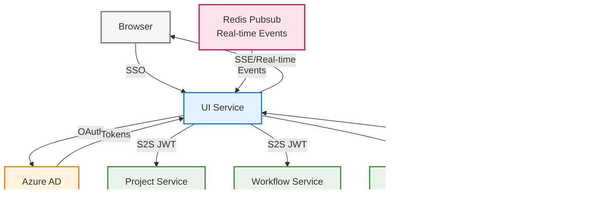

### Core Components

1. **Azure SSO** - MSAL Python-based Microsoft identity platform integration
2. **Internal S2S Authentication** - Enhanced JWT tokens with comprehensive claims
3. **GitLab Integration** - Proxies OAuth and API calls to gitlab-client-service
4. **Task Generation UI** - AI-powered backlog creation with real-time agent thought streaming
5. **SSE Bridge** - Real-time event streaming from Redis pubsub to browser

## Features

### Authentication & Authorization
- **MSAL Python Integration**: Official Microsoft library for Azure AD authentication
- **Redis-backed Token Cache**: Distributed, scalable session management (key: `msal_cache:{session_id}`)
- **Enhanced S2S Tokens**: Comprehensive claims including oid, tid, aud, iss, roles
- **Automatic Token Refresh**: Proactive refresh for Azure tokens via MSAL
- **Conditional Access Support**: Proper handling of MFA and CA challenges
- **GitLab Integration (Proxied)**: All GitLab OAuth and API interactions proxied to gitlab-client-service

### Task Generation Interface
- **Seamless Navigation Flow**: Requirements gathering → AI task generation → backlog review
- **Real-time Agent Thought Streaming**: Live visualization of AI reasoning and processing
- **Connection Status Dashboard**: Real-time monitoring of Auth, AI Tasks Service, and SSE connection
- **Interactive Backlog Visualization**: Epic cards with expandable tasks, acceptance criteria, dependencies
- **Duplicate Detection**: Yellow warning badges for similar GitLab items with similarity percentages
- **Task Editor Modal**: Full editing capabilities for epics, tasks, and GitLab link associations
- **Quality Score Display**: Visual indicators (0-100%) based on coverage, specificity, feasibility

### UI Components
- **Visual Authentication UI**: Green/red indicator, user profile display, logout button
- **Split-View Layout**: Left panel for agent workspace, right panel for live backlog
- **Collapsible Thinking Boxes**: Show/hide AI reasoning with markdown rendering
- **Responsive Design**: Tailwind CSS with modern gradients, shadows, and animations
- **Accessibility**: Semantic HTML5, ARIA roles, keyboard navigation, WCAG AA compliant

## Configuration

### Session Management
- `SESSION_SECRET_KEY` - Secret key for session cookie HMAC (required in production)
- `SESSION_COOKIE_NAME` - Session cookie name (default: `ui_session`)
- `SESSION_MAX_AGE` - Session max age in seconds (default: 14 days)
- `SESSION_SAME_SITE` - Session SameSite policy (default: `lax`)
- `ALLOW_INSECURE_SESSION` - Allow HTTP cookies for development/mock auth (default: `false`)

### Redis
- `REDIS_URL` - Redis connection URL (required, e.g., `redis://redis:6379`)

### Azure AD (via shared configuration)
- `AZURE_TENANT_ID` - Azure AD tenant ID (required)
- `AZURE_CLIENT_ID` - Azure AD application client ID (required)
- `AZURE_CLIENT_SECRET` - Azure AD application client secret (required)
- `AZURE_SCOPE_DESCRIPTION` - Scope description (default: `user_impersonation`)
- `AZURE_AD_AUTHORITY` - Azure AD authority URL (default: `https://login.microsoftonline.com`)


### S2S Authentication
- `LOCAL_JWT_SECRET` - Shared secret for S2S JWT tokens (required)
- `LOCAL_JWT_ALG` - JWT algorithm (default: `HS256`)

### MSAL Logging
- `MSAL_LOG_LEVEL` - MSAL log level: DEBUG, INFO, WARNING, ERROR (default: `INFO`)

### Downstream Services
- `PROJECT_MANAGEMENT_SERVICE_URL` - Project management service URL
- `AI_WORKFLOW_SERVICE_URL` - AI workflow service URL
- `AI_TASKS_SERVICE_URL` - AI tasks/backlog generation service URL (default: `http://localhost:8003`)
- `GITLAB_CLIENT_SERVICE_URL` - GitLab client service URL for OAuth and API proxying

## API Endpoints

### Azure SSO
- `GET /auth/login?redirect_uri=<url>` - Initiate Azure AD login flow
  - `redirect_uri` (optional): URL to redirect to after successful authentication (validated for security)
  - If not provided, redirects to `/projects.html` by default
- `GET /auth/callback` - Azure AD callback handler
- `GET /auth/me` - Get current user authentication status
- `POST /auth/logout` - Logout and clear tokens

### GitLab Integration (Proxied)

ui-service proxies all GitLab OAuth and API interactions to gitlab-client-service:

- `GET /auth/gitlab/authorize?redirect_uri=<url>` - Proxy GitLab OAuth authorization
  - Forwards to gitlab-client-service with session_id
- `GET /auth/gitlab/callback` - Proxy GitLab OAuth callback
  - Optional proxy for development (GitLab should callback directly to gitlab-client-service in production)
- `GET /auth/gitlab/status` - Proxy GitLab connection status check
  - Returns: `{"connected": bool, "configured": bool}`
- `POST /auth/gitlab/disconnect` - Proxy GitLab disconnect request
- `GET/POST/PUT/DELETE /gitlab/*` - Proxy GitLab API requests to gitlab-client-service

**Authentication Flow:**
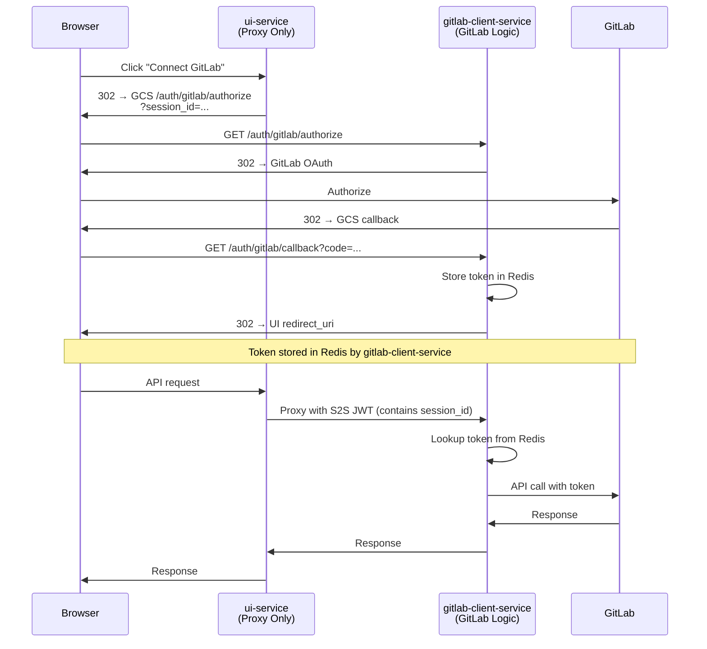

**S2S JWT Claims:**
```json
{
  "oid": "user-session-id",
  "tid": "tenant-id",
  "preferred_username": "user@example.com",
  "roles": ["Admin"],
  "iss": "ui-service",
  "aud": "gitlab-service",
  "exp": 1234567890
}
```

**Note:** ui-service has no direct GitLab dependencies (no python-gitlab, no authlib). All GitLab OAuth and API interactions are proxied to gitlab-client-service.

### API Proxying
- `GET/POST/PUT/DELETE /project/*` - Proxy to project management service
- `GET/POST/PUT/DELETE /workflow/*` - Proxy to AI workflow service
- `GET/POST/PUT/DELETE /tasks/*` - Proxy to AI tasks service
- `GET /config` - Get UI configuration

### Server-Sent Events
- `GET /events` - SSE stream for project progress updates
  - Channels: `ui:project_progress`, `ui:ai_workflow_progress`, `ui:ai_tasks_progress`

### Static UI Pages
- `GET /` - Main project selection page (`index.html`)
- `GET /chat.html` - Requirements gathering interface
- `GET /tasks.html` - AI task generation interface

## User Experience Flows

### 1. Authentication Flow

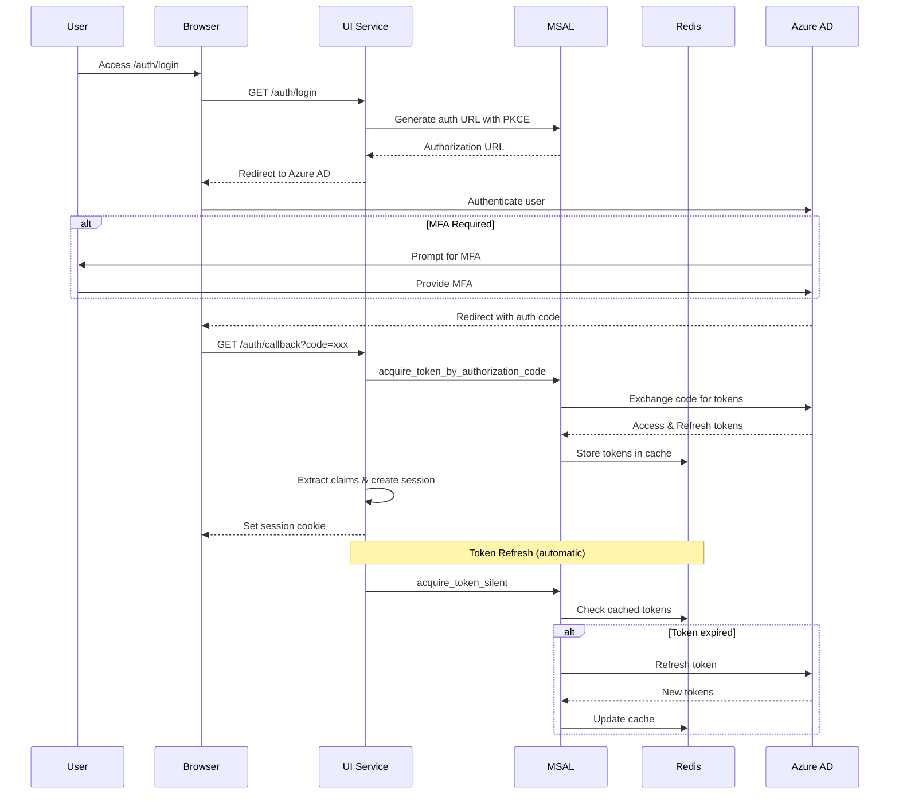

**Key Steps**:

1. **User Login**: User accesses `/auth/login?redirect_uri=<url>`, optional redirect URI is validated and encoded in OAuth state parameter (base64-encoded JSON with CSRF token + redirect URL), MSAL generates authorization URL with PKCE, user redirects to Azure AD
2. **Callback Processing**: Azure AD redirects to `/auth/callback` with authorization code and state parameter, state is decoded to extract CSRF token and redirect URI, MSAL exchanges code for tokens, tokens stored in Redis-backed cache, user claims extracted and stored in session, user redirected to original page (from state) or default `/projects.html`
3. **Token Refresh**: MSAL automatically refreshes tokens via `acquire_token_silent`, refresh occurs when cached token is expired or missing
4. **Conditional Access**: Detects `interaction_required` errors, stores claims challenge for re-authentication, prompts user for MFA when required
5. **Security**: Redirect URI validation prevents open redirect attacks (rejects external URLs, javascript: URIs, etc.), state parameter provides both CSRF protection and return URL preservation

### 2. S2S Authentication Flow

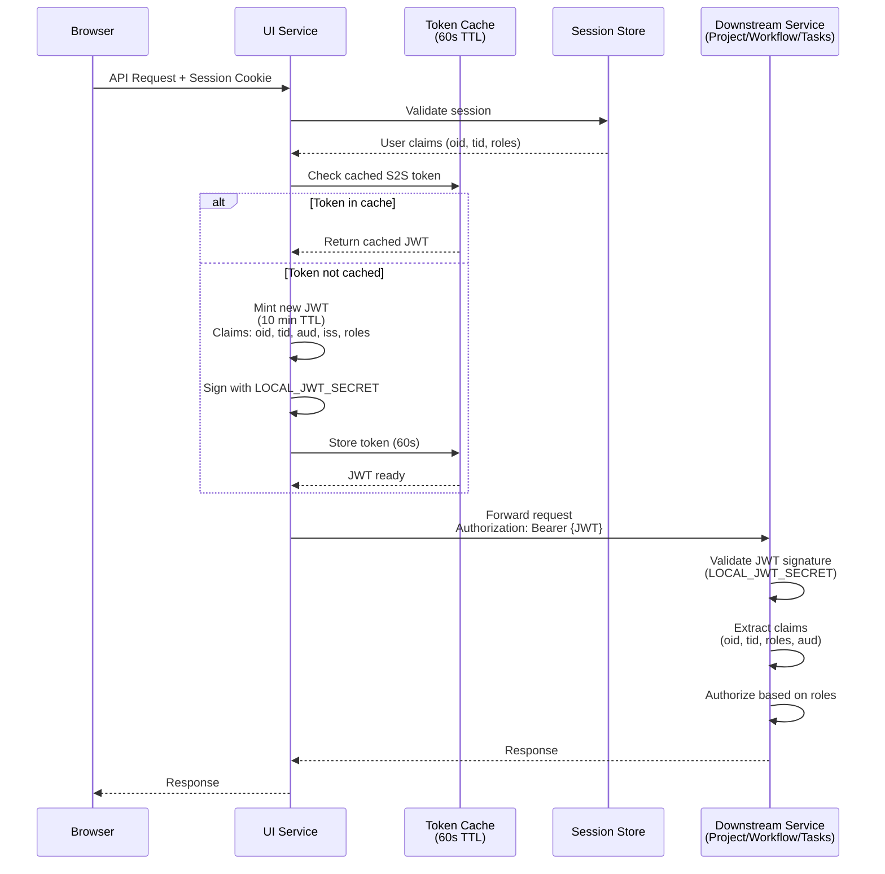

**Key Steps**:

1. **Request Received**: Browser sends authenticated request with session cookie, session validated against MSAL token cache
2. **S2S Token Minting**: UI service mints short-lived JWT (10 minutes) with comprehensive claims: `oid`, `tid`, `aud`, `iss`, `roles`, `preferred_username`
3. **Token Forwarding**: S2S JWT sent in `Authorization: Bearer <token>` header, downstream services validate using shared secret and extract user identity/roles
4. **Token Caching**: Minted S2S tokens cached for 60 seconds to reduce signing overhead

### 3. GitLab Integration Flow

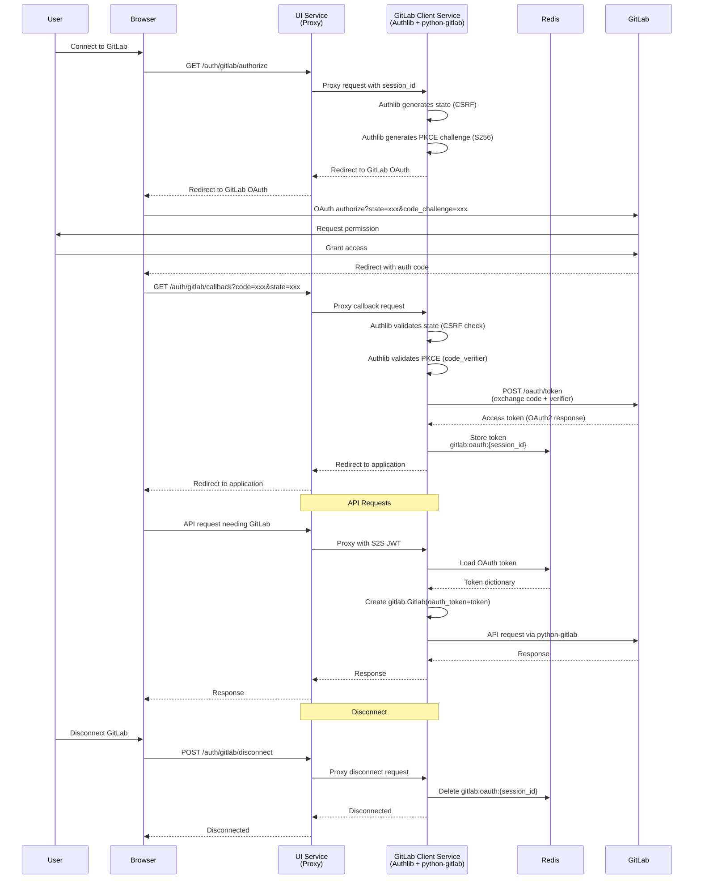

**Key Steps**:

1. **Authorization**: ui-service proxies `/auth/gitlab/authorize` to gitlab-client-service with session_id, gitlab-client-service uses Authlib for OAuth with PKCE (S256)
2. **Token Exchange**: gitlab-client-service validates state and exchanges authorization code with PKCE verifier, tokens stored in Redis (key: `gitlab:oauth:{session_id}`)
3. **API Access**: ui-service proxies all GitLab API requests to gitlab-client-service with S2S JWT authentication, gitlab-client-service handles OAuth token management and API calls
4. **Disconnect**: Token cleared from Redis via proxied request
5. **Security**: PKCE prevents authorization code interception, state provides CSRF protection, S2S JWT secures proxy communication

### 4. Task Generation Workflow

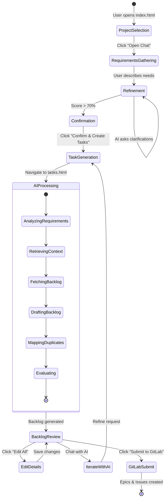

**Typical User Journey**:

1. **Start**: User opens `index.html` → selects project
2. **Requirements**: Clicks "Open Chat" → discusses needs in `chat.html`
3. **Refinement**: AI generates requirements, user answers clarification questions
4. **Confirmation**: Score reaches >70% → "✓ Confirm & Create Tasks" button appears
5. **Task Generation**: Click navigates to `tasks.html?project_id=X&prompt_id=Y`
6. **AI Processing**: Thinking box appears showing agent reasoning, status updates in real-time via SSE, backlog materializes on the right panel
7. **Review**: User reviews epics, tasks, duplicate alerts
8. **Edit**: Click "✎ Edit All" to modify details
9. **Iterate**: User can chat with AI to refine backlog
10. **Submit**: (Future) "Save & Submit to GitLab" pushes to repository

## Technical Implementation

### Frontend Structure

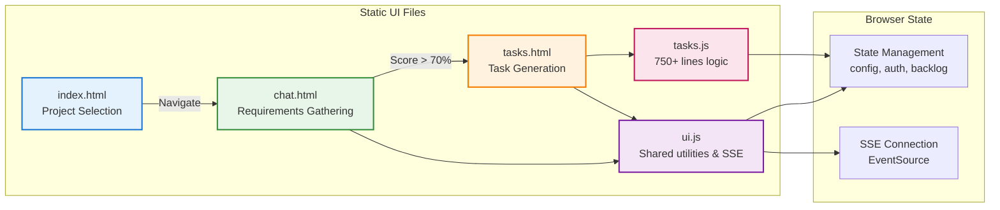

**File Structure**:
```
static/
├── index.html       # Project selection and console
├── chat.html        # Requirements gathering interface
├── tasks.html       # Task generation interface (185 lines)
├── tasks.js         # Task management logic (750+ lines)
└── ui.js            # Shared utilities and SSE handling
```

### Task Generation UI Features

#### Split-View Layout
- **Left Panel**: Agent workspace with chat/iteration
- **Right Panel**: Live backlog visualization
- Responsive design with Tailwind CSS gradients and shadows

#### Connection Status Dashboard
Real-time indicators for:
- Authentication status (🟢 Green / 🔵 Blue pulse / ⚪ Gray)
- AI Tasks Service health
- SSE/Real-time events connection

#### Agent Thought Stream Visualization
- Collapsible "thinking boxes" show AI reasoning
- Markdown rendering with syntax highlighting
- Animated pulsing indicator during active processing
- Completion badges with timing information

#### Backlog Rendering

**Epic Cards**:
- Clean, card-based layout for each epic
- Expandable task lists with:
  - Task titles and descriptions
  - Acceptance criteria (Given/When/Then format)
  - Dependencies visualization
  - Similar work item detection

**Duplicate Detection Alerts**:
- Yellow warning badges for similar GitLab items
- Shows similarity percentage and links
- Helps prevent redundant work

**Quality Score Display**:
- Visual score indicator (0-100%)
- Color-coded: Green (≥75%), Amber (50-74%), Red (<50%)

#### Task Editor Modal
- Edit epic titles and descriptions
- Modify task details inline
- Manage GitLab link associations
- Add/remove similar work items
- Clean, form-based UI with validation

#### Real-Time Progress Updates

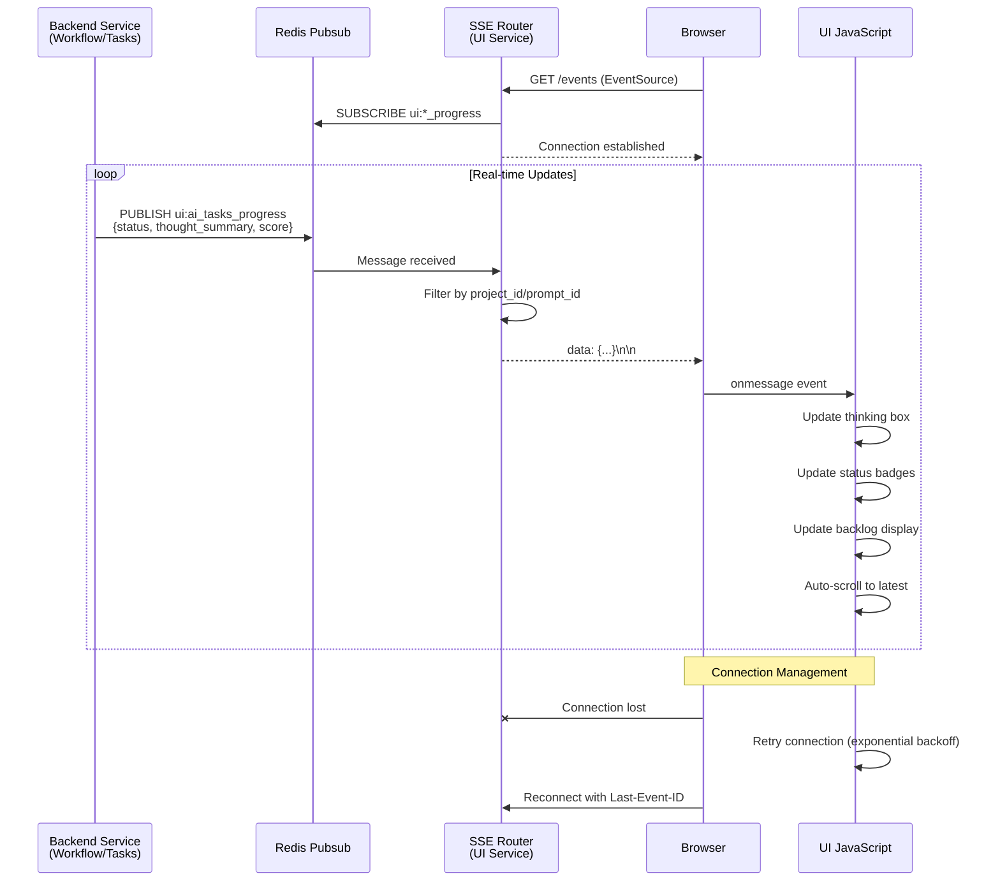

**SSE Event Subscription** - Listens to channels with event types:

Channels:
- `ui:project_progress` - General project updates
- `ui:ai_requirements_progress` - Requirements gathering
- `ui:ai_tasks_progress` - Task generation

Event types:
- `analyzing_requirements`
- `retrieving_context`
- `fetching_backlog`
- `drafting_backlog`
- `mapping_duplicates`
- `evaluating`
- `needs_clarification`
- `completed`
- `error`

**Live Status Updates**:
- Status badges update in real-time
- Thought streams append to active thinking box
- Automatic scrolling to latest updates

### State Management

```javascript
const state = {
  config, projectId, promptId, token,
  authenticated, backlogBundle,
  rtEvents, tasksService, evtSource,
  thinkingBoxes, boxesByPromptId,
  activeBox, pendingBox, loadingCount
};
```

### Markdown Rendering
- Custom renderer for headings, bold, italic, code, links
- Syntax-highlighted code blocks
- Safe HTML escaping

### Connection Management
- Automatic SSE reconnection
- Token refresh handling
- Service health monitoring

## Key Components

### MSAL Integration

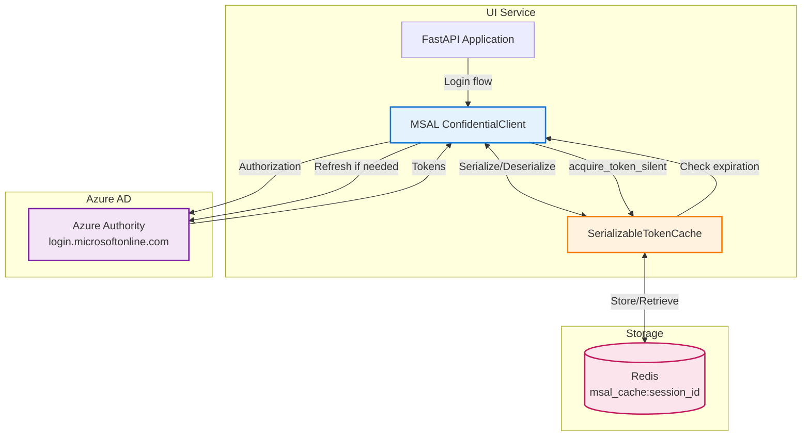

**Features**:
- Uses `msal.ConfidentialClientApplication` for Azure AD
- Redis-backed `SerializableTokenCache` for distributed token storage
- Automatic token refresh via `acquire_token_silent`
- Proper Conditional Access and MFA handling
- Session-based cache isolation (one cache per session)

### GitLab Integration (Proxied)

**Architecture**: ui-service acts as a transparent proxy to gitlab-client-service

**Proxy Endpoints**:
- `GET/POST /auth/gitlab/*` - Proxy GitLab OAuth flow to gitlab-client-service
- `GET/POST/PUT/DELETE /gitlab/*` - Proxy GitLab API requests to gitlab-client-service

**Features**:
- Transparent proxying of all GitLab OAuth and API requests
- S2S JWT authentication for proxy communication
- Session ID correlation for OAuth state management
- No direct GitLab dependencies in ui-service
- All OAuth token management handled by gitlab-client-service

**Flow**:
1. Browser makes request to ui-service
2. ui-service adds S2S JWT with user claims
3. Request proxied to gitlab-client-service
4. gitlab-client-service handles OAuth/API logic with GitLab
5. Response flows back through ui-service to browser

**Example Proxy Configuration**:
```python
# ui-service proxies to gitlab-client-service
@router.api_route("/gitlab/{path:path}", methods=["GET", "POST", "PUT", "DELETE"])
async def proxy_to_gitlab_client(path: str, request: Request):
    upstream_base = get_app_settings().http_client.GITLAB_CLIENT_SERVICE_URL
    target_url = f"{upstream_base}/gitlab/{path}"
    return await _forward(request, target_url)
```

### S2S Authentication

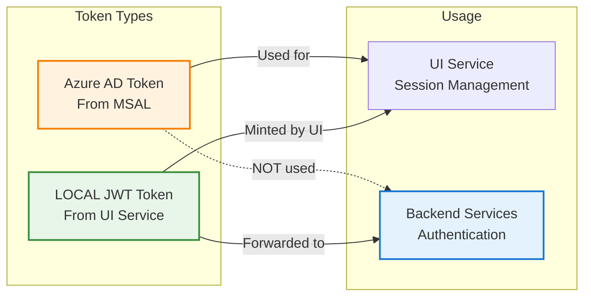

**Important Distinction**:

⚠️ **Backend services do NOT validate Azure AD tokens**. They only validate LOCAL JWT tokens signed with `LOCAL_JWT_SECRET`.

**Two Token Types**:

1. **Azure AD Tokens** (from MSAL):
   - Used ONLY for UI service session management
   - Stored in Redis via MSAL token cache
   - Never forwarded to backend services
   - Validated by Azure AD

2. **LOCAL JWT Tokens** (minted by UI service):
   - Used for service-to-service (S2S) authentication
   - Signed with `LOCAL_JWT_SECRET` (shared secret)
   - Forwarded to all backend services (project, workflow, tasks)
   - Validated by backend services using shared secret
   - Short-lived (10 minutes)
   - Enhanced claims: `oid`, `tid`, `aud`, `iss`, `roles`, `preferred_username`
   - In-memory caching (60s TTL) for performance

**For Testing/Direct Backend Access**:

When calling backend services directly (e.g., in E2E tests), you must create LOCAL JWT tokens:

```python
import jwt
import time

def create_local_jwt_token(oid: str = None, roles: list = None, username: str = None) -> str:
    """Create LOCAL JWT token for backend service authentication."""
    secret = os.getenv("LOCAL_JWT_SECRET", "test-secret-key")
    now = int(time.time())
    
    claims = {
        "oid": oid or str(uuid.uuid4()),
        "preferred_username": username or "test.user@example.com",
        "roles": roles or ["Admin", "User"],
        "iss": "test-client",
        "aud": "backend-services",
        "iat": now,
        "nbf": now,
        "exp": now + 3600,  # 1 hour validity
    }
    
    return jwt.encode(claims, secret, algorithm="HS256")

# Usage
headers = {"Authorization": f"Bearer {create_local_jwt_token()}"}
response = requests.get("http://project-service:8000/api/projects", headers=headers)
```

**Backend Services Using LOCAL JWT**:
- `project_management_service`
- `ai_requirements_service`
- `ai_tasks_service`
- `neo4j_retrieval_service`
- `neo4j_maintenance_service`
- `db_init_service`

### SSE Router
- Bridges Redis pubsub to browser-compatible SSE
- Supports multiple channels with message filtering
- Automatic cleanup on connection close

### Proxy Router

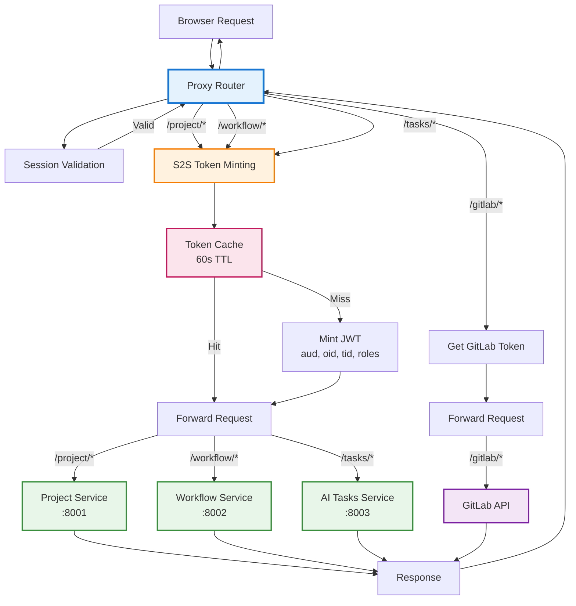

**Features**:
- Transparent proxying to downstream services
- Automatic S2S token minting and forwarding
- Header preservation and error handling
- Service-specific routing (project, workflow, tasks, gitlab)
- Token caching for performance optimization

## Integration with AI Tasks Service

### Request Payload
```json
POST /tasks/tasks/generate
{
  "project_id": "uuid",
  "prompt_id": "uuid (optional)",
  "message": "User message",
  "options": {
    "top_k": 2,
    "similarity_threshold": 0.83,
    "max_iters": 3
  }
}
```

### Response Bundle
```json
{
  "prompt_id": "uuid",
  "project_id": "uuid",
  "epics": [
    {
      "id": "epic-1",
      "title": "...",
      "description": "...",
      "tasks": [...],
      "similar": [...]
    }
  ],
  "assumptions": [...],
  "risks": [...],
  "score": 0.82,
  "coverage_components": {...}
}
```

### SSE Progress Events
```json
{
  "message_type": "ai_tasks_progress",
  "project_id": "uuid",
  "prompt_id": "uuid",
  "status": "drafting_backlog",
  "thought_summary": "...",
  "details_md": "...",
  "score": 0.75,
  "timestamp": "2025-10-02T..."
}
```

## Development

### Run Locally

```bash
cd services/ui_service
pip install -e .[dev]
python -m src.main
```

### Run Tests

```bash
pip install -e .[dev]
pytest
```

### Environment Setup

1. Set required environment variables (see Configuration section)
2. Ensure Redis is running
3. Ensure downstream services are accessible

### Development Mode
For local development with mock authentication:
```bash
export ALLOW_INSECURE_SESSION=true
export AZURE_AD_AUTHORITY=http://host.docker.internal:8005
```

## Deployment

### Docker

Multi-stage build for optimization:
```bash
docker build -t ui-service .
docker run -p 8000:8000 --env-file .env ui-service
```

### Health Check
- Endpoint: `GET /health`
- Interval: 30s
- Timeout: 30s
- Start period: 5s

### Docker Compose

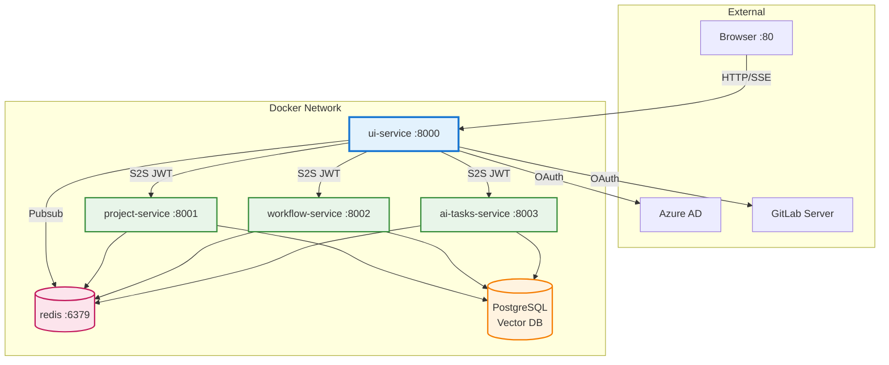

**Configuration**:
```yaml
ui-service:
  build: ./services/ui_service
  ports:
    - "8000:8000"
  environment:
    - REDIS_URL=redis://redis:6379
    - PROJECT_MANAGEMENT_SERVICE_URL=http://project-service:8000
    - AI_WORKFLOW_SERVICE_URL=http://workflow-service:8000
    - AI_TASKS_SERVICE_URL=http://ai-tasks-service:8000
  depends_on:
    - redis
    - project-service
    - workflow-service
    - ai-tasks-service
```

## Security Considerations

### Development vs Production

| Feature | Development (Mock) | Production (Azure AD) |
|---------|-------------------|----------------------|
| Authority | `http://host.docker.internal:8005` | `https://login.microsoftonline.com` |
| HTTPS Only | `false` (`ALLOW_INSECURE_SESSION=true`) | `true` |
| Session Secret | Can be ephemeral | Must be persistent and strong |
| Token Validation | Mock signing (RSA) | Full Azure AD validation |

### Security Features

1. **Session Security**:
   - Session cookie is `HttpOnly` and `Secure` (in production)
   - SameSite protection enabled
   - Session secret must be strong in production (store in Azure Key Vault)

2. **Token Storage**:
   - Azure tokens stored in Redis with MSAL cache serialization
   - GitLab tokens stored separately in Redis
   - Tokens properly revoked on logout
   - All tokens cleared from Redis on logout

3. **S2S Authentication**:
   - Short-lived tokens (10 minutes)
   - HMAC signing with shared secret
   - Consider certificate-based auth for production

4. **CSRF Protection**:
   - State parameter validated in OAuth flows (both Azure and GitLab)
   - Session-based state verification
   - Authlib and MSAL handle state generation and validation

5. **OAuth Error Handling**:
   - Detects and handles OAuth-specific errors
   - User-friendly error messages
   - Proper logging for audit trail

### Production Checklist

- [ ] Set `AZURE_AD_AUTHORITY=https://login.microsoftonline.com`
- [ ] Set `ALLOW_INSECURE_SESSION=false` (or remove it)
- [ ] Use production Azure AD tenant ID and client ID
- [ ] Store `SESSION_SECRET_KEY` in secure vault (Azure Key Vault)
- [ ] Store `LOCAL_JWT_SECRET` in secure vault
- [ ] Enable HTTPS on UI service
- [ ] Configure proper CORS origins
- [ ] Set up Conditional Access policies
- [ ] Enable MFA for users
- [ ] Verify GitLab OAuth app is properly configured
- [ ] Test token refresh and revocation flows

## UI/UX Design Principles

### Visual Hierarchy
- Clear sectioning with borders and backgrounds
- Typography scale (xl → lg → base → sm → xs)
- Color-coded status and categories

### Feedback & Affordance
- Hover effects on interactive elements
- Loading overlays with spinners
- Disabled states with reduced opacity
- Animated connection indicators

### Progressive Disclosure
- Collapsible thinking boxes (hide complexity)
- Expandable epic cards
- Modal-based detailed editing

### Real-Time Transparency
- Live agent thought streams
- Connection status always visible
- Progress indicators for long operations

### Consistency
- Reuses color palette across all pages
- Consistent button styles and interactions
- Unified status badge rendering

### Accessibility
- Semantic HTML5 elements
- ARIA roles (`role="log"`, `aria-live="polite"`)
- Keyboard navigation support
- Color contrast WCAG AA compliant

## Code Quality

### Principles Followed
- **DRY**: Reusable functions for rendering, status updates
- **SOLID**: Single-responsibility components (chat, backlog, editor)
- **Separation of Concerns**: State, UI, API, SSE isolated
- **Error Handling**: Try-catch with user-friendly messages
- **Documentation**: Inline comments, clear function names

### Performance Optimizations
- Debounced scrolling
- Efficient DOM updates (innerHTML for batch rendering)
- Event delegation for dynamic content
- Cached selectors where appropriate
- S2S token caching (60s TTL)

## GitLab Integration Details

### OAuth Endpoints

| Endpoint | Purpose | Handled By |
|----------|---------|------------|
| `/oauth/authorize` | Initial authorization | Authlib OAuth client |
| `/oauth/token` | Token exchange | Authlib OAuth client |

### API Access via python-gitlab

All GitLab API operations use the `python-gitlab` library:

```python
gl = gitlab.Gitlab(url="https://gitlab.example.com", oauth_token=token)

# Projects API
projects = gl.projects.list()
project = gl.projects.get(project_id)

# Issues API
issues = project.issues.list()
issue = project.issues.create({'title': 'Bug fix', 'description': '...'})

# Merge Requests API
mrs = project.mergerequests.list(state='opened')
```

Refer to [python-gitlab documentation](https://python-gitlab.readthedocs.io/) for full API coverage.

## Troubleshooting

### Connection Status Shows Red
- Check if services are running: `docker-compose ps`
- Verify environment variables
- Check service logs: `docker-compose logs <service-name>`

### "Not authenticated" Error
- Session expired - refresh page to re-login
- Check auth service logs

### Tasks Not Generating
- Open browser console (F12) for detailed errors
- Verify project_id in URL: `tasks.html?project_id=xxx`
- Check Redis is running

### Thinking Box Stuck on "Thinking..."
- SSE connection may have dropped
- Refresh page to reconnect
- Check network tab for `/events` connection

### MSAL Errors
Enable MSAL debug logging:
```bash
export MSAL_LOG_LEVEL=DEBUG
```

## References

### Microsoft Documentation
- [MSAL Python Documentation](https://learn.microsoft.com/en-us/entra/msal/python/)
- [Microsoft Identity Platform](https://learn.microsoft.com/en-us/entra/identity-platform/)

### OAuth & Security
- [OAuth 2.0 PKCE](https://oauth.net/2/pkce/)
- [GitLab Client Service](../gitlab_client_service/README.md) - Handles GitLab OAuth and API integration
- [GitLab OAuth 2.0 API](https://docs.gitlab.com/ee/api/oauth2.html)

### GitLab Integration
- [python-gitlab Documentation](https://python-gitlab.readthedocs.io/)
- [python-gitlab OAuth Authentication](https://python-gitlab.readthedocs.io/en/stable/gl_objects/users.html#authentication)
- [GitLab API Documentation](https://docs.gitlab.com/ee/api/)

### UI/UX
- [Tailwind CSS Documentation](https://tailwindcss.com/docs)
- [WCAG 2.1 Guidelines](https://www.w3.org/WAI/WCAG21/quickref/)

---

**Production-ready UI service with comprehensive authentication, real-time updates, and AI-powered task generation capabilities.** 🚀