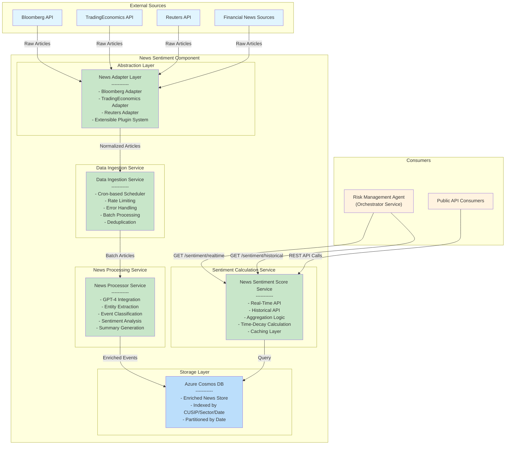
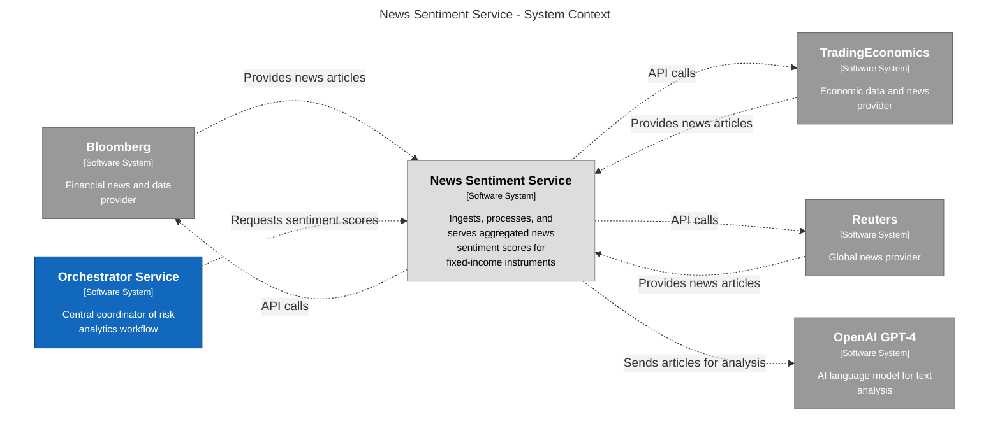
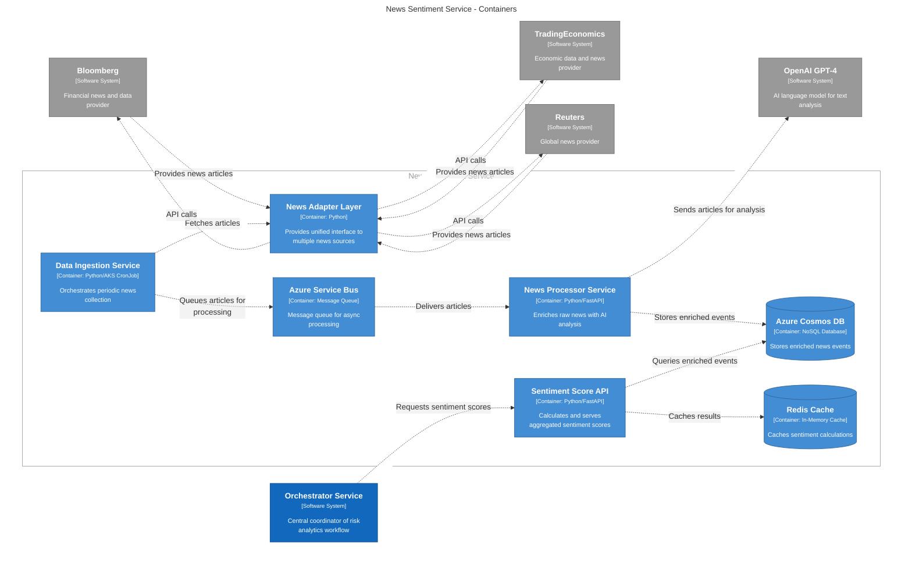
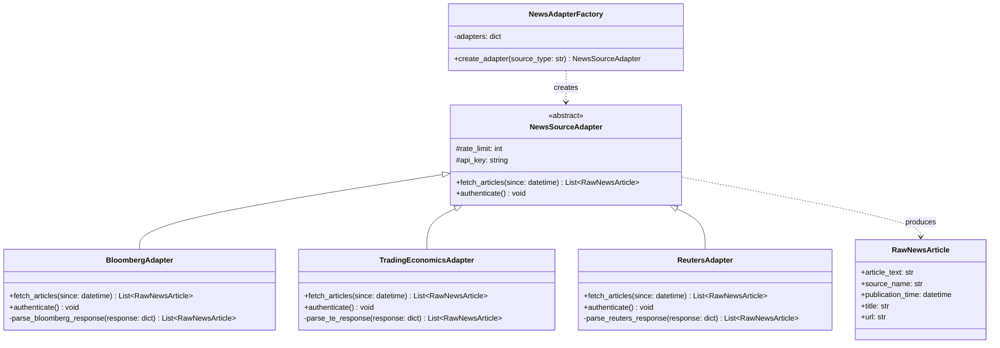
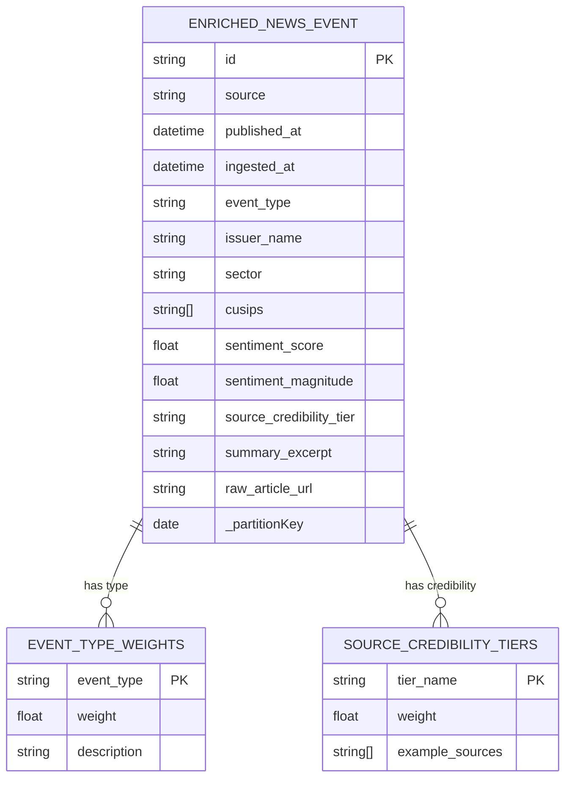
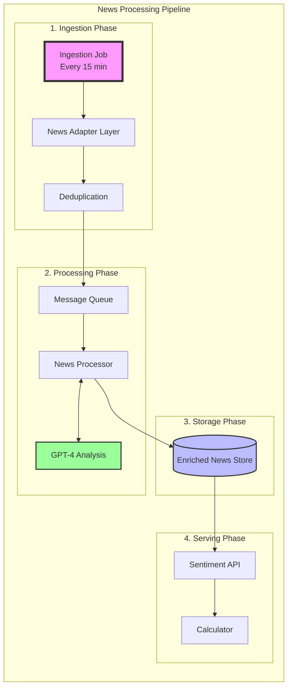
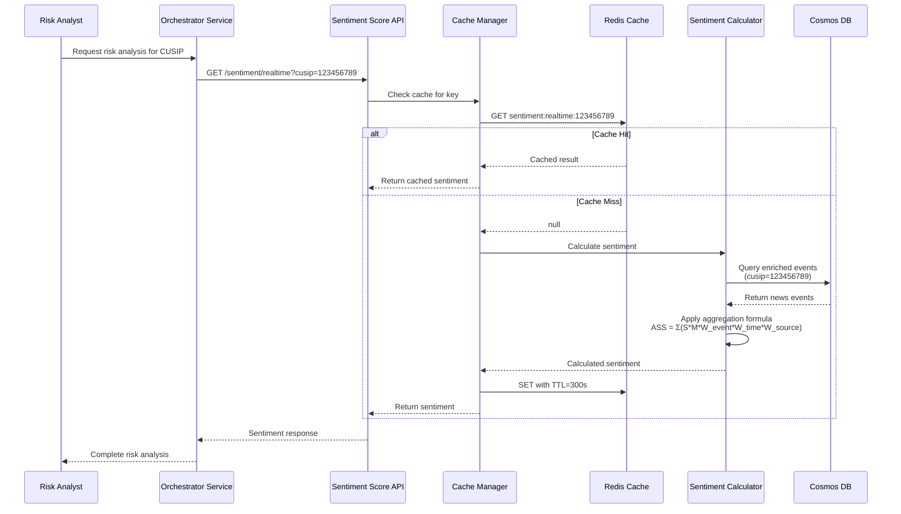
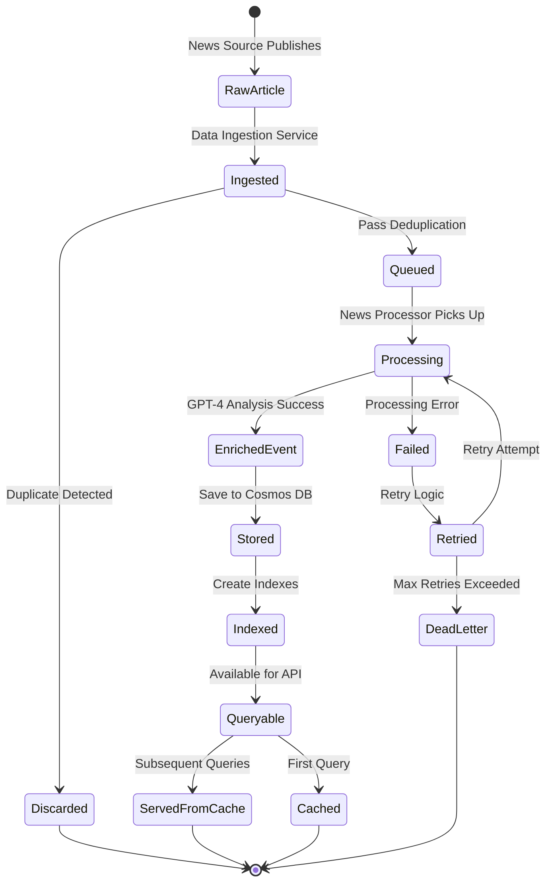
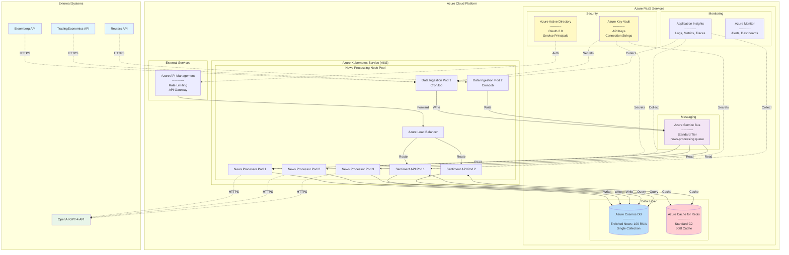

# News Sentiment Service - System Architecture

---

## Table of Contents
1. [Executive Summary](#1-executive-summary)
2. [High-Level Architecture Overview](#2-high-level-architecture-overview)
3. [C4 Architecture Diagrams](#3-c4-architecture-diagrams)
4. [Detailed Component Design](#4-detailed-component-design)
5. [Data Flow and Processing](#5-data-flow-and-processing)
6. [Scalability and Performance](#6-scalability-and-performance)
7. [Security and Monitoring](#7-security-and-monitoring)
8. [Deployment Architecture](#8-deployment-architecture)
9. [Future Enhancements](#9-future-enhancements)

---

## 1. Executive Summary

The News Sentiment Service is a critical component of the Fixed Income AI Risk Analytics System, responsible for ingesting, processing, and serving aggregated news sentiment scores for fixed-income instruments. This document outlines the complete system architecture, including all sub-components, data flows, technology choices, and design decisions.

The system follows a microservices architecture pattern with clear separation of concerns, enabling high scalability, maintainability, and extensibility. The architecture supports processing 10,000 articles/day with sub-500ms API response times.

### Key Architecture Decisions
- **Microservices Pattern**: 5 independent services with specific responsibilities
- **Event-Driven Processing**: Azure Service Bus for asynchronous message passing
- **AI-Powered Analysis**: GPT-4 integration for intelligent news classification
- **Single Source of Truth**: Unified Cosmos DB collection for all enriched news
- **Performance Optimization**: Redis caching with intelligent TTL management

---

## 2. High-Level Architecture Overview

### 2.1 System Components Overview



### 2.2 Technology Stack

- **Programming Language**: Python 3.11+
- **Web Framework**: FastAPI
- **Message Queue**: Azure Service Bus
- **Caching**: Redis (Azure Cache for Redis)
- **Database**: Azure Cosmos DB
- **Container Orchestration**: Azure Kubernetes Service (AKS)
- **Monitoring**: Azure Monitor, Application Insights
- **API Gateway**: Azure API Management

---

## 3. C4 Architecture Diagrams

### 3.1 Level 1: System Context



### 3.2 Level 2: Container Diagram



---

## 4. Detailed Component Design

### 4.1 News Adapter Layer (NAL)

The News Adapter Layer provides a unified interface for multiple news sources using the Adapter pattern with Factory.

#### Class Architecture



#### Implementation Example

```python
# Abstract base adapter
class NewsSourceAdapter(ABC):
    @abstractmethod
    async def fetch_articles(self, since: datetime) -> List[RawNewsArticle]:
        pass
    
    @abstractmethod
    def authenticate(self) -> None:
        pass

# Concrete implementations
class BloombergAdapter(NewsSourceAdapter):
    # Bloomberg-specific implementation

class TradingEconomicsAdapter(NewsSourceAdapter):
    # TradingEconomics-specific implementation

# Factory for adapter creation
class NewsAdapterFactory:
    @staticmethod
    def create_adapter(source_type: str) -> NewsSourceAdapter:
        # Returns appropriate adapter based on source type
```

### 4.2 Data Ingestion Service (DIS)

The Data Ingestion Service orchestrates periodic news collection with robust error handling.

#### Configuration

```yaml
news_sources:
  bloomberg:
    enabled: true
    api_key: ${BLOOMBERG_API_KEY}
    rate_limit: 100  # requests per minute
    batch_size: 50
  
  tradingeconomics:
    enabled: true
    api_key: ${TE_API_KEY}
    rate_limit: 60
    batch_size: 100
```

#### Deployment Configuration (AKS CronJob)

```yaml
apiVersion: batch/v1
kind: CronJob
metadata:
  name: news-ingestion-job
spec:
  schedule: "*/15 * * * *"
  jobTemplate:
    spec:
      template:
        spec:
          containers:
          - name: news-ingestion
            image: ${ACR_REGISTRY}/news-ingestion:latest
            env:
            - name: COSMOS_CONNECTION_STRING
              valueFrom:
                secretKeyRef:
                  name: cosmos-secret
                  key: connection-string
          restartPolicy: OnFailure
```

### 4.3 News Processor Service (NPS)

The News Processor Service uses GPT-4 to enrich raw news articles with structured financial analysis.

#### Enhanced GPT-4 Prompt Engineering

```python
SYSTEM_PROMPT = """
You are a specialized financial news analyst for the fixed-income (bond) market. Your role is to analyze news articles and extract structured information that is specifically relevant to bond investors and risk managers.

CONTEXT AND PURPOSE:
- Fixed-income securities (bonds) are debt instruments where investors care about credit risk, interest rate risk, and liquidity risk
- Unlike stocks, bondholders care more about the issuer's ability to pay back debt than growth potential
- Your analysis will be used by professional traders to assess risks in municipal bonds, corporate bonds, and other fixed-income instruments

OUTPUT REQUIREMENTS:
You must output valid JSON with exactly this structure:
{
    "issuer_name": "string or null",
    "sector": "string",
    "cusips": ["array of CUSIP identifiers"],
    "event_type": "string",
    "sentiment": {
        "score": float,
        "magnitude": float
    },
    "summary_excerpt": "string"
}

FIELD SPECIFICATIONS:

1. issuer_name: 
   - Extract the exact legal name of the bond issuer if mentioned
   - For municipalities, use format: "City of X" or "State of Y"
   - Return null if no specific issuer is mentioned

2. sector:
   - For issuer-specific news: Use the issuer's industry sector (e.g., "Technology", "Healthcare", "Utilities")
   - For municipal bonds: Use "Municipal" 
   - For broad market news affecting all bonds: Use "global_market"
   - For unclear/irrelevant news: Use "global_other"

3. cusips:
   - Extract any 9-character CUSIP identifiers mentioned in the article
   - CUSIPs are alphanumeric codes that uniquely identify securities
   - Return empty array if none mentioned

4. event_type (choose the MOST SPECIFIC applicable):
   CRITICAL EVENTS (highest impact on bondholders):
   - "Default": Failure to make required debt payments
   - "Bankruptcy": Legal filing for bankruptcy protection
   - "Credit_Rating_Downgrade": Reduction in credit rating by Moody's, S&P, or Fitch
   
   HIGH IMPACT EVENTS:
   - "Bond_Insurer_Downgrade": Downgrade of bond insurance companies (MBIA, Ambac, etc.)
   - "Central_Bank_Policy": Federal Reserve or other central bank rate decisions
   - "State_Budget_Crisis": Severe state/municipal budget shortfalls
   - "Natural_Disaster_Impact": Natural disasters affecting municipal bond issuers
   
   MEDIUM IMPACT EVENTS:
   - "Credit_Rating_Upgrade": Improvement in credit rating
   - "M&A_Announced": Merger or acquisition announcement
   - "Pension_Funding_Status_Change": Changes in public pension funding levels
   - "Credit_Outlook_Negative": Rating agency negative outlook (not actual downgrade)
   - "Regulatory_Investigation": Government investigations into the issuer
   - "Macro_Economic_Data": CPI, GDP, employment reports
   
   LOWER IMPACT EVENTS:
   - "Guidance_Change": Company guidance updates
   - "Lawsuit_Filed": Major litigation
   - "Credit_Outlook_Positive": Rating agency positive outlook
   - "Earnings_Miss": Earnings below expectations
   - "Earnings_Beat": Earnings above expectations
   - "Executive_Change": CEO/CFO changes
   - "General_News": Use only if no other category fits

5. sentiment:
   - score: Range from -1.0 (extremely negative for bondholders) to 1.0 (extremely positive)
   - magnitude: Range from 0.0 (mixed/neutral sentiment) to 1.0 (strong unanimous sentiment)
   
   IMPORTANT: Consider bondholder perspective specifically:
   - Debt reduction is POSITIVE for bondholders
   - Increased leverage/debt is NEGATIVE for bondholders
   - Strong cash flow is POSITIVE for bondholders
   - M&A funded by debt is typically NEGATIVE for existing bondholders
   - M&A where a stronger company acquires the issuer is typically POSITIVE

6. summary_excerpt:
   - Maximum 200 characters
   - Focus on the key fact most relevant to bond investors
   - Include specific numbers/percentages when available

EXAMPLES:

Example 1 - Credit Rating Downgrade:
Input: "S&P Global Ratings lowered ABC Corp's credit rating from BBB to BBB- citing concerns over declining cash flows..."
Output:
{
    "issuer_name": "ABC Corp",
    "sector": "Technology",
    "cusips": [],
    "event_type": "Credit_Rating_Downgrade",
    "sentiment": {
        "score": -0.8,
        "magnitude": 0.9
    },
    "summary_excerpt": "S&P downgrades ABC Corp from BBB to BBB- due to declining cash flows"
}

Example 2 - Central Bank Policy:
Input: "Federal Reserve raises interest rates by 50 basis points, signaling continued fight against inflation..."
Output:
{
    "issuer_name": null,
    "sector": "global_market",
    "cusips": [],
    "event_type": "Central_Bank_Policy",
    "sentiment": {
        "score": -0.6,
        "magnitude": 0.8
    },
    "summary_excerpt": "Fed raises rates 50bps, negative for bond prices but improves new bond yields"
}

Example 3 - Municipal Natural Disaster:
Input: "Hurricane damage to Miami estimated at $2 billion, city considering emergency bonds..."
Output:
{
    "issuer_name": "City of Miami",
    "sector": "Municipal",
    "cusips": [],
    "event_type": "Natural_Disaster_Impact",
    "sentiment": {
        "score": -0.7,
        "magnitude": 0.8
    },
    "summary_excerpt": "Hurricane causes $2B damage to Miami, city may issue emergency debt"
}
"""

USER_PROMPT_TEMPLATE = """
Analyze the following news article for fixed-income risk assessment:

Source: {source}
Published: {published_at}
Title: {title}
Content: {content}

Extract and return the structured information as specified.
"""
```

### 4.4 Storage Layer Design

The system uses a single, unified Azure Cosmos DB collection for all enriched news events.

#### Database Schema



#### Cosmos DB Configuration

```json
// Enriched News Events Container
{
    "id": "unique-guid",
    "source": "Bloomberg",
    "published_at": "2024-01-15T10:30:00Z",
    "ingested_at": "2024-01-15T10:45:00Z",
    "event_type": "Credit_Rating_Downgrade",
    "entities": {
        "issuer_name": "ABC Corporation",
        "sector": "Technology",
        "cusips": ["12345678X"]
    },
    "sentiment": {
        "score": -0.7,
        "magnitude": 0.9
    },
    "source_credibility_tier": "TIER_1_REGULATOR",
    "summary_excerpt": "S&P downgrades ABC Corporation...",
    "raw_article_url": "https://...",
    "_partitionKey": "2024-01-15"  // Date-based partitioning
}
```

#### Indexing Policy

```json
{
    "indexingMode": "consistent",
    "automatic": true,
    "includedPaths": [
        {
            "path": "/*"
        }
    ],
    "compositeIndexes": [
        [
            {"path": "/entities/cusips/*", "order": "ascending"},
            {"path": "/published_at", "order": "descending"}
        ],
        [
            {"path": "/entities/sector", "order": "ascending"},
            {"path": "/published_at", "order": "descending"}
        ],
        [
            {"path": "/entities/issuer_name", "order": "ascending"},
            {"path": "/published_at", "order": "descending"}
        ]
    ]
}
```

### 4.5 News Sentiment Score Service (NSSS)

The API service calculates and serves aggregated sentiment scores.

#### API Design

```python
from fastapi import FastAPI, Query
from datetime import datetime, date
from typing import Optional, List

app = FastAPI(title="News Sentiment Score Service")

@app.get("/sentiment/realtime")
async def get_realtime_sentiment(
    cusip: Optional[str] = Query(None),
    sector: Optional[str] = Query(None),
    issuer_name: Optional[str] = Query(None)
) -> RealtimeSentimentResponse:
    """
    Calculate real-time sentiment score with time decay from current time
    """
    # Implementation

@app.get("/sentiment/historical")
async def get_historical_sentiment(
    as_of_date: date,
    cusip: Optional[str] = Query(None),
    sector: Optional[str] = Query(None),
    issuer_name: Optional[str] = Query(None)
) -> HistoricalSentimentResponse:
    """
    Calculate historical sentiment score with time decay from end of specified date
    """
    # Implementation
```

#### Aggregation Logic Implementation

```python
class SentimentCalculator:
    def calculate_aggregated_sentiment(
        self, 
        events: List[EnrichedNewsEvent], 
        reference_time: datetime,
        mode: CalculationMode
    ) -> float:
        """
        ASS = Σ(Si * Mi * W_eventi * W_timei * W_sourcei) / 
              Σ(Mi * W_eventi * W_timei * W_sourcei)
        """
        numerator = 0.0
        denominator = 0.0
        
        for event in events:
            S = event.sentiment.score
            M = event.sentiment.magnitude
            W_event = EVENT_TYPE_WEIGHTS[event.event_type]
            W_source = SOURCE_CREDIBILITY_WEIGHTS[event.source_credibility_tier]
            W_time = self._calculate_time_decay(
                event.published_at, 
                reference_time, 
                mode
            )
            
            numerator += S * M * W_event * W_time * W_source
            denominator += M * W_event * W_time * W_source
        
        return numerator / denominator if denominator > 0 else 0.0
    
    def _calculate_time_decay(
        self, 
        event_time: datetime, 
        reference_time: datetime,
        mode: CalculationMode
    ) -> float:
        """
        Calculate exponential time decay weight
        """
        if mode == CalculationMode.HISTORICAL:
            # For historical, reference is end of day
            delta_hours = (reference_time - event_time).total_seconds() / 3600
        else:
            # For realtime, reference is current time
            delta_hours = (datetime.utcnow() - event_time).total_seconds() / 3600
        
        # Exponential decay with 72-hour half-life
        return math.exp(-0.693 * delta_hours / 72)
```

---

## 5. Data Flow and Processing

### 5.1 End-to-End Processing Pipeline



### 5.2 Request Processing Sequence



### 5.3 Article State Machine



---

## 6. Scalability and Performance

### 6.1 Horizontal Scaling Strategy

- **Data Ingestion Service**: Can run multiple instances with distributed locking
- **News Processor Service**: Stateless, can scale based on queue depth
- **API Service**: Behind load balancer, auto-scales based on CPU/memory

### 6.2 Caching Strategy

```python
class CacheManager:
    def __init__(self):
        self.redis_client = redis.Redis.from_url(REDIS_URL)
        self.ttl = {
            'realtime': 300,  # 5 minutes
            'historical': 3600  # 1 hour
        }
    
    def get_or_compute(self, key: str, compute_func, ttl_type: str):
        cached = self.redis_client.get(key)
        if cached:
            return json.loads(cached)
        
        result = compute_func()
        self.redis_client.setex(
            key, 
            self.ttl[ttl_type], 
            json.dumps(result)
        )
        return result
```

### 6.3 Performance Requirements

#### SLAs
- API Availability: 99.9%
- Real-time Sentiment Latency: < 500ms p95
- Historical Sentiment Latency: < 2s p95
- News Processing Lag: < 30 minutes

#### Capacity Planning
- Expected volume: 10,000 articles/day
- Peak load: 1,000 articles/hour
- Storage growth: ~500GB/year

---

## 7. Security and Monitoring

### 7.1 Security Architecture

#### API Security
- OAuth 2.0 authentication via Azure AD
- Rate limiting per client
- API key rotation policy

#### Data Security
- Encryption at rest (Cosmos DB)
- Encryption in transit (TLS 1.3)
- Sensitive data masking in logs

#### Secrets Management
- Azure Key Vault for API keys
- Managed identities for Azure resources
- Regular secret rotation

### 7.2 Monitoring and Observability

#### Metrics
- **Ingestion Metrics**: Articles processed/hour, source availability
- **Processing Metrics**: GPT-4 latency, error rates
- **API Metrics**: Request latency, cache hit ratio
- **Business Metrics**: Sentiment score distribution, event type frequency

#### Logging
```python
import structlog

logger = structlog.get_logger()

logger.info(
    "article_processed",
    cusip=enriched_event.entities.cusips,
    event_type=enriched_event.event_type,
    sentiment_score=enriched_event.sentiment.score,
    processing_time_ms=processing_time
)
```

#### Alerting
- Source unavailability > 1 hour
- GPT-4 error rate > 5%
- API p99 latency > 2 seconds
- Cosmos DB RU consumption > 80%

---

## 8. Deployment Architecture



### 8.1 Disaster Recovery

#### Backup Strategy
- Cosmos DB continuous backup with 7-day retention
- Configuration backups in Azure DevOps

#### Recovery Procedures
- RPO: 1 hour
- RTO: 4 hours
- Automated failover to secondary region

---

## 9. Future Enhancements

1. **Multi-language Support**: Process non-English news sources
2. **Real-time Streaming**: WebSocket API for live sentiment updates
3. **ML Model Fine-tuning**: Custom sentiment model for finance
4. **Advanced Analytics**: Sentiment trend analysis and anomaly detection
5. **Source Quality Scoring**: Dynamic source credibility based on accuracy 