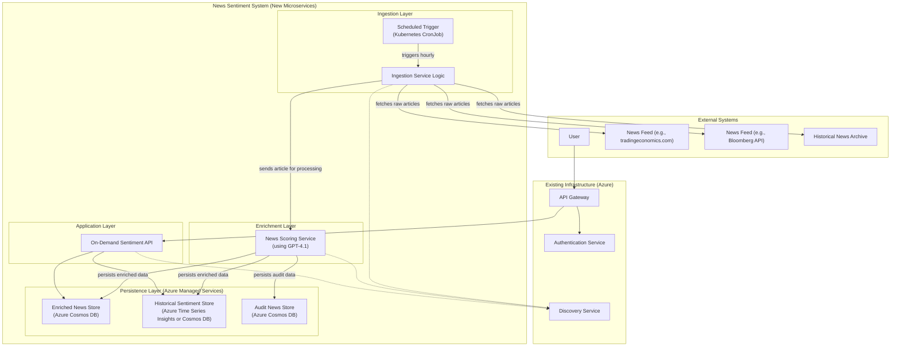

# System Architecture: News Sentiment Service

This document outlines the system architecture for the News Sentiment feature, designed as a set of containerized Python microservices for deployment on Microsoft Azure.

---

## 1. High-Level Architecture Diagram

The system is composed of four distinct layers: Ingestion, Enrichment, Persistence, and Application. It is designed to integrate seamlessly with existing enterprise infrastructure such as an API Gateway and Discovery Service.



---

## 2. Component Breakdown

### 2.1. Ingestion Layer

#### 2.1.1. Scheduled Trigger (Kubernetes CronJob)
- **Technology:** Kubernetes CronJob.
- **Responsibility:** Acts as the primary scheduler. Once every hour, it triggers a job to start the ingestion process. This is the only responsibility of this component.

#### 2.1.2. Ingestion Service Logic
- **Technology:** A containerized Python script or application.
- **Responsibility:**
    - Contains the **Feed Adapter Sub-system**, which uses a Strategy design pattern to fetch data from various news sources (live feeds or historical archives). The specific adapter is chosen via configuration, allowing for easy switching between sources.
    - Upon being triggered by the CronJob, it activates the configured feed adapter.
    - For each raw article retrieved, it makes an internal API call to the `News Scoring Service` to perform enrichment.

---

### 2.2. Enrichment Layer

#### 2.2.1. News Scoring Service
- **Technology:** A containerized Python web service (e.g., FastAPI) utilizing the `azure-openai` library.
- **Responsibility:** This is the analytical core of the system.
    - It exposes an internal API to receive raw articles from the Ingestion Service.
    - **Prompt Engineering:** Its primary function is to construct a detailed, task-specific prompt to be sent to a **GPT-4.1 model** via the Azure OpenAI endpoint.
    - It parses the structured JSON output from the LLM, validates it, and merges it with other metadata to form the complete `Enriched News Event`.
    - It then persists this final object to the appropriate data store (`Enriched News Store` or `Audit News Store`).

- **Example GPT-4.1 Prompt:**
  ```text
  You are an expert financial analyst specializing in fixed-income credit risk. Analyze the following news article. Your task is to extract key information and return it ONLY as a valid JSON object.

  **Article Text:**
  {article_text}

  **Instructions:**
  1.  **Entity Extraction:** Identify `issuer_name`, `sector`, and `cusips`. If the news is about broad market events, set `sector` to `'global_market'`.
  2.  **Event Classification:** Classify the article into ONE of the following types: `['Default', 'Bankruptcy', 'Credit_Rating_Downgrade', ..., 'General_News']`.
  3.  **Sentiment Analysis (Credit-Focus):** Generate a `sentiment` object with a `score` (-1.0 to 1.0) and `magnitude` (0.0 to 1.0).
  4.  **Summarization:** Generate a concise `summary_excerpt` of no more than 50 words.

  **Required JSON Output format:**
  {
    "entities": { "issuer_name": "...", "sector": "...", "cusips": ["..."] },
    "event_type": "...",
    "sentiment": { "score": ..., "magnitude": ... },
    "summary_excerpt": "..."
  }
  ```

---

### 2.3. Persistence Layer

- **Technology:** Azure Managed Services to minimize operational overhead.
- **Stores:**
    - **Enriched News Store:** An Azure Cosmos DB instance to store the `Enriched News Event` JSON objects.
    - **Historical Sentiment Store:** Can be a separate collection in Cosmos DB or Azure Time Series Insights, optimized for date-based queries.
    - **Audit News Store:** A dedicated collection in Cosmos DB for events marked as `'global_other'` that require manual review.

---

### 2.4. Application & Integration Layer

#### 2.4.1. On-Demand Sentiment API
- **Technology:** A containerized Python web service (e.g., FastAPI).
- **Responsibility:**
    - Provides the public-facing API endpoints as defined in the requirements (`/realtime-sentiment`, `/historical-sentiment`).
    - **Integration:** It registers with the central **Discovery Service** and is accessed via the **API Gateway**, which handles authentication and routing.
    - **Function:** For a given request, it queries the pre-processed and pre-scored data from the `Enriched News Store` or `Historical Sentiment Store`, performs the final `Aggregated Sentiment Score` calculation, and returns the response. Because the data is pre-calculated, this service can respond with very low latency. 