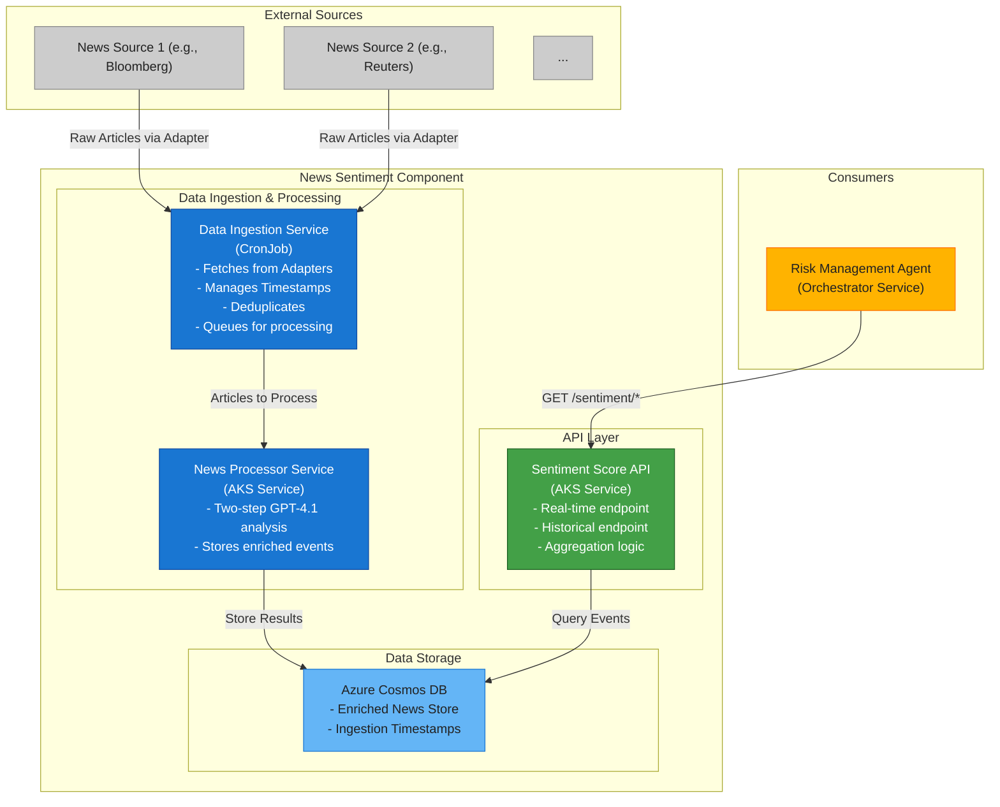
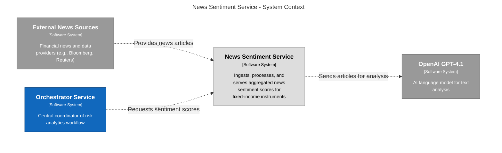
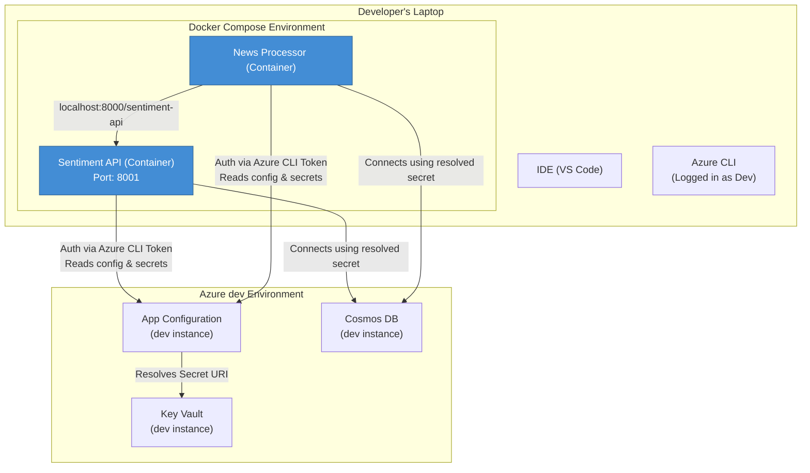
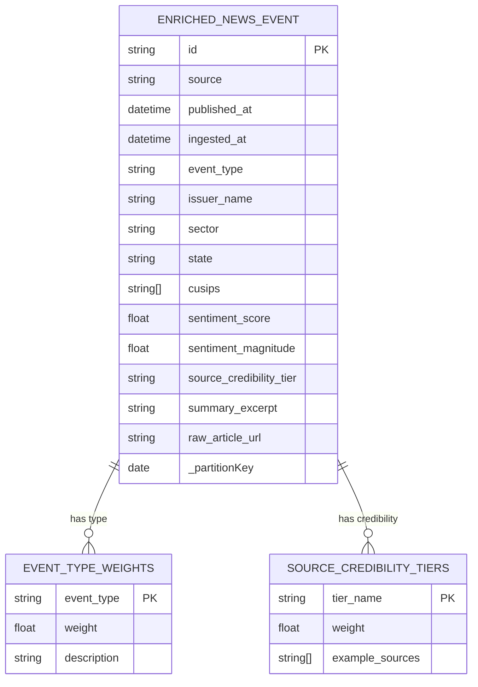
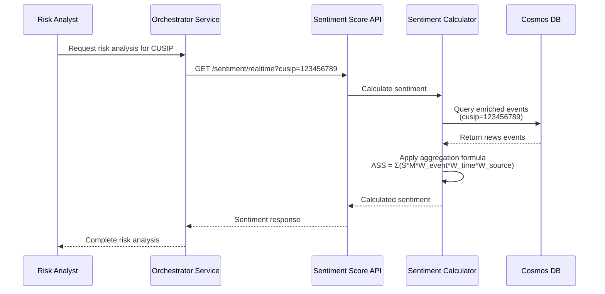
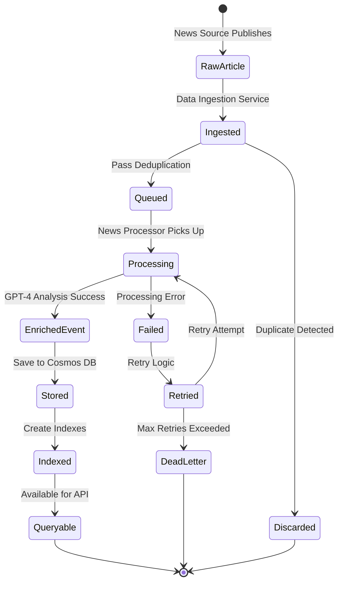

# News Sentiment Service - System Architecture

---

## Table of Contents
1. [Executive Summary](#1-executive-summary)
2. [High-Level Architecture Overview](#2-high-level-architecture-overview)
    - [2.1 System Components Overview](#21-system-components-overview)
    - [2.2 Technology Stack](#22-technology-stack)
3. [C4 Architecture Diagrams](#3-c4-architecture-diagrams)
    - [3.1 Level 1: System Context](#31-level-1-system-context)
    - [3.2 Level 2: Container Diagram](#32-level-2-container-diagram)
    - [3.3 Infrastructure, Configuration, and Secrets Management](#33-infrastructure-configuration-and-secrets-management)
    - [3.4 Local Development Strategy](#34-local-development-strategy)
4. [Detailed Component Design](#4-detailed-component-design)
    - [4.1 News Source Adapter Services](#41-news-source-adapter-services)
    - [4.2 Data Ingestion Service (DIS)](#42-data-ingestion-service-dis)
    - [4.3 News Processor Service (NPS)](#43-news-processor-service-nps)
    - [4.4 Storage Layer Design](#44-storage-layer-design)
    - [4.5 News Sentiment Score Service (NSSS)](#45-news-sentiment-score-service-nsss)
5. [Data Flow and Processing](#5-data-flow-and-processing)
    - [5.1 Request Processing Sequence](#51-request-processing-sequence)
    - [5.2 Article State Machine](#52-article-state-machine)
6. [Scalability and Performance](#6-scalability-and-performance)
    - [6.1 Horizontal Scaling Strategy](#61-horizontal-scaling-strategy)
    - [6.2 Performance Requirements](#62-performance-requirements)
7. [Disaster Recovery](#7-disaster-recovery)
    - [7.1 Backup Strategy](#71-backup-strategy)
    - [7.2 Recovery Procedures](#72-recovery-procedures)
8. [Future Enhancements](#8-future-enhancements)

---

## 1. Executive Summary

The News Sentiment Service is a critical component of the Fixed Income AI Risk Analytics System, responsible for ingesting, processing, and serving aggregated news sentiment scores for fixed-income instruments. This document outlines the complete system architecture, including all sub-components, data flows, technology choices, and design decisions.

---

## 2. High-Level Architecture Overview

### 2.1 System Components Overview



### 2.2 Technology Stack

- Programming Language: Python 3.14
- Web Framework: FastAPI
- Message Queue: Azure Service Bus
- Database: Azure Cosmos DB
- Container Orchestration: Azure Kubernetes Service (AKS)
- AI Service: Azure OpenAI Service (for GPT-4.1)
- Infrastructure as Code: Bicep
- Configuration Management: Azure App Configuration
- Secrets Management: Azure Key Vault
- Identity & Access Management: Azure Managed Identity
- Monitoring: Azure Monitor, Application Insights
- API Gateway: Azure API Management

---

## 3. C4 Architecture Diagrams

### 3.1 Level 1: System Context



### 3.2 Level 2: Container Diagram

```mermaid
graph TB
  linkStyle default fill:#ffffff

  subgraph diagram ["News Sentiment Service - Containers"]
    style diagram fill:#ffffff,stroke:#ffffff

    1["<div style='font-weight: bold'>External News Source Adapter</div><div style='font-size: 70%; margin-top: 0px'>[Software System]</div><div style='font-size: 80%; margin-top:10px'>Provides normalized news<br />articles via REST API</div>"]
    style 1 fill:#999999,stroke:#6b6b6b,color:#ffffff
    4["<div style='font-weight: bold'>OpenAI GPT-4.1</div><div style='font-size: 70%; margin-top: 0px'>[Software System]</div><div style='font-size: 80%; margin-top:10px'>AI language model for text<br />analysis</div>"]
    style 4 fill:#999999,stroke:#6b6b6b,color:#ffffff
    6["<div style='font-weight: bold'>Orchestrator Service</div><div style='font-size: 70%; margin-top: 0px'>[Software System]</div><div style='font-size: 80%; margin-top:10px'>Central coordinator of risk<br />analytics workflow</div>"]
    style 6 fill:#1168bd,stroke:#0b4884,color:#ffffff

    subgraph 7 ["News Sentiment Service"]
      style 7 fill:#ffffff,stroke:#9a9a9a,color:#9a9a9a

      13["<div style='font-weight: bold'>Data Ingestion Service</div><div style='font-size: 70%; margin-top: 0px'>[Container: Python/AKS CronJob]</div><div style='font-size: 80%; margin-top:10px'>Orchestrates periodic news<br />collection</div>"]
      style 13 fill:#438dd5,stroke:#2e6295,color:#ffffff
      18["<div style='font-weight: bold'>News Processor Service</div><div style='font-size: 70%; margin-top: 0px'>[Container: Python/FastAPI]</div><div style='font-size: 80%; margin-top:10px'>Enriches raw news with AI<br />analysis</div>"]
      style 18 fill:#438dd5,stroke:#2e6295,color:#ffffff
      24[("<div style='font-weight: bold'>Azure Cosmos DB</div><div style='font-size: 70%; margin-top: 0px'>[Container: NoSQL Database]</div><div style='font-size: 80%; margin-top:10px'>Stores enriched news events</div>")]
      style 24 fill:#438dd5,stroke:#2e6295,color:#ffffff
      26["<div style='font-weight: bold'>Sentiment Score API</div><div style='font-size: 70%; margin-top: 0px'>[Container: Python/FastAPI]</div><div style='font-size: 80%; margin-top:10px'>Calculates and serves<br />aggregated sentiment scores</div>"]
      style 26 fill:#438dd5,stroke:#2e6295,color:#ffffff
      31["<div style='font-weight: bold'>Azure Service Bus</div><div style='font-size: 70%; margin-top: 0px'>[Container: Message Queue]</div><div style='font-size: 80%; margin-top:10px'>Message queue for async<br />processing</div>"]
      style 31 fill:#438dd5,stroke:#2e6295,color:#ffffff
    end
    
    subgraph 32 ["Shared Infrastructure"]
        style 32 fill:#ffffff,stroke:#9a9a9a,color:#9a9a9a
        
        33["<div style='font-weight: bold'>Azure App Configuration</div><div style='font-size: 70%; margin-top: 0px'>[Container: Azure Service]</div><div style='font-size: 80%; margin-top:10px'>Centralized, managed<br/>configuration</div>"]
        style 33 fill:#f5a623,stroke:#b77c1b,color:#ffffff
        34["<div style='font-weight: bold'>Azure Key Vault</div><div style='font-size: 70%; margin-top: 0px'>[Container: Azure Service]</div><div style='font-size: 80%; margin-top:10px'>Secure secret storage</div>"]
        style 34 fill:#f5a623,stroke:#b77c1b,color:#ffffff
    end

    1-. "<div>Provides news articles</div><div style='font-size: 70%'></div>" .->13
    18-. "<div>Sends articles for analysis</div><div style='font-size: 70%'></div>" .->4
    6-. "<div>Requests sentiment scores</div><div style='font-size: 70%'></div>" .->26
    13-. "<div>Queues articles for<br />processing</div><div style='font-size: 70%'></div>" .->31
    31-. "<div>Delivers articles</div><div style='font-size: 70%'></div>" .->18
    18-. "<div>Stores enriched events</div><div style='font-size: 70%'></div>" .->24
    26-. "<div>Queries enriched events</div><div style='font-size: 70%'></div>" .->24
    
    13-. "<div>Reads config & secrets via<br/>Managed Identity</div><div style='font-size: 70%'></div>" .->33
    18-. "<div>Reads config & secrets via<br/>Managed Identity</div><div style='font-size: 70%'></div>" .->33
    26-. "<div>Reads config & secrets via<br/>Managed Identity</div><div style='font-size: 70%'></div>" .->33
    33-. "<div>Reads secrets</div><div style='font-size: 70%'></div>" .->34
  end
```



### 3.3 Infrastructure, Configuration, and Secrets Management

To ensure a robust, secure, and repeatable deployment, the system will adopt a modern Infrastructure as Code (IaC) and configuration management strategy. This will be standardized across all services within the `risk-analytics-agent` project.

#### 3.3.1 Infrastructure as Code with Bicep

All Azure resources (AKS, Cosmos DB, Service Bus, etc.) will be defined and managed using **Bicep**. This provides a declarative, concise, and version-controlled definition of the entire infrastructure. The Bicep files will be stored in a shared `infrastructure` repository to promote reuse and consistency.

#### 3.3.2 Centralized Configuration and Secrets

The system will use the recommended Azure pattern of combining Azure App Configuration and Azure Key Vault, secured by Managed Identities.

- **Azure App Configuration**: This will serve as the central store for all non-sensitive configuration data. This includes service URLs, scaling parameters, feature flags, and environment-specific settings. A labeling convention (e.g., `dev`, `prod`) will be used to manage different environments.
- **Azure Key Vault**: This is used exclusively for storing secrets, such as database connection strings, API keys (for OpenAI), and other credentials. **No secrets will be stored in application code, configuration files, or source control.**
- **Azure Managed Identity**: Each service running in AKS will be assigned its own Managed Identity. This identity provides a secure, passwordless mechanism to authenticate to other Azure services. The services' Managed Identities will be granted specific permissions to read from App Configuration and to access *only the necessary secrets* from Key Vault. App Configuration will store references to Key Vault secrets, not the secrets themselves.

This approach provides a clear separation of concerns, enhances security by eliminating credential management in code, and allows for dynamic configuration updates without redeploying the services.

### 3.4 Local Development Strategy

To enable efficient development and debugging of multiple interacting microservices, the project will adopt a "hybrid-local environment" strategy. This approach involves running only the services under active development locally in Docker containers, while connecting to a shared, dedicated `dev` environment in Azure for backing services like configuration, databases, and message queues.

This strategy provides high fidelity to the production environment while maintaining a simple and fast workflow for developers.

#### 3.4.1 Tooling: Docker Compose

The local environment will be orchestrated using **Docker Compose**. A `docker-compose.yml` file, committed to the root of the repository, will define the local container cluster. This ensures that all developers work with an identical and consistent setup.

**Conceptual `docker-compose.yml`:**
```yaml
# docker-compose.yml - Defines the local multi-service environment

version: '3.8'

services:
  sentiment-api:
    build:
      context: ./src/sentiment_api # Path to the service's Dockerfile
    ports:
      - "8001:8000" # Expose on http://localhost:8001
    environment:
      # Connects to the DEV configuration store in Azure
      - AZURE_APPCONFIG_ENDPOINT=https://appconfig-risk-analytics-dev.azconfig.io

  news-processor:
    build:
      context: ./src/news_processor
    environment:
      # Connects to the same DEV configuration store
      - AZURE_APPCONFIG_ENDPOINT=https://appconfig-risk-analytics-dev.azconfig.io
      # Overrides the cloud URL with the local Docker Compose DNS name for peer services
      - SENTIMENT_API_URL=http://sentiment-api:8000
```

#### 3.4.2 Authentication: The `DefaultAzureCredential` Flow

Local authentication to Azure services will be managed seamlessly by the **Azure Identity SDK**.

1.  **Developer Action**: The developer runs `az login` in their terminal once.
2.  **Code Implementation**: The application code uses `DefaultAzureCredential()`.
3.  **Seamless Operation**:
    *   **Locally**, `DefaultAzureCredential` automatically detects the developer's credentials from the Azure CLI.
    *   **In AKS**, the *exact same code* automatically uses the pod's assigned Managed Identity.

This eliminates the need for any secret-handling or complex authentication logic in the application code itself.

#### 3.4.3 Configuration Override Pattern

To enable local services to communicate with each other, the system uses a configuration override pattern.

1.  **Base Truth (Azure)**: Azure App Configuration stores the URLs for service-to-service communication in the cloud (e.g., internal Kubernetes DNS names).
2.  **Local Override (Environment Variable)**: The `docker-compose.yml` file injects environment variables that override these URLs with the local Docker Compose network addresses (e.g., `http://sentiment-api:8000`).
3.  **Application Logic**: The application code is written to prioritize an environment variable override if it exists, otherwise falling back to the value fetched from App Configuration.

**Conceptual Python Code for URL Resolution:**
```python
# In a service, when it needs to call a peer service:

# 1. Fetch all config from Azure App Configuration first
config_from_azure = load_all_settings_from_app_config()

# 2. Get the base URL from the fetched config (e.g., "http://sentiment-api.dev.cluster.local")
peer_service_url = config_from_azure.get("SentimentApi:Url")

# 3. Explicitly check for a local override from an environment variable
local_override_url = os.environ.get("SENTIMENT_API_URL")
if local_override_url:
    # If the override exists, use it. This will be "http://sentiment-api:8000" when run via Docker Compose.
    peer_service_url = local_override_url

# 4. Use the final, correct URL for the request
# result = requests.get(f"{peer_service_url}/some/endpoint")
```

#### 3.4.4 Hybrid Environment Architecture

The following diagram illustrates the data flow for the local development environment.



This setup provides a simple and powerful developer workflow: run `docker-compose up` to build and start the local cluster, which then connects securely and automatically to the shared `dev` backend.

---

## 4. Detailed Component Design

### 4.1 News Source Adapter Services

The system will integrate with one or more independent **News Source Adapter** microservices. Each adapter is responsible for connecting to a specific external news vendor (e.g., Bloomberg, Reuters), fetching raw articles, and exposing them through a standardized REST API.

These adapters are considered external to the News Sentiment Service itself and are responsible for their own internal logic and authentication with the upstream vendors. The key architectural principle is that they provide a consistent `RawNewsArticle` model to the Data Ingestion Service.

#### Raw News Article Model (API Contract)
This is the standardized model that all News Source Adapters must provide.
```json
{
    "article_text": "string",
    "source_name": "string",
    "publication_time": "datetime",
    "title": "string",
    "url": "string",
    "article_hash": "string" // MD5 hash of title+content
}
```

### 4.2 Data Ingestion Service (DIS)

The Data Ingestion Service is a cron-based job that orchestrates the collection of news from all configured News Source Adapters.

> **Requirements Reference**: This service is responsible for fetching news articles, fulfilling requirements for both real-time and historical processing (`RTN-FR-01`, `HPS-FR-01`).

#### Core Responsibilities
- **Timestamp Management**: For each news source, the service retrieves the timestamp of the last successfully processed article from Cosmos DB. It then requests only articles published after this timestamp from the corresponding adapter.
- **Deduplication**: The service uses the `article_hash` provided by the adapter to prevent processing duplicate articles. It checks for the existence of the hash in a dedicated, TTL-based Cosmos DB collection. If the hash exists, the article is discarded.
- **Batching & Queuing**: It collects articles from all sources and places them onto an Azure Service Bus queue for asynchronous processing by the News Processor Service.
- **Locking**: To support horizontal scaling, a distributed lock (e.g., via a lease on a blob in Azure Storage) will be used to ensure only one instance of the ingestion job runs at a time for a specific news source.


### 4.3 News Processor Service (NPS)

The News Processor Service uses **GPT-4.1** to enrich raw news articles with structured financial analysis in a **two-step process** for improved precision and maintainability.

> **Requirements Reference**: This service implements the core logic of the **News Scoring Service** (`NSS-FR-01` through `NSS-FR-07`), responsible for entity extraction, event classification, sentiment scoring, and summarization.

#### Step 1: Entity & Relevance Analysis
The first step determines if the article is relevant and extracts key entities.

**Prompt 1: Entity Extraction**
```
You are a financial data extractor. Analyze the news article to identify fixed-income entities and determine its relevance.

Respond in valid JSON with this exact structure:
{
    "is_relevant": boolean,
    "issuer_name": "string or null",
    "cusips": ["array of CUSIPs"],
    "sector": "string or null",
    "state": "string or null"
}

FIELD LOGIC:
- is_relevant: true if the article is about credit, debt, bonds, or has clear implications for fixed-income markets. Otherwise, false.
- issuer_name: The legal name of the bond issuer. For municipalities, use "City of X" or "State of Y".
- cusips: Extract all 9-character CUSIP identifiers.
- sector: The issuer's industry (e.g., "Technology"). For municipal bonds, use "municipal". For broad market news, use "global_market".
- state: For municipal bonds only, provide the two-letter US state code (e.g., "CA", "NY").
```

#### Step 2: Classification, Scoring & Summarization
If the article is deemed relevant (`is_relevant: true`), the second step performs the detailed analysis.

**Prompt 2: Scoring & Classification**
```
You are a specialized financial news analyst for the fixed-income market. Analyze the news article to create a sentiment score, classify the event, and write a summary from a bondholder's perspective.

Respond in valid JSON with this exact structure:
{
    "event_type": "string",
    "sentiment": {
        "score": float,
        "magnitude": float
    },
    "summary_excerpt": "string"
}

FIELD LOGIC:

1. event_type: Choose the MOST specific event type from this list:
   - "Default", "Bankruptcy", "Credit_Rating_Downgrade", "Bond_Insurer_Downgrade", "Central_Bank_Policy", "State_Budget_Crisis", "Natural_Disaster_Impact", "Credit_Rating_Upgrade", "M&A_Announced", "Pension_Funding_Status_Change", "Credit_Outlook_Negative", "Regulatory_Investigation", "Macro_Economic_Data", "Guidance_Change", "Lawsuit_Filed", "Credit_Outlook_Positive", "Earnings_Miss", "Earnings_Beat", "Executive_Change", "General_News"

2. sentiment:
   - score: -1.0 (very negative for bondholders) to 1.0 (very positive).
   - magnitude: 0.0 (neutral) to 1.0 (strong sentiment).
   - CRITICAL: Debt reduction is POSITIVE. Increased leverage is NEGATIVE. Strong cash flow is POSITIVE.

3. summary_excerpt:
   - Max 200 characters, focusing on the key fact for a bond investor.
```

#### User Prompt Template
```
Analyze the following news article.

Title: {title}
Content: {content}

Extract and return the structured information as specified.
```

### 4.4 Storage Layer Design

The system uses a single, unified Azure Cosmos DB collection for all enriched news events.

> **Requirements Reference**: This storage layer serves as the "Enriched News Store" and "Audit News Store" (`HPS-FR-03`, `HPS-FR-03a`, `RTN-FR-03`). All enriched events are persisted here, with routing logic (e.g., partitioning) to separate auditable events (`'global_other'`) from primary events.

#### Database Schema



#### Cosmos DB Configuration

```json
// Enriched News Events Container
{
    "id": "unique-guid",
    "source": "Bloomberg",
    "published_at": "2024-01-15T10:30:00Z",
    "ingested_at": "2024-01-15T10:45:00Z",
    "event_type": "Credit_Rating_Downgrade",
    "entities": {
        "issuer_name": "ABC Corporation",
        "sector": "Technology",
        "state": null,
        "cusips": ["12345678X"]
    },
    "sentiment": {
        "score": -0.7,
        "magnitude": 0.9
    },
    "source_credibility_tier": "TIER_1_REGULATOR",
    "summary_excerpt": "S&P downgrades ABC Corporation...",
    "raw_article_url": "https://...",
    "_partitionKey": "2024-01-15"  // Date-based partitioning
}
```

### 4.5 News Sentiment Score Service (NSSS)

The API service calculates and serves aggregated sentiment scores.

> **Requirements Reference**: This service provides the public-facing API endpoints, implementing the functional requirements of the **On-Demand Sentiment Service** (`SCS-FR-01` through `SCS-FR-05`). It handles requests, retrieves data, and calculates the Aggregated Sentiment Score.

#### API Design

The service provides two primary endpoints for retrieving sentiment scores. The logic for calculating the score is encapsulated within the service and is not exposed.

**GET `/sentiment/realtime`**
- **Purpose**: Calculate the current, time-decayed sentiment score for a given entity.
- **Query Parameters**: `cusip: str`, `sector: str`, `issuer_name: str` (at least one is required).
- **Response**:
  ```json
  {
    "aggregated_sentiment_score": "float",
    "contributing_articles_count": "integer",
    "articles": ["string"]
  }
  ```

**GET `/sentiment/historical`**
- **Purpose**: Calculate the sentiment score for an entity as of the end of a specific day.
- **Query Parameters**: `as_of_date: date`, `cusip: str`, `sector: str`, `issuer_name: str` (at least one is required).
- **Response**:
  ```json
  {
    "aggregated_sentiment_score": "float",
    "contributing_articles_count": "integer"
  }
  ```

#### Aggregation Logic
The core aggregation logic uses a weighted formula to calculate the final sentiment score. The formula remains internal to the service.
`ASS = Σ(Si * Mi * W_eventi * W_timei * W_sourcei) / Σ(Mi * W_eventi * W_timei * W_sourcei)`

---

## 5. Data Flow and Processing

### 5.1 Request Processing Sequence



### 5.2 Article State Machine



---

## 6. Scalability and Performance

### 6.1 Horizontal Scaling Strategy

- **Data Ingestion Service**: Can run multiple instances. A distributed lock will be used to ensure only one job runs per news source at a given time.
- **News Processor Service**: Stateless service that pulls from the message queue. Can be auto-scaled horizontally based on the queue depth in Azure Service Bus.
- **Sentiment Score API Service**: Stateless service behind a load balancer. Can be auto-scaled horizontally based on CPU/memory consumption.

### 6.2 Performance Requirements

#### SLAs
- API Availability: 99.9%
- Real-time Sentiment Latency: < 500ms p95
- Historical Sentiment Latency: < 500ms p95
- News Processing Lag: < 30 minutes

#### Capacity Planning
- Expected volume: 10,000 articles/day
- Peak load: 1,000 articles/hour
- Storage growth: ~500GB/year

---

## 7. Disaster Recovery

### 7.1 Backup Strategy

- Cosmos DB continuous backup with 7-day retention
- Configuration backups in Gitlab

### 7.2 Recovery Procedures

- RPO: 1 hour
- RTO: 4 hours
- Automated failover to secondary region

---

## 8. Future Enhancements

1. **Real-time Streaming**: Implement a WebSocket API for live, pushed sentiment updates to consumers.
2. **ML Model Fine-tuning**: Fine-tune a custom sentiment model on a large corpus of proprietary financial news to improve accuracy and reduce reliance on general-purpose models. 