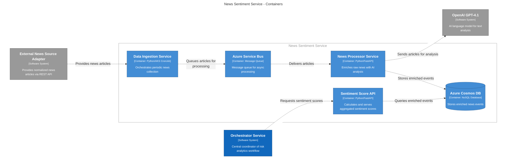

# News Sentiment Service - System Architecture

---

## Table of Contents
1. [Executive Summary](#1-executive-summary)
2. [High-Level Architecture Overview](#2-high-level-architecture-overview)
    - [System Components Overview](#21-system-components-overview)
    - [Technology Stack](#22-technology-stack)
3. [C4 Architecture Diagrams](#3-c4-architecture-diagrams)
    - [Level 1: System Context](#31-level-1-system-context)
    - [Level 2: Container Diagram](#32-level-2-container-diagram)
4. [Detailed Component Design](#4-detailed-component-design)
    - [News Source Adapter Services](#41-news-source-adapter-services)
    - [Data Ingestion Service (DIS)](#42-data-ingestion-service-dis)
    - [News Processor Service (NPS)](#43-news-processor-service-nps)
    - [Storage Layer Design](#44-storage-layer-design)
    - [News Sentiment Score Service (NSSS)](#45-news-sentiment-score-service-nsss)
5. [Data Flow and Processing](#5-data-flow-and-processing)
    - [Request Processing Sequence](#51-request-processing-sequence)
    - [Article State Machine](#52-article-state-machine)
6. [Scalability and Performance](#6-scalability-and-performance)
    - [Horizontal Scaling Strategy](#61-horizontal-scaling-strategy)
    - [Performance Requirements](#62-performance-requirements)
7. [Disaster Recovery](#7-disaster-recovery)
    - [Backup Strategy](#backup-strategy)
    - [Recovery Procedures](#recovery-procedures)
8. [Future Enhancements](#8-future-enhancements)

---

## 1. Executive Summary

The News Sentiment Service is a critical component of the Fixed Income AI Risk Analytics System, responsible for ingesting, processing, and serving aggregated news sentiment scores for fixed-income instruments. This document outlines the complete system architecture, including all sub-components, data flows, technology choices, and design decisions.

---

## 2. High-Level Architecture Overview

### 2.1 System Components Overview


### 2.2 Technology Stack

- Programming Language: Python 3.11+
- Web Framework: FastAPI
- Message Queue: Azure Service Bus
- Database: Azure Cosmos DB
- Container Orchestration: Azure Kubernetes Service (AKS)
- AI Service: Azure OpenAI Service (for GPT-4.1)
- Monitoring: Azure Monitor, Application Insights
- API Gateway: Azure API Management

---

## 3. C4 Architecture Diagrams

### 3.1 Level 1: System Context


### 3.2 Level 2: Container Diagram



---

## 4. Detailed Component Design

### 4.1 News Source Adapter Services

The system will integrate with one or more independent **News Source Adapter** microservices. Each adapter is responsible for connecting to a specific external news vendor (e.g., Bloomberg, Reuters), fetching raw articles, and exposing them through a standardized REST API.

These adapters are considered external to the News Sentiment Service itself and are responsible for their own internal logic and authentication with the upstream vendors. The key architectural principle is that they provide a consistent `RawNewsArticle` model to the Data Ingestion Service.

#### Raw News Article Model (API Contract)
This is the standardized model that all News Source Adapters must provide.
```json
{
    "article_text": "string",
    "source_name": "string",
    "publication_time": "datetime",
    "title": "string",
    "url": "string",
    "article_hash": "string" // MD5 hash of title+content
}
```

### 4.2 Data Ingestion Service (DIS)

The Data Ingestion Service is a cron-based job that orchestrates the collection of news from all configured News Source Adapters.

#### Core Responsibilities
- **Timestamp Management**: For each news source, the service retrieves the timestamp of the last successfully processed article from Cosmos DB. It then requests only articles published after this timestamp from the corresponding adapter.
- **Deduplication**: The service uses the `article_hash` provided by the adapter to prevent processing duplicate articles. It checks for the existence of the hash in a dedicated, TTL-based Cosmos DB collection. If the hash exists, the article is discarded.
- **Batching & Queuing**: It collects articles from all sources and places them onto an Azure Service Bus queue for asynchronous processing by the News Processor Service.
- **Locking**: To support horizontal scaling, a distributed lock (e.g., via a lease on a blob in Azure Storage) will be used to ensure only one instance of the ingestion job runs at a time for a specific news source.


### 4.3 News Processor Service (NPS)

The News Processor Service uses **GPT-4.1** to enrich raw news articles with structured financial analysis in a **two-step process** for improved precision and maintainability.

#### Step 1: Entity & Relevance Analysis
The first step determines if the article is relevant and extracts key entities.

**Prompt 1: Entity Extraction**
```
You are a financial data extractor. Analyze the news article to identify fixed-income entities and determine its relevance.

Respond in valid JSON with this exact structure:
{
    "is_relevant": boolean,
    "issuer_name": "string or null",
    "cusips": ["array of CUSIPs"],
    "sector": "string or null",
    "state": "string or null"
}

FIELD LOGIC:
- is_relevant: true if the article is about credit, debt, bonds, or has clear implications for fixed-income markets. Otherwise, false.
- issuer_name: The legal name of the bond issuer. For municipalities, use "City of X" or "State of Y".
- cusips: Extract all 9-character CUSIP identifiers.
- sector: The issuer's industry (e.g., "Technology"). For municipal bonds, use "municipal". For broad market news, use "global_market".
- state: For municipal bonds only, provide the two-letter US state code (e.g., "CA", "NY").
```

#### Step 2: Classification, Scoring & Summarization
If the article is deemed relevant (`is_relevant: true`), the second step performs the detailed analysis.

**Prompt 2: Scoring & Classification**
```
You are a specialized financial news analyst for the fixed-income market. Analyze the news article to create a sentiment score, classify the event, and write a summary from a bondholder's perspective.

Respond in valid JSON with this exact structure:
{
    "event_type": "string",
    "sentiment": {
        "score": float,
        "magnitude": float
    },
    "summary_excerpt": "string"
}

FIELD LOGIC:

1. event_type: Choose the MOST specific event type from this list:
   - "Default", "Bankruptcy", "Credit_Rating_Downgrade", "Bond_Insurer_Downgrade", "Central_Bank_Policy", "State_Budget_Crisis", "Natural_Disaster_Impact", "Credit_Rating_Upgrade", "M&A_Announced", "Pension_Funding_Status_Change", "Credit_Outlook_Negative", "Regulatory_Investigation", "Macro_Economic_Data", "Guidance_Change", "Lawsuit_Filed", "Credit_Outlook_Positive", "Earnings_Miss", "Earnings_Beat", "Executive_Change", "General_News"

2. sentiment:
   - score: -1.0 (very negative for bondholders) to 1.0 (very positive).
   - magnitude: 0.0 (neutral) to 1.0 (strong sentiment).
   - CRITICAL: Debt reduction is POSITIVE. Increased leverage is NEGATIVE. Strong cash flow is POSITIVE.

3. summary_excerpt:
   - Max 200 characters, focusing on the key fact for a bond investor.
```

#### User Prompt Template
```
Analyze the following news article.

Title: {title}
Content: {content}

Extract and return the structured information as specified.
```

### 4.4 Storage Layer Design

The system uses a single, unified Azure Cosmos DB collection for all enriched news events.

#### Database Schema


#### Cosmos DB Configuration

```json
// Enriched News Events Container
{
    "id": "unique-guid",
    "source": "Bloomberg",
    "published_at": "2024-01-15T10:30:00Z",
    "ingested_at": "2024-01-15T10:45:00Z",
    "event_type": "Credit_Rating_Downgrade",
    "entities": {
        "issuer_name": "ABC Corporation",
        "sector": "Technology",
        "state": null,
        "cusips": ["12345678X"]
    },
    "sentiment": {
        "score": -0.7,
        "magnitude": 0.9
    },
    "source_credibility_tier": "TIER_1_REGULATOR",
    "summary_excerpt": "S&P downgrades ABC Corporation...",
    "raw_article_url": "https://...",
    "_partitionKey": "2024-01-15"  // Date-based partitioning
}
```

### 4.5 News Sentiment Score Service (NSSS)

The API service calculates and serves aggregated sentiment scores.

#### API Design

The service provides two primary endpoints for retrieving sentiment scores. The logic for calculating the score is encapsulated within the service and is not exposed.

**GET `/sentiment/realtime`**
- **Purpose**: Calculate the current, time-decayed sentiment score for a given entity.
- **Query Parameters**: `cusip: str`, `sector: str`, `issuer_name: str` (at least one is required).
- **Response**:
  ```json
  {
    "aggregated_sentiment_score": "float",
    "contributing_articles_count": "integer"
  }
  ```

**GET `/sentiment/historical`**
- **Purpose**: Calculate the sentiment score for an entity as of the end of a specific day.
- **Query Parameters**: `as_of_date: date`, `cusip: str`, `sector: str`, `issuer_name: str` (at least one is required).
- **Response**:
  ```json
  {
    "aggregated_sentiment_score": "float",
    "contributing_articles_count": "integer"
  }
  ```

#### Aggregation Logic
The core aggregation logic uses a weighted formula to calculate the final sentiment score. The formula remains internal to the service.
`ASS = Σ(Si * Mi * W_eventi * W_timei * W_sourcei) / Σ(Mi * W_eventi * W_timei * W_sourcei)`

---

## 5. Data Flow and Processing

### 5.1 Request Processing Sequence


### 5.2 Article State Machine


---

## 6. Scalability and Performance

### 6.1 Horizontal Scaling Strategy

- **Data Ingestion Service**: Can run multiple instances. A distributed lock will be used to ensure only one job runs per news source at a given time.
- **News Processor Service**: Stateless service that pulls from the message queue. Can be auto-scaled horizontally based on the queue depth in Azure Service Bus.
- **Sentiment Score API Service**: Stateless service behind a load balancer. Can be auto-scaled horizontally based on CPU/memory consumption.

### 6.2 Performance Requirements

#### SLAs
- API Availability: 99.9%
- Real-time Sentiment Latency: < 500ms p95
- Historical Sentiment Latency: < 500ms p95
- News Processing Lag: < 30 minutes

#### Capacity Planning
- Expected volume: 10,000 articles/day
- Peak load: 1,000 articles/hour
- Storage growth: ~500GB/year

---

## 7. Disaster Recovery

### 7.1 Backup Strategy

- Cosmos DB continuous backup with 7-day retention
- Configuration backups in Gitlab

### 7.2 Recovery Procedures

- RPO: 1 hour
- RTO: 4 hours
- Automated failover to secondary region

---

## 8. Future Enhancements

1. **Real-time Streaming**: Implement a WebSocket API for live, pushed sentiment updates to consumers.
2. **ML Model Fine-tuning**: Fine-tune a custom sentiment model on a large corpus of proprietary financial news to improve accuracy and reduce reliance on general-purpose models. 