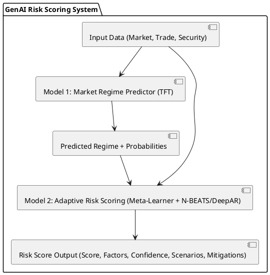

# Detailed Two-Stage GenAI Model Architecture Design

## 1. Overview

This document details the architecture for the GenAI Pre-Trade Risk Scoring system, following the two-stage approach outlined in the requirements document (`pre-trade-risk-scoring-genai-requirements.md`) and informed by research on suitable models (`research_summary.md`). The system comprises two core models: a Market Regime Predictor (Model 1) and an Adaptive Risk Scoring model (Model 2).

## 2. Overall Architecture

The system follows a sequential two-stage process:

1.  **Stage 1: Market Regime Prediction:** Model 1 analyzes current market data to identify the prevailing market regime.
2.  **Stage 2: Adaptive Risk Scoring:** Model 2 takes the predicted regime, along with specific trade details, security information, and market context, to generate a regime-adapted risk score and associated insights.

This architecture allows the risk assessment to be highly sensitive to the current market context, as identified by Model 1.

## 3. Model 1: Market Regime Predictor

-   **Purpose:** Identify the current market regime from the predefined categories and provide interpretability.
-   **Model Type:** Temporal Fusion Transformer (TFT).
    -   *Rationale:* TFT is chosen for its ability to handle multi-horizon time series data, incorporate various input types (static, known future, observed), capture complex temporal patterns using attention mechanisms, and provide interpretability through built-in variable selection and attention weight analysis, aligning with requirements 5.3.1.
-   **Inputs:**
    -   Historical and real-time Market Context Data (as per requirements 3.3), including yield curves, indices, fund flows, volatility measures, technical factors.
    -   Temporal Encodings (e.g., time of day, day of week, month).
-   **Outputs:**
    -   **Regime Classification:** Probability distribution over the 7 specified regimes (Calm/Normal, Volatility-Driven Risk-Off, Liquidity Crisis, Credit-Driven Selloff, Rate-Driven Selloff, Strong Inflow/Rally, Technical Positioning/Dislocation).
    -   **Key Factors:** Identification of the primary market indicators driving the current regime prediction.
    -   **Feature Importance:** Weights indicating the relevance of different input features.
-   **Implementation Details:**
    -   Utilize the `pytorch-forecasting` library's TFT implementation.
    -   Leverage TFT's variable selection networks to identify the most salient market indicators.
    -   Employ gating mechanisms to allow the model to adapt its complexity.
    -   Training will involve labeled historical periods and temporal cross-validation.

## 4. Model 2: Adaptive Risk Scoring

-   **Purpose:** Generate a comprehensive, regime-aware risk score for a proposed trade, along with actionable insights.
-   **Model Type:** Dynamic Meta-Learner managing an ensemble of regime-specific neural forecasting models (N-BEATS and DeepAR).
    -   *Rationale:* This approach directly addresses requirement 5.3.2 and 5.3.3. Using specialized models for each regime allows capturing unique dynamics. N-BEATS is suitable for regimes with clearer patterns, while DeepAR's probabilistic nature is ideal for high-uncertainty regimes. The Meta-Learner dynamically combines their outputs based on Model 1's prediction.
-   **Inputs:**
    -   **Security Parameters:** Core attributes and calculated metrics for the specific CUSIP (reqs 3.2).
    -   **Proposed Trade Details:** Direction, Par Amount, Price/Yield (reqs 3.1).
    -   **Dealer Behavior:** Relevant metrics derived from SecurityDealerQuotes (reqs 4.1).
    -   **Market Context:** Current indicators and temporal fingerprints (reqs 3.3).
    -   **Predicted Regime:** Output (probability distribution) from Model 1.
-   **Outputs:**
    -   **Risk Score:** A numerical score (0-100) indicating the pre-trade risk.
    -   **Contributing Factors:** Breakdown of factors influencing the score (e.g., liquidity, credit, duration risk components based on formulas in reqs 6.2).
    -   **Confidence Interval:** Calibrated probability range for the risk score/outcome using conformal prediction.
    -   **Comparable Historical Scenarios:** Examples of past trades with similar characteristics and outcomes.
    -   **Suggested Mitigations:** Actionable advice to potentially reduce trade risk.
-   **Implementation Details:**
    -   **Regime-Specific Models:**
        -   *N-BEATS:* Likely used for 'Calm/Normal', 'Strong Inflow/Rally' regimes where trend/seasonality decomposition is beneficial.
        -   *DeepAR:* Likely used for 'Volatility-Driven Risk-Off', 'Liquidity Crisis', 'Credit-Driven Selloff', 'Rate-Driven Selloff', 'Technical Positioning/Dislocation' regimes due to its strength in probabilistic forecasting and handling uncertainty.
        -   Implementations via `pytorch-forecasting`.
    -   **Dynamic Meta-Learner:**
        -   Takes regime probabilities from Model 1.
        -   Weights the outputs of the regime-specific models.
        -   Incorporates logic to handle regime transitions smoothly, potentially blending model outputs during periods of uncertainty.
        -   Considers confidence scores from individual models if available.
    -   **Confidence Calibration:** Apply conformal prediction techniques post-modeling to provide statistically valid confidence intervals for the risk score.
    -   **Output Generation:** Develop modules to calculate contributing factors based on model outputs and predefined formulas (reqs 6.2), retrieve similar historical scenarios from the database, and generate mitigation suggestions based on identified risk factors.

## 5. Data Flow Integration

The architecture relies on the data flow specified in the requirements (section 4.2):

1.  **Data Ingestion:** Consume Market Data (Kafka) and Trade History (Kafka/REST) from the Financial Trading Platform via the Data Gateway.
2.  **Feature Store:** Store and manage raw and derived features.
3.  **Data Processing:** Perform Feature Engineering, Risk Metric Calculation, Regime Labeling (for training), and Preprocessing.
4.  **Model Training:** Create Training Datasets and train Model 1 and Model 2 (including regime-specific sub-models and meta-learner).
5.  **Inference:** Real-time data flows through the processing pipeline, features are retrieved, Model 1 predicts the regime, and Model 2 generates the risk score using the appropriate sub-models weighted by the meta-learner.

## 6. Technology Stack (Preliminary)

-   **Language:** Python
-   **Core Libraries:** PyTorch, `pytorch-forecasting`
-   **Data Handling:** Pandas, NumPy
-   **Integration:** `kafka-python` (or similar), `requests`
-   **Feature Store:** Redis (for low-latency lookup), Apache Pinot (for analytics/aggregations) - as suggested in reqs 7.2
-   **Inference Serving:** NVIDIA Triton Inference Server (optional, for performance optimization as suggested in reqs 7.2)
-   **Cloud:** Designed for potential integration with Azure Cloud and Azure OpenAI tools (as per user knowledge).
