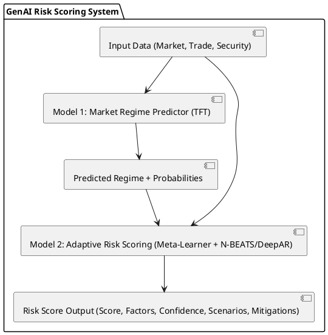

# Pre-Trade Risk Scoring GenAI: Implementation Documentation

This document provides a consolidated overview of the implementation plan, research, architecture, and code structure for the GenAI-powered Pre-Trade Risk Scoring system, based on the requirements outlined in `pre-trade-risk-scoring-genai-requirements.md`.

## 1. Implementation Plan (Final Checklist)


# Pre-Trade Risk Scoring GenAI Implementation Plan

- [X] 001: Read and analyze the requirements document (`pre-trade-risk-scoring-genai-requirements.md`).
- [X] 002: Research GenAI approaches for financial risk scoring, focusing on market regime prediction and adaptive scoring.
- [X] 003: Design the detailed two-stage model architecture based on requirements (TFT for regime prediction, N-BEATS/DeepAR for adaptive scoring, Dynamic Meta-Learner integration).
- [X] 004: Develop Model 1: Market Regime Predictor (TFT).
    - [X] 4.1: Implement data preprocessing for market indicators and technical factors.
    - [X] 4.2: Implement Temporal Fusion Transformer model.
    - [X] 4.3: Train and evaluate the regime predictor.
    - [X] 4.4: Implement feature importance layer for interpretability.
- [X] 005: Develop Model 2: Adaptive Risk Scoring (N-BEATS/DeepAR).
    - [X] 5.1: Implement data preprocessing for security parameters, trade details, dealer behavior, market context.
    - [X] 5.2: Implement regime-specific N-BEATS/DeepAR models.
    - [X] 5.3: Implement Dynamic Meta-Learner for model integration.
    - [X] 5.4: Implement confidence calibration (conformal prediction).
    - [X] 5.5: Train and evaluate the adaptive risk scoring model.
    - [X] 5.6: Implement logic for generating risk factors, historical scenarios, and mitigations.
- [X] 006: Create the integration framework with the Financial Trading Platform.
    - [X] 6.1: Implement Kafka consumer for market data.
    - [X] 6.2: Implement REST client/Kafka consumer for trade history data.
    - [X] 6.3: Define and implement data contracts and SLAs.
    - [X] 6.4: Implement data gateway and feature store interfaces.
- [X] 007: Implement the data processing pipeline.
    - [X] 7.1: Implement feature engineering module.
    - [X] 7.2: Implement risk metric calculation module.
    - [X] 7.3: Implement market regime labeling (for training).
    - [X] 7.4: Implement data preprocessing module.
    - [X] 7.5: Implement training dataset creation module.
- [ ] 008: Document the final implementation plan, architecture, and model details.


## 2. GenAI Model Research Summary

This section summarizes the findings from researching the GenAI models specified in the requirements document.

### Model 1: Market Regime Predictor - Temporal Fusion Transformer (TFT)

- **Purpose:** Designed for multi-horizon time series forecasting, leveraging self-attention to capture complex temporal patterns across multiple time steps.
- **Key Features:**
    - Transformer-based architecture.
    - Incorporates static covariates, known future inputs, and other exogenous variables.
    - Includes gating mechanisms to skip unused components of the architecture.
    - Variable selection networks for identifying relevant input variables.
    - Interpretable: Provides insights into feature importance and temporal patterns.
- **Relevance:** Suitable for identifying market regimes by analyzing various market indicators and technical factors over time. Its interpretability aligns with the requirement to identify key characterizing factors for regimes. Pytorch Forecasting library provides an implementation.
- **Sources:**
    - https://aihorizonforecast.substack.com/p/temporal-fusion-transformer-time
    - https://medium.com/ai-simplified-in-plain-english/an-in-depth-exploration-of-temporal-fusion-transformers-for-time-series-forecasting-91e74040a079
    - https://www.mdpi.com/1424-8220/25/3/976
    - https://thesai.org/Downloads/Volume15No7/Paper_13-Temporal_Fusion_Transformers_for_Enhanced_Multivariate_Time_Series.pdf
    - https://www.sciencedirect.com/science/article/abs/pii/S0925231223006239
    - https://pytorch-forecasting.readthedocs.io/en/stable/tutorials/stallion.html

### Model 2: Adaptive Risk Scoring - N-BEATS / DeepAR

#### N-BEATS (Neural Basis Expansion Analysis for Interpretable Time Series Forecasting)

- **Purpose:** A deep learning model specifically for univariate time series forecasting, known for its performance often exceeding statistical models.
- **Key Features:**
    - Purely deep learning-based, no time-series-specific components.
    - Architecture based on backward and forward residual links and a stack of fully connected layers.
    - Decomposes the time series into trend and seasonality components, offering interpretability.
    - Can be extended (NBEATSx) to incorporate exogenous variables.
- **Relevance:** Suitable for forecasting tasks within specific market regimes. Its potential for interpretability is valuable. Can be used for predicting price movements or other relevant metrics contributing to the risk score. Pytorch Forecasting library provides an implementation.
- **Sources:**
    - https://arxiv.org/html/2409.00480v2
    - https://www.sciencedirect.com/science/article/pii/S0957417423033043
    - https://medium.com/towards-data-science/n-beats-beating-statistical-models-with-neural-nets-28a4ba4a4de8
    - https://amlgolabs.com/documents/amlgolabs_com_enhance_financial_forecasting_with_n_beats_ai.pdf
    - https://www.researchgate.net/publication/333418084_N-BEATS_Neural_basis_expansion_analysis_for_interpretable_time_series_forecasting

#### DeepAR (Deep Autoregressive Recurrent Network)

- **Purpose:** A probabilistic forecasting model using recurrent neural networks (RNNs) for scalar time series.
- **Key Features:**
    - Learns a distribution over future values, providing probabilistic forecasts (prediction intervals) rather than just point forecasts.
    - Uses LSTMs or other RNNs to model the temporal dynamics.
    - Can incorporate covariates (related time series and features).
    - Developed by Amazon and available in tools like AWS SageMaker.
- **Relevance:** Excellent for risk assessment due to its probabilistic nature, allowing for the generation of confidence intervals as required. Suitable for modeling scenarios with uncertainty, like credit-driven or rate-driven selloffs, and providing calibrated uncertainty estimates.
- **Sources:**
    - https://medium.com/the-modern-scientist/revolutionizing-forecasting-harnessing-the-power-of-deepar-for-enhanced-predictive-accuracy-and-a3e1d1102703
    - https://docs.aws.amazon.com/sagemaker/latest/dg/deepar.html
    - https://link.springer.com/article/10.1007/s42521-022-00050-0
    - https://www.researchgate.net/publication/359932146_DeepVaR_a_framework_for_portfolio_risk_assessment_leveraging_probabilistic_deep_neural_networks

### Conclusion

The research confirms the suitability of TFT for market regime prediction due to its ability to handle complex temporal dependencies and provide interpretability. For adaptive risk scoring, both N-BEATS (potentially NBEATSx for covariates) and DeepAR are strong candidates. N-BEATS offers interpretability through decomposition, while DeepAR excels at probabilistic forecasting, crucial for risk assessment and confidence intervals. The choice between N-BEATS and DeepAR for specific regime sub-models can be based on the characteristics of the regime (e.g., DeepAR for high uncertainty regimes, N-BEATS for calmer ones) as suggested in the requirements.


## 3. Detailed Two-Stage GenAI Model Architecture Design

This section details the architecture for the GenAI Pre-Trade Risk Scoring system, following the two-stage approach outlined in the requirements document (`pre-trade-risk-scoring-genai-requirements.md`) and informed by research on suitable models (`research_summary.md`). The system comprises two core models: a Market Regime Predictor (Model 1) and an Adaptive Risk Scoring model (Model 2).

### 3.1 Overview

The system follows a sequential two-stage process:

1.  **Stage 1: Market Regime Prediction:** Model 1 analyzes current market data to identify the prevailing market regime.
2.  **Stage 2: Adaptive Risk Scoring:** Model 2 takes the predicted regime, along with specific trade details, security information, and market context, to generate a regime-adapted risk score and associated insights.

This architecture allows the risk assessment to be highly sensitive to the current market context, as identified by Model 1.



### 3.2 Model 1: Market Regime Predictor

-   **Purpose:** Identify the current market regime from the predefined categories and provide interpretability.
-   **Model Type:** Temporal Fusion Transformer (TFT).
    -   *Rationale:* TFT is chosen for its ability to handle multi-horizon time series data, incorporate various input types (static, known future, observed), capture complex temporal patterns using attention mechanisms, and provide interpretability through built-in variable selection and attention weight analysis, aligning with requirements 5.3.1.
-   **Inputs:**
    -   Historical and real-time Market Context Data (as per requirements 3.3), including yield curves, indices, fund flows, volatility measures, technical factors.
    -   Temporal Encodings (e.g., time of day, day of week, month).
-   **Outputs:**
    -   **Regime Classification:** Probability distribution over the 7 specified regimes (Calm/Normal, Volatility-Driven Risk-Off, Liquidity Crisis, Credit-Driven Selloff, Rate-Driven Selloff, Strong Inflow/Rally, Technical Positioning/Dislocation).
    -   **Key Factors:** Identification of the primary market indicators driving the current regime prediction.
    -   **Feature Importance:** Weights indicating the relevance of different input features.
-   **Implementation Details:**
    -   Utilize the `pytorch-forecasting` library's TFT implementation.
    -   Leverage TFT's variable selection networks to identify the most salient market indicators.
    -   Employ gating mechanisms to allow the model to adapt its complexity.
    -   Training will involve labeled historical periods and temporal cross-validation.

### 3.3 Model 2: Adaptive Risk Scoring

-   **Purpose:** Generate a comprehensive, regime-aware risk score for a proposed trade, along with actionable insights.
-   **Model Type:** Dynamic Meta-Learner managing an ensemble of regime-specific neural forecasting models (N-BEATS and DeepAR).
    -   *Rationale:* This approach directly addresses requirement 5.3.2 and 5.3.3. Using specialized models for each regime allows capturing unique dynamics. N-BEATS is suitable for regimes with clearer patterns, while DeepAR's probabilistic nature is ideal for high-uncertainty regimes. The Meta-Learner dynamically combines their outputs based on Model 1's prediction.
-   **Inputs:**
    -   **Security Parameters:** Core attributes and calculated metrics for the specific CUSIP (reqs 3.2).
    -   **Proposed Trade Details:** Direction, Par Amount, Price/Yield (reqs 3.1).
    -   **Dealer Behavior:** Relevant metrics derived from SecurityDealerQuotes (reqs 4.1).
    -   **Market Context:** Current indicators and temporal fingerprints (reqs 3.3).
    -   **Predicted Regime:** Output (probability distribution) from Model 1.
-   **Outputs:**
    -   **Risk Score:** A numerical score (0-100) indicating the pre-trade risk.
    -   **Contributing Factors:** Breakdown of factors influencing the score (e.g., liquidity, credit, duration risk components based on formulas in reqs 6.2).
    -   **Confidence Interval:** Calibrated probability range for the risk score/outcome using conformal prediction.
    -   **Comparable Historical Scenarios:** Examples of past trades with similar characteristics and outcomes.
    -   **Suggested Mitigations:** Actionable advice to potentially reduce trade risk.
-   **Implementation Details:**
    -   **Regime-Specific Models:**
        -   *N-BEATS:* Likely used for 'Calm/Normal', 'Strong Inflow/Rally' regimes where trend/seasonality decomposition is beneficial.
        -   *DeepAR:* Likely used for 'Volatility-Driven Risk-Off', 'Liquidity Crisis', 'Credit-Driven Selloff', 'Rate-Driven Selloff', 'Technical Positioning/Dislocation' regimes due to its strength in probabilistic forecasting and handling uncertainty.
        -   Implementations via `pytorch-forecasting`.
    -   **Dynamic Meta-Learner:**
        -   Takes regime probabilities from Model 1.
        -   Weights the outputs of the regime-specific models.
        -   Incorporates logic to handle regime transitions smoothly, potentially blending model outputs during periods of uncertainty.
        -   Considers confidence scores from individual models if available.
    -   **Confidence Calibration:** Apply conformal prediction techniques post-modeling to provide statistically valid confidence intervals for the risk score.
    -   **Output Generation:** Develop modules to calculate contributing factors based on model outputs and predefined formulas (reqs 6.2), retrieve similar historical scenarios from the database, and generate mitigation suggestions based on identified risk factors.

### 3.4 Data Flow Integration

The architecture relies on the data flow specified in the requirements (section 4.2):

1.  **Data Ingestion:** Consume Market Data (Kafka) and Trade History (Kafka/REST) from the Financial Trading Platform via the Data Gateway.
2.  **Feature Store:** Store and manage raw and derived features.
3.  **Data Processing:** Perform Feature Engineering, Risk Metric Calculation, Regime Labeling (for training), and Preprocessing.
4.  **Model Training:** Create Training Datasets and train Model 1 and Model 2 (including regime-specific sub-models and meta-learner).
5.  **Inference:** Real-time data flows through the processing pipeline, features are retrieved, Model 1 predicts the regime, and Model 2 generates the risk score using the appropriate sub-models weighted by the meta-learner.

### 3.5 Technology Stack (Preliminary)

-   **Language:** Python
-   **Core Libraries:** PyTorch, `pytorch-forecasting`
-   **Data Handling:** Pandas, NumPy
-   **Integration:** `kafka-python` (or similar), `requests`
-   **Feature Store:** Redis (for low-latency lookup), Apache Pinot (for analytics/aggregations) - as suggested in reqs 7.2
-   **Inference Serving:** NVIDIA Triton Inference Server (optional, for performance optimization as suggested in reqs 7.2)
-   **Cloud:** Designed for potential integration with Azure Cloud and Azure OpenAI tools (as per user knowledge).


## 4. Code Structure Summary

Based on the implementation steps, the following directory and file structure has been created, containing placeholder scripts for each component:

```
/home/ubuntu/
├── model1_regime_predictor/
│   ├── preprocess_model1.py       # Data preprocessing for TFT model
│   ├── train_model1.py            # TFT model definition and training logic
│   ├── evaluate_model1.py         # Evaluation logic for TFT model
│   └── interpret_model1.py        # Interpretability logic for TFT model
├── model2_adaptive_scoring/
│   ├── preprocess_model2.py       # Data preprocessing for N-BEATS/DeepAR
│   ├── train_model2_nbeats.py     # N-BEATS model definition and training
│   ├── train_model2_deepar.py     # DeepAR model definition and training
│   ├── meta_learner.py            # Logic to combine regime prediction and sub-model outputs
│   ├── calibrate_confidence.py    # Conformal prediction implementation
│   └── generate_outputs.py        # Final risk score calculation and output formatting
├── integration_framework/
│   ├── kafka_market_data_consumer.py # Consumes market data from Kafka
│   ├── trade_history_consumer.py     # Consumes trade history (REST/Kafka)
│   ├── data_contracts_sla.md         # Defines data formats and SLAs
│   ├── data_gateway.py               # Entry point, validation, routing
│   └── feature_store_interface.py    # Interface for writing/reading features
├── data_processing_pipeline/
│   ├── feature_engineering.py        # Generates temporal/interaction features
│   ├── risk_metric_calculation.py    # Calculates financial risk metrics
│   ├── market_regime_labeling.py     # Labels historical data for training Model 1
│   ├── data_preprocessing.py         # Scaling, encoding, preparing data for models
│   └── create_datasets.py            # Creates TimeSeriesDataSet objects
├── pre-trade-risk-scoring-genai-requirements.md # Original requirements (Input)
├── todo.md                        # Implementation checklist
├── research_summary.md            # Summary of model research
├── architecture_design.md         # Detailed architecture document
└── implementation_documentation.md  # This consolidated document
```

## 5. Next Steps

The placeholder scripts provide a framework for the complete implementation. The next steps would involve:

1.  **Data Acquisition:** Connecting the integration framework components to the actual Financial Trading Platform APIs and Kafka topics, using correct endpoints and credentials.
2.  **Feature Store Setup:** Configuring and setting up the chosen feature store technologies (e.g., Redis, Pinot) and refining the `feature_store_interface.py`.
3.  **Detailed Implementation:** Filling in the `TODO` sections within each placeholder script with actual data loading, processing logic, model hyperparameter tuning, training loops, evaluation metrics, and error handling based on the specific data and infrastructure.
4.  **Testing:** Rigorous unit, integration, and end-to-end testing.
5.  **Deployment:** Packaging the models and application components for deployment, potentially using tools like Docker and orchestration platforms, considering the Azure environment mentioned in user knowledge.

