# Business Requirements Document: Pre-Trade Risk Scoring with GenAI

## 1. Executive Summary

This document outlines the comprehensive business requirements for implementing a GenAI-powered Pre-Trade Risk Scoring system for municipal bonds and taxable fixed income products. The system will utilize historical trade data, security parameters, and market context to provide accurate risk assessments before trade execution, adapting to current market regimes.

The architecture clearly separates responsibilities between an external Financial Trading Platform (which provides market and trade data) and the GenAI Risk Scoring System (which analyzes the data and produces risk assessments).

## 2. System Purpose and Objectives

### 2.1 Primary Purpose
Develop a two-stage GenAI solution that:
1. Accurately identifies current market regimes
2. Provides comprehensive pre-trade risk scoring adapted to the identified regime
3. Exposes complex, non-linear interactions between risk factors
4. Delivers actionable insights to traders in real-time

### 2.2 Key Objectives
- Generate risk scores (0-100) for potential trades before execution
- Identify specific risk factors contributing to the score
- Adapt risk assessments to current market conditions
- Provide comparative historical scenarios
- Suggest risk mitigation strategies
- Deliver sub-second response times for trade evaluation

## 3. Data Requirements

### 3.1 Historical Trade Data
The following historical trade data is required from the Financial Trading Platform for model training and fine-tuning:

| Data Category | Specific Fields | Format/Units | Purpose |
|---------------|----------------|--------------|---------|
| **Trade Execution** | CUSIP/ISIN | String | Security identifier |
| | Trade date/time | ISO 8601 timestamp | Execution timing |
| | Direction | Buy/Sell | Trade direction |
| | Par amount | Decimal (USD) | Size of trade |
| | Price | Decimal (per 100 par) | Execution price |
| | Yield | Decimal (%) | Execution yield |
| | Spread to benchmark | Decimal (bps) | Relative value measure |
| | Trade type | Enum (customer, dealer, interdealer) | Counterparty category |
| | Counterparty/dealer ID | Masked identifier | Execution venue |
| | Execution method | Enum (electronic, voice, auction) | Trade mechanism |
| | Trader ID | Masked identifier | Executing trader |
| **Post-Trade Performance** | t+1, t+5, t+30, t+90 price movements | Decimal (%) | Short/medium-term performance |
| | Realized P&L | Decimal (USD and %) | Actual profit/loss |
| | Mark-to-market P&L | Time series of decimal values | Unrealized P&L over time |
| | Price target deviation | Decimal (%) | Execution quality |
| | Price impact | Decimal (bps) | Market impact |
| | Opportunity cost | Decimal (bps) | Execution efficiency |
| | Holding period volatility | Decimal (annualized %) | Risk realized |
| | Holding duration | Integer (days) | Investment timeframe |
| | Final disposition | Enum (maturity, sale, still held) | Ultimate outcome |

### 3.2 Security Parameters

| Data Category | Specific Fields | Format/Units | Purpose |
|---------------|----------------|--------------|---------|
| **Core Attributes** | Credit ratings (Moody's, S&P, Fitch) | String/Enum | Credit quality assessment |
| | Issuer name and type | String/Enum | Obligor identification |
| | State/geography | String/Enum | Geographic exposure |
| | Sector and subsector | String/Enum | Industry classification |
| | Tax status | Enum (tax-exempt, AMT, taxable) | Tax treatment |
| | Issue size | Decimal (USD) | Total outstanding |
| | Issue date | Date | Security age |
| | Maturity date | Date | Final maturity |
| | Call features | Struct (date, price, type) | Embedded options |
| | Coupon rate | Decimal (%) | Interest rate |
| | Coupon type | Enum (fixed, floating, zero) | Interest structure |
| | Security type | Enum (GO, revenue, etc.) | Bond category |
| **Calculated Metrics** | Modified duration | Decimal | Interest rate sensitivity |
| | Effective duration | Decimal | Option-adjusted sensitivity |
| | Convexity | Decimal | Non-linear rate sensitivity |
| | Option-adjusted spread (OAS) | Decimal (bps) | Risk premium |
| | Historical volatility (30/90-day) | Decimal (%) | Price variability |
| | Average daily trading volume | Decimal (USD) | Liquidity measure |
| | Bid-ask spread | Decimal (%) | Liquidity cost |
| | Liquidity score | Decimal (0-100) | Composite liquidity |
| | Dealer count | Integer | Market support |
| | Yield curve position | Enum + Decimal | Curve placement |
| | Yield ratio to benchmark | Decimal (%) | Relative value |
| | Call option value | Decimal (% of price) | Option worth |
| | MMD/Treasury ratio | Decimal (%) | Muni-specific relative value |

### 3.3 Market Context Data

| Data Category | Specific Fields | Format/Units | Purpose |
|---------------|----------------|--------------|---------|
| **Market Indicators** | Treasury yield curve points | Array of Decimals (%) | Baseline rates |
| | MMD yield curve | Array of Decimals (%) | Muni baseline |
| | Fed Funds rate | Decimal (%) | Monetary policy |
| | MOVE index | Decimal | Rate volatility |
| | Muni/Treasury ratios | Array of Decimals (%) | Cross-market value |
| | Muni fund flows | Decimal (USD weekly) | Demand indicator |
| | Primary issuance volume | Decimal (USD) | Supply indicator |
| | Equity market performance | Decimal (%) | Risk sentiment |
| | Credit spread indices | Decimal (bps) | Credit risk premium |
| **Technical Factors** | Supply calendar | Array of (Date, USD) | Forward supply |
| | Seasonal indicator | Enum/Integer | Time of year effects |
| | Tax-selling indicator | Boolean/Enum | Tax-driven flows |
| | Month/quarter-end indicator | Boolean | Reporting effects |
| | FOMC proximity | Integer (days) | Policy event timing |
| | Recent market events | Array of Event structs | Significant developments |
| | Market-wide liquidity metrics | Composite Decimal | System-wide liquidity |

## 4. Data Relations and Structure

### 4.1 Core Entity-Relationship Diagram

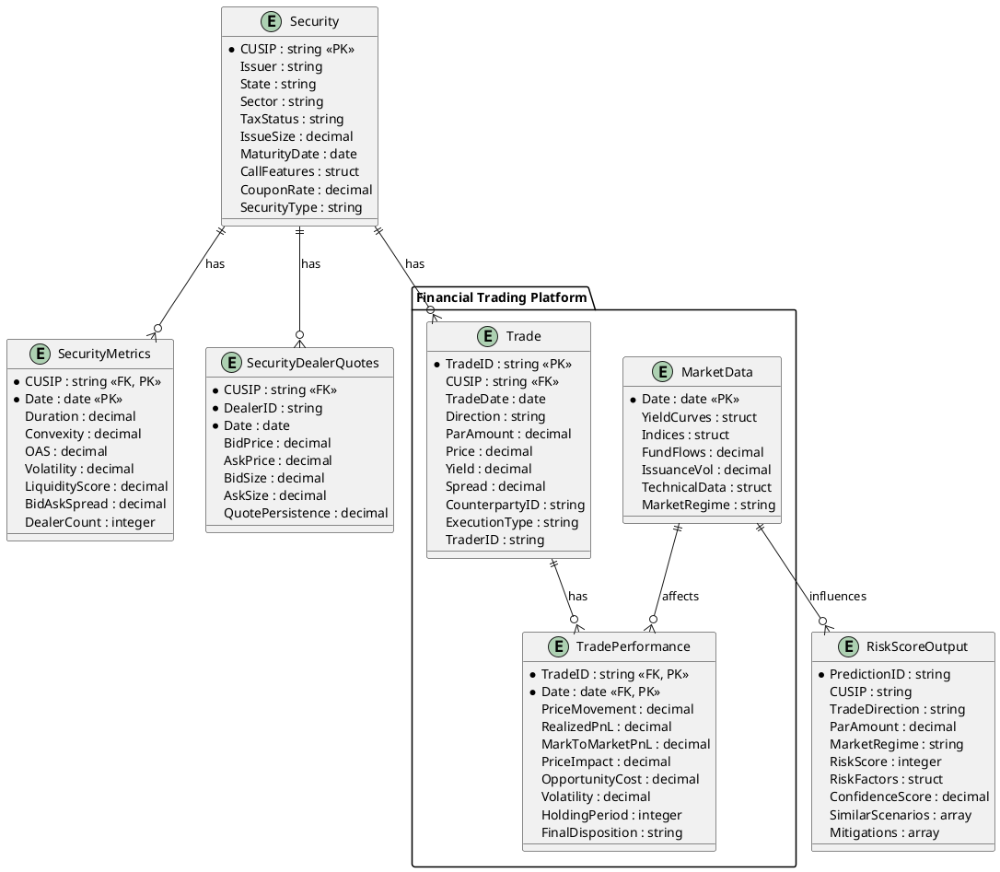

### 4.2 Data Flow for Model Training and Inference

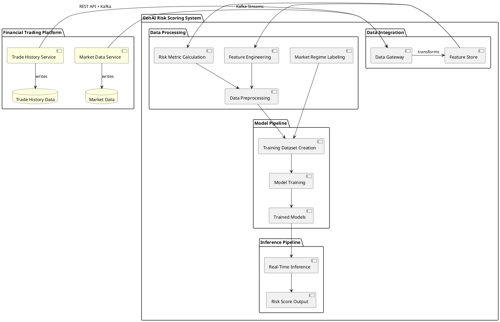

## 5. Model Architecture

### 5.0 System Boundary Definition

The overall solution is divided into two distinct systems with clear interfaces:

1. **Financial Trading Platform** (Out of Scope)
   - Responsible for market data acquisition, normalization, and distribution
   - Handles trade execution, recording, and post-trade analysis
   - Provides standardized data interfaces to consuming systems
   
2. **GenAI Risk Scoring System** (In Scope)
   - Consumes market and trade data via defined interfaces
   - Performs risk analysis, regime identification, and scoring
   - Provides risk assessments and recommendations to traders

This requirements document focuses primarily on the GenAI Risk Scoring System while defining the necessary integration points with the Financial Trading Platform.

### 5.1 Financial Trading Platform Components

#### 5.1.1 Market Data Ingestion Service
- **Purpose**: Capture, normalize, and distribute real-time and historical market data
- **Data Sources**: Bond pricing, yield curves, benchmark rates, market indices, fund flows
- **Operation Mode**: Real-time streaming via Kafka topics
- **Data Structure**:
  ```json
  {
    "dataType": "MARKET_DATA",
    "assetClass": "FIXED_INCOME",
    "timestamp": "ISO8601",
    "dataPoints": [
      {
        "metricType": "YIELD_CURVE",
        "key": "US_TREASURY_10Y",
        "value": 3.85,
        "unit": "PERCENT"
      }
    ],
    "metadata": {
      "source": "BLOOMBERG",
      "confidence": 0.99
    }
  }
  ```
- **Interaction Pattern**: Publishes to dedicated Kafka topics with guaranteed delivery

#### 5.1.2 Trade History Data Service
- **Purpose**: Provide historical trade execution data and performance metrics
- **Data Sources**: Trade books, post-trade analytics, P&L systems
- **Operation Mode**: Batch (daily updates) + incremental updates (hourly)
- **Data Structure**:
  ```json
  {
    "dataType": "TRADE_HISTORY",
    "tradeId": "UUID",
    "securityId": "CUSIP",
    "executionDetails": {
      "timestamp": "ISO8601",
      "price": 98.75,
      "direction": "BUY",
      "quantity": 1000000,
      "counterpartyType": "DEALER"
    },
    "performanceMetrics": {
      "t1PriceChange": 0.25,
      "t5PriceChange": 0.75,
      "realizePnL": 25000
    }
  }
  ```
- **Interaction Pattern**: REST API for historical queries, Kafka for streaming updates

### 5.2 Communication Protocol

#### 5.2.1 GenAI System Integration Points
- **Market Data Consumption**:
  - Subscribe to market data Kafka topics
  - Support backfill operations via REST API
  - Implement circuit breakers for data quality issues
  - Handle delayed/out-of-order data with timestamp-based processing

- **Trade History Consumption**:
  - Daily batch ingestion of complete history (T-1)
  - Incremental updates throughout trading day
  - Exponential backoff retry mechanism
  - Data quality validation with schema enforcement

#### 5.2.2 Data Contracts and SLAs
- **Data Freshness**:
  - Market data: < 5 second latency from source
  - Trade history: Complete T-1 data available by 7:00 AM
  - Incremental updates: < 15 minute delay

- **Data Quality**:
  - Schema validation on all ingested data
  - Completeness metrics (< 0.1% missing values)
  - Consistency checks between incremental and batch data

- **Availability**:
  - Market data service: 99.99% uptime during market hours
  - Trade history service: 99.9% uptime
  - Degraded mode operation during partial outages

### 5.3 Two-Stage GenAI Model Approach

#### 5.3.1 Model 1: Market Regime Predictor
- **Purpose**: Identify current market conditions and regime classification
- **Model Type**: Temporal Fusion Transformer (TFT) with explicit feature importance layer: https://pytorch-forecasting.readthedocs.io/en/v1.2.0/api/pytorch_forecasting.models.temporal_fusion_transformer.TemporalFusionTransformer.html
- **Input**: Current market indicators and technical factors with temporal encodings
- **Output**: 
  - Regime classification with probability distribution
  - Key characterizing factors for the current regime
  - Feature importance weights for interpretability
- **Regimes to Identify**:
  1. Calm/Normal
  2. Volatility-Driven Risk-Off
  3. Liquidity Crisis
  4. Credit-Driven Selloff
  5. Rate-Driven Selloff
  6. Strong Inflow/Rally
  7. Technical Positioning/Dislocation

#### 5.3.2 Model 2: Adaptive Risk Scoring
- **Purpose**: Generate comprehensive risk scores adapted to current market regime
- **Model Type**: Regime-specific neural forecasting models (N-BEATS or DeepAR) with temporal pattern recognition: https://pytorch-forecasting.readthedocs.io/en/v1.2.0/api/pytorch_forecasting.models.nbeats.NBeats.html
- **Input**: 
  - Security parameters
  - Proposed trade details
  - Current dealer behavior
  - Market context with temporal fingerprints
  - Market regime prediction from Model 1
- **Output**:
  - Risk score (0-100)
  - Contributing risk factor breakdown
  - Calibrated confidence intervals using conformal prediction
  - Comparable historical scenarios
  - Suggested risk mitigations

#### 5.3.3 Integration Approach: Dynamic Meta-Learner
- Each regime has a dedicated neural forecasting sub-model
- Meta-learner dynamically adjusts regime weights based on:
  - Regime probabilities
  - Confidence scores
  - Detected transition states
- Handles regime transitions with explicit transition modeling
- Provides calibrated uncertainty estimates during regime transitions

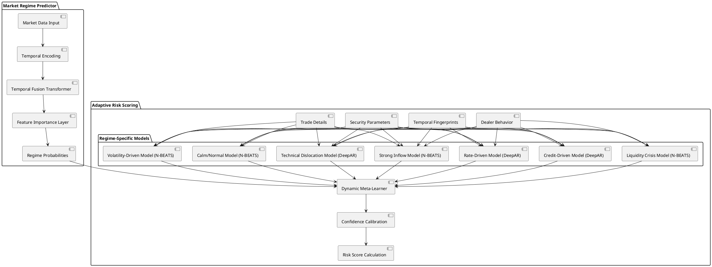

## 6. Key Risk Factor Interactions and Formulas

### 6.1 Complex Interaction Categories

| Interaction Category | Description | Formula Components |
|----------------------|-------------|-------------------|
| Liquidity × Market Direction | Asymmetric liquidity behavior in different market directions | Liquidity metrics, market momentum, trade direction |
| Credit Quality × Market Volatility | Non-linear relationship between credit quality and price pressure during volatility | Credit ratings, spread volatility, market regime |
| Duration × Liquidity × Market Direction | Compounding effects of duration and liquidity in directional markets | Modified duration, liquidity score, rate movement |
| Dealer Inventory × Issue Size × Recent Issuance | Supply-demand dynamics affecting specific securities | Dealer positions, outstanding size, primary calendar |
| Tax Status × Seasonal Factors × Fund Flows | Tax-driven behavioral effects on specific security types | Tax status, calendar position, fund flow data |
| Call Options × Interest Rate Environment × Issuer Quality | Refinancing behavior and option value changes | Call features, rate environment, issuer rating |

### 6.2 Key Mathematical Formulas

#### 6.2.1 Liquidity-Adjusted Risk Score

$$
\text{LiquidityRiskScore} = \text{BaseScore} \times \left(1 + \beta \times \frac{\text{TradeSize}}{\text{AvgDailyVolume}} \times e^{\alpha \times \text{MarketDirectionFactor}}\right)
$$

Where:
- $\text{BaseScore}$ is the initial risk assessment
- $\beta$ is the liquidity sensitivity parameter (regime-dependent)
- $\alpha$ is the market direction sensitivity (higher in selloffs)
- $\text{MarketDirectionFactor}$ is negative in selloffs, positive in rallies

#### 6.2.2 Credit-Volatility Adjustment

$$
\text{CreditVolRisk} = \text{BaseRisk} \times \left(1 + \gamma \times (10 - \text{NumericRating})^2 \times \frac{\text{CurrentVol}}{\text{HistoricalAvgVol}}\right)
$$

Where:
- $\text{NumericRating}$ converts alphanumeric ratings to numeric (AAA=10, AA+=9, etc.)
- $\gamma$ is the credit sensitivity parameter (regime-dependent)
- $\text{CurrentVol}$ is the current market volatility
- $\text{HistoricalAvgVol}$ is the long-term average volatility

#### 6.2.3 Duration-Liquidity Compound Risk

$$
\text{DurationLiquidityRisk} = \text{Duration} \times \text{LiquidityScore} \times \left(1 + \delta \times \text{MarketDirectionFactor} \times \text{RateMovementExp}\right)
$$

Where:
- $\text{Duration}$ is the modified duration
- $\text{LiquidityScore}$ is the standardized liquidity measure (0-1)
- $\delta$ is the compounding factor (regime-dependent)
- $\text{RateMovementExp}$ is the expected rate movement in the current regime

#### 6.2.4 Call Option Risk Assessment

$$
\text{CallOptionRisk} = \text{CallProbability} \times \frac{\text{CurrentPrice} - \text{CallPrice}}{\text{CallPrice}}
$$

Where $\text{CallProbability}$ is calculated as:

$$
\text{CallProbability} = \text{min}\left(0.95, \text{max}\left(0.05, \Phi\left(\frac{\text{RefRate} - \text{CouponRate} + \theta \times \text{CreditSpread}}{\sigma_{\text{rates}} \times \sqrt{\text{TimeToCall}}}\right)\right)\right)
$$

Where:
- $\Phi$ is the cumulative normal distribution function
- $\text{RefRate}$ is the reference rate for comparable maturity
- $\theta$ is the issuer quality factor
- $\sigma_{\text{rates}}$ is the rate volatility

#### 6.2.5 Composite Risk Score Calculation

$$
\text{CompositeRiskScore} = \sum_{i=1}^{n} w_i(\text{regime}) \times \text{RiskFactor}_i
$$

Where:
- $w_i(\text{regime})$ are the regime-dependent weights for each risk factor
- $\text{RiskFactor}_i$ are the individual risk components
- $n$ is the number of risk factors considered

## 7. Implementation Approach

### 7.1 Model Training Methodology

1. **Data Preparation**
   - Clean and normalize historical trade data
   - Implement sliding window feature generation with variable lookback periods
   - Generate temporal fingerprints to capture seasonality and cycles
   - Add automatic anomaly detection for data quality issues
   - Engineer interaction features to capture complex relationships
   - Create regime-specific feature normalization to account for distribution shifts
   - Mask all counterparty IDs (CID) and account information

2. **Market Regime Identification**
   - Label historical periods with market regimes using expert knowledge
   - Implement data augmentation for underrepresented regimes using time series specific techniques
   - Train Temporal Fusion Transformer with variable selection network
   - Use Bayesian hyperparameter optimization instead of fixed parameters
   - Validate using multiple temporal cross-validation folds

3. **Risk Model Training**
   - Implement curriculum learning (starting with simple patterns, then complex)
   - Add explicit regime transition samples with higher weights in training
   - Train neural forecasting models for each regime with different architectures suited to regime characteristics
   - Apply conformal prediction for calibrated uncertainty estimates
   - Create meta-learner to dynamically adjust regime importance based on confidence scores

4. **Validation Approach**
   - Temporal cross-validation with multiple folds (train on past, validate on future)
   - Implement adversarial validation to detect distribution shifts
   - Performance metrics: RMSE, MAE for risk scores, plus calibrated uncertainty estimates
   - Classification metrics: F1, AUC for regime identification
   - Trading metrics: Correlation with realized volatility, P&L outcomes

### 7.2 Inference Pipeline

1. **Real-time Market Data Processing**
   - Implement Kafka-based streaming architecture for sub-millisecond responses
   - Calculate derived metrics and indicators through stream processing
   - Use feature store (Redis + Apache Pinot) for efficient feature retrieval and computation
   - Normalize according to regime-specific distributions

2. **Market Regime Prediction**
   - Apply Temporal Fusion Transformer model with NVIDIA Triton acceleration
   - Generate regime probabilities and uncertainty estimates
   - Extract feature importance for interpretability

3. **Trade Risk Calculation**
   - Process security and trade parameters
   - Apply regime-specific neural forecasting models
   - Use dynamic meta-learner to adjust weights based on regime transitions
   - Generate composite risk score with calibrated confidence intervals

4. **Output Generation and Feedback Loop**
   - Format risk assessment for API response
   - Include calibrated confidence intervals and historical comparisons
   - Generate risk mitigation suggestions
   - Implement model-in-the-loop feedback system to improve future predictions

## 8. Work Breakdown Structure

### 8.1 Data Engineering Tasks

1. **Data Collection and Integration**
   - Define data schemas and relations
   - Establish data pipelines for historical trade data
   - Implement security master data integration
   - Develop market data collection mechanisms

2. **Feature Engineering**
   - Implement core risk metric calculations
   - Develop derived indicators and interaction features
   - Create data transformation pipeline
   - Build data validation and quality checks

3. **Training Dataset Creation**
   - Generate regime labels for historical periods
   - Create feature vectors for model training
   - Implement data splitting strategy (temporal CV)
   - Develop data versioning and lineage tracking

### 8.2 Model Development Tasks

1. **Market Regime Model**
   - Design model architecture
   - Implement feature preprocessing
   - Develop training pipeline
   - Perform hyperparameter optimization
   - Create evaluation framework

2. **Risk Scoring Models**
   - Design ensemble architecture
   - Implement regime-specific sub-models
   - Develop training pipeline for each sub-model
   - Create integration mechanism for sub-models
   - Implement weighting scheme for regime probabilities

3. **Model Validation**
   - Design validation methodology
   - Implement performance metrics
   - Create backtesting framework
   - Develop comparative analysis tools

### 8.3 Inference Pipeline Tasks

1. **Real-time Data Processing**
   - Implement data ingestion APIs
   - Develop normalization pipeline
   - Create feature calculation components
   - Build caching mechanism for repeated queries

2. **Model Inference Service**
   - Design service architecture
   - Implement model loading and versioning
   - Develop inference optimization
   - Create response formatting logic

3. **Integration Services**
   - Implement service APIs
   - Develop security and authentication
   - Create logging and monitoring
   - Build error handling and fallback mechanisms

### 8.4 Testing and Validation Tasks

1. **Unit Testing**
   - Test core calculations and formulas
   - Validate data transformations
   - Verify model input/output handling

2. **Integration Testing**
   - Test end-to-end inference pipeline
   - Validate API functionality
   - Verify performance under load

3. **Model Performance Validation**
   - Backtest on historical trades
   - Validate against known risk scenarios
   - Compare to existing risk methodologies

4. **Performance Optimization**
   - Profile and optimize inference latency
   - Implement caching strategies
   - Optimize model size and complexity

## 9. Regulatory Compliance

### 9.1 Data Privacy Requirements

- All trader and counterparty identifiers must be masked during training
- No PII may be stored in the model or used for inference
- All account information must be anonymized

### 9.2 Data Retention

- The model itself should not store any trade data
- Historical data is used only for training and fine-tuning
- No client-specific information should be retained in the model

## 10. Success Criteria

1. Risk score predictive accuracy > 75% (correlation with realized volatility)
2. Market regime identification accuracy > 80%
3. Sub-second response time for risk score generation
4. Clear factor attribution for all risk scores
5. Successful integration with trading workflow

## 11. Technical Implementation Details

### 11.1 Model Specifics

#### 11.1.1 Market Regime Predictor Model Architecture

- **Model Type**: Temporal Fusion Transformer (TFT)
- **Input Dimension**: Combined feature vector of ~100 market indicators with temporal encodings
- **Architecture**:
  - Variable selection networks for feature importance
  - Temporal processing: LSTM encoders/decoders
  - Self-attention layers with 8 heads
  - Interpretable multi-head attention for variable attribution
- **Output Layer**: Softmax layer for regime probabilities with uncertainty quantification
- **Training Parameters**:
  - Learning rate: Bayesian optimization in range [0.00001, 0.001]
  - Batch size: Dynamic based on gradient accumulation
  - Epochs: Early stopping with patience=10
  - Loss function: Focal loss with label smoothing for imbalanced regimes

#### 11.1.2 Risk Scoring Model Architecture

- **Base Model Type**: Ensemble of regime-specific neural forecasting models
- **Model Architectures by Regime**:
  - Calm/Normal: N-BEATS with trend-seasonal decomposition
  - Volatility-Driven: N-BEATS with uncertainty quantification
  - Liquidity Crisis: DeepAR with custom likelihood function
  - Credit-Driven: DeepAR with hierarchical structure
  - Rate-Driven: Temporal Convolutional Network with skip connections
  - Strong Inflow: N-BEATS with interpretable blocks
  - Technical Dislocation: DeepAR with mixture density outputs
- **Feature Input**: ~200 dimensions with explicit temporal features
- **Regime Integration**: 
  - Dynamic meta-learner adjusting weights in real-time
  - Explicit modeling of regime transitions
  - Confidence calibration using conformal prediction
- **Training Approach**:
  - Curriculum learning (simple to complex patterns)
  - Progressive regime transition modeling
  - Regularization through temporal consistency constraints
  - Model distillation for inference speed

### 11.2 Calculation Specifics

#### 11.2.1 Liquidity Risk Quantification

$$
\text{LiquidityScore} = w_1 \times \frac{\text{AvgDailyVolume}}{\text{OutstandingSize}} + w_2 \times \frac{1}{\text{BidAskSpread}} + w_3 \times \text{DealerCount} + w_4 \times \text{TradeFrequency}
$$

Where weights $w_1$ through $w_4$ are regime-dependent:

| Regime | $w_1$ | $w_2$ | $w_3$ | $w_4$ |
|--------|-------|-------|-------|-------|
| Calm/Normal | 0.20 | 0.30 | 0.25 | 0.25 |
| Volatility-Driven | 0.15 | 0.40 | 0.30 | 0.15 |
| Liquidity Crisis | 0.10 | 0.50 | 0.30 | 0.10 |
| Credit-Driven | 0.20 | 0.25 | 0.35 | 0.20 |
| Rate-Driven | 0.25 | 0.30 | 0.25 | 0.20 |
| Strong Inflow | 0.30 | 0.20 | 0.20 | 0.30 |
| Technical Dislocation | 0.20 | 0.25 | 0.40 | 0.15 |

#### 11.2.2 Price Impact Estimation

$$
\text{EstimatedPriceImpact} = \alpha \times \left( \frac{\text{TradeSize}}{\text{AvgDailyVolume}} \right)^\beta \times \text{VolatilityAdjustment} \times \text{RegimeFactor}
$$

Where:
- $\alpha$ is the base impact coefficient (calibrated from historical data)
- $\beta$ is the non-linear scaling factor (typically 0.5-0.8)
- $\text{VolatilityAdjustment} = \frac{\text{CurrentVolatility}}{\text{HistoricalAvgVolatility}}$
- $\text{RegimeFactor}$ varies by market regime (higher in stressed regimes)

#### 11.2.3 Expected Holding Period Risk

$$
\text{HoldingPeriodRisk} = \text{Position} \times \text{Duration} \times \text{DailyVolatility} \times \sqrt{\text{ExpectedHoldingDays}} \times \text{RegimeScalar}
$$

Where:
- $\text{Position}$ is the trade size in par amount
- $\text{ExpectedHoldingDays}$ is estimated based on security characteristics and historical patterns
- $\text{RegimeScalar}$ adjusts the risk estimate based on current market regime

### 11.3 Data Pipeline Implementation

#### 11.3.1 Batch Processing Components

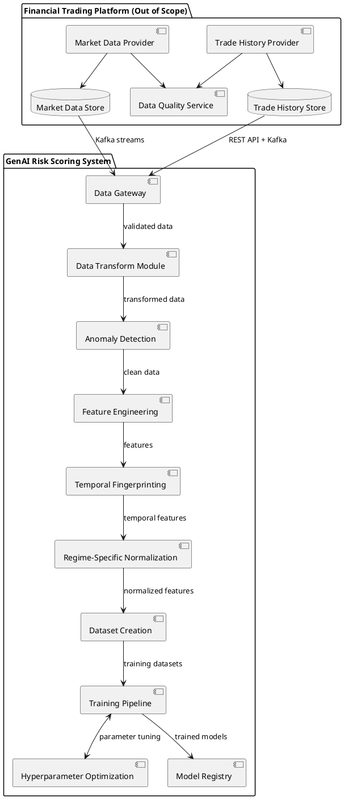

#### 11.3.2 Real-time Inference Components

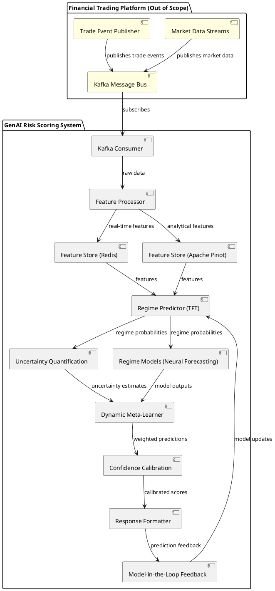

### 11.4 Feature Store Implementation

A dedicated feature store will be implemented to manage feature computation, storage, and retrieval, ensuring consistent features between training and inference while minimizing redundant calculations.

#### 11.4.1 Feature Store Architecture

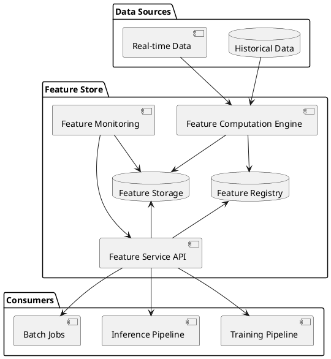

#### 11.4.2 Feature Freshness Policies

| Feature Category | Update Frequency | TTL | Caching Strategy |
|------------------|------------------|-----|------------------|
| Security Static Attributes | Daily | 24 hours | Long-term cache |
| Security Calculated Metrics | Daily | 24 hours | Long-term cache |
| Market Data Features | 5 minutes | 1 hour | Short-term cache |
| Derived Technical Indicators | 5 minutes | 1 hour | Short-term cache |
| Dealer Quote Features | 15 minutes | 2 hours | Medium-term cache |
| Regime Indicators | 15 minutes | 4 hours | Medium-term cache |

#### 11.4.3 Feature Materialization Strategy

1. **Online Features**:
   - Real-time computed features for immediate inference
   - Low-latency access pattern (sub-50ms)
   - Redis or in-memory database storage

2. **Offline Features**:
   - Pre-computed for model training
   - Batch-oriented access pattern
   - Parquet files in object storage with partitioning

3. **Near-real-time Features**:
   - Periodically materialized (5-15 minute intervals)
   - Used for both training and inference
   - Stored in columnar format (Parquet) with streaming updates

#### 11.4.4 Feature Consistency Enforcement

- Single computation logic shared between training and inference
- Versioned feature transformations with backward compatibility
- Feature drift detection and alerting
- Automated retraining triggers based on feature distribution shifts

### 11.5 Data Versioning and Lineage

A robust data versioning system will be implemented to ensure reproducibility of model training and facilitate regulatory compliance.

#### 11.5.1 Dataset Versioning Strategy

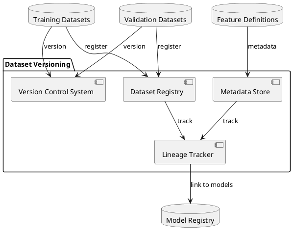

#### 11.5.2 Version Control Implementation

1. **Immutable Snapshots**:
   - Each training dataset preserved as immutable snapshot
   - Content-addressable storage with hash-based verification
   - Delta-based storage to minimize duplication

2. **Metadata Tracking**:
   - Creation timestamp and author
   - Source data versions and feature store version
   - Data preprocessing parameters
   - Data quality metrics
   - Train/validation/test split methodology

3. **Lineage Graph**:
   - Complete graph of dataset derivations
   - Links between source data, feature transformations, and resulting datasets
   - Directed acyclic graph (DAG) representation of all transformations

#### 11.5.3 Reproducibility Guarantees

1. **Training Reproducibility**:
   - Exact dataset reconstruction capability
   - Versioned preprocessing code
   - Consistent train/validation/test splits
   - Random seed persistence

2. **Inference Reproducibility**:
   - Versioned feature transformations
   - Capture of all inference-time inputs
   - Timestamp-based feature store access

3. **Regulatory Compliance**:
   - Complete audit trail of data usage
   - Model-to-data provenance tracking
   - Data access logging and authorization controls

### 11.6 Storage Optimization for Time-Series Data

Efficient storage strategies will be implemented to handle the large volumes of historical market data, security metrics, and trade information while maintaining query performance.

#### 11.6.1 Time-Series Compression Techniques

1. **Delta Encoding**:
   - Store differences between successive values rather than absolute values
   - Particularly effective for slowly changing metrics (bid-ask spreads, liquidity scores)
   - Typical compression ratio: 5:1 to 10:1 for market data

2. **Lossy Compression for Historical Data**:
   - Progressive downsampling based on age:
     - Full granularity for most recent 30 days
     - 5-minute aggregation for 30-90 days
     - Hourly aggregation for 90-365 days
     - Daily aggregation beyond 1 year
   - Maintain summary statistics (min, max, mean, std) for each aggregation period
   - Exception flagging for significant market events (preserve full granularity)

3. **Column-oriented Storage**:
   - Leveraging time-series similarity within columns
   - Dictionary encoding for categorical variables
   - Run-length encoding for sparse changes
   - Bitmap indexing for efficient filtering

#### 11.6.2 Partitioning Strategy

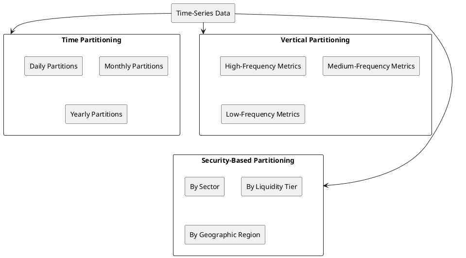

1. **Multi-level Temporal Partitioning**:
   - Daily partitions for most recent data (30 days)
   - Monthly partitions for medium-term data (1-12 months)
   - Yearly partitions for historical data (>1 year)
   - Partition pruning for query optimization

2. **Attribute-based Partitioning**:
   - Security characteristics (sector, maturity bucket, rating category)
   - Query pattern optimization (most frequent query dimensions)
   - Balanced partition sizes to avoid hotspots

3. **Update Frequency Partitioning**:
   - Separate storage for different update frequencies
   - Minimizes write amplification
   - Improves read performance by isolating hot data

#### 11.6.3 Storage Tiering Implementation

1. **Hot Tier**:
   - Most recent 30 days of market data and security metrics
   - High-performance SSD storage
   - In-memory caching layer for active securities
   - Sub-millisecond access times
   - Optimized for real-time inference and recent historical analysis

2. **Warm Tier**:
   - 1-12 months of historical data
   - Balanced performance/cost storage
   - Column-oriented format with moderate compression
   - 10-100ms access times
   - Used for model training and medium-term analysis

3. **Cold Tier**:
   - Data older than 12 months
   - Object storage with high compression
   - Heavily aggregated with selective preservation of important events
   - 1-10s access times acceptable
   - Used for long-term pattern analysis and regulatory compliance

4. **Automated Data Migration**:
   - Age-based migration policies
   - Access-pattern based retention in higher tiers
   - Pre-emptive warming based on scheduled analysis jobs

#### 11.6.4 Query Optimization Techniques

1. **Materialized Views**:
   - Pre-computed aggregates for common analysis patterns
   - Time-based rollups (daily, weekly, monthly summaries)
   - Security-based aggregations
   - Regime-specific metric calculations

2. **Approximate Query Processing**:
   - Sampling-based approximation for large historical queries
   - Error bounds guarantees for approximate results
   - Progressive query refinement for interactive analysis

3. **Time-Series Specific Indexing**:
   - Temporal indices for range-based queries
   - Multi-dimensional indices for combined filtering
   - Bitmap indices for high-cardinality dimensions

This comprehensive storage optimization strategy will reduce storage costs by 60-80% while maintaining query performance within SLA requirements for both real-time inference and historical analysis.

## 12. Performance Metrics and Evaluation

### 12.1 Model Performance Metrics

#### 12.1.1 Regime Prediction Metrics

| Metric | Target | Description | Formula |
|--------|--------|-------------|---------|
| Accuracy | >80% | Overall regime classification accuracy | $\frac{\text{Correct Predictions}}{\text{Total Predictions}}$ |
| F1 Score | >0.75 | Harmonic mean of precision and recall | $2 \times \frac{\text{Precision} \times \text{Recall}}{\text{Precision} + \text{Recall}}$ |
| Log Loss | <0.5 | Measures probabilistic accuracy | $-\frac{1}{N}\sum_{i=1}^{N}\sum_{j=1}^{M}y_{ij}\log(p_{ij})$ |
| Regime Transition Detection | >70% | Accuracy in detecting regime shifts | Custom metric based on change-point detection |

#### 12.1.2 Risk Score Metrics

| Metric | Target | Description | Formula |
|--------|--------|-------------|---------|
| RMSE | <15 | Root mean squared error of risk prediction | $\sqrt{\frac{1}{n}\sum_{i=1}^{n}(y_i - \hat{y}_i)^2}$ |
| Spearman Correlation | >0.7 | Rank correlation with actual outcomes | $\rho = 1 - \frac{6\sum d_i^2}{n(n^2-1)}$ |
| Calibration Error | <0.1 | Measures reliability of probability estimates | $\frac{1}{B}\sum_{b=1}^{B}\left\|o_b - e_b\right\|$ |
| Factor Attribution Accuracy | >75% | Accuracy of risk factor identification | Custom metric based on factor importance |

### 12.2 System Performance Metrics

| Metric | Target | Description |
|--------|--------|-------------|
| P95 Latency | <200ms | 95th percentile response time |
| P99 Latency | <500ms | 99th percentile response time |
| Throughput | >100 req/s | Requests processed per second |
| Availability | >99.9% | System uptime |
| Error Rate | <0.1% | Percentage of failed requests |

### 12.3 Business Value Metrics

| Metric | Target | Description | Calculation Method |
|--------|--------|-------------|-------------------|
| Risk-Adjusted Return Improvement | >15bps | Improvement in risk-adjusted returns | Compare portfolio performance before/after implementation |
| Execution Quality Improvement | >10% | Reduction in execution costs | Compare average execution costs before/after |
| Decision Time Reduction | >30% | Reduction in pre-trade analysis time | Measure trader time spent on analysis |
| Adverse Selection Reduction | >20% | Reduction in trades with negative outcomes | Compare percentage of losing trades |

## 13. Testing Methodology

### 13.1 Training-Validation-Test Split

Historical data will be split using temporal cross-validation with multiple folds:
- **Initial Training**: Oldest 50% of the data
- **Validation Folds**: Next 30% of data split into 5 sequential folds
- **Test Data**: Most recent 20% of the data held out as final evaluation

### 13.2 Cross-Validation Approach

- **Multi-fold temporal cross-validation**:
  - Train on windows [0, t₁], [0, t₂], etc.
  - Validate on windows [t₁+1, t₁+k], [t₂+1, t₂+k], etc.
  - Evaluate performance across all folds
  - Apply conformal prediction to calibrate uncertainty

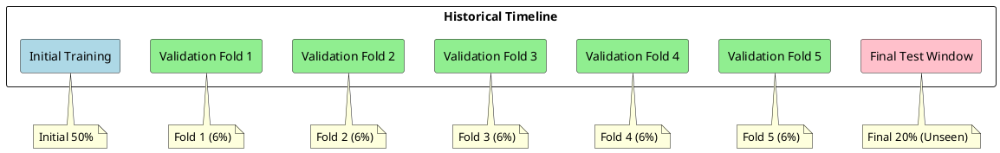

### 13.3 Backtest Methodology

1. **Historical Scenario Replay**:
   - Replay historical market scenarios
   - Apply model at each point to generate risk scores
   - Compare with actual outcomes
   - Evaluate calibrated confidence intervals

2. **Adversarial Validation**:
   - Create classifier to distinguish training vs. test data
   - Measure distribution shift with divergence metrics
   - Use feature importance from adversarial model to identify drift sources

3. **Regime Transition Testing**:
   - Create synthetic regime transition scenarios
   - Test dynamic meta-learner adaptation
   - Measure uncertainty calibration during transitions

## 14. Data Quality and Governance

### 14.1 Data Quality Requirements

| Data Quality Dimension | Requirement | Validation Method |
|------------------------|-------------|-------------------|
| Completeness | <5% missing values | Automated data quality checks |
| Accuracy | 99% match to source systems | Reconciliation with source data |
| Timeliness | Market data <5min delay | Timestamp monitoring |
| Consistency | <1% inconsistency rate | Cross-system validation |
| Integrity | 100% referential integrity | Database constraint checks |

### 14.2 Data Preprocessing Requirements

1. **Handling Missing Values**:
   - Time-series interpolation for missing market data
   - Median imputation for missing security attributes
   - Flagging and special handling for structurally missing data

2. **Outlier Detection and Treatment**:
   - Z-score based detection (|z| > 3)
   - Winsorization at 1st and 99th percentiles
   - Special flagging of true outliers vs. errors

3. **Feature Scaling**:
   - Standardization (z-score) for continuous features
   - Min-max scaling for bounded features
   - Log transformation for heavily skewed distributions

4. **Feature Engineering**:
   - Calculate all derived metrics before model input
   - Create interaction terms for known relationships
   - Generate temporal features (lags, moving averages)

## 15. System Integration

### 15.1 API Interface Specification

#### 15.1.1 Risk Score Request

```json
{
  "requestId": "string",
  "timestamp": "ISO8601 timestamp",
  "securityIdentifier": {
    "cusip": "string",
    "isin": "string (optional)"
  },
  "tradeDetails": {
    "direction": "BUY | SELL",
    "parAmount": "decimal",
    "indicativePrice": "decimal (optional)",
    "indicativeYield": "decimal (optional)"
  },
  "contextInformation": {
    "dealerId": "string (optional)",
    "executionMethod": "string (optional)",
    "portfolioId": "string (optional)"
  }
}
```

#### 15.1.2 Risk Score Response

```json
{
  "requestId": "string",
  "timestamp": "ISO8601 timestamp",
  "securityIdentifier": {
    "cusip": "string"
  },
  "marketRegime": {
    "primaryRegime": "string",
    "regimeProbabilities": {
      "regime1": "decimal",
      "regime2": "decimal",
      "...": "..."
    },
    "keyIndicators": ["string", "string", "..."]
  },
  "riskAssessment": {
    "overallRiskScore": "integer (0-100)",
    "confidenceInterval": {
      "lower": "integer",
      "upper": "integer"
    },
    "riskComponents": [
      {
        "factorName": "string",
        "contribution": "decimal",
        "description": "string"
      },
      "..."
    ]
  },
  "comparableScenarios": [
    {
      "scenarioDate": "ISO8601 date",
      "similarityScore": "decimal",
      "outcome": "string",
      "description": "string"
    },
    "..."
  ],
  "mitigationSuggestions": [
    {
      "suggestion": "string",
      "estimatedImpact": "decimal",
      "reasoning": "string"
    },
    "..."
  ],
  "processingMetadata": {
    "processingTimeMs": "integer",
    "modelVersion": "string",
    "dataTimestamp": "ISO8601 timestamp"
  }
}
```

### 15.2 Integration Points

1. **Market Data Systems**:
   - Real-time market data feeds
   - Historical price databases
   - Index and benchmark data

2. **Security Master**:
   - Bond reference data
   - Issuer information
   - Credit ratings

3. **Trading Systems**:
   - Order management system
   - Execution management system
   - Position management system

4. **Risk Systems**:
   - Portfolio risk management
   - Compliance monitoring
   - Limit management 

## 16. Deployment Strategy

### 16.1 Model Training and Deployment Pipeline

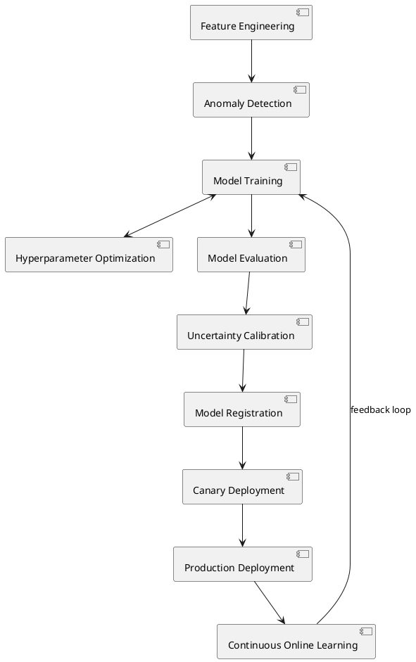

### 16.2 Serving Infrastructure

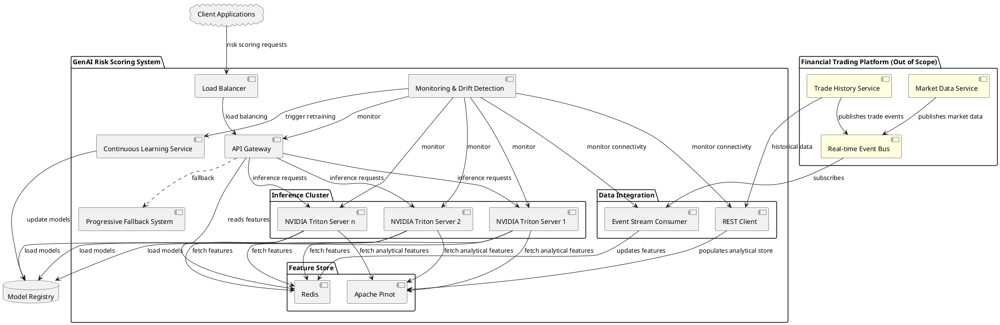

## 16a. Integration with Financial Trading Platform

### 16a.1 Data Gateway Layer

The Data Gateway serves as the interface between the external Financial Trading Platform and the GenAI Risk Scoring System:

1. **Adapter Components**:
   - Market Data Adapter: Consumes and normalizes streaming market data
   - Trade History Adapter: Processes historical and incremental trade data
   - Security Master Adapter: Synchronizes security reference data

2. **Error Handling**:
   - Circuit breakers to prevent cascade failures
   - Graceful degradation during partial outages
   - Dead letter queues for failed message processing
   - Automatic retry with exponential backoff

3. **Data Transformation**:
   - Convert external formats to internal feature representations
   - Apply standardized normalization and validation
   - Enrich data with derived calculations
   - Tag data with source and confidence metadata

### 16a.2 Feature Store Adaptation

The Feature Store is designed to work with the external Financial Trading Platform:

1. **Data Validation Pipeline**:
   - Schema validation against published contracts
   - Statistical validation against historical distributions
   - Anomaly detection for sudden pattern changes
   - Quality scoring with configurable thresholds

2. **Caching Strategy**:
   - Hot cache for actively traded securities
   - Tiered storage based on access patterns
   - Precomputed features for common queries
   - Cache invalidation based on update frequency

3. **Resilience Patterns**:
   - Read-through caching for missing data
   - Write-behind for performance optimization
   - Cache warming for anticipated query patterns
   - Fallback to stale data with degraded confidence

### 16a.3 Monitoring Extensions

Special monitoring is implemented for external integration points:

1. **Integration Health Metrics**:
   - Connection status to each external system
   - Message processing latency and throughput
   - Error rates and types by source
   - Data completeness and freshness metrics

2. **SLA Compliance Monitoring**:
   - Real-time dashboards for SLA tracking
   - Historical compliance reporting
   - Automated alerting for SLA violations
   - Trend analysis for degrading performance

3. **Recovery Mechanisms**:
   - Automatic reconnection to external systems
   - Data backfill procedures for missed intervals
   - Graceful degradation modes
   - Business continuity procedures for extended outages

## 17. Maintenance and Monitoring Plan

### 17.1 Model Drift Monitoring

- Track feature distribution shifts using distributional distance metrics (KL-divergence, Wasserstein)
- Implement adversarial classifiers to detect subtle data distribution changes
- Monitor prediction uncertainty calibration over time
- Automatically detect concept drift (relationship changes) vs. feature drift
- Implement explicit monitoring for regime transition accuracy

### 17.2 Retraining Strategy

- Continuous online learning with controlled, gradual model updates
- Implement automatic A/B testing of model improvements
- Use progressive deployment with canary testing
- Maintain version control of model lineage and data provenance
- Implement causal analysis for model performance degradation

### 17.3 Monitoring Metrics

- Feature drift (KL-divergence, Wasserstein distance)
- Uncertainty calibration (expected calibration error)
- Adaptive conformal prediction coverage
- Regime transition detection accuracy
- Meta-learner adaptation metrics
- Model explainability consistency

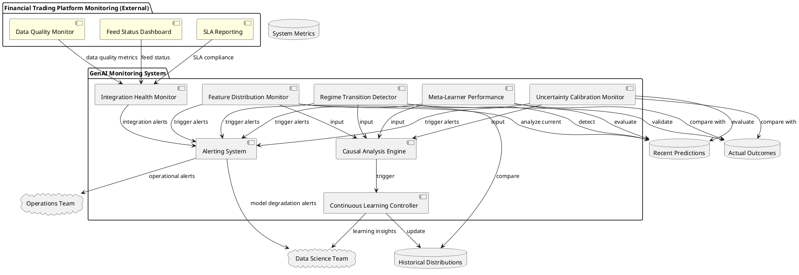

## 18. Implementation Timeline and Dependencies

### 18.1 High-Level Timeline

| Phase | Duration | Description | Key Deliverables |
|-------|----------|-------------|-----------------|
| 1 | 6 weeks | Data Engineering | Data pipelines, feature engineering framework |
| 2 | 8 weeks | Model Development | Trained regime and risk models |
| 3 | 4 weeks | Inference Pipeline | Real-time scoring system |
| 4 | 4 weeks | Testing and Validation | Validated model performance |
| 5 | 2 weeks | Integration | API integrations with trading systems |
| 6 | 2 weeks | Deployment | Production deployment |
| 7 | 4 weeks | Monitoring and Tuning | Monitoring systems, fine-tuning |

```plantuml
@startuml

project starts 2023-01-02

[Data Engineering] as [DE] lasts 6 weeks
[Model Development] as [MD] lasts 8 weeks
[Inference Pipeline] as [IP] lasts 4 weeks
[Testing and Validation] as [TV] lasts 4 weeks
[Integration] as [INT] lasts 2 weeks
[Deployment] as [DEP] lasts 2 weeks
[Monitoring and Tuning] as [MT] lasts 4 weeks

[DE] starts 2023-01-02
[MD] starts at [DE]'s end
[IP] starts at [MD]'s end
[TV] starts at [IP]'s end
[INT] starts at [TV]'s end
[DEP] starts at [INT]'s end
[MT] starts at [DEP]'s end

@enduml
```

### 18.2 Critical Dependencies

1. **Data Availability**:
   - Historical trade data with outcomes
   - Clean security master data
   - Accurate market regime labels

2. **Technical Dependencies**:
   - Real-time market data feeds
   - High-performance compute resources for training
   - Low-latency inference infrastructure

3. **Business Dependencies**:
   - Trading system API access
   - Subject matter expert input for validation
   - Trader feedback during testing

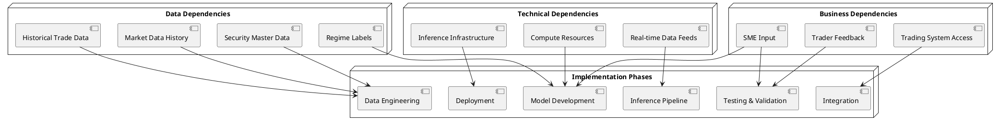

## 19. Future Enhancements

### 19.1 Potential Model Improvements

1. **Reinforcement Learning Integration**:
   - Train models that optimize for long-term portfolio performance
   - Develop adaptive risk budgeting algorithms

2. **Natural Language Processing**:
   - Incorporate news sentiment analysis
   - Process regulatory filings and issuer disclosures

3. **Graph Neural Networks**:
   - Model relationships between issuers, sectors, and geographic regions
   - Detect contagion risk and correlation breakdowns

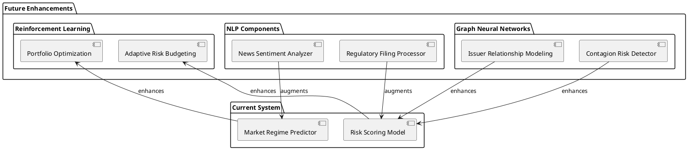

### 19.2 Roadmap for Additional Features

1. **Portfolio Optimization Integration**:
   - Connect risk scoring to portfolio construction
   - Provide optimal trade sizing recommendations

2. **Scenario Analysis Tools**:
   - Allow traders to test hypothetical market scenarios
   - Simulate regime transitions and impact

3. **Adaptive Benchmarking**:
   - Develop custom risk-return benchmarks
   - Track performance attribution by risk factor

```plantuml
@startuml

scale 0.8

concise "Feature Timeline" as FT

@0
FT is "Current System"

@3
FT is "Portfolio Optimization"

@6
FT is "Scenario Analysis"

@9
FT is "Adaptive Benchmarking"

@12
FT is "ML Enhancements"

@enduml
```

## 20. Appendix: Sample Calculations

### Appendix A: Example Risk Score Calculation

For a sample municipal bond with the following characteristics:
- AA-rated general obligation bond
- 5-year maturity
- 3.75% coupon
- Modified duration of 4.2
- Average daily volume of $2M
- Current bid-ask spread of 5 bps
- Proposed trade size of $10M (sell)
- Current market regime: Volatility-Driven Risk-Off (75% probability), Rate-Driven Selloff (25% probability)

The risk score would be calculated as follows:

1. **Base Risk Calculations**:

   Duration Risk:
   $$\text{DurationRisk} = 4.2 \times 3.5 \text{ (volatility factor)} = 14.7$$

   Liquidity Risk:
   $$\text{LiquidityRisk} = \frac{10M}{2M} \times 0.8 \text{ (size factor)} \times 1.3 \text{ (regime factor)} = 5.2$$

   Credit Risk:
   $$\text{CreditRisk} = (10 - 8) \text{ (rating numeric)} \times 1.2 \text{ (regime factor)} = 2.4$$

2. **Interaction Effects**:

   Duration-Liquidity Interaction:
   $$\text{DurationLiquidityEffect} = 14.7 \times 5.2 \times 0.03 \text{ (interaction coefficient)} = 2.3$$

   Credit-Volatility Interaction:
   $$\text{CreditVolatilityEffect} = 2.4 \times 3.5 \text{ (volatility)} \times 0.25 \text{ (coefficient)} = 2.1$$

3. **Regime-Specific Calculations**:

   Volatility-Regime Risk:
   $$\text{VolatilityRegimeScore} = (14.7 + 5.2 + 2.4 + 2.3 + 2.1) \times 1.15 \text{ (regime adjuster)} = 30.8$$

   Rate-Selloff-Regime Risk:
   $$\text{RateSelloffRegimeScore} = (14.7 + 5.2 + 2.4 + 2.3 + 2.1) \times 1.25 \text{ (regime adjuster)} = 33.4$$

4. **Composite Risk Score**:
   $$\text{CompositeRiskScore} = 0.75 \times 30.8 + 0.25 \times 33.4 = 31.5$$

5. **Normalized 0-100 Score**:
   $$\text{NormalizedScore} = \text{min}(100, \text{max}(0, 31.5 \times 2.2)) = 69$$

The final risk score would be 69 out of 100, with the primary contributors being duration risk and liquidity risk, amplified by the current volatility-driven risk-off regime.

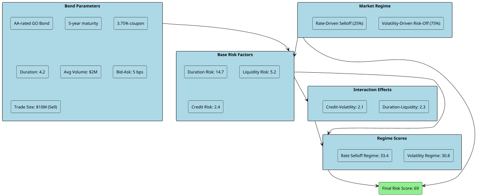

### Appendix B: Risk Factor Relationships

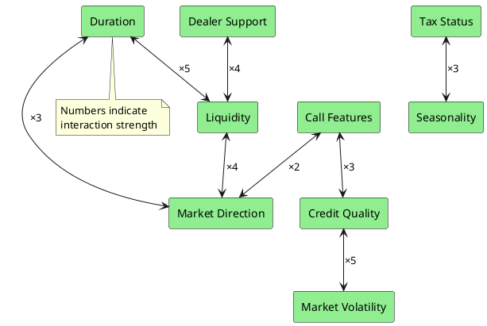

### Appendix C: Data Flow Diagram

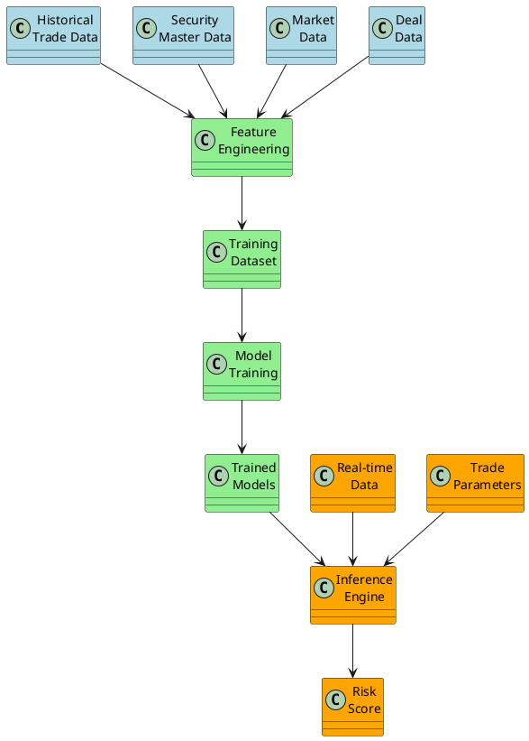

## Conclusion

This comprehensive business requirements document outlines the detailed specifications for implementing a GenAI-powered Pre-Trade Risk Scoring system. The system leverages historical data, complex mathematical models, and modern machine learning techniques to provide accurate, regime-aware risk assessments for municipal bond and fixed income trades. By implementing this system according to the specifications provided, trading organizations will gain a significant competitive advantage through improved risk management, better execution quality, and more informed trading decisions.

The two-stage model approach, with its market regime prediction and adaptive risk scoring, addresses the complex, non-linear relationships between risk factors that traditional models often miss. The detailed mathematical formulas, data requirements, and implementation methodology provide a clear roadmap for successful deployment, while the robust testing and monitoring plans ensure ongoing effectiveness in changing market conditions. 