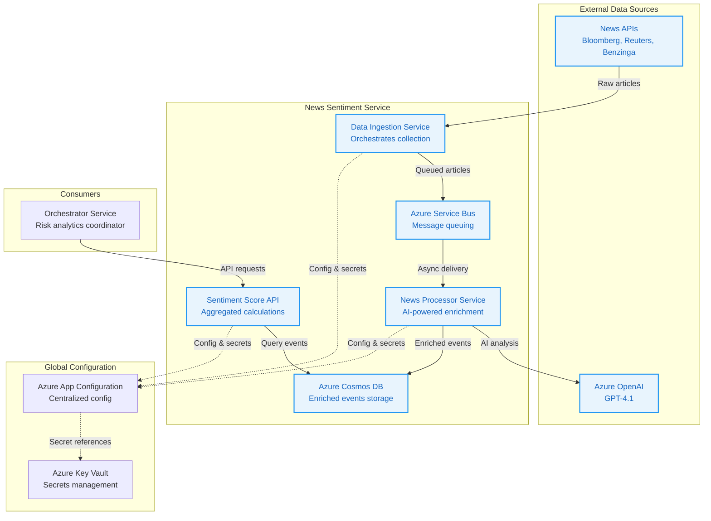

# News Sentiment Service

A comprehensive financial news sentiment analysis system for fixed-income instruments, designed to ingest, process, and serve aggregated sentiment scores for risk analytics and predictive modeling.

---

## 1. Business Overview

### 1.1 Purpose

The News Sentiment Service is a critical component of the Fixed Income AI Risk Analytics System, designed to:

- **Enhance Risk Analysis**: Provide real-time and historical sentiment scores for bonds, municipal securities, and fixed-income instruments
- **Support Predictive Models**: Generate training data for ML models that predict credit events and market movements
- **Enable Data-Driven Decisions**: Offer quantified news sentiment to supplement traditional financial metrics

### 1.2 Business Value

- **Early Warning System**: Detect sentiment shifts that may precede credit rating changes or market volatility

### 1.3 Key Metrics & SLAs

- **Capacity**: Handle 10,000+ articles/day with peak loads of 1,000 articles/hour

---

## 2. System Architecture

### 2.1 High-Level Overview

The system follows a microservices architecture with four main components orchestrating the complete news sentiment workflow:



### 2.2 Architectural Principles

- **Orchestration**: Central coordination simplifies adapter logic and state management
- **Asynchronous Processing**: Message queues decouple ingestion from processing for scalability
- **Cloud-Native Design**: Leverages Azure services for configuration, secrets, and infrastructure
- **Hybrid Local Development**: Docker Compose with cloud backend for efficient development

### 2.3 Technology Stack

- **Programming Language**: Python 3.11
- **Web Framework**: FastAPI
- **AI Service**: Azure OpenAI Service (GPT-4.1)
- **Database**: Azure Cosmos DB (NoSQL, partitioned by date)
- **Message Queue**: Azure Service Bus
- **Container Orchestration**: Azure Kubernetes Service (AKS)
- **Configuration Management**: Azure App Configuration + Azure Key Vault
- **Authentication**: Azure Managed Identity

---

## 3. Technical Implementation

### 3.1 Project Structure

```
src/news_sentiment_service/
├── common/                      # Shared library for all services
│   ├── src/
│   │   ├── models/             # Pydantic data models
│   │   ├── cosmos_db/          # Cosmos DB client
│   │   ├── service_bus/        # Service Bus client
├── data_ingestion/             # News collection orchestration
│   ├── orchestrator_service/   # Main ingestion coordinator
│   ├── db_init_service/        # Database initialization
│   └── adapters/               # News source adapters
│       └── benzinga_adapter/   # Benzinga API integration
├── news_processor_service/     # AI-powered article enrichment
└── sentiment_api_service/      # Public API for sentiment scores
```

### 3.2 Container Strategy

Each service is containerized with Docker:
- **Base Images**: Python 3.11-slim for consistency
- **Multi-stage Builds**: Separate build and runtime stages for optimization
- **Health Checks**: Built-in health endpoints for orchestration
- **Configuration**: Environment variables with Azure integration

### 3.3 Data Flow Architecture

1. **Ingestion Flow**:
   ```
   External APIs → Adapters → Orchestrator Service → Service Bus → News Processor
   ```

2. **Processing Flow**:
   ```
   Raw Article → GPT-4.1 Entity Extraction → GPT-4.1 Sentiment Analysis → Cosmos DB
   ```

3. **API Flow**:
   ```
   Client Request → Sentiment API → Cosmos DB Query → Aggregation Calculation → Response
   ```

---

## 4. Microservices

### 4.1 Data Ingestion Service

**Purpose**: Orchestrates periodic collection of news from external sources

**Key Features**:
- **Centralized Scheduling**: Single CronJob manages all news source polling
- **State Management**: Tracks last ingestion timestamp per source

### 4.2 News Source Adapters

**Purpose**: Normalize different news APIs into a standard format

**Implemented Adapters**:
- **Benzinga Adapter**: Financial news focusing on fixed-income channels

**Standard API Contract**:
```http
GET /news?dateFrom=2024-01-15T10:00&dateTo=2024-01-15T11:00
```

**Response Format**:
```json
[
  {
    "article_text": "Clean text content",
    "source_name": "Benzinga",
    "publication_time": "2024-01-15T10:30:00Z",
    "title": "Article headline",
    "url": "https://...",
    "article_hash": "md5hash"
  }
]
```

### 4.3 News Processor Service

**Purpose**: AI-powered enrichment using two-step GPT-4.1 analysis

**Processing Pipeline**:

1. **Step 1 - Entity Extraction**:
   - Determines article relevance to fixed-income markets
   - Extracts issuer names, CUSIPs, sectors, states
   - Filters irrelevant content early

2. **Step 2 - Sentiment Analysis** (if relevant):
   - Classifies event type (20+ categories)
   - Generates sentiment score (-1.0 to +1.0) and magnitude (0.0 to 1.0)
   - Creates bondholder-focused summary

### 4.4 Sentiment Score API Service

**Purpose**: Calculate and serve aggregated sentiment scores

**Endpoints**:
- `GET /sentiment/realtime` - Current sentiment with time decay
- `GET /sentiment/historical` - Historical sentiment as of specific date

---

## 5. Data Models & Business Logic

### 5.1 Core Data Models

**Raw News Article** (Input):
```python
class RawNewsArticle(BaseModel):
    article_text: str
    source_name: str
    publication_time: datetime
    title: str
    url: str
    article_hash: str  # MD5 for deduplication
```

**Enriched News Event** (Core Model):
```python
class EnrichedNewsEvent(BaseModel):
    id: str
    source: str
    published_at: datetime
    ingested_at: datetime
    event_type: str
    entities: Entities  # issuer_name, sector, state, cusips
    sentiment: Sentiment  # score, magnitude
    source_credibility_tier: str
    summary_excerpt: str
    raw_article_url: str
```

### 5.2 Business Rules & Weights

**Event Type Weights** (Sample):
| Event Type | Weight | Business Impact |
|------------|--------|-----------------|
| `Default` | 20.0 | Most severe credit event |
| `Bankruptcy` | 18.0 | Legal inability to pay |
| `Credit_Rating_Downgrade` | 15.0 | Triggers forced selling |
| `Central_Bank_Policy` | 9.0 | Monetary policy changes |
| `Earnings_Beat` | 3.0 | Positive but modest impact |
| `General_News` | 1.0 | Baseline weight |

**Source Credibility Tiers**:
| Tier | Weight | Examples |
|------|--------|----------|
| `TIER_1_REGULATOR` | 1.5 | SEC, Moody's, S&P |
| `TIER_2_PREMIUM_FINANCIAL` | 1.2 | Bloomberg, WSJ |
| `TIER_3_GENERAL_FINANCIAL` | 1.0 | Other financial news |
| `TIER_4_COMPANY_PR` | 0.8 | Issuer press releases |
| `TIER_5_SYNDICATED` | 0.6 | Wire services |

---

## 6. API Reference

### 6.1 Real-Time Sentiment Endpoint

```http
GET /sentiment/realtime?cusip=12345678X&sector=Technology&issuer_name=ABC Corp
```

**Parameters**:
- `cusip` (optional): 9-character CUSIP identifier
- `sector` (optional): Sector name or "global_market"
- `issuer_name` (optional): Legal issuer name
- **Note**: At least one parameter required

**Response**:
```json
{
  "aggregated_sentiment_score": -0.3542,
  "contributing_articles_count": 15,
  "articles": [
    "S&P downgrades ABC Corp from A- to BBB+...",
    "ABC Corp announces debt refinancing plan..."
  ]
}
```

### 6.2 Historical Sentiment Endpoint

```http
GET /sentiment/historical?as_of_date=2024-01-15&cusip=12345678X
```

**Parameters**:
- `as_of_date` (required): Date in YYYY-MM-DD format
- `cusip`, `sector`, `issuer_name` (optional): Entity filters

**Response**:
```json
{
  "aggregated_sentiment_score": -0.2156,
  "contributing_articles_count": 8
}
```

### 6.3 Health Endpoints

```http
GET /health              # Basic health check
GET /health/detailed     # Detailed dependency status
GET /stats              # Processing statistics (News Processor only)
```