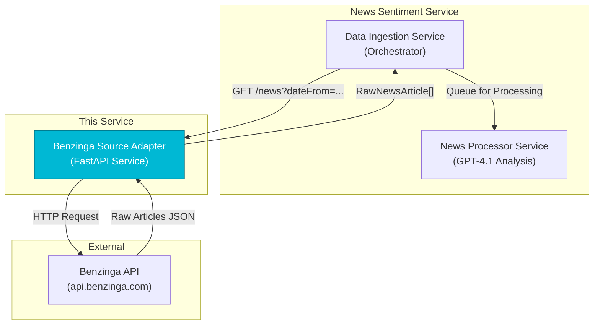

# Benzinga News Source Adapter

---

## 1. Overview

The Benzinga News Source Adapter is a microservice component of the **News Sentiment Service** that connects to the Benzinga API and fetches financial news articles relevant to fixed-income markets. This adapter transforms raw Benzinga data into the standardized `RawNewsArticle` format required by the News Sentiment Service.

The service focuses on fixed-income and municipal bond-relevant news channels: **Bonds, Treasuries, Economics, Federal Reserve, and Government & Economy**.

## 2. System Integration

This adapter integrates into the orchestrated data ingestion architecture where the Data Ingestion Service (DIS) polls it periodically for new articles.



## 3. API Contract

### **`GET /news`**

Retrieves raw news articles from Benzinga, filtered by publication time and focused on fixed-income markets.

**Query Parameters**

| Parameter  | Type       | Format                | Required | Description                                                          |
|------------|------------|-----------------------|----------|----------------------------------------------------------------------|
| `dateFrom` | `datetime` | `YYYY-MM-DDTHH:MM:SS` | No       | UTC start time (inclusive). Naive datetimes are assumed to be UTC.  |
| `dateTo`   | `datetime` | `YYYY-MM-DDTHH:MM:SS` | No       | UTC end time (inclusive). Naive datetimes are assumed to be UTC.    |

**Response Format**

- **`200 OK`**: Array of `RawNewsArticle` objects
- **`422 Unprocessable Entity`**: Invalid date parameters
- **`503 Service Unavailable`**: Unable to connect to Benzinga API

**Example Response:**
```json
[
    {
        "article_text": "The Federal Reserve announced a policy change affecting municipal bond markets...",
        "source_name": "Benzinga",
        "publication_time": "2024-01-15T12:00:00Z",
        "title": "Fed Policy Update Impacts Municipal Markets",
        "url": "https://www.benzinga.com/news/12345/...",
        "article_hash": "a1b2c3d4e5f6..."
    }
]
```

### **`GET /health`**

Health check endpoint.

**Response:** `{"status": "ok"}`

## 4. Local Development Setup

### 4.1. Prerequisites

- Python 3.13+
- Benzinga API token (contact Benzinga for access)

### 4.2. Installation

1.  **Create and activate virtual environment:**
    ```bash
    python -m venv venv
    
    # Windows
    .\\venv\\Scripts\\activate
    
    # macOS/Linux
    source venv/bin/activate
    ```

2.  **Install dependencies:**
    ```bash
    pip install -e .[dev]
    ```

### 4.3. Configuration

Create a `.env` file in the adapter directory:

```env
# Required: Your Benzinga API token
BENZINGA_API_TOKEN=your_secret_token_here

# Optional: Local development port
API_PORT=8000

# Optional: Azure App Configuration for cloud environments
# AZURE_APPCONFIG_ENDPOINT=https://your-app-config.azconfig.io
```

**Configuration Priority:**
1. `.env` file
2. Environment variables
3. Azure App Configuration (if `AZURE_APPCONFIG_ENDPOINT` is set)

### 4.4. Running the Service

```bash
# Development server with auto-reload
uvicorn src.main:app --host 0.0.0.0 --port 8000 --reload

# Or using the configured entry point
python -m src.main
```

The service will be available at `http://localhost:8000`

### 4.5. Testing

```bash
# Run all tests
pytest

# Run with verbose output
pytest -v

# Run specific test file
pytest tests/test_main.py
```

## 5. Implementation Details

### 5.1. Benzinga Integration

- **API Endpoint:** `https://api.benzinga.com/api/v2/news`
- **Channels Filter:** `"Bonds,Treasuries,Economics,Federal Reserve,Govt & Economy"`
- **Content Processing:** HTML tags are stripped from article content
- **Date Handling:** RFC 2822 format from Benzinga converted to UTC timezone-aware datetimes
- **Deduplication:** MD5 hash generated from title + content

### 5.2. Error Handling

- **HTTP 502:** Benzinga API errors (invalid JSON, unexpected format)
- **HTTP 503:** Network/connection errors to Benzinga API
- **HTTP 422:** Invalid date parameter format
- **Article-level:** Individual article processing errors are logged but don't fail the entire request

### 5.3. Production Considerations

- **Timeout:** 30-second timeout for Benzinga API calls
- **Workers:** Configured for 2 worker processes
- **Logging:** Structured logging with configurable levels
- **Authentication:** Azure Managed Identity support for cloud deployment

## 6. Docker Deployment

```bash
# Build image
docker build -t benzinga-adapter .

# Run container
docker run -p 8000:8000 \
  -e BENZINGA_API_TOKEN=your_token \
  benzinga-adapter
```

## 7. Data Flow

1. **Request Reception:** DIS calls `/news` with optional date filters
2. **API Query:** Service constructs Benzinga API request with relevant channels
3. **Data Processing:** Raw articles are parsed, HTML-stripped, and timezone-normalized
4. **Filtering:** Articles filtered by date range if specified
5. **Transformation:** Each article converted to `RawNewsArticle` model
6. **Response:** Array of standardized articles returned to DIS

This adapter serves as the entry point for Benzinga news data into the broader News Sentiment Service architecture, where articles are subsequently processed by GPT-4.1 for sentiment analysis and entity extraction.
