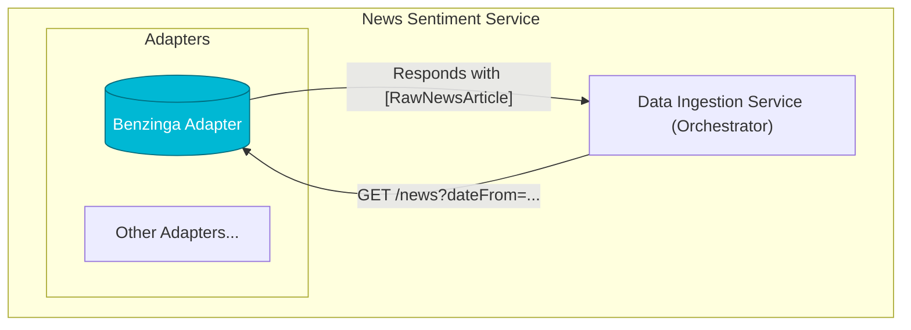

# Benzinga News Source Adapter

---

## 1. Overview

The Benzinga News Source Adapter is a microservice component of the **News Sentiment Service**. Its primary responsibility is to connect to the external Benzinga news vendor, fetch raw financial news articles, and expose them through a standardized REST API contract.

This service is designed to be a "dumb" adapter, meaning it only handles fetching and transforming data from a specific source into a common `RawNewsArticle` model. All complex business logic, such as orchestration, deduplication, and state management, is handled by the central [Data Ingestion Service (DIS)](../../../../ai_docs/1_architecture/NewsSentimentService_SystemArchitecture.md#42-data-ingestion-service-dis).

## 2. Architectural Role

This adapter is a leaf node in the News Sentiment Service's data ingestion architecture. It is invoked by the central Data Ingestion Service, which polls it periodically for new articles.



## 3. API Contract

The adapter implements the standardized REST API contract required by all News Source Adapters.

**`GET /news`**

Retrieves a list of raw news articles based on their publication time.

**Query Parameters**

| Parameter  | Type   | Format              | Required | Description                                                                                                                                                             |
|------------|--------|---------------------|----------|-------------------------------------------------------------------------------------------------------------------------------------------------------------------------|
| `dateFrom` | `datetime` | `YYYY-MM-DDTHH:MM:SS` | No       | The UTC start time for the query window (inclusive). Naive datetimes are assumed to be UTC. This is converted to a Unix timestamp for the Benzinga `updatedSince` parameter. |
| `dateTo`   | `datetime` | `YYYY-MM-DDTHH:MM:SS` | No       | The UTC end time for the query window (inclusive). Naive datetimes are assumed to be UTC. Filtering is performed internally by the adapter after fetching results.      |

**Responses**

- **`200 OK`**: A successful response containing a JSON array of `RawNewsArticle` objects. The array will be empty if no articles match the criteria.
  
  **Body:** `List[RawNewsArticle]`
  ```json
  [
      {
          "article_text": "The market saw significant activity today...",
          "source_name": "Benzinga",
          "publication_time": "2024-01-15T12:00:00Z",
          "title": "Major Muni Bond Update",
          "url": "https://www.benzinga.com/news/12345/...",
          "article_hash": "a1b2c3d4e5f6..."
      }
  ]
  ```

- **`422 Unprocessable Entity`**: Returned if date parameters are malformed.
- **`503 Service Unavailable`**: Returned if the adapter cannot connect to the downstream Benzinga API.

## 4. Local Development

### 4.1. Installation

The project uses standard Python packaging and can be installed with `pip`.

1.  **Create a Virtual Environment**: It is highly recommended to use a virtual environment to isolate dependencies. From this directory, run:
    ```bash
    python -m venv venv
    ```

2.  **Activate the Environment**:
    -   On Windows:
        ```bash
        .\\venv\\Scripts\\activate
        ```
    -   On macOS/Linux:
        ```bash
        source venv/bin/activate
        ```

3.  **Install Dependencies**: Once the virtual environment is activated, install the required packages:
    ```bash
    pip install -e .[dev]
    ```
    This will install all base and development dependencies, including the shared `news_sentiment_common` library in editable mode.

### 4.2. Configuration

The service requires the following configuration parameters. It uses a layered approach, prioritizing `.env` files, then environment variables, and finally Azure App Configuration.

Create a `.env` file in the `.../benzinga_adapter` directory:
```env
# .env

# The port the local FastAPI server will run on
API_PORT=8000

# Your API token for the Benzinga service
BENZINGA_API_TOKEN="YOUR_SECRET_TOKEN_HERE" 

# (Optional) For connecting to a cloud-based dev environment
# AZURE_APPCONFIG_ENDPOINT="https://<your-app-config-name>.azconfig.io"
```

### 4.3. Running the Service

Ensure your virtual environment is activated. To start the local FastAPI server:
```bash
uvicorn src.main:app --host 0.0.0.0 --port 8000 --reload
```

### 4.4. Running Tests

Ensure your virtual environment is activated. To run the full suite of unit tests:
```bash
pytest
```
The tests are configured to automatically use the `src` directory for the python path.
