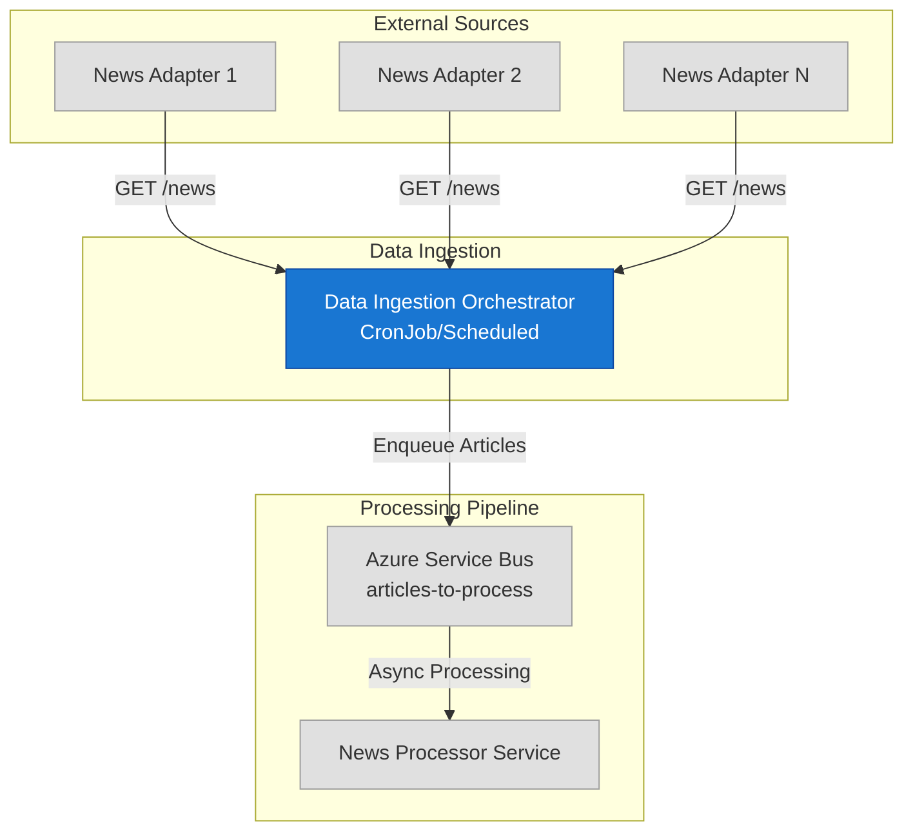

# Data Ingestion Service (DIS) Orchestrator

## 1. Overview

The Data Ingestion Service Orchestrator is a critical component of the **News Sentiment Service** that orchestrates the collection of news articles from multiple external news source adapters. It implements the orchestration pattern to centralize complex cross-cutting concerns while keeping adapter services simple and focused.

### Primary Responsibilities
- **News Collection**: Fetches articles from configured news source adapters via HTTP
- **Hash Calculation**: Generates SHA-256 hashes for article deduplication (handled downstream)
- **Message Queuing**: Enqueues articles to Azure Service Bus for asynchronous processing
- **Error Handling**: Gracefully handles adapter failures and network issues
- **Fallback Support**: Automatically falls back to local emulators when Azure services are unavailable

## 2. Architectural Role

The orchestrator sits at the entry point of the news processing pipeline, collecting raw articles and feeding them into the enrichment workflow.



### Architectural Benefits
- **Centralized Control**: Single point for scheduling, monitoring, and managing ingestion
- **Simplified Adapters**: Adapters only need to fetch and convert data to standard format
- **Resilient Buffering**: Service Bus provides decoupling and load smoothing

## 3. News Source Adapter Integration

The orchestrator integrates with news source adapters through a standardized REST API contract.

### Required Adapter API
**Endpoint**: `GET /news`

**Response Format**:
```json
[
    {
        "article_text": "Full article content...",
        "source_name": "Bloomberg",
        "publication_time": "2024-01-15T10:30:00Z",
        "title": "Market Update: Fed Signals Rate Changes",
        "url": "https://bloomberg.com/article/123",
        "article_hash": "optional - will be recalculated"
    }
]
```

### Integration Logic
1. **Sequential Processing**: Calls each configured adapter URL in sequence
2. **Hash Generation**: Calculates SHA-256 hash from `title:source_name` for deduplication
3. **Error Isolation**: Continues processing other adapters if one fails
4. **Timeout Handling**: 30-second timeout per adapter request

## 4. Configuration

The service uses a layered configuration approach: `.env` file → environment variables → Azure App Configuration.

### Core Configuration
```env
# News Source Adapters (comma-separated URLs)
ADAPTER_URLS=http://benzinga-adapter:8000/news,http://reuters-adapter:8000/news

# Azure Service Bus
SERVICE_BUS_NAMESPACE=your-sb-namespace
SERVICE_BUS_QUEUE_NAME=articles-to-process

# Azure App Configuration (optional)
AZURE_APPCONFIG_ENDPOINT=https://appconfig-risk-analytics-dev.azconfig.io
```

### Fallback Configuration
```env
# Local Development Mode
USE_LOCAL_FALLBACK=false

# Service Bus Emulator
SERVICE_BUS_EMULATOR_NAMESPACE=localhost:5672
SERVICE_BUS_EMULATOR_CONNECTION_STRING=Endpoint=sb://localhost:5672;SharedAccessKeyName=RootManageSharedAccessKey;SharedAccessKey=SAS_KEY_VALUE;UseDevelopmentEmulator=true
```

## 5. Local Development with Fallback Mechanism

The service supports automatic fallback to local emulators when Azure services are unavailable, enabling seamless development workflow.

### Fallback Behavior
1. **Try Azure First**: Attempts to connect to configured Azure services
2. **Automatic Detection**: Detects Azure availability through authentication and configuration
3. **Seamless Fallback**: Automatically switches to local emulators with warning logs
4. **Continue Processing**: No interruption to the ingestion workflow

### Development Setup

#### Option 1: Docker Compose (Recommended)
```bash
# Start all services including emulators
docker-compose up --build

# Start only emulators
docker-compose up cosmosdb-emulator servicebus-emulator sqledge
```

#### Option 2: Local Development
1. **Start Emulators**:
   ```bash
   docker-compose up cosmosdb-emulator servicebus-emulator sqledge
   ```

2. **Create Environment**:
   ```bash
   python -m venv venv
   source venv/bin/activate  # On Windows: venv\Scripts\activate
   pip install -e .[dev]
   ```

3. **Configure Local Settings**:
   ```env
   # .env
   USE_LOCAL_FALLBACK=true
   ADAPTER_URLS=http://localhost:8000/news
   SERVICE_BUS_QUEUE_NAME=articles-to-process
   SERVICE_BUS_EMULATOR_CONNECTION_STRING=Endpoint=sb://localhost:5672;SharedAccessKeyName=RootManageSharedAccessKey;SharedAccessKey=SAS_KEY_VALUE;UseDevelopmentEmulator=true
   ```

4. **Run Service**:
   ```bash
   python src/main.py
   ```

### Emulator Services
- **Service Bus Emulator**: `localhost:5672` (AMQP), `localhost:9090` (Management)
- **Cosmos DB Emulator**: `https://localhost:8081` (Explorer: `/_explorer/index.html`)
- **SQL Edge**: `localhost,1433` (supports Service Bus emulator)

### Authentication
- **Local**: Uses `az login` credentials via `DefaultAzureCredential`
- **Production**: Uses Managed Identity automatically
- **Emulators**: Uses default keys/connection strings

## 6. Deployment

### Docker Build
```bash
# Build the container
docker build -t dis-orchestrator-service .

# Run locally
docker run -e ADAPTER_URLS="http://adapter:8000/news" dis-orchestrator-service
```

## 7. Testing

### Unit Tests
```bash
# Activate virtual environment
source venv/bin/activate

# Run all tests
pytest

# Run with coverage
pytest --cov=src
```