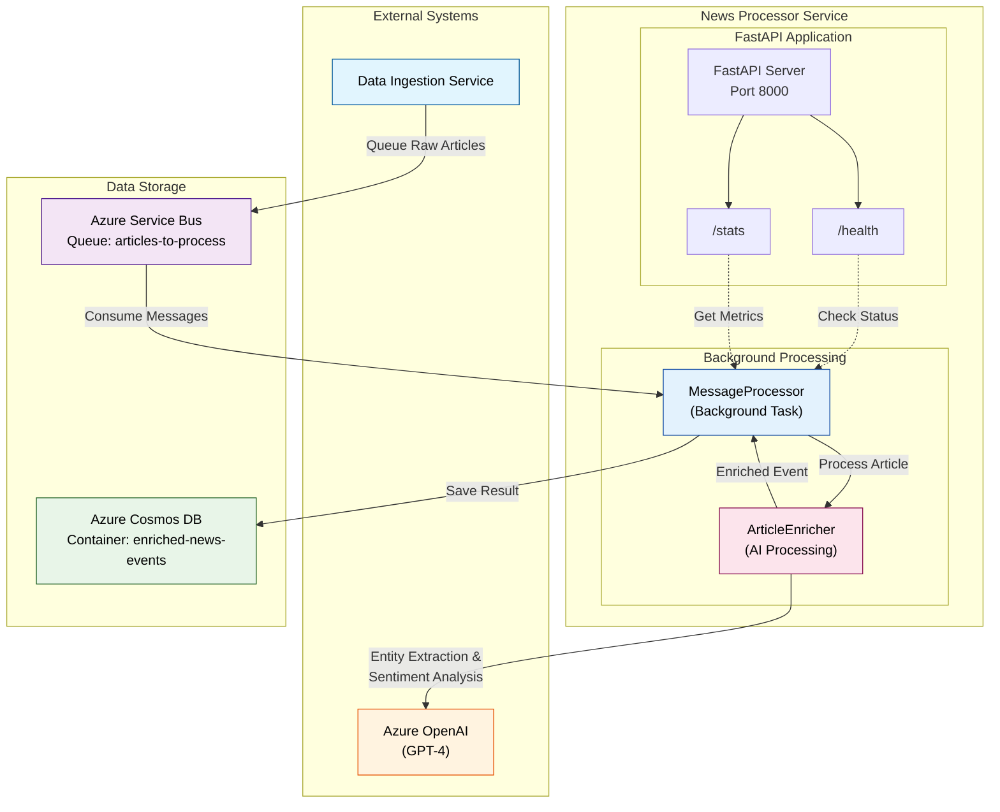

# News Processor Service

AI-powered news article enrichment service that processes raw articles from Service Bus, extracts financial entities and sentiment using LLM, and stores enriched results in Cosmos DB.

## Core Functionality

- **Message Processing**: Consumes articles from Azure Service Bus queue
- **AI Enrichment**: Two-step GPT-4 analysis (entity extraction → sentiment scoring)
- **Storage**: Saves enriched events to Cosmos DB
- **Health Monitoring**: Health endpoints and processing statistics

## Architecture



## Quick Start

### Local Development
```bash
# Install dependencies
pip install -e .[dev]

# Set environment variables
export USE_LOCAL_FALLBACK=true
export API_PORT=8000

# Run service
python -m src.main
```

### Docker
```bash
# Using docker-compose (recommended)
docker-compose up --build

# Service available at http://localhost:8002
```

## Configuration

### Required Environment Variables

| Variable | Description | Local Default |
|----------|-------------|---------------|
| `USE_LOCAL_FALLBACK` | Enable local development mode | `false` |
| `API_PORT` | HTTP server port | `8000` |

### Azure Production Variables (when USE_LOCAL_FALLBACK=false)

| Variable | Description |
|----------|-------------|
| `AZURE_OPENAI_ENDPOINT` | Azure OpenAI endpoint URL |
| `AZURE_OPENAI_API_KEY` | Azure OpenAI API key |
| `AZURE_OPENAI_DEPLOYMENT` | GPT-4 deployment name |
| `AZURE_SERVICEBUS_NAMESPACE` | Service Bus namespace |
| `SERVICE_BUS_QUEUE_NAME` | Queue name for articles |
| `AZURE_COSMOSDB_ENDPOINT` | Cosmos DB endpoint |
| `COSMOS_DB_DATABASE_NAME` | Database name |
| `COSMOS_DB_CONTAINER_NAME` | Container name |

## API Endpoints

- `GET /health` - Basic health check
- `GET /health/detailed` - Detailed dependency status  
- `GET /stats` - Processing statistics

## Processing Flow

1. **Message Consumption**: Polls Service Bus queue for raw articles
2. **Entity Extraction**: GPT-4 extracts issuer, sector, CUSIPs, relevance
3. **Sentiment Analysis**: If relevant, GPT-4 scores sentiment and classifies event type
4. **Storage**: Saves enriched event to Cosmos DB
5. **Statistics**: Updates processing metrics

## AI Processing

### Step 1: Entity Extraction
Extracts structured entities and determines financial relevance:
- `issuer_name`, `sector`, `state`, `cusips`
- `relevant_for_scoring` (boolean)

### Step 2: Sentiment Scoring (if relevant)
Analyzes sentiment and classifies event:
- `event_type` (Default, Credit_Rating_Downgrade, etc.)
- `sentiment.score` (-1.0 to 1.0)
- `sentiment.magnitude` (0.0 to 1.0)
- `source_credibility_tier`
- `summary_excerpt`

## Development

### Testing
```bash
pytest tests/ -v
```

### Health Monitoring
```bash
# Check service health
curl http://localhost:8000/health

# View detailed status
curl http://localhost:8000/health/detailed

# Monitor processing stats
curl http://localhost:8000/stats
```

## Dependencies

- **Core**: FastAPI, Azure OpenAI, Azure Service Bus, Azure Cosmos DB
- **Shared**: news_sentiment_common library
- **Config**: Azure App Configuration, Azure Identity 