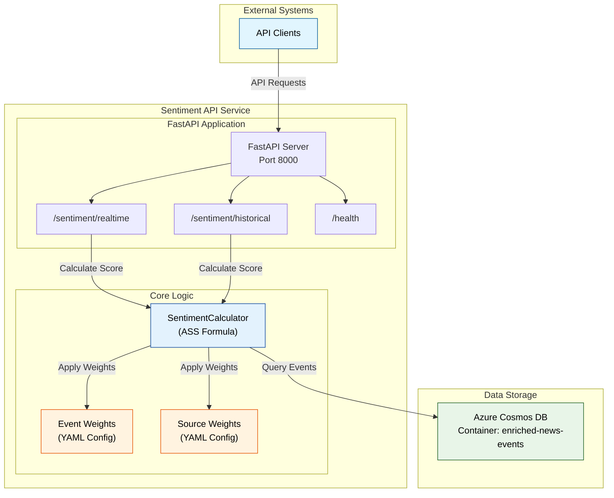

# Sentiment Score API Service (NSSS)

---

## Overview

FastAPI microservice that calculates and serves **Aggregated Sentiment Scores (ASS)** for fixed-income instruments using weighted news event analysis.

## Architecture



## API Endpoints

### GET `/sentiment/realtime`
**Parameters:** At least one required: `cusip`, `sector`, `issuer_name`

**Response:**
```json
{
  "aggregated_sentiment_score": -0.25,
  "contributing_articles_count": 15,
  "articles": ["Example Acrticle Summary 1", "Example Acrticle Summary 2", "..."]
}
```

### GET `/sentiment/historical`  
**Parameters:** `as_of_date` (YYYY-MM-DD) + at least one: `cusip`, `sector`, `issuer_name`

**Response:**
```json
{
  "aggregated_sentiment_score": -0.25,
  "contributing_articles_count": 15
}
```

### GET `/health`
Health check endpoint.

## ASS Formula

$$ASS = \frac{\sum_{i}(S_i \times M_i \times W_{event_i} \times W_{time_i} \times W_{source_i})}{\sum_{i}(M_i \times W_{event_i} \times W_{time_i} \times W_{source_i})}$$

**Components:**
- **Si**: Sentiment score (-1 to 1)
- **Mi**: Magnitude (0 to 1)  
- **W_eventi**: Event type weight (configured in `config/event_weights.yaml`)
- **W_timei**: Time decay weight (24-hour exponential decay: `2^(-hours/24)`)
- **W_sourcei**: Source credibility weight (configured in `config/source_weights.yaml`)

## Local Development

### Setup
```bash
# Create and activate virtual environment
python -m venv venv
# Windows: .\venv\Scripts\activate
# macOS/Linux: source venv/bin/activate

# Install dependencies (installs shared common package)
pip install -e .[dev]
```

### Configuration
Create `.env` file:
```env
API_PORT=8000
COSMOS_DATABASE_NAME=NewsDatabase
COSMOS_CONTAINER_NAME=EnrichedNewsEvents
# Optional: AZURE_APPCONFIG_ENDPOINT=https://your-config.azconfig.io
```

### Run Service
```bash
uvicorn src.main:app --host 0.0.0.0 --port 8000 --reload
```

### Run Tests
```bash
pytest
```

## Docker Deployment

### Build
From `news_sentiment_service` directory:
```bash
docker build -t sentiment-api-service:latest -f ./sentiment_api_service/Dockerfile .
```

### Run
```bash
docker run -p 8000:8000 \
  -e COSMOS_DATABASE_NAME=NewsDatabase \
  -e COSMOS_CONTAINER_NAME=EnrichedNewsEvents \
  sentiment-api-service:latest
```

## Dependencies
- **FastAPI**: Web framework
- **Azure Cosmos DB**: News events storage
- **Azure App Configuration**: Centralized config management
- **Shared Common Package**: Data models and Cosmos DB client (`../common`)

## Weight Configuration
- **Event weights**: `src/config/event_weights.yaml` (Default=20.0 to General_News=1.0)
- **Source weights**: `src/config/source_weights.yaml` (TIER_1_REGULATOR=1.5 to TIER_5_SYNDICATED=0.6) 